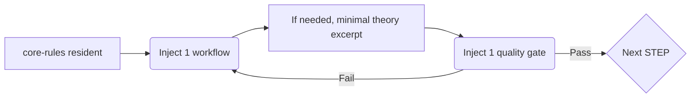

# AIcoding-ProcessEngineering — Theory x Agent Operations (EN)

This repository separates Process Engineering “theory” from day‑to‑day “operations” so AI agents can run safely and efficiently with a minimal context footprint.

- Minimal resident: only docs-agent/core-rules.md should stay resident. At run time, inject exactly 1 workflow; during checks, inject exactly 1 quality gate
- Theory reference: pull only small Source‑Mapped excerpts from docs-theory/theory (no full‑document reads)
- Dual entrances:
  - Humans → docs-agent/README (operational details)
  - Agents → AGENTS.md (quick start + guardrails)

---

## Why (separation rationale)
- Full reading of large theory docs causes context overflow, inconsistency, and slower iterations
- Keep rules resident and inject procedures on demand to maximize precision, speed, and reproducibility
- Always trace back to canonical sources (theory) via Source Mapping for maintainability

## What (roles)

### docs-theory — Canonical theory (human‑oriented)
- Purpose: hold the canonical background, methodology, and templates
- Policy: no full reads by agents; only minimal excerpts (≈ ≤ 200 tokens) via Source Mapping
- Structure: theory/ (main texts), templates/ (templates referenced from theory)

### docs-agent — Operational canon (for humans and agents)
- Purpose: provide minimal resident rules, workflows (by STEP), quality gates, and protocols
- Policy: resident = core-rules only; on run → inject 1 workflow; on check → inject 1 quality gate
- Structure: core-rules.md, workflows/, quality-gates/, protocols/

---

## How (using this repository)

### Humans (developers/leads)
1) Skim this README to grasp Why/What
2) Open docs-agent/README for detailed operations and quick steps
3) Pick the workflow you need (docs-agent/workflows/stepN-*.md)
4) When theory evidence is needed, use Source Mapping to pull the exact section from docs-theory/theory (small excerpt only)
5) For gate decisions, inject the relevant quality gate from docs-agent/quality-gates/

### Agents (AI)
- Entry point is strictly AGENTS.md
- Keep only core-rules resident; inject exactly 1 workflow (run) or 1 gate (check) when needed
- Theory is referenced only via small Source‑Mapped excerpts (no full reads)

### Cline integration (optional)
- If .clinerules/ exists, you can call compressed wrappers from chat and keep docs-agent as canonical

---

## Do (quick path example)

- Typical loop
  1) Run STEP2 system design: inject workflows/step2-system-design.md
  2) Decide with Gate2: inject the corresponding quality gate and evaluate
  3) If pass → move to the next STEP workflow; otherwise → iterate

---

## Repository structure (essentials)
- docs-agent/ … operational canon (core-rules, workflows, quality-gates, protocols)
- docs-theory/ … canonical theory (main texts and templates)
- AGENTS.md … agent entry (key points and prohibitions)
- .clinerules/ … optional compressed wrappers for Cline

---

## Policies / guardrails

- Prohibited
  - Injecting multiple workflows simultaneously
  - Full reading of docs-theory/theory
  - Pre‑injecting multiple quality gates before checks

- Recommended
  - Source Mapping only for the exact sections needed (≈ ≤ 200 tokens)
  - Keep core-rules minimal for residency
  - Synchronize changes docs-agent → .clinerules (wrappers updated afterward)

---

## Key links
- Human entry (operations): ./docs-agent/README.md
- Agent entry: ./AGENTS.md
- Canonical theory top (human‑oriented): ./docs-theory/theory/README.md
- Core rules: ./docs-agent/core-rules.md
- Meta/protocols: ./docs-agent/workflows/meta-workflow-orchestrator.md, ./docs-agent/workflows/context-management-protocol.md

---

## Version and compatibility
- Theory base is v1.3 (see docs-theory/theory)
- Across future versions we keep the principles: minimal residency, single workflow/gate injection, minimal theory excerpts

## Notes
- Mentions of "docs/" inside docs-theory are usually examples of generic project structures, not clickable links
- We periodically check internal link integrity; CI link checking is optional

