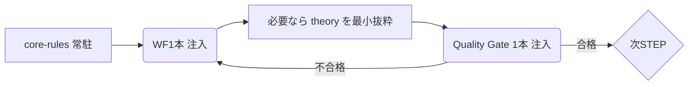

# AIcoding-ProcessEngineering — Theory x Agent Operations

本リポジトリは、プロセスエンジニアリングの「理論」と「運用」を分離し、AIエージェントが安全かつ効率的に活用できるよう最小コンテキストで運用するための標準を提供します。

- 最小常駐: docs-agent/core-rules.md（コアルール）だけを常駐。実行時はワークフロー1本、判定時は品質ゲート1本のみを注入
- 理論参照: docs-theory/theory を Source Mapping で必要節のみ最小抜粋（丸読み禁止）
- 入口の二極化:
  - 人間: docs-agent/README → 運用詳細へ
  - エージェント: AGENTS.md → 即実行

---

## Why（なぜ分離するか）
- 大規模な理論文書の丸読みは、コンテキスト溢れ・混乱・再現性低下を招きます
- ルールは最小常駐、手順はオンデマンド注入で、精度・速度・再現性を最大化します
- 参照は常に出典（原典）へトレース可能にし、変更に強い運用を実現します

## What（役割定義）

### docs-theory — 原典（人間向け）
- 目的: 背景・理論・体系・テンプレートの正典を保持
- 方針: 丸読み禁止。必要箇所のみ最小抜粋（≲ 200 tokens 目安）
- 構成: theory/（理論本文）、templates/（テンプレート）

### docs-agent — 運用正本（人間・エージェント共通）
- 目的: 最小常駐ルール、ワークフロー（STEP別）、品質ゲート、メタ/プロトコルを提供
- 方針: 常駐=core-rules のみ。実行時は WF 1本、チェック時は Gate 1本のみ注入
- 構成: core-rules.md、workflows/、quality-gates/、protocols/

---

## How（このリポジトリの使い方）

### 人間（開発者/リード）
1) 本 README で Why/What を把握
2) docs-agent/README で運用の詳説と手順を確認
3) 目的の STEP のワークフロー（docs-agent/workflows/stepN-*.md）を開く
4) 実行中に理論の根拠が必要な場合は、Source Mapping（docs-theory/theory/... の該当節）を最小抜粋
5) 判定時は該当の品質ゲート（docs-agent/quality-gates/）のみを注入

### エージェント（AI）
- 入口は AGENTS.md に限る
- 常駐は core-rules のみ。実行時にワークフロー1本、判定時に品質ゲート1本だけを読み込む
- 理論参照は必要節の最小抜粋のみ（docs-theory/theory の丸読み禁止）

### Cline 連携（任意）
- .clinerules/ に実行用ラッパがある場合は、チャットから必要なワークフロー/ゲートをピンポイントに呼び出します
- 正本は docs-agent 配下（.clinerules は圧縮版/ラッパ）

---

## Do（最短実行のイメージ）

- 代表ユースケース（例）
  1) STEP2 要件→設計: workflows/step2-system-design.md を注入
  2) Gate2 判定: quality-gate-2 を注入して合否判定
  3) 合格なら次 STEP の WF に切替、以降繰り返し

---

## リポジトリ構成（要点）
- docs-agent/ … 運用正本（core-rules, workflows, quality-gates, protocols）
- docs-theory/ … 原典（theory 本文、templates）
- AGENTS.md … エージェント入口（要点と禁止事項）
- .clinerules/ … Cline 向け圧縮版/ラッパ（任意）

---

## ポリシー/ガードレール

- 禁止
  - 複数ワークフローの同時注入
  - docs-theory/theory の丸読み
  - 品質ゲートの事前多重注入

- 推奨
  - Source Mapping は該当節だけ（≲ 200 tokens）
  - 常駐は core-rules の最小版で十分
  - 変更は docs-agent → .clinerules の順で同期（ラッパは後）

---

## 主要リンク
- 運用の入口（人間）: ./docs-agent/README.md
- 入口（エージェント）: ./AGENTS.md
- 原典トップ（人間向け）: ./docs-theory/theory/README.md
- コアルール: ./docs-agent/core-rules.md
- メタ/プロトコル: ./docs-agent/workflows/meta-workflow-orchestrator.md, ./docs-agent/workflows/context-management-protocol.md

---

## バージョンと互換性
- 本リポの理論は v1.3 系に準拠（docs-theory/theory 内参照）
- 将来バージョンにおいても「最小常駐/単一WF/単一Gate/最小抜粋」の原則は維持します

## 注意
- docs-theory 内の "docs/" 記述は、プロジェクト一般規約の例示として残置されている場合があります（クリック可能リンクではありません）
- 内部リンク整合性は定期的にチェックします（CI の導入は任意）

