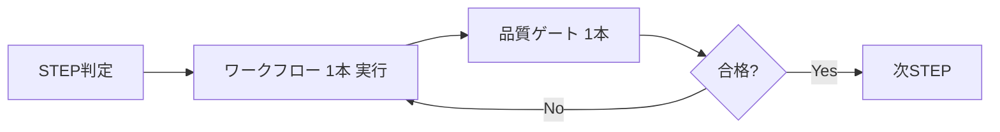

# docs-agent 運用ガイド（Agent-first）

## なぜ理論をモジュール化するのか（Why）
- プロセスエンジニアリング理論の要諦は、STEPの段階的進行・品質ゲートでの移行判定・完全なトレーサビリティ・再現性の担保にあります。
- しかし巨大な理論文書（docs-theory/theory/*）を丸読みすると、コンテキスト溢れや再現性低下を招きがちです。
- そこで本リポでは、理論を「常駐最小のルール」と「必要時のみ注入するワークフロー」に再編し、理論の価値を損なわずに運用可能性と再現性を両立します。

## 最適化された使い方（What）
- ルールは常駐最小（docs-agent/core-rules.md）。
- ワークフローはタスク/フェーズごとに1本だけ注入（docs-agent/workflows/stepN-*.md）。
- 品質ゲートは完了判定のときに1本だけ注入（docs-agent/workflows/quality-gate-*.md）。
- 理論本文は各Workflowの Source Mapping に従い、該当節のみ最小抜粋（目安 ≤ 200 tokens）。
- エージェント用の入口はリポジトリ直下の AGENTS.md。Cline では .clinerules/ を併用できます。

## How: docs-agent の設計（ファイル体系と役割）
- ルールは常駐最小、ワークフローは必要時のみ注入し、コンテキスト溢れを防ぎながら理論を実践する。

## 構成
- Core Rules: docs-agent/core-rules.md（常駐・最小）
- Workflows: docs-agent/workflows/*.md（STEP別・品質ゲート・メタ/コンテキスト）
- 自律運用: meta-workflow-orchestrator.md / context-management-protocol.md

## Do: 実行の基本（最短手順）
1) Core Rules を前提に現在STEPを判定
2) 対応するワークフロー1本だけを注入して実行
3) 完了後に対応する品質ゲート1本だけを注入してチェック
4) 理論本文は各Workflowの Source Mapping の該当節だけ最小抜粋

## .clinerules 連携
- ルール（圧縮版）: .clinerules/rules.md
- ワークフロー（ラッパー）: .clinerules/workflows/*.md → canonical は docs-agent/workflows/*
- チャットでの呼び出し例: `/step2-system-design.md`, `/quality-gate-design.md`

## 参照
- エージェント用入口: AGENTS.md
- 運用設計レポート: docs-agent/agent-autonomous-orchestration-report.md

> このガイドは人間の学習コストを最小化するために作られています。自然言語でゴールを伝えれば、エージェントが自律的にワークフローを選択・実行します。

## 同期ガイド（docs-agent ↔ ランタイム）
- Canonical: docs-agent/*（正本。ここを更新）
- Runtime: .clinerules/*（圧縮ルール/ラッパー）, AGENTS.md（ゲートウェイ）
- 運用: docs-agent を更新したら、必要に応じて .clinerules と AGENTS.md の文言を見直す（自動同期スクリプトは任意で導入）
