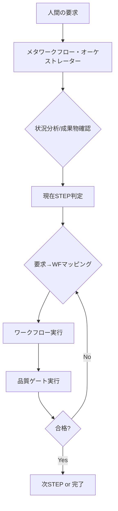

# エージェント自律運用によるワークフローオーケストレーション設計レポート

## 要旨（エグゼクティブサマリ）

- 目的: 人が使い方を覚えなくても、エージェントが自律的に docs-agent を理解・活用し、プロセスエンジニアリング理論を再現可能に実践する仕組みを提供する。
- 中核戦略: 「メタ認知ワークフロー」を導入し、エージェントが状況認識→ワークフロー選択→実行→品質確認までを自律で回す。人間はゴールを述べるだけ。
- 実装要素:
  - meta-workflow-orchestrator（自律判断ロジック）
  - context-management-protocol（トークン最適化の自動実行）
  - Core Rules への「自律運用モード」組み込み
- 運用: Core Rules は常駐（最少）、ワークフローはタスクごとに1本だけ注入、品質ゲートは完了時に1本だけ注入。理論本文は Source Mapping の該当節のみ最小抜粋。

---

## 1. 問題分析：なぜ「人が覚える」運用になるのか

- 現状は「人間がどのワークフローを使うか」を選び、エージェントは受動的に実行する構造。
- どの場面でどのワークフロー／品質ゲートを使うかの判断が人間依存のため、知識の負担が人間側に残る。
- 理想は、エージェントが「現在の状況・ゴール・成果物」から適切なワークフローを自動選択し、品質ゲートまで自動化すること。

---

## 2. 解決戦略：メタ認知ワークフローの導入

- 3層構造で認知負荷を分離:
  1) メタ層（自律判断）: 現在状況分析→STEP判定→ワークフロー選択→品質ゲート選択→次STEP遷移判定
  2) 実行層（docs-agent/workflows）: stepN-* と quality-gate-* を実行
  3) 理論層（docs-theory/theory）: Source Mapping に従って必要節のみ遅延参照
- コンテキスト最小化: Core Rules 常駐 + 現在ワークフロー1本 + 必要時の品質ゲート1本 + 理論は最小抜粋

---

## 3. 具体的実装（1）: meta-workflow-orchestrator

- 目的: エージェントが人間の要求（自然言語）から適切なワークフロー／品質ゲートを自動選択して実行するための「メタ」指示書。
- 推奨配置: docs-agent/workflows/meta-workflow-orchestrator.md

### 自律判断フロー（概念）

### 成果物ベースのSTEP判定（例）

- goal-statement.md → STEP1
- requirements.* → STEP2
- system-design.* → STEP3
- detailed-design.* → STEP4
- test-design.* → STEP5
- implementation-plan.* → STEP7

### 自動マッピング（例）

- 「要件を整理して」→ step1-requirements.md → quality-gate-requirements.md
- 「システム設計をして」→ step2-system-design.md → quality-gate-architecture.md
- 「詳細設計をして」→ step3-detailed-design.md → quality-gate-design.md
- 「テスト設計をして」→ step4-test-design.md → quality-gate-test-design.md
- 「実装計画を作って」→ step5-implementation-planning.md → quality-gate-implementation-planning.md
- 「コーディングして」→ step7-coding-execution.md（必要に応じて追加ゲート）
- 「品質をチェックして」→ 現在STEPに対応する quality-gate-*.md

---

## 4. 具体的実装（2）: context-management-protocol

- 目的: コンテキスト溢れを避けるための「自動」最小注入ルール。
- 推奨配置: docs-agent/workflows/context-management-protocol.md

### 自動実行ルール（要点）

1) 常駐は @docs-agent/core-rules.md のみ（圧縮版でも可）
2) 現在STEPを成果物から判定
3) 実行時は「ワークフロー1本のみ」注入
4) 完了時は「品質ゲート1本のみ」注入
5) 理論は Source Mapping の該当節だけ最小抜粋（最大200トークン目安）
6) 過去STEPの全文注入は禁止（必要箇所のみ）

### 禁止事項（ガードレール）

- 複数ワークフロー同時注入
- docs-theory/theory の丸読み
- 品質ゲートの事前読み込み（必要時のみ）

---

## 5. Core Rules への自律運用モード組み込み（提案）

- docs-agent/core-rules.md に以下のミニセクションを追加することを提案:

- 自律運用モード（要旨）:
  - 状況認識→ワークフロー選択→品質保証→理論最小参照の順で自動実行
  - 常駐=本ルールのみ／注入=WF1本＋Gate1本／理論=該当節のみ
  - 人間の自然言語要求を meta-workflow-orchestrator でマッピング

---

## 6. エージェント認知モデル（内部構造）

- 判断木:
  1) 人間要求受信
  2) 成果物確認（ls / grep などで軽量確認）
  3) 現在STEP判定
  4) 要求とSTEPからWF選択
  5) コンテキスト最小化（WF1本＋Gate1本のみ）
  6) WF実行→Gate実行→合否でループまたは次STEP
- 学習/適応:
  - 要求→WF→結果のパターンを記録し精度向上
  - 曖昧要求はまず品質ゲートで問題特定→最短WFへ誘導

---

## 7. フェイルセーフ・エラーハンドリング

- ワークフロー選択失敗: 現在STEPの標準WFをデフォルト実行し、人間に選択肢提示
- 品質ゲート不合格: 不合格項目→該当WFで修正→再チェック。3回失敗でエスカレーション
- コンテキスト溢れ: Core Rules + 現在WFのみ保持へ自動縮退

---

## 8. 実装ロードマップ

- Phase 1（即実行）
  1) meta-workflow-orchestrator.md を docs-agent/workflows に作成
  2) context-management-protocol.md を docs-agent/workflows に作成
  3) core-rules.md に「自律運用モード」節を追記
  4) .clinerules へ Core Rules 圧縮版と workflows を同期（任意）

- Phase 2（高度化）
  1) 要求パターンの拡充（実運用ログから）
  2) 品質ゲートの自動修正提案
  3) 成果物の自動品質スコアリング

- Phase 3（将来）
  1) 履歴ベースの最適WF推薦
  2) 品質予測・リスク早期警告

---

## 9. 検証・テストシナリオ（例）

- 基本動作
  - 初期→「要件を整理して」→ STEP判定→ step1 実行→ gate requirements 合格
  - 設計レビュー→ quality-gate-design 実行→指摘→修正→再チェック
  - 曖昧要求「改善して」→ 現在STEPの gate 実行→問題特定→該当WFで修正

- エラーケース
  - 未知要求→標準WF提示＋確認
  - 連続不合格→エスカレーション
  - トークン逼迫→最小構成へ縮退

---

## 10. 導入効果の測定

- 定量: 自律選択精度、コンテキスト平均使用量、品質ゲート通過率、人手指示回数
- 定性: 人間の認知負荷低減、対話の自然さ、理論運用の再現性

---

## まとめ：人が覚えない仕組み → エージェントの自律化

- Before: 人間が「どのワークフローを使うか」を覚えて注入
- After: 人間はゴールを述べるだけ。エージェントが状況認識→WF選択→品質保証→次STEP遷移まで自律的に実行
- 実現の鍵:
  1) meta-workflow-orchestrator（自律判断の明文化）
  2) context-management-protocol（トークン最適化の自動化）
  3) Core Rules 自律運用モード（常駐化）

> 次アクション案: 本レポートに沿って 2つのメタ文書（meta-workflow-orchestrator.md / context-management-protocol.md）を docs-agent/workflows に作成し、core-rules に自律運用モードの要約を追記する。

