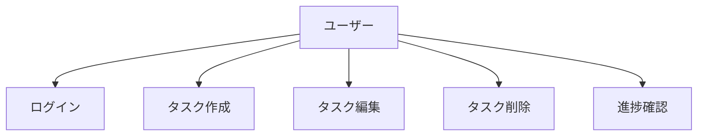
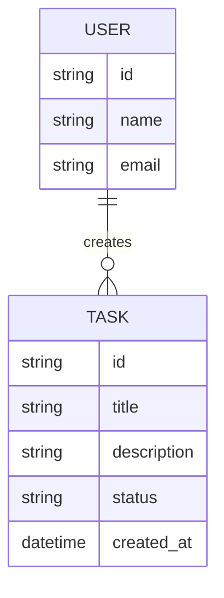

# STEP 1: 要件定義ワークフロー

## 目的・スコープ

ユーザーニーズを詳細に分析し、システムが満たすべき機能要件・非機能要件を明確に定義する。設計フェーズの基盤となる要求仕様を確立する。

## インプット・アウトプット

**インプット**：
- ゴールステートメント
- ステークホルダー一覧
- 制約条件リスト

**アウトプット**：
- ユースケース一覧（`docs-agent/requirements/use-cases.md`）
- 非機能要件リスト（`docs-agent/requirements/non-functional.md`）
- 要求仕様書（`docs-agent/requirements/specification.md`）

## Source Mapping
- @docs-theory/theory/ai-coding-development-process-v1.3-deliverable-flow.md § 要件定義
- @docs-theory/theory/process-engineering-v1.3-complete-definition.md § STEP1
- @docs-theory/theory/quality-gate-detailed-specifications-v1.3.md § Requirements

## 具体的手順

### 1. ユースケース分析

**ユースケース一覧テーブル**：
| UC-ID | ユースケース名 | アクター | 概要 | 優先度 |
|-------|----------------|----------|------|--------|
| UC-001 | ユーザー認証 | ユーザー | システムへのログイン | 高 |
| UC-002 | タスク管理 | ユーザー | タスクのCRUD操作 | 高 |

### 2. 非機能要件定義
- **パフォーマンス要件**：応答時間、スループット
- **可用性要件**：稼働率、復旧時間
- **セキュリティ要件**：認証、認可、データ保護
- **保守性要件**：コード品質、テスト容易性

### 3. データ関係図作成

### 4. 要求仕様書統合
- 全ユースケースの詳細記述
- 非機能要件の定量的定義
- データモデルの詳細仕様
- インターフェース要件

## チェックリスト

- [ ] 全ユースケースが特定されている
- [ ] アクターが明確に定義されている
- [ ] 非機能要件が定量的に記述されている
- [ ] データ関係図が作成されている
- [ ] 要求仕様書が完成している
- [ ] Mermaid記法が正しく使用されている
- [ ] 標準テーブル形式が使用されている

## 次STEP移行条件

- 全要件が明確に定義されている
- ステークホルダーからの要件承認が完了
- 要件の優先度付けが完了している
- `@workflows/quality-gate-requirements.md`での品質確認完了
- `@workflows/step2-system-design.md`への移行準備完了