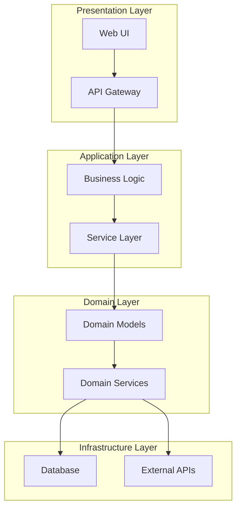
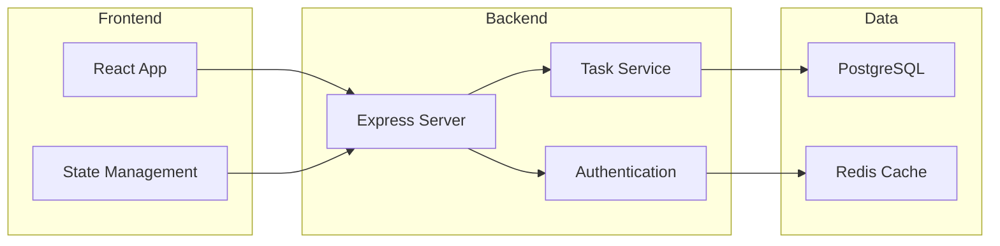

# STEP 2: システム設計ワークフロー

## 目的・スコープ

要件定義を基に、システム全体のアーキテクチャを設計し、技術選定を行う。実装可能で保守性の高いシステム構成を確立する。

## インプット・アウトプット

**インプット**：
- ユースケース一覧
- 非機能要件リスト
- 要求仕様書

**アウトプット**：
- システム構成図（`docs-agent/design/system-architecture.md`）
- 技術選定・依存関係定義書（`docs-agent/design/tech-stack.md`）

## Source Mapping
- @docs-theory/theory/ai-coding-development-process-v1.3-deliverable-flow.md § システム設計
- @docs-theory/theory/process-engineering-v1.3-complete-definition.md § STEP2
- @docs-theory/theory/quality-gate-detailed-specifications-v1.3.md § Architecture

## 具体的手順

### 1. システム全体アーキテクチャ設計

### 2. コンポーネント構成図作成

### 3. 技術選定表作成
| カテゴリ | 技術 | バージョン | 選定理由 | 代替案 |
|----------|------|------------|----------|--------|
| Frontend | React | 18.x | コンポーネント指向、豊富なエコシステム | Vue.js, Angular |
| Backend | Node.js | 18.x | JavaScript統一、高いパフォーマンス | Python, Java |
| Database | PostgreSQL | 15.x | ACID準拠、豊富な機能 | MySQL, MongoDB |
| Cache | Redis | 7.x | 高速、多様なデータ構造 | Memcached |

### 4. 依存関係定義
- 外部ライブラリの選定と理由
- バージョン管理戦略
- セキュリティ考慮事項
- パフォーマンス最適化方針

### 5. 非機能要件への対応設計
- スケーラビリティ対応
- セキュリティ対策
- 可用性確保
- 監視・ログ戦略

## チェックリスト

- [ ] システム全体アーキテクチャ図が作成されている
- [ ] コンポーネント構成図が作成されている
- [ ] 技術選定表が完成している
- [ ] 依存関係が明確に定義されている
- [ ] 非機能要件への対応が設計されている
- [ ] Mermaid記法が正しく使用されている
- [ ] 標準テーブル形式が使用されている

## 次STEP移行条件

- 全アーキテクチャ図が完成している
- 技術選定の妥当性が確認されている
- 非機能要件への対応が設計されている
- `@workflows/quality-gate-architecture.md`での品質確認完了
- `@workflows/step3-detailed-design.md`への移行準備完了