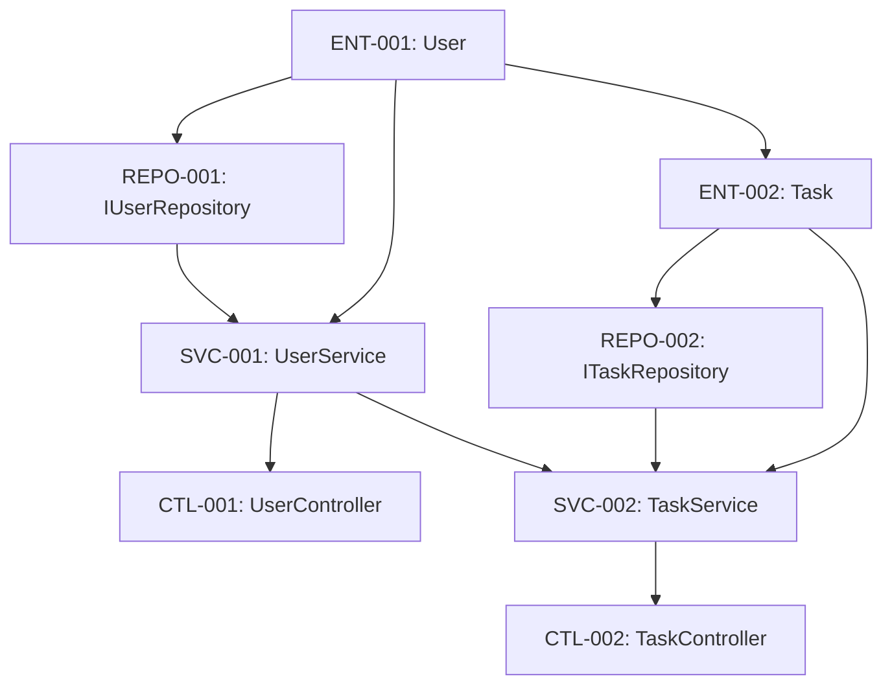

# STEP 5: 実装計画ワークフロー

## 目的・スコープ

詳細設計とテスト設計を基に、実装の具体的な計画を策定する。ファイル単位のタスク分割、依存関係の整理、開発スケジュールの作成を行う。

## インプット・アウトプット

**インプット**：
- クラス設計表
- メソッドI/Fリスト
- テスト戦略書
- テストケース定義書

**アウトプット**：
- 実装コンポーネント一覧（`docs-agent/implementation/components.md`）
- 開発工程表（`docs-agent/implementation/schedule.md`）
- ディレクトリ構造マップ（`docs-agent/implementation/directory-structure.md`）

## Source Mapping
- @docs-theory/theory/ai-coding-development-process-v1.3-deliverable-flow.md § 実装計画
- @docs-theory/theory/process-engineering-v1.3-complete-definition.md § STEP5
- @docs-theory/theory/quality-gate-implementation-guide-v1.3.md

## 具体的手順

### 1. ディレクトリ構造設計
```
src/
├── presentation/
│   ├── controllers/
│   │   ├── UserController.ts
│   │   └── TaskController.ts
│   ├── middlewares/
│   │   ├── AuthMiddleware.ts
│   │   └── ValidationMiddleware.ts
│   └── routes/
│       ├── userRoutes.ts
│       └── taskRoutes.ts
├── application/
│   ├── services/
│   │   ├── UserService.ts
│   │   └── TaskService.ts
│   ├── dtos/
│   │   ├── CreateUserDto.ts
│   │   ├── UpdateUserDto.ts
│   │   ├── CreateTaskDto.ts
│   │   └── UpdateTaskDto.ts
│   └── interfaces/
│       ├── IUserService.ts
│       └── ITaskService.ts
├── domain/
│   ├── entities/
│   │   ├── User.ts
│   │   └── Task.ts
│   ├── valueObjects/
│   │   ├── Email.ts
│   │   └── TaskStatus.ts
│   └── repositories/
│       ├── IUserRepository.ts
│       └── ITaskRepository.ts
└── infrastructure/
    ├── database/
    │   ├── UserRepository.ts
    │   ├── TaskRepository.ts
    │   └── DatabaseConnection.ts
    ├── external/
    │   └── EmailService.ts
    └── config/
        └── AppConfig.ts
```

### 2. 実装コンポーネント一覧作成
| コンポーネントID | ファイルパス | レイヤー | 依存関係 | 見積時間 |
|------------------|--------------|----------|----------|----------|
| ENT-001 | src/domain/entities/User.ts | Domain | - | 2h |
| ENT-002 | src/domain/entities/Task.ts | Domain | ENT-001 | 2h |
| VO-001 | src/domain/valueObjects/Email.ts | Domain | - | 1h |
| VO-002 | src/domain/valueObjects/TaskStatus.ts | Domain | - | 1h |
| REPO-001 | src/domain/repositories/IUserRepository.ts | Domain | ENT-001 | 1h |
| REPO-002 | src/domain/repositories/ITaskRepository.ts | Domain | ENT-002 | 1h |
| SVC-001 | src/application/services/UserService.ts | Application | ENT-001, REPO-001 | 4h |
| SVC-002 | src/application/services/TaskService.ts | Application | ENT-002, REPO-002 | 4h |
| DTO-001 | src/application/dtos/CreateUserDto.ts | Application | - | 1h |
| DTO-002 | src/application/dtos/UpdateUserDto.ts | Application | - | 1h |
| DTO-003 | src/application/dtos/CreateTaskDto.ts | Application | - | 1h |
| DTO-004 | src/application/dtos/UpdateTaskDto.ts | Application | - | 1h |
| CTL-001 | src/presentation/controllers/UserController.ts | Presentation | SVC-001 | 3h |
| CTL-002 | src/presentation/controllers/TaskController.ts | Presentation | SVC-002 | 3h |
| REPO-IMPL-001 | src/infrastructure/database/UserRepository.ts | Infrastructure | REPO-001 | 3h |
| REPO-IMPL-002 | src/infrastructure/database/TaskRepository.ts | Infrastructure | REPO-002 | 3h |

### 3. 3フェーズ実装計画
#### Phase 1: 実装・単体テスト（Week 1-2）
- Domain層の実装（ENT, VO, REPO interfaces）
- Application層の実装（SVC, DTO）
- Infrastructure層の実装（REPO implementations）
- 各コンポーネントの単体テスト作成・実行

#### Phase 2: 結合テスト（Week 3）
- Presentation層の実装（CTL, Routes, Middlewares）
- レイヤー間結合テストの実行
- API結合テストの実行
- 統合環境での動作確認

#### Phase 3: E2Eテスト（Week 4）
- フロントエンド統合
- E2Eテストシナリオの実行
- パフォーマンステスト
- 本番環境デプロイ準備

### 4. 開発工程表作成
| Phase | Week | タスク | 成果物 | 品質ゲート |
|-------|------|--------|--------|------------|
| Phase 1 | Week 1 | Domain層実装 | Entity, VO, Repository I/F | 単体テスト90%+ |
| Phase 1 | Week 1 | Application層実装 | Service, DTO | 単体テスト90%+ |
| Phase 1 | Week 2 | Infrastructure層実装 | Repository実装 | 単体テスト90%+ |
| Phase 2 | Week 3 | Presentation層実装 | Controller, Routes | 結合テスト100% |
| Phase 2 | Week 3 | 結合テスト実行 | テスト結果レポート | API動作確認 |
| Phase 3 | Week 4 | E2Eテスト実行 | E2Eテスト結果 | 全シナリオ通過 |
| Phase 3 | Week 4 | 本番デプロイ | 本番環境 | 本番動作確認 |

### 5. タスク依存関係マップ


### 6. 品質管理計画
- **コードレビュー**: 全PRに対して実施
- **静的解析**: ESLint, TypeScript strict mode
- **テストカバレッジ**: 90%以上維持
- **パフォーマンス**: 応答時間200ms以下
- **セキュリティ**: OWASP Top 10対応

## チェックリスト

- [ ] ディレクトリ構造が設計されている
- [ ] 実装コンポーネント一覧が作成されている
- [ ] 3フェーズ実装計画が策定されている
- [ ] 開発工程表が作成されている
- [ ] タスク依存関係が明確になっている
- [ ] 品質管理計画が策定されている
- [ ] 見積時間が現実的である
- [ ] 標準テーブル形式が使用されている

## 次STEP移行条件

- 全実装計画が完成している
- タスク分割が適切に行われている
- 依存関係が正しく整理されている
- 品質管理計画が確立されている
- `@workflows/quality-gate-implementation-planning.md`での品質確認完了
- `@workflows/step7-coding-execution.md`への移行準備完了