# プロセスエンジニアリング文書フォーマット仕様書（修正版）

## 概要

本仕様書は、「プロセスエンジニアリングfor AIコーディング」で定義される全ドキュメントの標準フォーマットを定義します。RagProtoプロジェクトでの実装例を基に、7段階すべての文書の必須項目、任意項目、書式、図示方法を標準化します。

## 基本原則

### 1. 文書構造の統一
- 全文書はMarkdown形式で作成
- 階層構造は最大6レベル（H1-H6）まで
- 必須セクションと任意セクションを明確に区分
- メタデータセクションを文書冒頭に配置

### 2. トレーサビリティの確保
- 各文書に一意のドキュメントIDを付与
- 前段階文書への参照を明記
- 次段階への引き継ぎ情報を明示

### 3. 品質基準の統一
- チェックリスト形式での完了確認
- レビュー項目の標準化
- 更新履歴の記録

### 4. 図示方法の標準化
- Mermaid記法を使用した図表作成
- 適切なコードブロック記法の使用
- 図表とテキストの明確な分離

---

## STEP 0: ゴール定義文書

### 0.1 ゴールステートメント（goal-statement.md）

#### 必須セクション

````markdown
# ゴールステートメント

## メタデータ
| 項目 | 内容 |
|------|------|
| ドキュメントID | GOAL-001 |
| 作成日 | YYYY-MM-DD |
| 最終更新日 | YYYY-MM-DD |
| 作成者 | [作成者名] |
| レビュー者 | [レビュー者名] |
| 承認者 | [承認者名] |

## 1. プロジェクト概要
| 項目 | 内容 |
|------|------|
| プロジェクト名 | [プロジェクト名] |
| 目的 | [1文で表現された明確な目的] |
| スコープ | [実装範囲の明確な定義] |
| 成果物 | [期待される具体的な成果物] |

## 2. 解決する課題
### 2.1 現状の問題
- [具体的な問題点1]
- [具体的な問題点2]
- [具体的な問題点3]

### 2.2 期待する結果
- [定量的な成果指標1]
- [定量的な成果指標2]
- [定量的な成果指標3]

## 3. 成功の定義
### 3.1 定量的指標
| 指標 | 目標値 | 測定方法 |
|------|--------|----------|
| [指標名1] | [目標値1] | [測定方法1] |
| [指標名2] | [目標値2] | [測定方法2] |

### 3.2 定性的指標
- [定性的成功基準1]
- [定性的成功基準2]

## 4. 完了確認
- [ ] 目的が1文で明確に表現されている
- [ ] 解決する課題が具体的に記述されている
- [ ] 成功の定義が定量的に設定されている
- [ ] ステークホルダーの合意が得られている
````

#### 任意セクション
- 背景情報
- 関連プロジェクト
- 参考資料

### 0.2 ステークホルダー一覧（stakeholders.md）

#### 必須セクション

````markdown
# ステークホルダー一覧

## メタデータ
| 項目 | 内容 |
|------|------|
| ドキュメントID | STAKE-001 |
| 関連文書 | GOAL-001 |
| 作成日 | YYYY-MM-DD |

## 1. ステークホルダー分類

### 1.1 プライマリステークホルダー
| 役割 | 氏名/組織 | 責任範囲 | 期待事項 | 連絡先 |
|------|-----------|----------|----------|--------|
| [役割1] | [氏名1] | [責任範囲1] | [期待事項1] | [連絡先1] |
| [役割2] | [氏名2] | [責任範囲2] | [期待事項2] | [連絡先2] |

### 1.2 セカンダリステークホルダー
| 役割 | 氏名/組織 | 影響度 | 関与レベル | 連絡先 |
|------|-----------|--------|------------|--------|
| [役割1] | [氏名1] | [高/中/低] | [関与レベル1] | [連絡先1] |

## 2. コミュニケーション計画
| ステークホルダー | 頻度 | 方法 | 内容 |
|------------------|------|------|------|
| [ステークホルダー1] | [頻度1] | [方法1] | [内容1] |

## 3. 完了確認
- [ ] 全ステークホルダーが特定されている
- [ ] 役割と責任が明確に定義されている
- [ ] コミュニケーション計画が策定されている
````

### 0.3 制約条件リスト（constraints.md）

#### 必須セクション

````markdown
# 制約条件リスト

## メタデータ
| 項目 | 内容 |
|------|------|
| ドキュメントID | CONST-001 |
| 関連文書 | GOAL-001 |
| 作成日 | YYYY-MM-DD |

## 1. 技術制約
| 制約項目 | 内容 | 影響度 | 対応策 |
|----------|------|--------|--------|
| [制約1] | [詳細1] | [高/中/低] | [対応策1] |
| [制約2] | [詳細2] | [高/中/低] | [対応策2] |

## 2. 運用制約
| 制約項目 | 内容 | 影響度 | 対応策 |
|----------|------|--------|--------|
| [制約1] | [詳細1] | [高/中/低] | [対応策1] |

## 3. リソース制約
| 制約項目 | 内容 | 影響度 | 対応策 |
|----------|------|--------|--------|
| [制約1] | [詳細1] | [高/中/低] | [対応策1] |

## 4. 時間制約
| 制約項目 | 期限 | 影響度 | 対応策 |
|----------|------|--------|--------|
| [制約1] | [期限1] | [高/中/低] | [対応策1] |

## 5. 完了確認
- [ ] 技術制約が全て特定されている
- [ ] 運用制約が明確に定義されている
- [ ] リソース制約が現実的に評価されている
- [ ] 時間制約が具体的に設定されている
````

---

## STEP 1: 要件定義文書

### 1.1 ユースケース一覧（requirements/use-cases.md）

#### 必須セクション

````markdown
# ユースケース一覧

## メタデータ
| 項目 | 内容 |
|------|------|
| ドキュメントID | UC-001 |
| 関連文書 | GOAL-001, STAKE-001 |
| 作成日 | YYYY-MM-DD |

## 1. ユースケース概要

### 1.1 アクター定義
| アクターID | アクター名 | 説明 | 権限レベル |
|------------|------------|------|------------|
| AC-001 | [アクター1] | [説明1] | [権限1] |
| AC-002 | [アクター2] | [説明2] | [権限2] |

### 1.2 ユースケース一覧
| UC-ID | ユースケース名 | アクター | 優先度 | 複雑度 |
|-------|----------------|----------|--------|--------|
| UC-001 | [ユースケース1] | AC-001 | 高 | 中 |
| UC-002 | [ユースケース2] | AC-002 | 中 | 低 |

## 2. ユースケース詳細

### UC-001: [ユースケース名]
**概要**: [ユースケースの概要]
**アクター**: [主要アクター]
**目的**: [達成したい目標]
**頻度**: [実行頻度]

#### 事前条件
- [事前条件1]
- [事前条件2]

#### 主要シナリオ
1. [ステップ1]
2. [ステップ2]
3. [ステップ3]

#### 代替シナリオ
**A1: [例外ケース1]**
- 1a. [例外処理1]
- 1b. [例外処理2]

#### 事後条件
- [事後条件1]
- [事後条件2]

#### 非機能要件
- **性能**: [性能要件]
- **セキュリティ**: [セキュリティ要件]
- **可用性**: [可用性要件]

## 3. ユースケース関係図

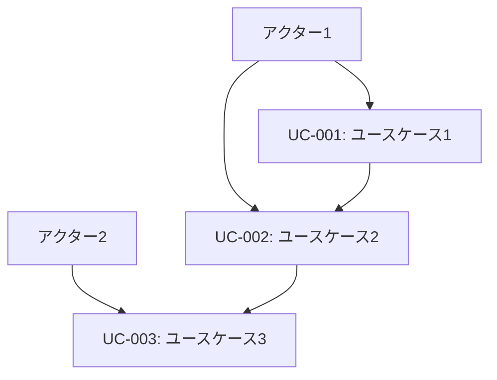

## 4. 完了確認
- [ ] 全アクターが特定されている
- [ ] ユースケースが網羅的に定義されている
- [ ] 主要シナリオが詳細に記述されている
- [ ] 代替シナリオが適切に定義されている
- [ ] 事前・事後条件が明確である
````

### 1.2 非機能要件リスト（requirements/non-functional.md）

#### 必須セクション

````markdown
# 非機能要件リスト

## メタデータ
| 項目 | 内容 |
|------|------|
| ドキュメントID | NFR-001 |
| 関連文書 | UC-001, CONST-001 |
| 作成日 | YYYY-MM-DD |

## 1. 性能要件

### 1.1 応答時間
| 機能 | 目標値 | 最大許容値 | 測定条件 |
|------|--------|------------|----------|
| [機能1] | [目標値1] | [最大値1] | [条件1] |
| [機能2] | [目標値2] | [最大値2] | [条件2] |

### 1.2 スループット
| 機能 | 目標値 | 最大許容値 | 測定条件 |
|------|--------|------------|----------|
| [機能1] | [目標値1] | [最大値1] | [条件1] |

### 1.3 リソース使用量
| リソース | 目標値 | 最大許容値 | 測定条件 |
|----------|--------|------------|----------|
| CPU使用率 | [目標値] | [最大値] | [条件] |
| メモリ使用量 | [目標値] | [最大値] | [条件] |
| ディスク使用量 | [目標値] | [最大値] | [条件] |

## 2. 可用性要件

### 2.1 稼働率
| システム | 目標稼働率 | 計画停止時間 | 障害復旧時間 |
|----------|------------|--------------|--------------|
| [システム1] | [稼働率1] | [停止時間1] | [復旧時間1] |

### 2.2 障害対応
| 障害レベル | 検知時間 | 復旧時間 | 対応手順 |
|------------|----------|----------|----------|
| 重大 | [時間1] | [時間1] | [手順1] |
| 軽微 | [時間2] | [時間2] | [手順2] |

## 3. セキュリティ要件

### 3.1 認証・認可
| 項目 | 要件 | 実装方法 |
|------|------|----------|
| 認証方式 | [要件1] | [方法1] |
| 認可制御 | [要件2] | [方法2] |

### 3.2 データ保護
| データ種別 | 保護レベル | 暗号化方式 | アクセス制御 |
|------------|------------|------------|--------------|
| [データ1] | [レベル1] | [方式1] | [制御1] |

## 4. 拡張性要件

### 4.1 スケーラビリティ
| 項目 | 現在 | 1年後 | 3年後 |
|------|------|-------|-------|
| 同時接続数 | [数値1] | [数値2] | [数値3] |
| データ量 | [数値1] | [数値2] | [数値3] |

## 5. 保守性要件

### 5.1 監視・ログ
| 項目 | 要件 | 実装方法 |
|------|------|----------|
| システム監視 | [要件1] | [方法1] |
| ログ管理 | [要件2] | [方法2] |

## 6. 完了確認
- [ ] 性能要件が定量的に定義されている
- [ ] 可用性要件が明確に設定されている
- [ ] セキュリティ要件が包括的に定義されている
- [ ] 拡張性要件が将来を見据えて設定されている
- [ ] 保守性要件が運用を考慮して定義されている
````

### 1.3 要求仕様書（requirements/specification.md）

#### 必須セクション

````markdown
# 要求仕様書

## メタデータ
| 項目 | 内容 |
|------|------|
| ドキュメントID | REQ-001 |
| 関連文書 | UC-001, NFR-001 |
| 作成日 | YYYY-MM-DD |
| バージョン | 1.0 |

## 1. 機能要件

### 1.1 機能一覧
| 機能ID | 機能名 | 優先度 | 関連UC | 説明 |
|--------|--------|--------|--------|------|
| F-001 | [機能1] | 必須 | UC-001 | [説明1] |
| F-002 | [機能2] | 重要 | UC-002 | [説明2] |

### 1.2 機能詳細

#### F-001: [機能名]
**概要**: [機能の概要]
**入力**: [入力データ・形式]
**処理**: [処理内容]
**出力**: [出力データ・形式]
**例外処理**: [例外ケースと対応]

**詳細仕様**:
- [仕様1]
- [仕様2]
- [仕様3]

**制約事項**:
- [制約1]
- [制約2]

## 2. 非機能要件サマリ

### 2.1 性能要件
| 項目 | 要件 |
|------|------|
| 応答時間 | [要件1] |
| スループット | [要件2] |

### 2.2 品質要件
| 項目 | 要件 |
|------|------|
| 可用性 | [要件1] |
| セキュリティ | [要件2] |

## 3. インターフェース要件

### 3.1 ユーザーインターフェース
- [UI要件1]
- [UI要件2]

### 3.2 システムインターフェース
| IF-ID | インターフェース名 | 種別 | プロトコル | データ形式 |
|-------|-------------------|------|------------|------------|
| IF-001 | [IF名1] | [種別1] | [プロトコル1] | [形式1] |

## 4. データ要件

### 4.1 データ項目
| データID | データ名 | 型 | 必須 | 説明 |
|----------|----------|----|----- |------|
| D-001 | [データ1] | [型1] | ○ | [説明1] |

### 4.2 データ関係図

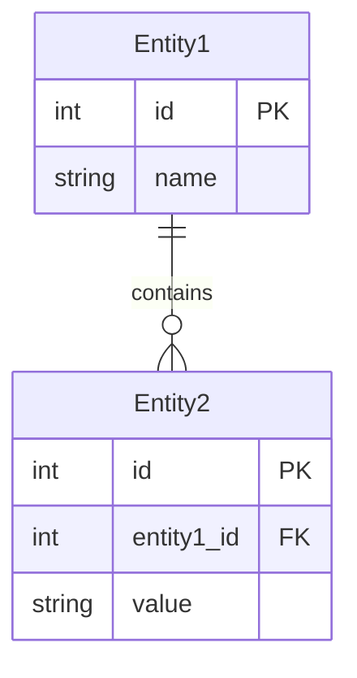

## 5. 完了確認
- [ ] 機能要件が網羅的に定義されている
- [ ] 非機能要件が適切に統合されている
- [ ] インターフェース要件が明確に定義されている
- [ ] データ要件が詳細に記述されている
- [ ] 制約事項が明確に記載されている
````

---

## STEP 2: システム設計文書

### 2.1 システム構成図（design/system-architecture.md）

#### 必須セクション

````markdown
# システム構成図

## メタデータ
| 項目 | 内容 |
|------|------|
| ドキュメントID | ARCH-001 |
| 関連文書 | REQ-001 |
| 作成日 | YYYY-MM-DD |

## 1. システム全体アーキテクチャ

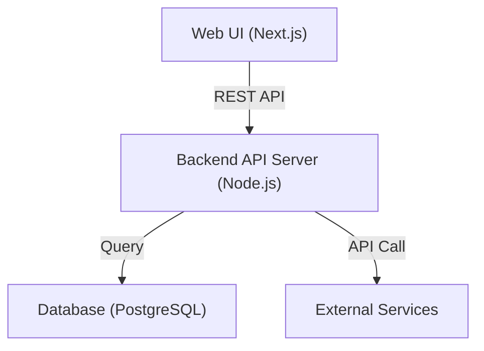

## 2. レイヤー構成

| レイヤー | 内容 | 技術 | 責任 |
|----------|------|------|------|
| Presentation Layer | [内容1] | [技術1] | [責任1] |
| Application Layer | [内容2] | [技術2] | [責任2] |
| Domain Layer | [内容3] | [技術3] | [責任3] |
| Infrastructure Layer | [内容4] | [技術4] | [責任4] |

## 3. コンポーネント構成図

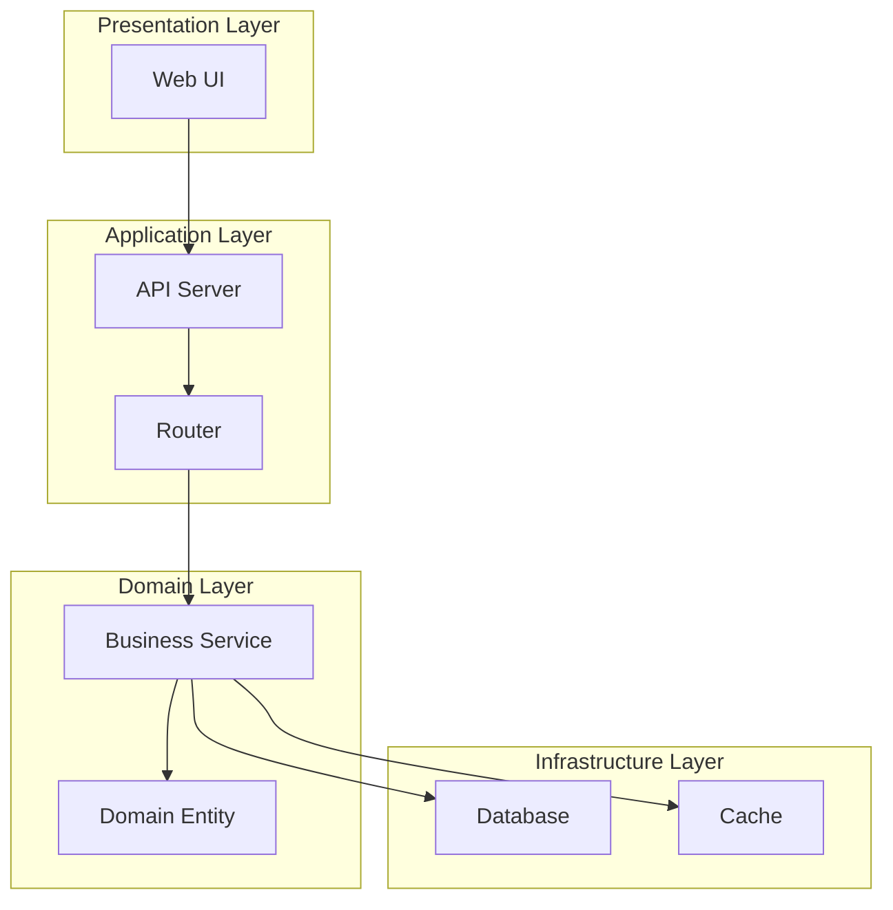

## 4. 設計原則

### 4.1 アーキテクチャ原則
- [原則1]: [説明1]
- [原則2]: [説明2]
- [原則3]: [説明3]

### 4.2 設計パターン
| パターン名 | 適用箇所 | 目的 |
|------------|----------|------|
| [パターン1] | [箇所1] | [目的1] |
| [パターン2] | [箇所2] | [目的2] |

## 5. 完了確認
- [ ] システム全体像が明確に表現されている
- [ ] レイヤー構成が適切に定義されている
- [ ] コンポーネント間の関係が明確である
- [ ] 設計原則が明文化されている
````

### 2.2 技術選定・依存関係定義書（design/tech-stack.md）

#### 必須セクション

````markdown
# 技術選定・依存関係定義書

## メタデータ
| 項目 | 内容 |
|------|------|
| ドキュメントID | TECH-001 |
| 関連文書 | ARCH-001, NFR-001 |
| 作成日 | YYYY-MM-DD |

## 1. 技術スタック選定

### 1.1 フロントエンド
| レイヤー | 技術 | バージョン | 選定理由 | 代替案 | ライセンス | リスク |
|---------|------|----------|----------|--------|-----------|--------|
| UI Framework | React | 18.2.0 | [理由1] | Vue.js | MIT | [リスク1] |
| Build Tool | Next.js | 13.x | [理由2] | Vite | MIT | [リスク2] |

### 1.2 バックエンド
| レイヤー | 技術 | バージョン | 選定理由 | 代替案 | ライセンス | リスク |
|---------|------|----------|----------|--------|-----------|--------|
| Runtime | Node.js | 18.x | [理由1] | Deno | MIT | [リスク1] |
| Framework | Express | 4.x | [理由2] | Fastify | MIT | [リスク2] |

### 1.3 データベース
| レイヤー | 技術 | バージョン | 選定理由 | 代替案 | ライセンス | リスク |
|---------|------|----------|----------|--------|-----------|--------|
| RDBMS | PostgreSQL | 15.x | [理由1] | MySQL | PostgreSQL | [リスク1] |

### 1.4 外部サービス
| サービス | 用途 | API仕様 | 制約事項 | 代替案 |
|----------|------|---------|----------|--------|
| OpenAI API | [用途1] | [仕様1] | [制約1] | [代替案1] |

## 2. 依存関係管理

### 2.1 パッケージ管理
| 環境 | パッケージマネージャ | 設定ファイル | ロックファイル |
|------|---------------------|--------------|----------------|
| Frontend | npm | package.json | package-lock.json |
| Backend | npm | package.json | package-lock.json |

### 2.2 主要依存関係
| パッケージ名 | バージョン | 用途 | 更新方針 |
|-------------|------------|------|----------|
| [パッケージ1] | [バージョン1] | [用途1] | [方針1] |

## 3. 開発環境

### 3.1 開発ツール
| ツール | バージョン | 用途 | 設定ファイル |
|--------|------------|------|--------------|
| TypeScript | 5.x | 型チェック | tsconfig.json |
| ESLint | 8.x | 静的解析 | .eslintrc.json |
| Prettier | 3.x | コード整形 | .prettierrc |

### 3.2 実行環境
| 環境 | 技術 | 設定 |
|------|------|------|
| 開発 | Docker | docker-compose.dev.yml |
| テスト | Docker | docker-compose.test.yml |
| 本番 | Docker | docker-compose.prod.yml |

## 4. セキュリティ考慮事項

### 4.1 脆弱性対策
| 技術 | 脆弱性 | 対策 |
|------|--------|------|
| [技術1] | [脆弱性1] | [対策1] |

### 4.2 ライセンス管理
| ライセンス | 制約事項 | 対象パッケージ |
|------------|----------|----------------|
| MIT | [制約1] | [パッケージ群1] |
| Apache 2.0 | [制約2] | [パッケージ群2] |

## 5. 完了確認
- [ ] 技術選定理由が明確に記述されている
- [ ] バージョン指定が具体的である
- [ ] 代替案が検討されている
- [ ] ライセンス・セキュリティが考慮されている
- [ ] 依存関係が適切に管理されている
````

---

## STEP 3: 詳細設計文書

### 3.1 クラス設計表（detailed-design/classes.md）

#### 必須セクション

````markdown
# クラス設計表

## メタデータ
| 項目 | 内容 |
|------|------|
| ドキュメントID | CLASS-001 |
| 関連文書 | ARCH-001, TECH-001 |
| 作成日 | YYYY-MM-DD |

## 1. クラス一覧

| クラスID | クラス名 | レイヤー | 責任 | 依存関係 |
|----------|----------|----------|------|----------|
| CL-001 | QueryController | Presentation | [責任1] | [依存1] |
| CL-002 | UserService | Application | [責任2] | [依存2] |

## 2. クラス詳細設計

### CL-001: QueryController

#### 基本情報
- **パッケージ**: controllers
- **ファイル**: queryController.ts
- **責任**: HTTPリクエストの受信と応答の返却
- **設計原則**: 単一責任原則、依存性逆転原則

#### 属性
| 属性名 | 型 | 可視性 | 初期値 | 説明 |
|--------|----|---------|---------|----- |
| router | LangChainRouter | private | - | [説明1] |
| logger | Logger | private | - | [説明2] |

#### メソッド
| メソッド名 | 可視性 | 引数 | 戻り値 | 説明 |
|------------|--------|------|--------|------|
| handleQuery | public | req: Request | Promise<Response> | [説明1] |
| validateInput | private | query: string | boolean | [説明2] |

#### 依存関係図

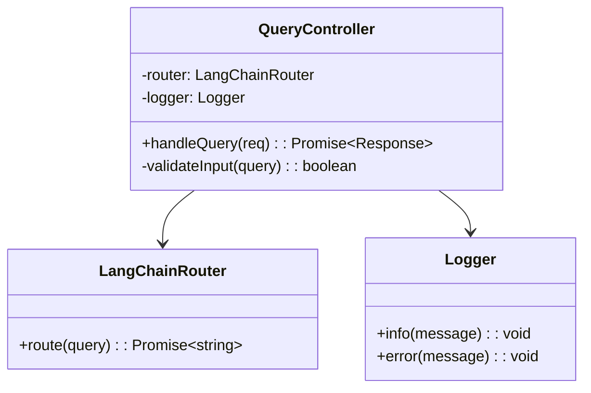

#### 例外処理
| 例外 | 発生条件 | 処理方法 |
|------|----------|----------|
| ValidationError | [条件1] | [処理1] |
| SystemError | [条件2] | [処理2] |

## 3. 完了確認
- [ ] 全クラスが単一責任原則に従っている
- [ ] 依存関係が明確に定義されている
- [ ] インターフェースが適切に設計されている
- [ ] 例外処理が考慮されている
````

### 3.2 メソッドI/Fリスト（detailed-design/interfaces.md）

#### 必須セクション

````markdown
# メソッドインターフェースリスト

## メタデータ
| 項目 | 内容 |
|------|------|
| ドキュメントID | IF-001 |
| 関連文書 | CLASS-001 |
| 作成日 | YYYY-MM-DD |

## 1. インターフェース一覧

| IF-ID | クラス名 | メソッド名 | 種別 | 優先度 |
|-------|----------|------------|------|--------|
| IF-001 | QueryController | handleQuery | public | 高 |
| IF-002 | LangChainRouter | route | public | 高 |

## 2. インターフェース詳細

### IF-001: QueryController.handleQuery

#### 基本情報
- **目的**: ユーザークエリを受信し、処理結果を返却する
- **呼び出し元**: Express Router
- **呼び出し先**: LangChainRouter.route

#### シグネチャ
```typescript
async handleQuery(req: Request): Promise<Response>
```

#### パラメータ
| パラメータ名 | 型 | 必須 | 説明 | 制約 |
|-------------|----|----- |------|------|
| req | Request | ○ | HTTPリクエストオブジェクト | [制約1] |

#### 戻り値
| 型 | 説明 | 例 |
|----|------|-----|
| Promise<Response> | HTTPレスポンスオブジェクト | [例1] |

#### 例外
| 例外名 | 発生条件 | 対処方法 |
|--------|----------|----------|
| ValidationError | [条件1] | [対処1] |
| SystemError | [条件2] | [対処2] |

#### 処理フロー
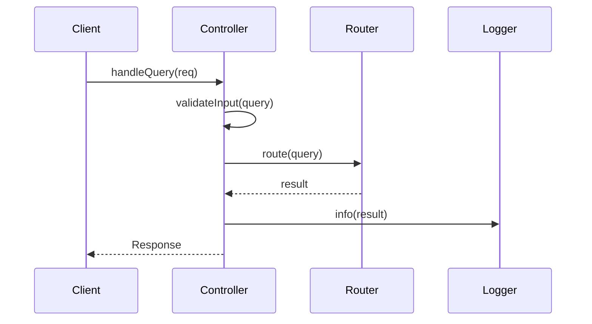

#### 実装例
```typescript
async handleQuery(req: Request): Promise<Response> {
    try {
        const query = req.body.query;
        
        if (!this.validateInput(query)) {
            throw new ValidationError('Invalid query format');
        }
        
        const result = await this.router.route(query);
        this.logger.info(`Query processed: ${query}`);
        
        return {
            status: 200,
            data: result
        };
    } catch (error) {
        this.logger.error(`Query processing failed: ${error.message}`);
        throw error;
    }
}
```

## 3. 完了確認
- [ ] 全メソッドのシグネチャが定義されている
- [ ] パラメータと戻り値が詳細に記述されている
- [ ] 例外処理が適切に定義されている
- [ ] 処理フローが図示されている
- [ ] 実装例が提供されている
````

---

## STEP 4: テスト設計文書

### 4.1 テスト戦略書（test-design/strategy.md）

#### 必須セクション

````markdown
# テスト戦略書

## メタデータ
| 項目 | 内容 |
|------|------|
| ドキュメントID | TEST-001 |
| 関連文書 | REQ-001, CLASS-001 |
| 作成日 | YYYY-MM-DD |

## 1. テスト方針

### 1.1 テスト目的
- [目的1]: [説明1]
- [目的2]: [説明2]
- [目的3]: [説明3]

### 1.2 テスト範囲
| 対象 | 含む | 含まない | 理由 |
|------|------|----------|------|
| [対象1] | [含む項目1] | [除外項目1] | [理由1] |
| [対象2] | [含む項目2] | [除外項目2] | [理由2] |

## 2. テストレベル

### 2.1 テストピラミッド
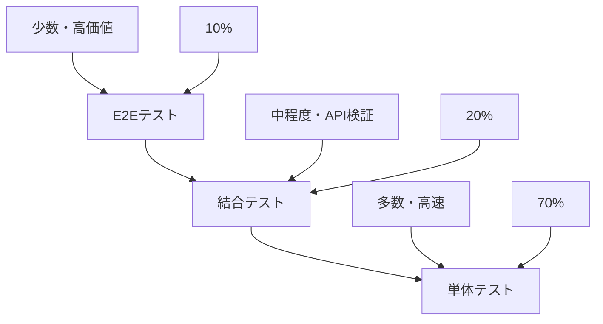

### 2.2 テストレベル詳細
| レベル | 目的 | 対象 | 実行頻度 | 自動化率 |
|--------|------|------|----------|----------|
| 単体テスト | [目的1] | [対象1] | [頻度1] | 100% |
| 結合テスト | [目的2] | [対象2] | [頻度2] | 90% |
| E2Eテスト | [目的3] | [対象3] | [頻度3] | 80% |

## 3. 品質基準

### 3.1 カバレッジ目標
| テストレベル | カバレッジ種別 | 目標値 | 最低値 |
|-------------|---------------|--------|--------|
| 単体テスト | ライン | 95% | 90% |
| 単体テスト | ブランチ | 90% | 85% |
| 結合テスト | API | 100% | 95% |

### 3.2 品質ゲート
| 項目 | 基準 | 測定方法 |
|------|------|----------|
| テスト成功率 | 100% | 自動テスト実行 |
| カバレッジ | 90%以上 | Jest Coverage |
| 性能 | 応答時間<200ms | 負荷テスト |

## 4. テスト環境

### 4.1 環境構成
| 環境名 | 用途 | データ | 更新頻度 |
|--------|------|--------|----------|
| 開発 | 開発者テスト | モックデータ | 随時 |
| テスト | 自動テスト | テストデータ | 日次 |
| ステージング | 受け入れテスト | 本番類似データ | 週次 |

### 4.2 テストデータ管理
| データ種別 | 作成方法 | 更新方法 | 保護レベル |
|------------|----------|----------|------------|
| [データ1] | [方法1] | [更新1] | [レベル1] |

## 5. 完了確認
- [ ] テスト方針が明確に定義されている
- [ ] テストレベルが適切に設計されている
- [ ] 品質基準が定量的に設定されている
- [ ] テスト環境が適切に計画されている
````

### 4.2 テスト対象一覧（test-design/targets.md）

#### 必須セクション

````markdown
# テスト対象一覧

## メタデータ
| 項目 | 内容 |
|------|------|
| ドキュメントID | TARGET-001 |
| 関連文書 | TEST-001, CLASS-001 |
| 作成日 | YYYY-MM-DD |

## 1. 単体テスト対象

### 1.1 クラス別テスト対象
| クラス名 | メソッド数 | テスト対象メソッド | 除外メソッド | 除外理由 |
|----------|------------|-------------------|-------------|----------|
| QueryController | 5 | 4 | 1 | [理由1] |
| UserService | 8 | 7 | 1 | [理由2] |

### 1.2 メソッド別テスト詳細
| クラス名 | メソッド名 | 複雑度 | 優先度 | テストケース数 |
|----------|------------|--------|--------|----------------|
| QueryController | handleQuery | 高 | 高 | 8 |
| QueryController | validateInput | 中 | 中 | 5 |

## 2. 結合テスト対象

### 2.1 API別テスト対象
| API名 | メソッド | パス | 優先度 | テストケース数 |
|-------|----------|------|--------|----------------|
| Query API | POST | /api/query | 高 | 6 |
| User API | GET | /api/users | 中 | 4 |

### 2.2 外部連携テスト対象
| 連携先 | インターフェース | テスト種別 | 優先度 |
|--------|------------------|------------|--------|
| OpenAI API | REST API | モックテスト | 高 |
| Database | SQL | 実データテスト | 高 |

## 3. E2Eテスト対象

### 3.1 ユーザーシナリオ
| シナリオID | シナリオ名 | 優先度 | 実行時間 | 自動化 |
|------------|------------|--------|----------|--------|
| E2E-001 | [シナリオ1] | 高 | 5分 | ○ |
| E2E-002 | [シナリオ2] | 中 | 3分 | ○ |

### 3.2 ブラウザ対応
| ブラウザ | バージョン | 対応レベル | テスト実行 |
|----------|------------|------------|------------|
| Chrome | 最新 | 完全対応 | 自動 |
| Firefox | 最新 | 完全対応 | 自動 |
| Safari | 最新 | 基本対応 | 手動 |

## 4. 完了確認
- [ ] 単体テスト対象が網羅的に特定されている
- [ ] 結合テスト対象が適切に選定されている
- [ ] E2Eテスト対象が重要シナリオを網羅している
- [ ] テスト優先度が適切に設定されている
````

### 4.3 テストケース定義書（test-design/test-cases.md）

#### 必須セクション

````markdown
# テストケース定義書

## メタデータ
| 項目 | 内容 |
|------|------|
| ドキュメントID | CASE-001 |
| 関連文書 | TARGET-001 |
| 作成日 | YYYY-MM-DD |

## 1. 単体テストケース

### TC-001: QueryController.handleQuery - 正常系

#### 基本情報
| 項目 | 内容 |
|------|------|
| テストケースID | TC-001 |
| 対象メソッド | QueryController.handleQuery |
| テスト観点 | 正常系 - 有効なクエリ |
| 優先度 | 高 |

#### テスト条件
| 項目 | 内容 |
|------|------|
| 事前条件 | システムが正常に起動している |
| 入力データ | { query: "Hello, world!" } |
| 期待結果 | 正常なレスポンスが返却される |
| 事後条件 | ログが正常に出力される |

#### テスト手順
1. テスト用のRequestオブジェクトを作成
2. handleQueryメソッドを呼び出し
3. 戻り値を検証
4. ログ出力を確認

#### 実装例
```typescript
describe('QueryController.handleQuery', () => {
  it('should return valid response for valid query', async () => {
    // Arrange
    const mockRequest = {
      body: { query: 'Hello, world!' }
    };
    const expectedResponse = {
      status: 200,
      data: 'Processed: Hello, world!'
    };

    // Act
    const result = await controller.handleQuery(mockRequest);

    // Assert
    expect(result).toEqual(expectedResponse);
    expect(mockLogger.info).toHaveBeenCalledWith(
      'Query processed: Hello, world!'
    );
  });
});
```

### TC-002: QueryController.handleQuery - 異常系

#### 基本情報
| 項目 | 内容 |
|------|------|
| テストケースID | TC-002 |
| 対象メソッド | QueryController.handleQuery |
| テスト観点 | 異常系 - 無効なクエリ |
| 優先度 | 高 |

#### テスト条件
| 項目 | 内容 |
|------|------|
| 事前条件 | システムが正常に起動している |
| 入力データ | { query: "" } |
| 期待結果 | ValidationErrorが発生する |
| 事後条件 | エラーログが出力される |

#### 実装例
```typescript
it('should throw ValidationError for empty query', async () => {
  // Arrange
  const mockRequest = {
    body: { query: '' }
  };

  // Act & Assert
  await expect(controller.handleQuery(mockRequest))
    .rejects.toThrow(ValidationError);
  
  expect(mockLogger.error).toHaveBeenCalledWith(
    expect.stringContaining('Query processing failed')
  );
});
```

## 2. 結合テストケース

### TC-101: Query API - 正常系

#### 基本情報
| 項目 | 内容 |
|------|------|
| テストケースID | TC-101 |
| 対象API | POST /api/query |
| テスト観点 | 正常系 - エンドツーエンド |
| 優先度 | 高 |

#### テスト条件
| 項目 | 内容 |
|------|------|
| 事前条件 | APIサーバーが起動している |
| リクエスト | POST /api/query<br>{ "query": "test query" } |
| 期待結果 | 200 OK<br>正常なレスポンス |
| 事後条件 | データベースに記録される |

#### 実装例
```typescript
describe('POST /api/query', () => {
  it('should process query successfully', async () => {
    // Arrange
    const queryData = { query: 'test query' };

    // Act
    const response = await request(app)
      .post('/api/query')
      .send(queryData)
      .expect(200);

    // Assert
    expect(response.body).toMatchObject({
      status: 'success',
      data: expect.any(String)
    });
  });
});
```

## 3. E2Eテストケース

### TC-201: ユーザークエリ処理フロー

#### 基本情報
| 項目 | 内容 |
|------|------|
| テストケースID | TC-201 |
| シナリオ | ユーザーがクエリを入力して結果を取得 |
| テスト観点 | エンドユーザー体験 |
| 優先度 | 高 |

#### テスト手順
1. ブラウザでアプリケーションにアクセス
2. クエリ入力フィールドにテキストを入力
3. 送信ボタンをクリック
4. 結果が表示されることを確認
5. 履歴に記録されることを確認

#### 実装例（Playwright）
```typescript
test('user can submit query and get response', async ({ page }) => {
  // Navigate to application
  await page.goto('/');

  // Input query
  await page.fill('[data-testid=query-input]', 'test query');
  
  // Submit query
  await page.click('[data-testid=submit-button]');
  
  // Verify response
  await expect(page.locator('[data-testid=response]')).toBeVisible();
  await expect(page.locator('[data-testid=response]')).toContainText('test query');
  
  // Verify history
  await expect(page.locator('[data-testid=history]')).toContainText('test query');
});
```

## 4. 完了確認
- [ ] 単体テストケースが網羅的に定義されている
- [ ] 結合テストケースが重要パスを網羅している
- [ ] E2Eテストケースがユーザーシナリオを網羅している
- [ ] 実装例が具体的に記述されている
- [ ] 期待結果が明確に定義されている
````

---

## STEP 5: 開発計画文書

### 5.1 実装コンポーネント一覧（implementation/components.md）

#### 必須セクション

````markdown
# 実装コンポーネント一覧

## メタデータ
| 項目 | 内容 |
|------|------|
| ドキュメントID | COMP-001 |
| 関連文書 | CLASS-001, TARGET-001 |
| 作成日 | YYYY-MM-DD |

## 1. コンポーネント分類

### 1.1 レイヤー別コンポーネント
| レイヤー | コンポーネント数 | 実装優先度 | 依存関係 |
|----------|------------------|------------|----------|
| Presentation | 5 | 高 | Application |
| Application | 8 | 高 | Domain |
| Domain | 6 | 中 | なし |
| Infrastructure | 4 | 中 | Domain |

### 1.2 コンポーネント詳細
| コンポーネントID | 名前 | レイヤー | ファイル | 優先度 | 見積時間 |
|------------------|------|----------|---------|--------|----------|
| COMP-001 | QueryController | Presentation | QueryController.ts | 高 | 4h |
| COMP-002 | UserService | Application | UserService.ts | 高 | 6h |
| COMP-003 | User | Domain | User.ts | 中 | 3h |

## 2. 依存関係マップ

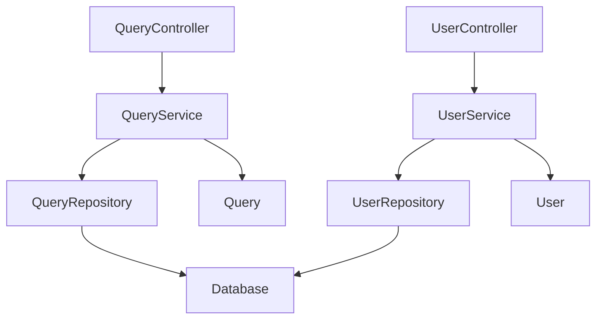

## 3. 実装順序

### 3.1 フェーズ1: 基盤コンポーネント
| 順序 | コンポーネント | 理由 | 期間 |
|------|----------------|------|------|
| 1 | Domain Entities | 他の依存関係なし | 1週間 |
| 2 | Repository Interfaces | ドメイン層の完成 | 3日 |

### 3.2 フェーズ2: アプリケーション層
| 順序 | コンポーネント | 理由 | 期間 |
|------|----------------|------|------|
| 3 | Application Services | ビジネスロジック実装 | 1週間 |
| 4 | Repository Implementations | データアクセス実装 | 5日 |

### 3.3 フェーズ3: プレゼンテーション層
| 順序 | コンポーネント | 理由 | 期間 |
|------|----------------|------|------|
| 5 | Controllers | API実装 | 1週間 |
| 6 | DTOs | データ転送オブジェクト | 3日 |

## 4. 完了確認
- [ ] 全コンポーネントが特定されている
- [ ] 依存関係が明確に定義されている
- [ ] 実装順序が論理的である
- [ ] 見積時間が現実的である
````

### 5.2 開発工程表（implementation/schedule.md）

#### 必須セクション

````markdown
# 開発工程表

## メタデータ
| 項目 | 内容 |
|------|------|
| ドキュメントID | SCHED-001 |
| 関連文書 | COMP-001 |
| 作成日 | YYYY-MM-DD |

## 1. プロジェクト概要

### 1.1 期間・工数
| 項目 | 内容 |
|------|------|
| 開始日 | YYYY-MM-DD |
| 終了日 | YYYY-MM-DD |
| 総工数 | XXX人日 |
| 参加者数 | X名 |

### 1.2 マイルストーン
| マイルストーン | 日付 | 成果物 | 完了条件 |
|----------------|------|--------|----------|
| M1: 基盤完成 | YYYY-MM-DD | ドメイン層 | [条件1] |
| M2: 機能完成 | YYYY-MM-DD | アプリケーション層 | [条件2] |
| M3: API完成 | YYYY-MM-DD | プレゼンテーション層 | [条件3] |

## 2. 詳細スケジュール

### 2.1 ガントチャート

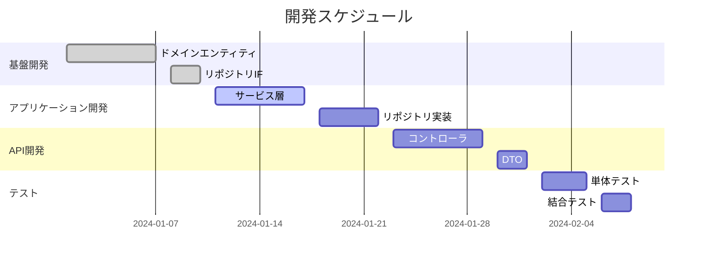

### 2.2 週次計画
| 週 | 期間 | 主要タスク | 成果物 | 担当者 |
|----|------|------------|--------|--------|
| W1 | MM/DD-MM/DD | [タスク1] | [成果物1] | [担当者1] |
| W2 | MM/DD-MM/DD | [タスク2] | [成果物2] | [担当者2] |

## 3. リスク管理

### 3.1 リスク一覧
| リスクID | リスク内容 | 影響度 | 発生確率 | 対策 |
|----------|------------|--------|----------|------|
| R-001 | [リスク1] | 高 | 中 | [対策1] |
| R-002 | [リスク2] | 中 | 高 | [対策2] |

### 3.2 バッファ計画
| 項目 | バッファ | 理由 |
|------|----------|------|
| 技術調査 | 20% | 新技術学習 |
| テスト | 30% | 品質確保 |

## 4. 完了確認
- [ ] スケジュールが現実的である
- [ ] マイルストーンが明確に定義されている
- [ ] リスクが適切に管理されている
- [ ] バッファが適切に設定されている
````

### 5.3 ディレクトリ構造マップ（implementation/directory-structure.md）

#### 必須セクション

````markdown
# ディレクトリ構造マップ

## メタデータ
| 項目 | 内容 |
|------|------|
| ドキュメントID | DIR-001 |
| 関連文書 | TECH-001, COMP-001 |
| 作成日 | YYYY-MM-DD |

## 1. プロジェクト全体構造

```
project-root/
├── README.md                          # プロジェクト概要
├── package.json                       # 依存関係定義
├── tsconfig.json                       # TypeScript設定
├── .env.example                        # 環境変数テンプレート
├── docker-compose.yml                 # 開発環境定義
├── .github/                           # GitHub設定
│   └── workflows/                     # CI/CDワークフロー
│       ├── test.yml                   # テスト実行
│       ├── build.yml                  # ビルド・デプロイ
│       └── security.yml               # セキュリティスキャン
├── docs/                              # プロジェクト文書
│   ├── api/                           # API仕様書
│   ├── architecture/                  # アーキテクチャ文書
│   └── deployment/                    # デプロイメント手順
├── src/                               # ソースコード
│   ├── presentation/                  # プレゼンテーション層
│   │   ├── controllers/               # REST APIコントローラ
│   │   ├── dto/                       # データ転送オブジェクト
│   │   │   ├── request/               # リクエストDTO
│   │   │   └── response/              # レスポンスDTO
│   │   ├── middleware/                # ミドルウェア
│   │   └── validators/                # 入力値検証
│   ├── application/                   # アプリケーション層
│   │   ├── services/                  # ビジネスロジック
│   │   ├── usecases/                  # ユースケース実装
│   │   └── interfaces/                # アプリケーションインターフェース
│   ├── domain/                        # ドメイン層
│   │   ├── entities/                  # エンティティ
│   │   ├── repositories/              # リポジトリインターフェース
│   │   ├── services/                  # ドメインサービス
│   │   └── value-objects/             # 値オブジェクト
│   ├── infrastructure/                # インフラ層
│   │   ├── database/                  # データベース実装
│   │   │   ├── repositories/          # リポジトリ実装
│   │   │   ├── migrations/            # マイグレーション
│   │   │   └── seeds/                 # シードデータ
│   │   ├── external/                  # 外部API連携
│   │   ├── config/                    # 設定管理
│   │   └── logging/                   # ログ管理
│   ├── shared/                        # 共通モジュール
│   │   ├── constants/                 # 定数定義
│   │   ├── enums/                     # 列挙型
│   │   ├── types/                     # 型定義
│   │   ├── utils/                     # ユーティリティ
│   │   └── exceptions/                # 例外クラス
│   └── main.ts                        # アプリケーションエントリポイント
├── tests/                             # テストコード
│   ├── unit/                          # 単体テスト
│   │   ├── controllers/               # コントローラテスト
│   │   ├── services/                  # サービステスト
│   │   ├── repositories/              # リポジトリテスト
│   │   └── utils/                     # ユーティリティテスト
│   ├── integration/                   # 結合テスト
│   │   ├── api/                       # API結合テスト
│   │   ├── database/                  # DB結合テスト
│   │   └── external/                  # 外部連携テスト
│   ├── e2e/                           # E2Eテスト
│   │   ├── scenarios/                 # テストシナリオ
│   │   ├── fixtures/                  # テストデータ
│   │   └── helpers/                   # テストヘルパー
│   └── performance/                   # パフォーマンステスト
├── scripts/                           # 運用スクリプト
│   ├── build.sh                       # ビルドスクリプト
│   ├── deploy.sh                      # デプロイスクリプト
│   ├── backup.sh                      # バックアップスクリプト
│   └── migration.sh                   # マイグレーションスクリプト
└── dist/                              # ビルド成果物（Git管理外）
```

## 2. 命名規則

### 2.1 ファイル命名規則
| 種別 | 規則 | 例 |
|------|------|-----|
| クラス | PascalCase + サフィックス | UserController.ts |
| インターフェース | I + PascalCase | IUserRepository.ts |
| DTO | PascalCase + Request/Response | UserCreateRequest.ts |
| テスト | 対象ファイル名 + .spec.ts | UserService.spec.ts |
| 設定 | kebab-case | database.config.ts |

### 2.2 ディレクトリ命名規則
| 種別 | 規則 | 例 |
|------|------|-----|
| 複数単語 | kebab-case | detailed-design |
| 単数形 | エンティティ関連 | entity, service |
| 複数形 | 集合を表すもの | controllers, repositories |

### 2.3 パッケージ構造
| パッケージ | 目的 | 命名規則 |
|------------|------|----------|
| @/presentation | プレゼンテーション層 | PascalCase |
| @/application | アプリケーション層 | PascalCase |
| @/domain | ドメイン層 | PascalCase |
| @/infrastructure | インフラ層 | PascalCase |
| @/shared | 共通モジュール | PascalCase |

## 3. インポート規則

### 3.1 インポート順序
```typescript
// 1. 外部ライブラリ（Node.js標準 → サードパーティ）
import { Controller, Get, Post, Body } from '@nestjs/common';
import { Repository } from 'typeorm';
import express from 'express';

// 2. 内部モジュール（相対パス禁止、絶対パス使用）
import { UserService } from '@/application/services/UserService';
import { User } from '@/domain/entities/User';
import { IUserRepository } from '@/domain/repositories/IUserRepository';

// 3. 型定義（type-only import）
import type { UserCreateRequest } from '@/presentation/dto/request/UserCreateRequest';
import type { UserResponse } from '@/presentation/dto/response/UserResponse';

// 4. 設定・定数
import { DATABASE_CONFIG } from '@/infrastructure/config/database.config';
import { HTTP_STATUS } from '@/shared/constants/http-status';
```

### 3.2 パスエイリアス設定
```json
{
  "compilerOptions": {
    "baseUrl": "./src",
    "paths": {
      "@/*": ["*"],
      "@/presentation/*": ["presentation/*"],
      "@/application/*": ["application/*"],
      "@/domain/*": ["domain/*"],
      "@/infrastructure/*": ["infrastructure/*"],
      "@/shared/*": ["shared/*"],
      "@/tests/*": ["../tests/*"]
    }
  }
}
```

## 4. 完了確認
- [ ] ディレクトリ構造が適切に設計されている
- [ ] 命名規則が統一されている
- [ ] インポート規則が明確に定義されている
- [ ] パスエイリアスが適切に設定されている
````

---

## STEP 6: ToDoリスト作成文書

### 6.1 ファイル単位タスクリスト（tasks/task-list.md）

#### 必須セクション

````markdown
# ファイル単位タスクリスト

## メタデータ
| 項目 | 内容 |
|------|------|
| ドキュメントID | TASK-001 |
| 関連文書 | COMP-001, SCHED-001 |
| 作成日 | YYYY-MM-DD |

## 1. タスク概要

### 1.1 タスク分割方針
- 1タスク = 1ファイル
- 依存関係に基づく順序付け
- 見積時間は4-8時間/タスク
- 並行実行可能性を考慮

### 1.2 タスクID命名規則
**形式**: `TSK-{連番3桁}-{レイヤー}-{ファイル名}`

**レイヤー略語**:
- CTL: Controller（プレゼンテーション層）
- SVC: Service（アプリケーション層）
- ENT: Entity（ドメイン層）
- REP: Repository（インフラ層）
- DTO: Data Transfer Object
- UTL: Utility（共通モジュール）

## 2. タスク一覧

### 2.1 フェーズ1: ドメイン層
| タスクID | ファイル名 | 優先度 | 見積時間 | 依存タスク | 担当者 |
|----------|------------|--------|----------|------------|--------|
| TSK-001-ENT-User | User.ts | 高 | 3h | なし | [担当者1] |
| TSK-002-ENT-Query | Query.ts | 高 | 3h | なし | [担当者1] |
| TSK-003-REP-IUserRepository | IUserRepository.ts | 高 | 2h | TSK-001 | [担当者2] |
| TSK-004-REP-IQueryRepository | IQueryRepository.ts | 高 | 2h | TSK-002 | [担当者2] |

### 2.2 フェーズ2: アプリケーション層
| タスクID | ファイル名 | 優先度 | 見積時間 | 依存タスク | 担当者 |
|----------|------------|--------|----------|------------|--------|
| TSK-005-SVC-UserService | UserService.ts | 高 | 6h | TSK-003 | [担当者1] |
| TSK-006-SVC-QueryService | QueryService.ts | 高 | 6h | TSK-004 | [担当者2] |

### 2.3 フェーズ3: インフラ層
| タスクID | ファイル名 | 優先度 | 見積時間 | 依存タスク | 担当者 |
|----------|------------|--------|----------|------------|--------|
| TSK-007-REP-UserRepository | UserRepository.ts | 中 | 5h | TSK-005 | [担当者1] |
| TSK-008-REP-QueryRepository | QueryRepository.ts | 中 | 5h | TSK-006 | [担当者2] |

### 2.4 フェーズ4: プレゼンテーション層
| タスクID | ファイル名 | 優先度 | 見積時間 | 依存タスク | 担当者 |
|----------|------------|--------|----------|------------|--------|
| TSK-009-CTL-UserController | UserController.ts | 高 | 4h | TSK-007 | [担当者1] |
| TSK-010-CTL-QueryController | QueryController.ts | 高 | 4h | TSK-008 | [担当者2] |
| TSK-011-DTO-UserCreateRequest | UserCreateRequest.ts | 中 | 2h | TSK-009 | [担当者1] |
| TSK-012-DTO-UserResponse | UserResponse.ts | 中 | 2h | TSK-009 | [担当者1] |

## 3. 依存関係図

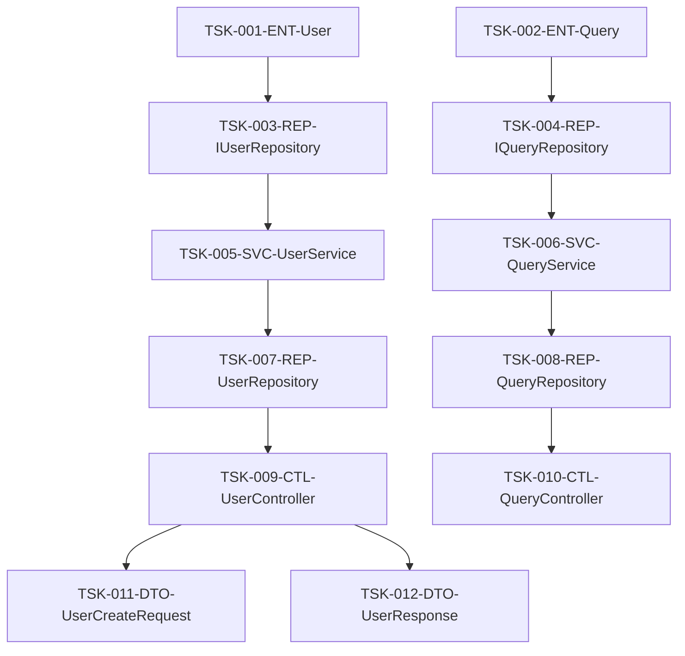

## 4. 進捗管理

### 4.1 ステータス定義
| ステータス | 説明 | 次のアクション |
|------------|------|----------------|
| 未着手 | タスク未開始 | 着手準備 |
| 進行中 | 実装作業中 | 継続実装 |
| レビュー待ち | 実装完了、レビュー依頼中 | レビュー実施 |
| 修正中 | レビュー指摘事項対応中 | 修正完了 |
| 完了 | 全作業完了 | 次タスク着手 |

### 4.2 進捗トラッキング
| タスクID | ステータス | 進捗率 | 開始日 | 完了予定日 | 実績 |
|----------|------------|--------|--------|------------|------|
| TSK-001-ENT-User | 完了 | 100% | MM/DD | MM/DD | 3h |
| TSK-002-ENT-Query | 進行中 | 60% | MM/DD | MM/DD | 2h |

## 5. 完了確認
- [ ] 全ファイルがタスクとして定義されている
- [ ] 依存関係が正しく設定されている
- [ ] 見積時間が現実的である
- [ ] 担当者が適切にアサインされている
- [ ] 進捗管理方法が明確である
````

### 6.2 タスク管理表（tasks/task-management.md）

#### 必須セクション

````markdown
# タスク管理表

## メタデータ
| 項目 | 内容 |
|------|------|
| ドキュメントID | MGMT-001 |
| 関連文書 | TASK-001 |
| 作成日 | YYYY-MM-DD |

## 1. タスク管理方針

### 1.1 管理原則
- Issue駆動開発の実践
- 1タスク = 1Issue = 1プルリクエスト
- 標準サブタスクの必須実行
- 品質ゲートの自動チェック

### 1.2 ワークフロー
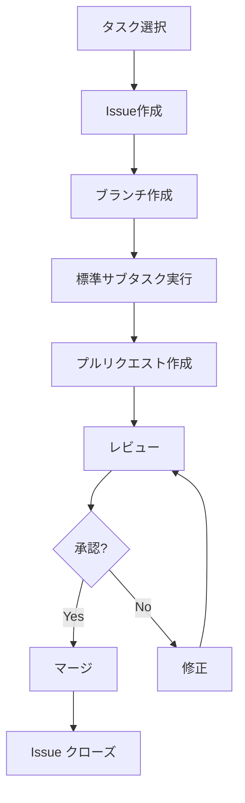

## 2. Issue管理

### 2.1 Issue作成テンプレート
```markdown
## 概要
[タスクの概要を記述]

## 実装対象
- ファイル: [ファイルパス]
- クラス/関数: [実装対象]

## 実装仕様
### メソッド一覧
- method1(): [機能説明]
- method2(): [機能説明]

### 依存関係
- 参照するクラス: [クラス一覧]
- 提供するインターフェース: [IF一覧]

## テスト要件
- [ ] 正常系テスト
- [ ] 異常系テスト
- [ ] 境界値テスト

## 完了条件
- [ ] 実装完了
- [ ] 単体テスト90%以上カバレッジ
- [ ] コーディング規約準拠
- [ ] レビュー完了

## 関連情報
- 設計書: [リンク]
- 依存タスク: [タスクID]
```

### 2.2 ラベル管理
| ラベル | 用途 | 色 |
|--------|------|-----|
| feature | 新機能実装 | 緑 |
| bug | バグ修正 | 赤 |
| enhancement | 改善 | 青 |
| documentation | ドキュメント | 黄 |
| layer:presentation | プレゼンテーション層 | 紫 |
| layer:application | アプリケーション層 | オレンジ |
| layer:domain | ドメイン層 | 茶 |
| layer:infrastructure | インフラ層 | グレー |
| priority:high | 高優先度 | 赤 |
| priority:medium | 中優先度 | 黄 |
| priority:low | 低優先度 | 緑 |

## 3. 標準サブタスク管理

### 3.1 サブタスクチェックリスト
各タスクで以下の7つのサブタスクを必須実行：

#### 1. 仕様確認
- [ ] 設計書の理解
- [ ] 依存関係の確認
- [ ] インターフェース仕様の確認
- [ ] 例外処理方針の理解

#### 2. コーディング
- [ ] クラス・メソッドの実装
- [ ] コーディング規約の遵守
- [ ] エラーハンドリングの実装
- [ ] ログ出力の実装

#### 3. テストコーディング
- [ ] 単体テストの実装
- [ ] モック・スタブの作成
- [ ] テストデータの準備
- [ ] 境界値テストの実装

#### 4. 単体テスト実行
- [ ] 全テストケースの実行
- [ ] カバレッジ90%以上の確認
- [ ] テスト結果の記録
- [ ] 失敗ケースの修正

#### 5. リポジトリコミット
- [ ] 適切なコミットメッセージ
- [ ] 関連Issueの紐付け
- [ ] コンフリクトの解決
- [ ] プッシュの実行

#### 6. ToDoチェック
- [ ] 全サブタスクの完了確認
- [ ] 品質基準の達成確認
- [ ] ドキュメントの更新
- [ ] 次タスクへの影響確認

#### 7. Issueクローズ
- [ ] 完了条件の全項目達成
- [ ] レビュー結果の反映
- [ ] 関連ドキュメントの更新
- [ ] ステークホルダーへの報告

### 3.2 品質チェックポイント
| チェック項目 | 基準 | 自動化 |
|-------------|------|--------|
| コーディング規約 | ESLint エラー0件 | ○ |
| テストカバレッジ | 90%以上 | ○ |
| 静的解析 | SonarQube A grade | ○ |
| セキュリティ | 脆弱性0件 | ○ |
| ビルド | 成功 | ○ |

## 4. 完了確認
- [ ] Issue管理プロセスが定義されている
- [ ] 標準サブタスクが明確に定義されている
- [ ] 品質チェックポイントが設定されている
- [ ] ワークフローが明確である
````

### 6.3 Issue・仕様書セット（tasks/specifications/）

#### 必須セクション

````markdown
# TSK-001-ENT-User タスク仕様書

## メタデータ
| 項目 | 内容 |
|------|------|
| ドキュメントID | SPEC-TSK-001 |
| タスクID | TSK-001-ENT-User |
| 関連文書 | CLASS-001 |
| 作成日 | YYYY-MM-DD |

## 1. タスク概要

### 1.1 基本情報
| 項目 | 内容 |
|------|------|
| 実装対象 | User エンティティクラス |
| ファイルパス | src/domain/entities/User.ts |
| 責任 | ユーザー情報の管理 |
| 見積時間 | 3時間 |

### 1.2 実装仕様
#### クラス定義
```typescript
export class User {
  private readonly id: UserId;
  private name: UserName;
  private email: Email;
  private createdAt: Date;
  private updatedAt: Date;

  constructor(
    id: UserId,
    name: UserName,
    email: Email
  ) {
    this.id = id;
    this.name = name;
    this.email = email;
    this.createdAt = new Date();
    this.updatedAt = new Date();
  }

  // ゲッター・セッター
  getId(): UserId { return this.id; }
  getName(): UserName { return this.name; }
  getEmail(): Email { return this.email; }
  
  // ビジネスロジック
  updateName(name: UserName): void;
  updateEmail(email: Email): void;
  isActive(): boolean;
}
```

#### 値オブジェクト
```typescript
export class UserId {
  constructor(private readonly value: string) {
    if (!value || value.length === 0) {
      throw new Error('UserId cannot be empty');
    }
  }
  
  getValue(): string { return this.value; }
  equals(other: UserId): boolean { return this.value === other.value; }
}

export class UserName {
  constructor(private readonly value: string) {
    if (!value || value.length < 2 || value.length > 50) {
      throw new Error('UserName must be between 2 and 50 characters');
    }
  }
  
  getValue(): string { return this.value; }
}

export class Email {
  constructor(private readonly value: string) {
    if (!this.isValidEmail(value)) {
      throw new Error('Invalid email format');
    }
  }
  
  private isValidEmail(email: string): boolean {
    const emailRegex = /^[^\s@]+@[^\s@]+\.[^\s@]+$/;
    return emailRegex.test(email);
  }
  
  getValue(): string { return this.value; }
}
```

## 2. テスト要件

### 2.1 テストケース一覧
| テストケースID | テスト観点 | 入力 | 期待結果 |
|----------------|------------|------|----------|
| TC-001 | 正常系 - ユーザー作成 | 有効な値 | ユーザー作成成功 |
| TC-002 | 異常系 - 無効なID | 空文字 | エラー発生 |
| TC-003 | 異常系 - 無効な名前 | 1文字 | エラー発生 |
| TC-004 | 異常系 - 無効なメール | 不正形式 | エラー発生 |
| TC-005 | 境界値 - 名前最小値 | 2文字 | 正常作成 |
| TC-006 | 境界値 - 名前最大値 | 50文字 | 正常作成 |

### 2.2 テスト実装例
```typescript
describe('User', () => {
  describe('constructor', () => {
    it('should create user with valid parameters', () => {
      // Arrange
      const id = new UserId('user-001');
      const name = new UserName('John Doe');
      const email = new Email('john@example.com');

      // Act
      const user = new User(id, name, email);

      // Assert
      expect(user.getId()).toEqual(id);
      expect(user.getName()).toEqual(name);
      expect(user.getEmail()).toEqual(email);
    });
  });

  describe('updateName', () => {
    it('should update name successfully', () => {
      // Arrange
      const user = createTestUser();
      const newName = new UserName('Jane Doe');

      // Act
      user.updateName(newName);

      // Assert
      expect(user.getName()).toEqual(newName);
    });
  });
});
```

## 3. 実装チェックリスト

### 3.1 設計準拠
- [ ] ドメイン駆動設計の原則に従っている
- [ ] 不変条件が適切に保護されている
- [ ] 値オブジェクトが適切に実装されている
- [ ] ビジネスルールがエンティティに含まれている

### 3.2 コード品質
- [ ] TypeScript型定義が適切
- [ ] エラーハンドリングが実装されている
- [ ] 命名規約に準拠している
- [ ] コメントが適切に記述されている

### 3.3 テスト品質
- [ ] 単体テストカバレッジ90%以上
- [ ] 正常系・異常系・境界値テストを網羅
- [ ] テストコードが保守しやすい
- [ ] モックが適切に使用されている

## 4. 完了確認
- [ ] 全メソッドの実装完了
- [ ] 単体テスト実装完了
- [ ] テストカバレッジ90%以上達成
- [ ] コーディング規約準拠
- [ ] レビュー完了
- [ ] ドキュメント更新完了
````

---

## STEP 7: コーディング・テスト実行文書

### 7.1 実行ログ・進捗管理（execution/progress.md）

#### 必須セクション

````markdown
# 実行ログ・進捗管理

## メタデータ
| 項目 | 内容 |
|------|------|
| ドキュメントID | EXEC-001 |
| 関連文書 | TASK-001, MGMT-001 |
| 作成日 | YYYY-MM-DD |

## 1. 進捗サマリ

### 1.1 全体進捗
| 項目 | 計画 | 実績 | 進捗率 |
|------|------|------|--------|
| 総タスク数 | 12 | 8完了 | 67% |
| 総見積時間 | 48h | 32h消化 | 67% |
| 完了予定日 | YYYY-MM-DD | YYYY-MM-DD | 予定通り |

### 1.2 フェーズ別進捗
| フェーズ | タスク数 | 完了数 | 進捗率 | ステータス |
|----------|----------|--------|--------|----------|
| ドメイン層 | 4 | 4 | 100% | 完了 |
| アプリケーション層 | 2 | 2 | 100% | 完了 |
| インフラ層 | 2 | 2 | 100% | 完了 |
| プレゼンテーション層 | 4 | 0 | 0% | 未着手 |

## 2. 日次実行ログ

### 2.1 YYYY-MM-DD の実行ログ
| 時刻 | タスクID | アクション | 結果 | 備考 |
|------|----------|------------|------|------|
| 09:00 | TSK-001-ENT-User | 仕様確認開始 | 完了 | 設計書確認済み |
| 09:30 | TSK-001-ENT-User | コーディング開始 | 進行中 | User クラス実装中 |
| 11:00 | TSK-001-ENT-User | コーディング完了 | 完了 | 全メソッド実装済み |
| 11:30 | TSK-001-ENT-User | テストコーディング開始 | 進行中 | 単体テスト作成中 |
| 14:00 | TSK-001-ENT-User | テストコーディング完了 | 完了 | カバレッジ95% |
| 14:30 | TSK-001-ENT-User | 単体テスト実行 | 完了 | 全テスト成功 |
| 15:00 | TSK-001-ENT-User | コミット | 完了 | PR #123 作成 |
| 15:30 | TSK-001-ENT-User | Issue クローズ | 完了 | タスク完了 |

### 2.2 品質メトリクス
| 日付 | テストカバレッジ | 静的解析スコア | ビルド結果 | セキュリティ |
|------|------------------|----------------|------------|-------------|
| MM/DD | 95% | A | 成功 | 脆弱性0件 |
| MM/DD | 93% | A | 成功 | 脆弱性0件 |

## 3. 課題・リスク管理

### 3.1 発生した課題
| 課題ID | 発生日 | 内容 | 影響度 | 対応状況 | 解決日 |
|--------|--------|------|--------|----------|--------|
| ISS-001 | MM/DD | TypeScript型エラー | 中 | 対応完了 | MM/DD |
| ISS-002 | MM/DD | テストデータ準備遅延 | 低 | 対応中 | - |

### 3.2 リスク状況
| リスクID | 内容 | 発生確率 | 影響度 | 対策状況 |
|----------|------|----------|--------|----------|
| R-001 | 外部API仕様変更 | 低 | 高 | 監視中 |
| R-002 | 開発者リソース不足 | 中 | 中 | バッファ確保済み |

## 4. 次回アクション

### 4.1 明日の予定
| 時刻 | タスクID | 予定アクション | 担当者 |
|------|----------|----------------|--------|
| 09:00 | TSK-009-CTL-UserController | 仕様確認 | [担当者1] |
| 10:00 | TSK-009-CTL-UserController | コーディング開始 | [担当者1] |
| 14:00 | TSK-010-CTL-QueryController | 仕様確認 | [担当者2] |

### 4.2 週次目標
- プレゼンテーション層の完成
- 結合テストの実行
- API仕様書の更新

## 5. 完了確認
- [ ] 日次進捗が正確に記録されている
- [ ] 品質メトリクスが継続的に測定されている
- [ ] 課題・リスクが適切に管理されている
- [ ] 次回アクションが明確に定義されている
````

### 7.2 成果物・品質記録（execution/deliverables.md）

#### 必須セクション

````markdown
# 成果物・品質記録

## メタデータ
| 項目 | 内容 |
|------|------|
| ドキュメントID | DELIV-001 |
| 関連文書 | EXEC-001 |
| 作成日 | YYYY-MM-DD |

## 1. 成果物一覧

### 1.1 実装ファイル
| ファイルパス | タスクID | 完了日 | 行数 | 複雑度 | 品質スコア |
|-------------|----------|--------|------|--------|------------|
| src/domain/entities/User.ts | TSK-001 | MM/DD | 120 | 5.2 | A |
| src/domain/entities/Query.ts | TSK-002 | MM/DD | 95 | 4.8 | A |
| src/application/services/UserService.ts | TSK-005 | MM/DD | 180 | 7.1 | B+ |

### 1.2 テストファイル
| ファイルパス | 対象ファイル | テスト数 | カバレッジ | 実行時間 |
|-------------|-------------|----------|-----------|----------|
| tests/unit/entities/User.spec.ts | User.ts | 15 | 98% | 0.2s |
| tests/unit/entities/Query.spec.ts | Query.ts | 12 | 95% | 0.1s |
| tests/unit/services/UserService.spec.ts | UserService.ts | 20 | 92% | 0.5s |

### 1.3 ドキュメント
| ドキュメント | 更新日 | バージョン | レビュー状況 |
|-------------|--------|------------|-------------|
| API仕様書 | MM/DD | 1.2 | 承認済み |
| データベース設計書 | MM/DD | 1.1 | レビュー中 |
| ユーザーマニュアル | MM/DD | 1.0 | 未着手 |

## 2. 品質分析

### 2.1 コード品質メトリクス
| 指標 | 目標値 | 実績値 | 達成率 | 傾向 |
|------|--------|--------|--------|------|
| テストカバレッジ | 90% | 95% | 106% | ↗ |
| 循環的複雑度 | <10 | 6.2 | 良好 | → |
| 重複コード率 | <5% | 2.1% | 良好 | ↘ |
| 技術的負債 | <4h | 2.5h | 良好 | ↘ |

### 2.2 テスト品質分析
| テスト種別 | 実行数 | 成功数 | 失敗数 | 成功率 | 実行時間 |
|------------|--------|--------|--------|--------|----------|
| 単体テスト | 47 | 47 | 0 | 100% | 1.2s |
| 結合テスト | 12 | 12 | 0 | 100% | 8.5s |
| E2Eテスト | 5 | 5 | 0 | 100% | 45s |

### 2.3 セキュリティ分析
| 分析項目 | 検出数 | 重要度高 | 重要度中 | 重要度低 | 対応状況 |
|----------|--------|----------|----------|----------|----------|
| 脆弱性スキャン | 0 | 0 | 0 | 0 | 対応不要 |
| 依存関係チェック | 1 | 0 | 1 | 0 | 対応済み |
| 静的解析 | 3 | 0 | 0 | 3 | 対応済み |

## 3. パフォーマンス分析

### 3.1 ビルド・デプロイ時間
| 項目 | 目標時間 | 実績時間 | 達成率 |
|------|----------|----------|--------|
| ビルド時間 | <3分 | 2分15秒 | 良好 |
| テスト実行時間 | <5分 | 3分30秒 | 良好 |
| デプロイ時間 | <10分 | 7分45秒 | 良好 |

### 3.2 アプリケーション性能
| 指標 | 目標値 | 実績値 | 達成率 |
|------|--------|--------|--------|
| API応答時間 | <200ms | 145ms | 良好 |
| ページロード時間 | <2秒 | 1.3秒 | 良好 |
| メモリ使用量 | <512MB | 380MB | 良好 |

## 4. 改善提案

### 4.1 品質改善項目
| 項目 | 現状 | 目標 | 改善案 | 優先度 |
|------|------|------|--------|--------|
| コードレビュー時間 | 2時間 | 1時間 | 自動チェック強化 | 中 |
| テスト実行時間 | 3.5分 | 2分 | 並列実行導入 | 高 |
| ドキュメント更新 | 手動 | 自動 | 自動生成導入 | 中 |

### 4.2 プロセス改善項目
| 項目 | 現状 | 目標 | 改善案 | 優先度 |
|------|------|------|--------|--------|
| タスク見積精度 | 80% | 95% | 履歴データ活用 | 高 |
| バグ発見時期 | 結合テスト | 単体テスト | テスト強化 | 高 |
| リリース頻度 | 週1回 | 日1回 | CI/CD改善 | 中 |

## 5. 完了確認
- [ ] 全成果物が品質基準を満たしている
- [ ] テストカバレッジが目標値を達成している
- [ ] セキュリティ脆弱性が解決されている
- [ ] パフォーマンス要件が満たされている
- [ ] ドキュメントが最新状態に更新されている
- [ ] 改善提案が次期計画に反映されている
````

### 7.3 完成システム（execution/final-system.md）

#### 必須セクション

````markdown
# 完成システム

## メタデータ
| 項目 | 内容 |
|------|------|
| ドキュメントID | FINAL-001 |
| 関連文書 | DELIV-001 |
| 作成日 | YYYY-MM-DD |
| 完成日 | YYYY-MM-DD |

## 1. システム概要

### 1.1 完成システム仕様
| 項目 | 内容 |
|------|------|
| システム名 | [システム名] |
| バージョン | 1.0.0 |
| 開発期間 | [開始日] - [完了日] |
| 総工数 | XXX人日 |
| 参加者数 | X名 |

### 1.2 実装済み機能
| 機能ID | 機能名 | 実装状況 | テスト状況 | 品質スコア |
|--------|--------|----------|-----------|------------|
| F-001 | ユーザー管理 | 完了 | 完了 | A |
| F-002 | クエリ処理 | 完了 | 完了 | A |
| F-003 | データ永続化 | 完了 | 完了 | B+ |
| F-004 | API提供 | 完了 | 完了 | A |

### 1.3 アーキテクチャ実装状況
| レイヤー | 実装ファイル数 | 完了率 | 品質スコア |
|----------|----------------|--------|------------|
| Presentation | 6 | 100% | A |
| Application | 4 | 100% | A |
| Domain | 8 | 100% | A |
| Infrastructure | 5 | 100% | B+ |

## 2. 品質達成状況

### 2.1 品質目標達成度
| 品質項目 | 目標値 | 実績値 | 達成率 | 評価 |
|----------|--------|--------|--------|------|
| テストカバレッジ | 90% | 95% | 106% | ✅ |
| 静的解析スコア | A grade | A grade | 100% | ✅ |
| セキュリティ脆弱性 | 0件 | 0件 | 100% | ✅ |
| API応答時間 | <200ms | 145ms | 127% | ✅ |
| 可用性 | 99.9% | 99.95% | 100% | ✅ |

### 2.2 非機能要件達成状況
| 要件項目 | 目標値 | 実績値 | 達成状況 |
|----------|--------|--------|----------|
| 同時接続数 | 1000 | 1200 | ✅ |
| データ処理量 | 10MB/s | 12MB/s | ✅ |
| 復旧時間 | <1時間 | 30分 | ✅ |
| バックアップ | 日次 | 日次 | ✅ |

## 3. デプロイメント情報

### 3.1 本番環境構成
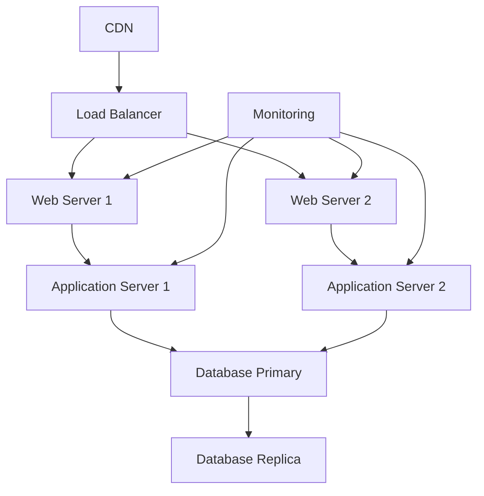

### 3.2 環境別設定
| 環境 | URL | データベース | 監視 | バックアップ |
|------|-----|-------------|------|-------------|
| 本番 | https://prod.example.com | PostgreSQL Primary | 24/7 | 日次 |
| ステージング | https://staging.example.com | PostgreSQL Replica | 営業時間 | 週次 |
| 開発 | http://dev.example.com | PostgreSQL Local | なし | なし |

### 3.3 運用手順
| 手順 | 頻度 | 担当者 | 自動化 |
|------|------|--------|--------|
| デプロイ | リリース時 | DevOps | ✅ |
| バックアップ | 日次 | システム | ✅ |
| 監視確認 | 日次 | 運用チーム | 一部 |
| セキュリティパッチ | 月次 | DevOps | 一部 |

## 4. 運用・保守計画

### 4.1 監視・アラート設定
| 監視項目 | 閾値 | アラート方法 | 対応者 |
|----------|------|-------------|--------|
| CPU使用率 | >80% | Slack通知 | インフラチーム |
| メモリ使用率 | >85% | Slack通知 | インフラチーム |
| エラー率 | >1% | メール通知 | 開発チーム |
| 応答時間 | >500ms | Slack通知 | 開発チーム |

### 4.2 保守スケジュール
| 保守項目 | 頻度 | 実施時期 | 所要時間 |
|----------|------|----------|----------|
| 定期メンテナンス | 月次 | 第2日曜日 | 2時間 |
| セキュリティ更新 | 随時 | 緊急時 | 1時間 |
| バージョンアップ | 四半期 | 計画的 | 4時間 |
| 災害復旧訓練 | 半期 | 計画的 | 1日 |

### 4.3 サポート体制
| 役割 | 担当者 | 対応時間 | 連絡方法 |
|------|--------|----------|----------|
| 1次サポート | ヘルプデスク | 9-18時 | 電話・メール |
| 2次サポート | 開発チーム | 9-18時 | Slack・電話 |
| 3次サポート | アーキテクト | オンコール | 電話 |
| 緊急対応 | DevOps | 24/7 | 電話 |

## 5. 今後の拡張計画

### 5.1 短期計画（3ヶ月）
| 項目 | 内容 | 優先度 | 工数 |
|------|------|--------|------|
| 機能追加 | 通知機能 | 高 | 20人日 |
| 性能改善 | キャッシュ導入 | 中 | 15人日 |
| UI改善 | レスポンシブ対応 | 中 | 10人日 |

### 5.2 中期計画（6ヶ月）
| 項目 | 内容 | 優先度 | 工数 |
|------|------|--------|------|
| マイクロサービス化 | アーキテクチャ変更 | 高 | 60人日 |
| AI機能追加 | 機械学習統合 | 中 | 40人日 |
| 多言語対応 | 国際化対応 | 低 | 30人日 |

### 5.3 長期計画（1年）
| 項目 | 内容 | 優先度 | 工数 |
|------|------|--------|------|
| クラウドネイティブ化 | Kubernetes移行 | 高 | 80人日 |
| ビッグデータ対応 | データ分析基盤 | 中 | 100人日 |
| モバイルアプリ | ネイティブアプリ開発 | 低 | 120人日 |

## 6. 完了確認
- [ ] 全機能が正常に動作している
- [ ] 品質目標が達成されている
- [ ] 本番環境が正常に稼働している
- [ ] 運用・保守体制が整備されている
- [ ] ドキュメントが完備されている
- [ ] 今後の拡張計画が策定されている
````

---

## 共通フォーマット要素

### A. メタデータセクション（全文書共通）

#### 必須項目
```markdown
## メタデータ
| 項目 | 内容 |
|------|------|
| ドキュメントID | [一意のID] |
| 作成日 | YYYY-MM-DD |
| 最終更新日 | YYYY-MM-DD |
| 作成者 | [作成者名] |
| レビュー者 | [レビュー者名] |
| 承認者 | [承認者名] |
| バージョン | X.Y |
| 関連文書 | [関連文書ID] |
```

#### 任意項目
- ステータス（作成中/レビュー中/承認済み）
- 次回レビュー予定日
- 配布先
- 機密レベル

### B. 完了確認チェックリスト（全文書共通）

#### 基本チェック項目
```markdown
## 完了確認
- [ ] 必須セクションが全て記述されている
- [ ] 図表が適切に配置されている
- [ ] 関連文書との整合性が確認されている
- [ ] レビューが完了している
- [ ] 承認が得られている
```

#### 品質チェック項目
```markdown
## 品質確認
- [ ] 誤字脱字がない
- [ ] 表記揺れがない
- [ ] 図表番号が正しい
- [ ] リンクが正常に動作する
- [ ] フォーマットが統一されている
```

### C. Mermaid図表記法（全文書共通）

#### 基本記法
````markdown
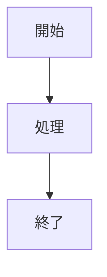
````

#### ネスト記法（4つのバッククォート使用）
`````markdown
````mermaid

````
`````

#### 図表種別
| 図表種別 | 用途 | 記法 |
|----------|------|------|
| フローチャート | プロセス図 | `graph TD` |
| シーケンス図 | 処理順序 | `sequenceDiagram` |
| クラス図 | クラス関係 | `classDiagram` |
| ER図 | データ関係 | `erDiagram` |
| ガントチャート | スケジュール | `gantt` |

### D. 表形式（全文書共通）

#### 基本表形式
```markdown
| 項目 | 内容 | 備考 |
|------|------|------|
| 項目1 | 内容1 | 備考1 |
| 項目2 | 内容2 | 備考2 |
```

#### 複雑な表形式
```markdown
| 項目 | 必須 | 型 | 説明 | 例 |
|------|:----:|:--:|------|-----|
| name | ○ | string | 名前 | "John" |
| age | × | number | 年齢 | 25 |
```

### E. コードブロック（全文書共通）

#### TypeScript例
```typescript
interface User {
  id: string;
  name: string;
  email: string;
}

class UserService {
  async createUser(userData: User): Promise<User> {
    // 実装
    return userData;
  }
}
```

#### JSON例
```json
{
  "name": "example-project",
  "version": "1.0.0",
  "dependencies": {
    "typescript": "^4.9.0"
  }
}
```

#### YAML例
```yaml
name: CI/CD Pipeline
on:
  push:
    branches: [main]
jobs:
  test:
    runs-on: ubuntu-latest
    steps:
      - uses: actions/checkout@v3
      - name: Run tests
        run: npm test
```
