# Process Engineering Document Format Specification (Revised Version)

## Overview

This specification defines the standard format for all documents defined in "Process Engineering for AI Coding". Based on implementation examples in the RagProto project, it standardizes the required items, optional items, formats, and diagramming methods for documents in all 7 stages.

## Basic Principles

### 1. Document Structure Unification
- All documents are created in Markdown format
- Hierarchical structure up to 6 levels (H1-H6)
- Clear distinction between required and optional sections
- Metadata section placed at the beginning of documents

### 2. Ensuring Traceability
- Assign unique document IDs to each document
- Clearly state references to previous stage documents
- Clearly indicate handover information to the next stage

### 3. Quality Standard Unification
- Completion confirmation in checklist format
- Standardization of review items
- Recording of update history

### 4. Standardization of Diagramming Methods
- Use Mermaid notation for diagram creation
- Use appropriate code block notation
- Clear separation between diagrams and text

---

## STEP 0: Goal Definition Documents

### 0.1 Goal Statement (goal-statement.md)

#### Required Sections

````markdown
# Goal Statement

## Metadata
| Item | Content |
|------|---------|
| Document ID | GOAL-001 |
| Creation Date | YYYY-MM-DD |
| Last Updated | YYYY-MM-DD |
| Author | [Author Name] |
| Reviewer | [Reviewer Name] |
| Approver | [Approver Name] |

## 1. Project Overview
| Item | Content |
|------|---------|
| Project Name | [Project Name] |
| Purpose | [Clear purpose expressed in one sentence] |
| Scope | [Clear definition of implementation scope] |
| Deliverables | [Expected concrete deliverables] |

## 2. Problems to Solve
### 2.1 Current Issues
- [Specific problem 1]
- [Specific problem 2]
- [Specific problem 3]

### 2.2 Expected Results
- [Quantitative outcome indicator 1]
- [Quantitative outcome indicator 2]
- [Quantitative outcome indicator 3]

## 3. Definition of Success
### 3.1 Quantitative Indicators
| Indicator | Target Value | Measurement Method |
|-----------|--------------|-------------------|
| [Indicator 1] | [Target 1] | [Method 1] |
| [Indicator 2] | [Target 2] | [Method 2] |

### 3.2 Qualitative Indicators
- [Qualitative success criteria 1]
- [Qualitative success criteria 2]

## 4. Completion Confirmation
- [ ] Purpose is clearly expressed in one sentence
- [ ] Problems to solve are specifically described
- [ ] Definition of success is quantitatively set
- [ ] Stakeholder agreement has been obtained
````

#### Optional Sections
- Background information
- Related projects
- Reference materials

### 0.2 Stakeholder List (stakeholders.md)

#### Required Sections

````markdown
# Stakeholder List

## Metadata
| Item | Content |
|------|---------|
| Document ID | STAKE-001 |
| Related Documents | GOAL-001 |
| Creation Date | YYYY-MM-DD |

## 1. Stakeholder Classification

### 1.1 Primary Stakeholders
| Role | Name/Organization | Responsibility | Expectations | Contact |
|------|-------------------|----------------|--------------|---------|
| [Role 1] | [Name 1] | [Responsibility 1] | [Expectation 1] | [Contact 1] |
| [Role 2] | [Name 2] | [Responsibility 2] | [Expectation 2] | [Contact 2] |

### 1.2 Secondary Stakeholders
| Role | Name/Organization | Impact Level | Involvement Level | Contact |
|------|-------------------|--------------|-------------------|---------|
| [Role 1] | [Name 1] | [High/Medium/Low] | [Involvement 1] | [Contact 1] |

## 2. Communication Plan
| Stakeholder | Frequency | Method | Content |
|-------------|-----------|--------|---------|
| [Stakeholder 1] | [Frequency 1] | [Method 1] | [Content 1] |

## 3. Completion Confirmation
- [ ] All stakeholders have been identified
- [ ] Roles and responsibilities are clearly defined
- [ ] Communication plan has been developed
````

### 0.3 Constraints List (constraints.md)

#### Required Sections

````markdown
# Constraints List

## Metadata
| Item | Content |
|------|---------|
| Document ID | CONST-001 |
| Related Documents | GOAL-001 |
| Creation Date | YYYY-MM-DD |

## 1. Technical Constraints
| Constraint Item | Content | Impact Level | Countermeasure |
|-----------------|---------|--------------|----------------|
| [Constraint 1] | [Detail 1] | [High/Medium/Low] | [Countermeasure 1] |
| [Constraint 2] | [Detail 2] | [High/Medium/Low] | [Countermeasure 2] |

## 2. Operational Constraints
| Constraint Item | Content | Impact Level | Countermeasure |
|-----------------|---------|--------------|----------------|
| [Constraint 1] | [Detail 1] | [High/Medium/Low] | [Countermeasure 1] |

## 3. Resource Constraints
| Constraint Item | Content | Impact Level | Countermeasure |
|-----------------|---------|--------------|----------------|
| [Constraint 1] | [Detail 1] | [High/Medium/Low] | [Countermeasure 1] |

## 4. Time Constraints
| Constraint Item | Deadline | Impact Level | Countermeasure |
|-----------------|----------|--------------|----------------|
| [Constraint 1] | [Deadline 1] | [High/Medium/Low] | [Countermeasure 1] |

## 5. Completion Confirmation
- [ ] All technical constraints have been identified
- [ ] Operational constraints are clearly defined
- [ ] Resource constraints are realistically evaluated
- [ ] Time constraints are specifically set
````

---

## STEP 1: Requirements Definition Documents

### 1.1 Use Case List (requirements/use-cases.md)

#### Required Sections

````markdown
# Use Case List

## Metadata
| Item | Content |
|------|---------|
| Document ID | UC-001 |
| Related Documents | GOAL-001, STAKE-001 |
| Creation Date | YYYY-MM-DD |

## 1. Use Case Overview

### 1.1 Actor Definition
| Actor ID | Actor Name | Description | Permission Level |
|----------|------------|-------------|------------------|
| AC-001 | [Actor 1] | [Description 1] | [Permission 1] |
| AC-002 | [Actor 2] | [Description 2] | [Permission 2] |

### 1.2 Use Case List
| UC-ID | Use Case Name | Actor | Priority | Complexity |
|-------|---------------|-------|----------|------------|
| UC-001 | [Use Case 1] | AC-001 | High | Medium |
| UC-002 | [Use Case 2] | AC-002 | Medium | Low |

## 2. Use Case Details

### UC-001: [Use Case Name]
**Overview**: [Use case overview]
**Actor**: [Primary actor]
**Purpose**: [Goal to achieve]
**Frequency**: [Execution frequency]

#### Preconditions
- [Precondition 1]
- [Precondition 2]

#### Main Scenario
1. [Step 1]
2. [Step 2]
3. [Step 3]

#### Alternative Scenarios
**A1: [Exception case 1]**
- 1a. [Exception handling 1]
- 1b. [Exception handling 2]

#### Postconditions
- [Postcondition 1]
- [Postcondition 2]

#### Non-functional Requirements
- **Performance**: [Performance requirement]
- **Security**: [Security requirement]
- **Availability**: [Availability requirement]

## 3. Use Case Relationship Diagram

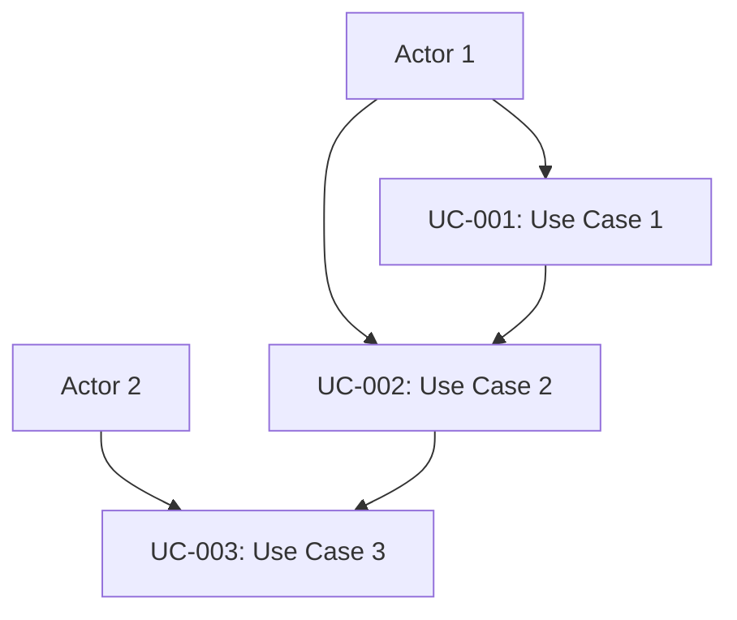

## 4. Completion Confirmation
- [ ] All actors have been identified
- [ ] Use cases are comprehensively defined
- [ ] Main scenarios are described in detail
- [ ] Alternative scenarios are appropriately defined
- [ ] Pre and post conditions are clear
````

### 1.2 Non-functional Requirements List (requirements/non-functional.md)

#### Required Sections

````markdown
# Non-functional Requirements List

## Metadata
| Item | Content |
|------|---------|
| Document ID | NFR-001 |
| Related Documents | UC-001, CONST-001 |
| Creation Date | YYYY-MM-DD |

## 1. Performance Requirements

### 1.1 Response Time
| Function | Target Value | Maximum Allowable | Measurement Conditions |
|----------|--------------|-------------------|------------------------|
| [Function 1] | [Target 1] | [Maximum 1] | [Condition 1] |
| [Function 2] | [Target 2] | [Maximum 2] | [Condition 2] |

### 1.2 Throughput
| Function | Target Value | Maximum Allowable | Measurement Conditions |
|----------|--------------|-------------------|------------------------|
| [Function 1] | [Target 1] | [Maximum 1] | [Condition 1] |

### 1.3 Resource Usage
| Resource | Target Value | Maximum Allowable | Measurement Conditions |
|----------|--------------|-------------------|------------------------|
| CPU Usage | [Target] | [Maximum] | [Condition] |
| Memory Usage | [Target] | [Maximum] | [Condition] |
| Disk Usage | [Target] | [Maximum] | [Condition] |

## 2. Availability Requirements

### 2.1 Uptime
| System | Target Uptime | Planned Downtime | Recovery Time |
|--------|---------------|------------------|---------------|
| [System 1] | [Uptime 1] | [Downtime 1] | [Recovery 1] |

### 2.2 Failure Response
| Failure Level | Detection Time | Recovery Time | Response Procedure |
|---------------|----------------|---------------|-------------------|
| Critical | [Time 1] | [Time 1] | [Procedure 1] |
| Minor | [Time 2] | [Time 2] | [Procedure 2] |

## 3. Security Requirements

### 3.1 Authentication & Authorization
| Item | Requirement | Implementation Method |
|------|-------------|----------------------|
| Authentication Method | [Requirement 1] | [Method 1] |
| Authorization Control | [Requirement 2] | [Method 2] |

### 3.2 Data Protection
| Data Type | Protection Level | Encryption Method | Access Control |
|-----------|------------------|-------------------|----------------|
| [Data 1] | [Level 1] | [Method 1] | [Control 1] |

## 4. Scalability Requirements

### 4.1 Scalability
| Item | Current | 1 Year | 3 Years |
|------|---------|--------|---------|
| Concurrent Connections | [Value 1] | [Value 2] | [Value 3] |
| Data Volume | [Value 1] | [Value 2] | [Value 3] |

## 5. Maintainability Requirements

### 5.1 Monitoring & Logging
| Item | Requirement | Implementation Method |
|------|-------------|----------------------|
| System Monitoring | [Requirement 1] | [Method 1] |
| Log Management | [Requirement 2] | [Method 2] |

## 6. Completion Confirmation
- [ ] Performance requirements are quantitatively defined
- [ ] Availability requirements are clearly set
- [ ] Security requirements are comprehensively defined
- [ ] Scalability requirements are set with future considerations
- [ ] Maintainability requirements are defined considering operations
````

### 1.3 Requirements Specification (requirements/specification.md)

#### Required Sections

````markdown
# Requirements Specification

## Metadata
| Item | Content |
|------|---------|
| Document ID | REQ-001 |
| Related Documents | UC-001, NFR-001 |
| Creation Date | YYYY-MM-DD |
| Version | 1.0 |

## 1. Functional Requirements

### 1.1 Function List
| Function ID | Function Name | Priority | Related UC | Description |
|-------------|---------------|----------|------------|-------------|
| F-001 | [Function 1] | Required | UC-001 | [Description 1] |
| F-002 | [Function 2] | Important | UC-002 | [Description 2] |

### 1.2 Function Details

#### F-001: [Function Name]
**Overview**: [Function overview]
**Input**: [Input data/format]
**Process**: [Processing content]
**Output**: [Output data/format]
**Exception Handling**: [Exception cases and handling]

**Detailed Specifications**:
- [Specification 1]
- [Specification 2]
- [Specification 3]

**Constraints**:
- [Constraint 1]
- [Constraint 2]

## 2. Non-functional Requirements Summary

### 2.1 Performance Requirements
| Item | Requirement |
|------|-------------|
| Response Time | [Requirement 1] |
| Throughput | [Requirement 2] |

### 2.2 Quality Requirements
| Item | Requirement |
|------|-------------|
| Availability | [Requirement 1] |
| Security | [Requirement 2] |

## 3. Interface Requirements

### 3.1 User Interface
- [UI Requirement 1]
- [UI Requirement 2]

### 3.2 System Interface
| IF-ID | Interface Name | Type | Protocol | Data Format |
|-------|----------------|------|----------|-------------|
| IF-001 | [IF Name 1] | [Type 1] | [Protocol 1] | [Format 1] |

## 4. Data Requirements

### 4.1 Data Items
| Data ID | Data Name | Type | Required | Description |
|---------|-----------|------|----------|-------------|
| D-001 | [Data 1] | [Type 1] | ○ | [Description 1] |

### 4.2 Data Relationship Diagram

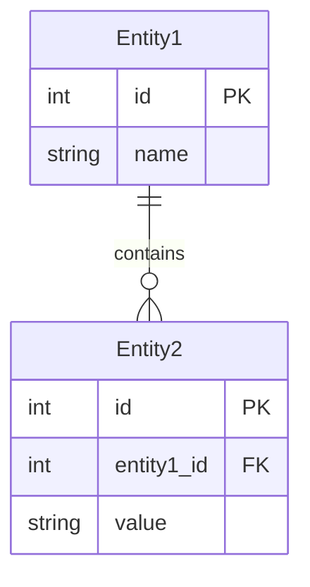

## 5. Completion Confirmation
- [ ] Functional requirements are comprehensively defined
- [ ] Non-functional requirements are appropriately integrated
- [ ] Interface requirements are clearly defined
- [ ] Data requirements are described in detail
- [ ] Constraints are clearly stated
````

---

## STEP 2: System Design Documents

### 2.1 System Architecture Diagram (design/system-architecture.md)

#### Required Sections

````markdown
# System Architecture Diagram

## Metadata
| Item | Content |
|------|---------|
| Document ID | ARCH-001 |
| Related Documents | REQ-001 |
| Creation Date | YYYY-MM-DD |

## 1. Overall System Architecture

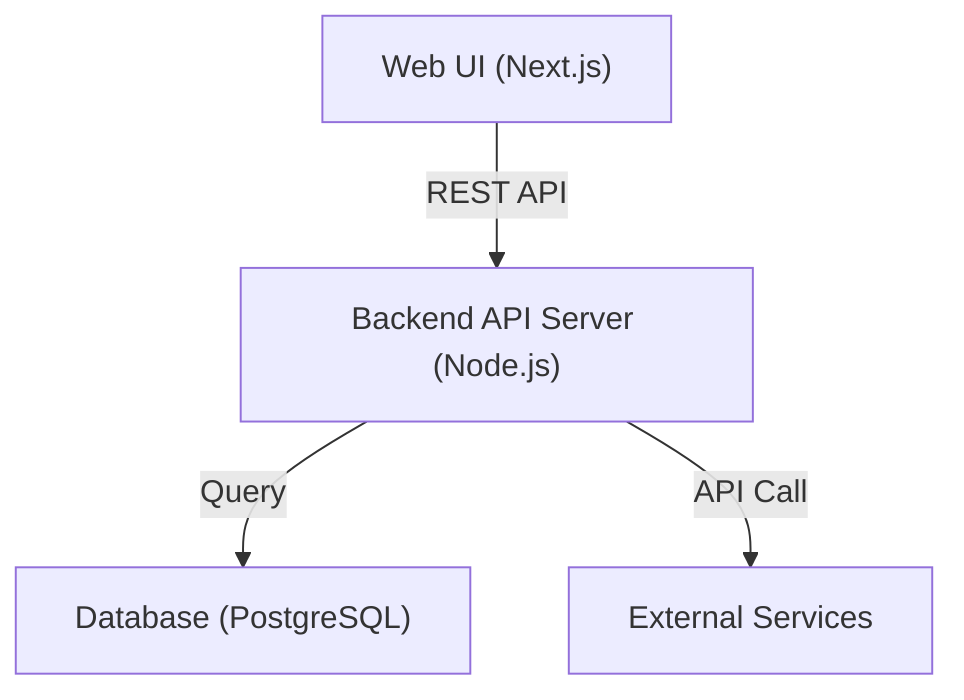

## 2. Layer Structure

| Layer | Content | Technology | Responsibility |
|-------|---------|------------|----------------|
| Presentation Layer | [Content 1] | [Technology 1] | [Responsibility 1] |
| Application Layer | [Content 2] | [Technology 2] | [Responsibility 2] |
| Domain Layer | [Content 3] | [Technology 3] | [Responsibility 3] |
| Infrastructure Layer | [Content 4] | [Technology 4] | [Responsibility 4] |

## 3. Component Architecture Diagram

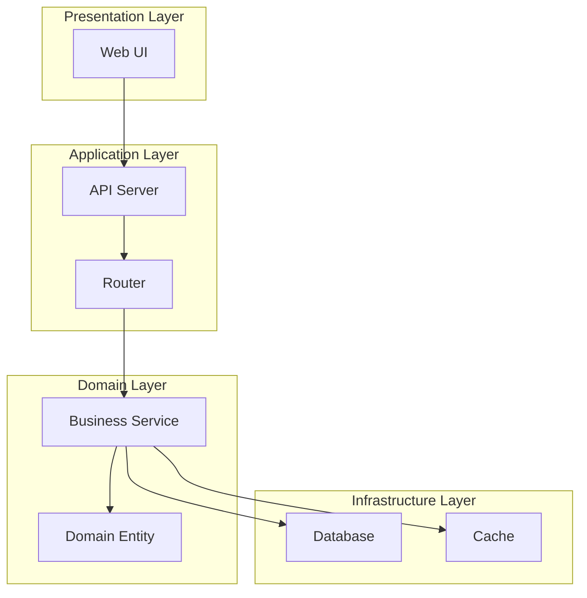

## 4. Design Principles

### 4.1 Architecture Principles
- [Principle 1]: [Description 1]
- [Principle 2]: [Description 2]
- [Principle 3]: [Description 3]

### 4.2 Design Patterns
| Pattern Name | Application Area | Purpose |
|--------------|------------------|---------|
| [Pattern 1] | [Area 1] | [Purpose 1] |
| [Pattern 2] | [Area 2] | [Purpose 2] |

## 5. Completion Confirmation
- [ ] Overall system view is clearly expressed
- [ ] Layer structure is appropriately defined
- [ ] Component relationships are clear
- [ ] Design principles are documented
````

### 2.2 Technology Selection & Dependency Definition (design/tech-stack.md)

#### Required Sections

````markdown
# Technology Selection & Dependency Definition

## Metadata
| Item | Content |
|------|---------|
| Document ID | TECH-001 |
| Related Documents | ARCH-001, NFR-001 |
| Creation Date | YYYY-MM-DD |

## 1. Technology Stack Selection

### 1.1 Frontend
| Layer | Technology | Version | Selection Reason | Alternative | License | Risk |
|-------|------------|---------|------------------|-------------|---------|------|
| UI Framework | React | 18.2.0 | [Reason 1] | Vue.js | MIT | [Risk 1] |
| Build Tool | Next.js | 13.x | [Reason 2] | Vite | MIT | [Risk 2] |

### 1.2 Backend
| Layer | Technology | Version | Selection Reason | Alternative | License | Risk |
|-------|------------|---------|------------------|-------------|---------|------|
| Runtime | Node.js | 18.x | [Reason 1] | Deno | MIT | [Risk 1] |
| Framework | Express | 4.x | [Reason 2] | Fastify | MIT | [Risk 2] |

### 1.3 Database
| Layer | Technology | Version | Selection Reason | Alternative | License | Risk |
|-------|------------|---------|------------------|-------------|---------|------|
| RDBMS | PostgreSQL | 15.x | [Reason 1] | MySQL | PostgreSQL | [Risk 1] |

### 1.4 External Services
| Service | Purpose | API Specification | Constraints | Alternative |
|---------|---------|-------------------|-------------|-------------|
| OpenAI API | [Purpose 1] | [Spec 1] | [Constraint 1] | [Alternative 1] |

## 2. Dependency Management

### 2.1 Package Management
| Environment | Package Manager | Config File | Lock File |
|-------------|-----------------|-------------|-----------|
| Frontend | npm | package.json | package-lock.json |
| Backend | npm | package.json | package-lock.json |

### 2.2 Major Dependencies
| Package Name | Version | Purpose | Update Policy |
|--------------|---------|---------|---------------|
| [Package 1] | [Version 1] | [Purpose 1] | [Policy 1] |

## 3. Development Environment

### 3.1 Development Tools
| Tool | Version | Purpose | Config File |
|------|---------|---------|-------------|
| TypeScript | 5.x | Type checking | tsconfig.json |
| ESLint | 8.x | Static analysis | .eslintrc.json |
| Prettier | 3.x | Code formatting | .prettierrc |

### 3.2 Execution Environment
| Environment | Technology | Configuration |
|-------------|------------|---------------|
| Development | Docker | docker-compose.dev.yml |
| Test | Docker | docker-compose.test.yml |
| Production | Docker | docker-compose.prod.yml |

## 4. Security Considerations

### 4.1 Vulnerability Countermeasures
| Technology | Vulnerability | Countermeasure |
|------------|---------------|----------------|
| [Technology 1] | [Vulnerability 1] | [Countermeasure 1] |

### 4.2 License Management
| License | Constraints | Target Packages |
|---------|-------------|-----------------|
| MIT | [Constraint 1] | [Package Group 1] |
| Apache 2.0 | [Constraint 2] | [Package Group 2] |

## 5. Completion Confirmation
- [ ] Technology selection reasons are clearly described
- [ ] Version specifications are concrete
- [ ] Alternatives have been considered
- [ ] License and security are considered
- [ ] Dependencies are properly managed
````

---

## STEP 3: Detailed Design Documents

### 3.1 Class Design Table (detailed-design/classes.md)

#### Required Sections

````markdown
# Class Design Table

## Metadata
| Item | Content |
|------|---------|
| Document ID | CLASS-001 |
| Related Documents | ARCH-001, TECH-001 |
| Creation Date | YYYY-MM-DD |

## 1. Class List

| Class ID | Class Name | Layer | Responsibility | Dependencies |
|----------|------------|-------|----------------|--------------|
| CL-001 | QueryController | Presentation | [Responsibility 1] | [Dependency 1] |
| CL-002 | UserService | Application | [Responsibility 2] | [Dependency 2] |

## 2. Detailed Class Design

### CL-001: QueryController

#### Basic Information
- **Package**: controllers
- **File**: queryController.ts
- **Responsibility**: Receive HTTP requests and return responses
- **Design Principles**: Single Responsibility Principle, Dependency Inversion Principle

#### Attributes
| Attribute Name | Type | Visibility | Initial Value | Description |
|----------------|------|------------|---------------|-------------|
| router | LangChainRouter | private | - | [Description 1] |
| logger | Logger | private | - | [Description 2] |

#### Methods
| Method Name | Visibility | Parameters | Return Value | Description |
|-------------|------------|------------|--------------|-------------|
| handleQuery | public | req: Request | Promise<Response> | [Description 1] |
| validateInput | private | query: string | boolean | [Description 2] |

#### Dependency Diagram

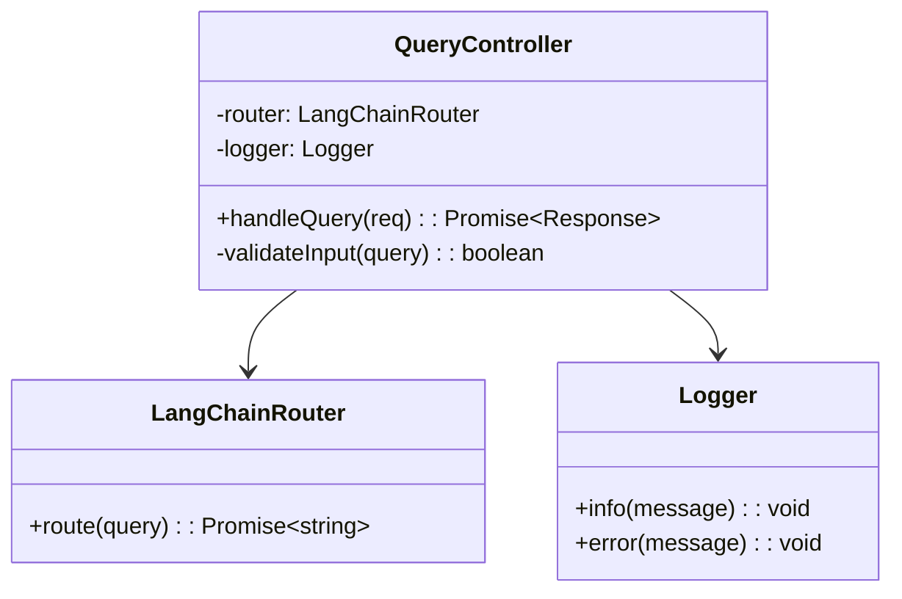

#### Exception Handling
| Exception | Occurrence Condition | Handling Method |
|-----------|---------------------|-----------------|
| ValidationError | [Condition 1] | [Handling 1] |
| SystemError | [Condition 2] | [Handling 2] |

## 3. Completion Confirmation
- [ ] All classes follow the Single Responsibility Principle
- [ ] Dependencies are clearly defined
- [ ] Interfaces are properly designed
- [ ] Exception handling is considered
````

### 3.2 Method Interface List (detailed-design/interfaces.md)

#### Required Sections

````markdown
# Method Interface List

## Metadata
| Item | Content |
|------|---------|
| Document ID | IF-001 |
| Related Documents | CLASS-001 |
| Creation Date | YYYY-MM-DD |

## 1. Interface List

| IF-ID | Class Name | Method Name | Type | Priority |
|-------|------------|-------------|------|----------|
| IF-001 | QueryController | handleQuery | public | High |
| IF-002 | LangChainRouter | route | public | High |

## 2. Interface Details

### IF-001: QueryController.handleQuery

#### Basic Information
- **Purpose**: Receive user query and return processing result
- **Caller**: Express Router
- **Callee**: LangChainRouter.route

#### Signature
```typescript
async handleQuery(req: Request): Promise<Response>
```

#### Parameters
| Parameter Name | Type | Required | Description | Constraints |
|----------------|------|----------|-------------|-------------|
| req | Request | ○ | HTTP request object | [Constraint 1] |

#### Return Value
| Type | Description | Example |
|------|-------------|---------|
| Promise<Response> | HTTP response object | [Example 1] |

#### Exceptions
| Exception Name | Occurrence Condition | Handling Method |
|----------------|---------------------|-----------------|
| ValidationError | [Condition 1] | [Handling 1] |
| SystemError | [Condition 2] | [Handling 2] |

#### Processing Flow
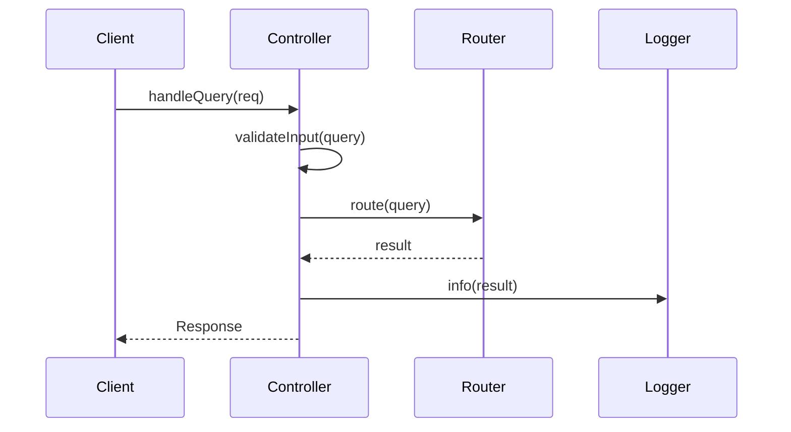

#### Implementation Example
```typescript
async handleQuery(req: Request): Promise<Response> {
    try {
        const query = req.body.query;
        
        if (!this.validateInput(query)) {
            throw new ValidationError('Invalid query format');
        }
        
        const result = await this.router.route(query);
        this.logger.info(`Query processed: ${query}`);
        
        return {
            status: 200,
            data: result
        };
    } catch (error) {
        this.logger.error(`Query processing failed: ${error.message}`);
        throw error;
    }
}
```

## 3. Completion Confirmation
- [ ] All method signatures are defined
- [ ] Parameters and return values are described in detail
- [ ] Exception handling is properly defined
- [ ] Processing flow is illustrated
- [ ] Implementation examples are provided
````

---

## STEP 4: Test Design Documents

### 4.1 Test Strategy Document (test-design/strategy.md)

#### Required Sections

````markdown
# Test Strategy Document

## Metadata
| Item | Content |
|------|---------|
| Document ID | TEST-001 |
| Related Documents | REQ-001, CLASS-001 |
| Creation Date | YYYY-MM-DD |

## 1. Test Policy

### 1.1 Test Objectives
- [Objective 1]: [Description 1]
- [Objective 2]: [Description 2]
- [Objective 3]: [Description 3]

### 1.2 Test Scope
| Target | Include | Exclude | Reason |
|--------|---------|---------|--------|
| [Target 1] | [Include 1] | [Exclude 1] | [Reason 1] |
| [Target 2] | [Include 2] | [Exclude 2] | [Reason 2] |

## 2. Test Levels

### 2.1 Test Pyramid
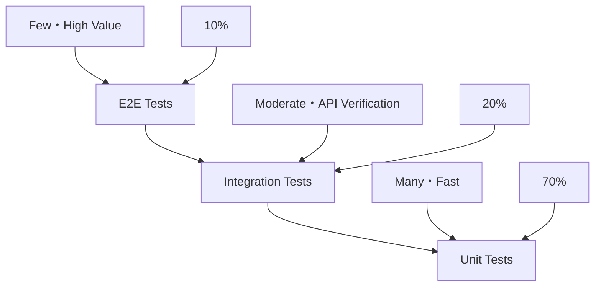

### 2.2 Test Level Details
| Level | Purpose | Target | Frequency | Automation Rate |
|-------|---------|--------|-----------|-----------------|
| Unit Test | [Purpose 1] | [Target 1] | [Frequency 1] | 100% |
| Integration Test | [Purpose 2] | [Target 2] | [Frequency 2] | 90% |
| E2E Test | [Purpose 3] | [Target 3] | [Frequency 3] | 80% |

## 3. Quality Standards

### 3.1 Coverage Targets
| Test Level | Coverage Type | Target Value | Minimum Value |
|------------|---------------|--------------|---------------|
| Unit Test | Line | 95% | 90% |
| Unit Test | Branch | 90% | 85% |
| Integration Test | API | 100% | 95% |

### 3.2 Quality Gates
| Item | Criteria | Measurement Method |
|------|----------|-------------------|
| Test Success Rate | 100% | Automated test execution |
| Coverage | 90% or higher | Jest Coverage |
| Performance | Response time <200ms | Load testing |

## 4. Test Environment

### 4.1 Environment Configuration
| Environment Name | Purpose | Data | Update Frequency |
|------------------|---------|------|------------------|
| Development | Developer testing | Mock data | As needed |
| Test | Automated testing | Test data | Daily |
| Staging | Acceptance testing | Production-like data | Weekly |

### 4.2 Test Data Management
| Data Type | Creation Method | Update Method | Protection Level |
|-----------|-----------------|---------------|------------------|
| [Data 1] | [Method 1] | [Update 1] | [Level 1] |

## 5. Completion Confirmation
- [ ] Test policy is clearly defined
- [ ] Test levels are properly designed
- [ ] Quality standards are quantitatively set
- [ ] Test environment is properly planned
````

### 4.2 Test Target List (test-design/targets.md)

#### Required Sections

````markdown
# Test Target List

## Metadata
| Item | Content |
|------|---------|
| Document ID | TARGET-001 |
| Related Documents | TEST-001, CLASS-001 |
| Creation Date | YYYY-MM-DD |

## 1. Unit Test Targets

### 1.1 Test Targets by Class
| Class Name | Method Count | Test Target Methods | Excluded Methods | Exclusion Reason |
|------------|--------------|---------------------|------------------|------------------|
| QueryController | 5 | 4 | 1 | [Reason 1] |
| UserService | 8 | 7 | 1 | [Reason 2] |

### 1.2 Test Details by Method
| Class Name | Method Name | Complexity | Priority | Test Case Count |
|------------|-------------|------------|----------|-----------------|
| QueryController | handleQuery | High | High | 8 |
| QueryController | validateInput | Medium | Medium | 5 |

## 2. Integration Test Targets

### 2.1 Test Targets by API
| API Name | Method | Path | Priority | Test Case Count |
|----------|--------|------|----------|-----------------|
| Query API | POST | /api/query | High | 6 |
| User API | GET | /api/users | Medium | 4 |

### 2.2 External Integration Test Targets
| Integration Point | Interface | Test Type | Priority |
|-------------------|-----------|-----------|----------|
| OpenAI API | REST API | Mock test | High |
| Database | SQL | Real data test | High |

## 3. E2E Test Targets

### 3.1 User Scenarios
| Scenario ID | Scenario Name | Priority | Execution Time | Automated |
|-------------|---------------|----------|----------------|-----------|
| E2E-001 | [Scenario 1] | High | 5 min | ○ |
| E2E-002 | [Scenario 2] | Medium | 3 min | ○ |

### 3.2 Browser Support
| Browser | Version | Support Level | Test Execution |
|---------|---------|---------------|----------------|
| Chrome | Latest | Full support | Automated |
| Firefox | Latest | Full support | Automated |
| Safari | Latest | Basic support | Manual |

## 4. Completion Confirmation
- [ ] Unit test targets are comprehensively identified
- [ ] Integration test targets are properly selected
- [ ] E2E test targets cover important scenarios
- [ ] Test priorities are properly set
````

### 4.3 Test Case Definition Document (test-design/test-cases.md)

#### Required Sections

````markdown
# Test Case Definition Document

## Metadata
| Item | Content |
|------|---------|
| Document ID | CASE-001 |
| Related Documents | TARGET-001 |
| Creation Date | YYYY-MM-DD |

## 1. Unit Test Cases

### TC-001: QueryController.handleQuery - Normal Case

#### Basic Information
| Item | Content |
|------|---------|
| Test Case ID | TC-001 |
| Target Method | QueryController.handleQuery |
| Test Viewpoint | Normal case - Valid query |
| Priority | High |

#### Test Conditions
| Item | Content |
|------|---------|
| Preconditions | System is running normally |
| Input Data | { query: "Hello, world!" } |
| Expected Result | Normal response is returned |
| Postconditions | Logs are properly output |

#### Test Steps
1. Create test Request object
2. Call handleQuery method
3. Verify return value
4. Confirm log output

#### Implementation Example
```typescript
describe('QueryController.handleQuery', () => {
  it('should return valid response for valid query', async () => {
    // Arrange
    const mockRequest = {
      body: { query: 'Hello, world!' }
    };
    const expectedResponse = {
      status: 200,
      data: 'Processed: Hello, world!'
    };

    // Act
    const result = await controller.handleQuery(mockRequest);

    // Assert
    expect(result).toEqual(expectedResponse);
    expect(mockLogger.info).toHaveBeenCalledWith(
      'Query processed: Hello, world!'
    );
  });
});
```

### TC-002: QueryController.handleQuery - Abnormal Case

#### Basic Information
| Item | Content |
|------|---------|
| Test Case ID | TC-002 |
| Target Method | QueryController.handleQuery |
| Test Viewpoint | Abnormal case - Invalid query |
| Priority | High |

#### Test Conditions
| Item | Content |
|------|---------|
| Preconditions | System is running normally |
| Input Data | { query: "" } |
| Expected Result | ValidationError occurs |
| Postconditions | Error log is output |

#### Implementation Example
```typescript
it('should throw ValidationError for empty query', async () => {
  // Arrange
  const mockRequest = {
    body: { query: '' }
  };

  // Act & Assert
  await expect(controller.handleQuery(mockRequest))
    .rejects.toThrow(ValidationError);
  
  expect(mockLogger.error).toHaveBeenCalledWith(
    expect.stringContaining('Query processing failed')
  );
});
```

## 2. Integration Test Cases

### TC-101: Query API - Normal Case

#### Basic Information
| Item | Content |
|------|---------|
| Test Case ID | TC-101 |
| Target API | POST /api/query |
| Test Viewpoint | Normal case - End-to-end |
| Priority | High |

#### Test Conditions
| Item | Content |
|------|---------|
| Preconditions | API server is running |
| Request | POST /api/query<br>{ "query": "test query" } |
| Expected Result | 200 OK<br>Normal response |
| Postconditions | Recorded in database |

#### Implementation Example
```typescript
describe('POST /api/query', () => {
  it('should process query successfully', async () => {
    // Arrange
    const queryData = { query: 'test query' };

    // Act
    const response = await request(app)
      .post('/api/query')
      .send(queryData)
      .expect(200);

    // Assert
    expect(response.body).toMatchObject({
      status: 'success',
      data: expect.any(String)
    });
  });
});
```

## 3. E2E Test Cases

### TC-201: User Query Processing Flow

#### Basic Information
| Item | Content |
|------|---------|
| Test Case ID | TC-201 |
| Scenario | User inputs query and gets result |
| Test Viewpoint | End user experience |
| Priority | High |

#### Test Steps
1. Access application in browser
2. Enter text in query input field
3. Click submit button
4. Confirm result is displayed
5. Confirm recorded in history

#### Implementation Example (Playwright)
```typescript
test('user can submit query and get response', async ({ page }) => {
  // Navigate to application
  await page.goto('/');

  // Input query
  await page.fill('[data-testid=query-input]', 'test query');
  
  // Submit query
  await page.click('[data-testid=submit-button]');
  
  // Verify response
  await expect(page.locator('[data-testid=response]')).toBeVisible();
  await expect(page.locator('[data-testid=response]')).toContainText('test query');
  
  // Verify history
  await expect(page.locator('[data-testid=history]')).toContainText('test query');
});
```

## 4. Completion Confirmation
- [ ] Unit test cases are comprehensively defined
- [ ] Integration test cases cover important paths
- [ ] E2E test cases cover user scenarios
- [ ] Implementation examples are specifically described
- [ ] Expected results are clearly defined
````

---

## STEP 5: Development Planning Documents

### 5.1 Implementation Component List (implementation/components.md)

#### Required Sections

````markdown
# Implementation Component List

## Metadata
| Item | Content |
|------|---------|
| Document ID | COMP-001 |
| Related Documents | CLASS-001, TARGET-001 |
| Creation Date | YYYY-MM-DD |

## 1. Component Classification

### 1.1 Components by Layer
| Layer | Component Count | Implementation Priority | Dependencies |
|-------|-----------------|------------------------|--------------|
| Presentation | 5 | High | Application |
| Application | 8 | High | Domain |
| Domain | 6 | Medium | None |
| Infrastructure | 4 | Medium | Domain |

### 1.2 Component Details
| Component ID | Name | Layer | File | Priority | Estimated Time |
|--------------|------|-------|------|----------|----------------|
| COMP-001 | QueryController | Presentation | QueryController.ts | High | 4h |
| COMP-002 | UserService | Application | UserService.ts | High | 6h |
| COMP-003 | User | Domain | User.ts | Medium | 3h |

## 2. Dependency Map

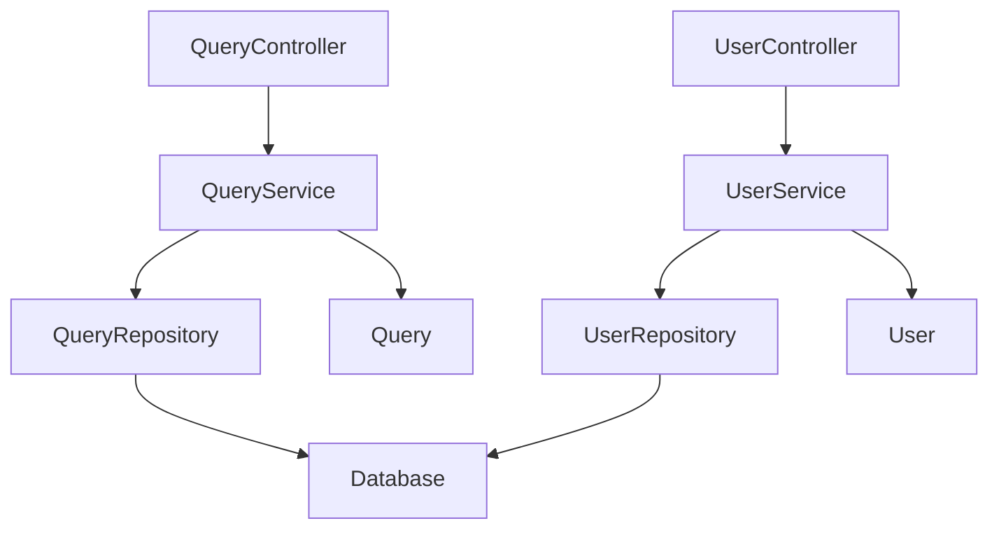

## 3. Implementation Order

### 3.1 Phase 1: Foundation Components
| Order | Component | Reason | Duration |
|-------|-----------|--------|----------|
| 1 | Domain Entities | No other dependencies | 1 week |
| 2 | Repository Interfaces | Domain layer completion | 3 days |

### 3.2 Phase 2: Application Layer
| Order | Component | Reason | Duration |
|-------|-----------|--------|----------|
| 3 | Application Services | Business logic implementation | 1 week |
| 4 | Repository Implementations | Data access implementation | 5 days |

### 3.3 Phase 3: Presentation Layer
| Order | Component | Reason | Duration |
|-------|-----------|--------|----------|
| 5 | Controllers | API implementation | 1 week |
| 6 | DTOs | Data transfer objects | 3 days |

## 4. Completion Confirmation
- [ ] All components are identified
- [ ] Dependencies are clearly defined
- [ ] Implementation order is logical
- [ ] Estimated times are realistic
````

### 5.2 Development Schedule (implementation/schedule.md)

#### Required Sections

````markdown
# Development Schedule

## Metadata
| Item | Content |
|------|---------|
| Document ID | SCHED-001 |
| Related Documents | COMP-001 |
| Creation Date | YYYY-MM-DD |

## 1. Project Overview

### 1.1 Period & Effort
| Item | Content |
|------|---------|
| Start Date | YYYY-MM-DD |
| End Date | YYYY-MM-DD |
| Total Effort | XXX person-days |
| Participants | X people |

### 1.2 Milestones
| Milestone | Date | Deliverable | Completion Criteria |
|-----------|------|-------------|-------------------|
| M1: Foundation Complete | YYYY-MM-DD | Domain layer | [Criteria 1] |
| M2: Features Complete | YYYY-MM-DD | Application layer | [Criteria 2] |
| M3: API Complete | YYYY-MM-DD | Presentation layer | [Criteria 3] |

## 2. Detailed Schedule

### 2.1 Gantt Chart

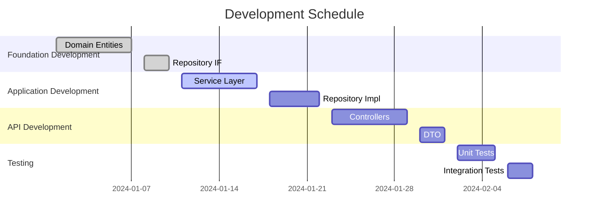

### 2.2 Weekly Plan
| Week | Period | Main Tasks | Deliverables | Assignee |
|------|--------|------------|--------------|----------|
| W1 | MM/DD-MM/DD | [Task 1] | [Deliverable 1] | [Assignee 1] |
| W2 | MM/DD-MM/DD | [Task 2] | [Deliverable 2] | [Assignee 2] |

## 3. Risk Management

### 3.1 Risk List
| Risk ID | Risk Content | Impact | Probability | Countermeasure |
|---------|--------------|--------|-------------|----------------|
| R-001 | [Risk 1] | High | Medium | [Countermeasure 1] |
| R-002 | [Risk 2] | Medium | High | [Countermeasure 2] |

### 3.2 Buffer Planning
| Item | Buffer | Reason |
|------|--------|--------|
| Technical Research | 20% | New technology learning |
| Testing | 30% | Quality assurance |

## 4. Completion Confirmation
- [ ] Schedule is realistic
- [ ] Milestones are clearly defined
- [ ] Risks are properly managed
- [ ] Buffers are appropriately set
````

### 5.3 Directory Structure Map (implementation/directory-structure.md)

#### Required Sections

````markdown
# Directory Structure Map

## Metadata
| Item | Content |
|------|---------|
| Document ID | DIR-001 |
| Related Documents | TECH-001, COMP-001 |
| Creation Date | YYYY-MM-DD |

## 1. Overall Project Structure

```
project-root/
├── README.md                          # Project overview
├── package.json                       # Dependency definitions
├── tsconfig.json                      # TypeScript configuration
├── .env.example                       # Environment variable template
├── docker-compose.yml                 # Development environment definition
├── .github/                           # GitHub configuration
│   └── workflows/                     # CI/CD workflows
│       ├── test.yml                   # Test execution
│       ├── build.yml                  # Build & deploy
│       └── security.yml               # Security scan
├── docs/                              # Project documentation
│   ├── api/                           # API specifications
│   ├── architecture/                  # Architecture documents
│   └── deployment/                    # Deployment procedures
├── src/                               # Source code
│   ├── presentation/                  # Presentation layer
│   │   ├── controllers/               # REST API controllers
│   │   ├── dto/                       # Data transfer objects
│   │   │   ├── request/               # Request DTOs
│   │   │   └── response/              # Response DTOs
│   │   ├── middleware/                # Middleware
│   │   └── validators/                # Input validation
│   ├── application/                   # Application layer
│   │   ├── services/                  # Business logic
│   │   ├── usecases/                  # Use case implementations
│   │   └── interfaces/                # Application interfaces
│   ├── domain/                        # Domain layer
│   │   ├── entities/                  # Entities
│   │   ├── repositories/              # Repository interfaces
│   │   ├── services/                  # Domain services
│   │   └── value-objects/             # Value objects
│   ├── infrastructure/                # Infrastructure layer
│   │   ├── database/                  # Database implementations
│   │   │   ├── repositories/          # Repository implementations
│   │   │   ├── migrations/            # Migrations
│   │   │   └── seeds/                 # Seed data
│   │   ├── external/                  # External API integrations
│   │   ├── config/                    # Configuration management
│   │   └── logging/                   # Log management
│   ├── shared/                        # Common modules
│   │   ├── constants/                 # Constant definitions
│   │   ├── enums/                     # Enumerations
│   │   ├── types/                     # Type definitions
│   │   ├── utils/                     # Utilities
│   │   └── exceptions/                # Exception classes
│   └── main.ts                        # Application entry point
├── tests/                             # Test code
│   ├── unit/                          # Unit tests
│   │   ├── controllers/               # Controller tests
│   │   ├── services/                  # Service tests
│   │   ├── repositories/              # Repository tests
│   │   └── utils/                     # Utility tests
│   ├── integration/                   # Integration tests
│   │   ├── api/                       # API integration tests
│   │   ├── database/                  # DB integration tests
│   │   └── external/                  # External integration tests
│   ├── e2e/                           # E2E tests
│   │   ├── scenarios/                 # Test scenarios
│   │   ├── fixtures/                  # Test data
│   │   └── helpers/                   # Test helpers
│   └── performance/                   # Performance tests
├── scripts/                           # Operational scripts
│   ├── build.sh                       # Build script
│   ├── deploy.sh                      # Deploy script
│   ├── backup.sh                      # Backup script
│   └── migration.sh                   # Migration script
└── dist/                              # Build artifacts (not in Git)
```

## 2. Naming Conventions

### 2.1 File Naming Conventions
| Type | Convention | Example |
|------|------------|---------|
| Class | PascalCase + Suffix | UserController.ts |
| Interface | I + PascalCase | IUserRepository.ts |
| DTO | PascalCase + Request/Response | UserCreateRequest.ts |
| Test | Target filename + .spec.ts | UserService.spec.ts |
| Config | kebab-case | database.config.ts |

### 2.2 Directory Naming Conventions
| Type | Convention | Example |
|------|------------|---------|
| Multi-word | kebab-case | detailed-design |
| Singular | Entity-related | entity, service |
| Plural | Collections | controllers, repositories |

### 2.3 Package Structure
| Package | Purpose | Naming Convention |
|---------|---------|-------------------|
| @/presentation | Presentation layer | PascalCase |
| @/application | Application layer | PascalCase |
| @/domain | Domain layer | PascalCase |
| @/infrastructure | Infrastructure layer | PascalCase |
| @/shared | Common modules | PascalCase |

## 3. Import Rules

### 3.1 Import Order
```typescript
// 1. External libraries (Node.js standard → Third-party)
import { Controller, Get, Post, Body } from '@nestjs/common';
import { Repository } from 'typeorm';
import express from 'express';

// 2. Internal modules (No relative paths, use absolute paths)
import { UserService } from '@/application/services/UserService';
import { User } from '@/domain/entities/User';
import { IUserRepository } from '@/domain/repositories/IUserRepository';

// 3. Type definitions (type-only import)
import type { UserCreateRequest } from '@/presentation/dto/request/UserCreateRequest';
import type { UserResponse } from '@/presentation/dto/response/UserResponse';

// 4. Configuration & Constants
import { DATABASE_CONFIG } from '@/infrastructure/config/database.config';
import { HTTP_STATUS } from '@/shared/constants/http-status';
```

### 3.2 Path Alias Configuration
```json
{
  "compilerOptions": {
    "baseUrl": "./src",
    "paths": {
      "@/*": ["*"],
      "@/presentation/*": ["presentation/*"],
      "@/application/*": ["application/*"],
      "@/domain/*": ["domain/*"],
      "@/infrastructure/*": ["infrastructure/*"],
      "@/shared/*": ["shared/*"],
      "@/tests/*": ["../tests/*"]
    }
  }
}
```

## 4. Completion Confirmation
- [ ] Directory structure is properly designed
- [ ] Naming conventions are unified
- [ ] Import rules are clearly defined
- [ ] Path aliases are properly configured
````

---

## STEP 6: ToDo List Creation Documents

### 6.1 File-based Task List (tasks/task-list.md)

#### Required Sections

````markdown
# File-based Task List

## Metadata
| Item | Content |
|------|---------|
| Document ID | TASK-001 |
| Related Documents | COMP-001, SCHED-001 |
| Creation Date | YYYY-MM-DD |

## 1. Task Overview

### 1.1 Task Division Policy
- 1 task = 1 file
- Ordering based on dependencies
- Estimated time is 4-8 hours/task
- Consider parallel execution possibility

### 1.2 Task ID Naming Convention
**Format**: `TSK-{3-digit sequence}-{layer}-{filename}`

**Layer Abbreviations**:
- CTL: Controller (Presentation layer)
- SVC: Service (Application layer)
- ENT: Entity (Domain layer)
- REP: Repository (Infrastructure layer)
- DTO: Data Transfer Object
- UTL: Utility (Common module)

## 2. Task List

### 2.1 Phase 1: Domain Layer
| Task ID | File Name | Priority | Estimated Time | Dependencies | Assignee |
|---------|-----------|----------|----------------|--------------|----------|
| TSK-001-ENT-User | User.ts | High | 3h | None | [Assignee 1] |
| TSK-002-ENT-Query | Query.ts | High | 3h | None | [Assignee 1] |
| TSK-003-REP-IUserRepository | IUserRepository.ts | High | 2h | TSK-001 | [Assignee 2] |
| TSK-004-REP-IQueryRepository | IQueryRepository.ts | High | 2h | TSK-002 | [Assignee 2] |

### 2.2 Phase 2: Application Layer
| Task ID | File Name | Priority | Estimated Time | Dependencies | Assignee |
|---------|-----------|----------|----------------|--------------|----------|
| TSK-005-SVC-UserService | UserService.ts | High | 6h | TSK-003 | [Assignee 1] |
| TSK-006-SVC-QueryService | QueryService.ts | High | 6h | TSK-004 | [Assignee 2] |

### 2.3 Phase 3: Infrastructure Layer
| Task ID | File Name | Priority | Estimated Time | Dependencies | Assignee |
|---------|-----------|----------|----------------|--------------|----------|
| TSK-007-REP-UserRepository | UserRepository.ts | Medium | 5h | TSK-005 | [Assignee 1] |
| TSK-008-REP-QueryRepository | QueryRepository.ts | Medium | 5h | TSK-006 | [Assignee 2] |

### 2.4 Phase 4: Presentation Layer
| Task ID | File Name | Priority | Estimated Time | Dependencies | Assignee |
|---------|-----------|----------|----------------|--------------|----------|
| TSK-009-CTL-UserController | UserController.ts | High | 4h | TSK-007 | [Assignee 1] |
| TSK-010-CTL-QueryController | QueryController.ts | High | 4h | TSK-008 | [Assignee 2] |
| TSK-011-DTO-UserCreateRequest | UserCreateRequest.ts | Medium | 2h | TSK-009 | [Assignee 1] |
| TSK-012-DTO-UserResponse | UserResponse.ts | Medium | 2h | TSK-009 | [Assignee 1] |

## 3. Dependency Diagram

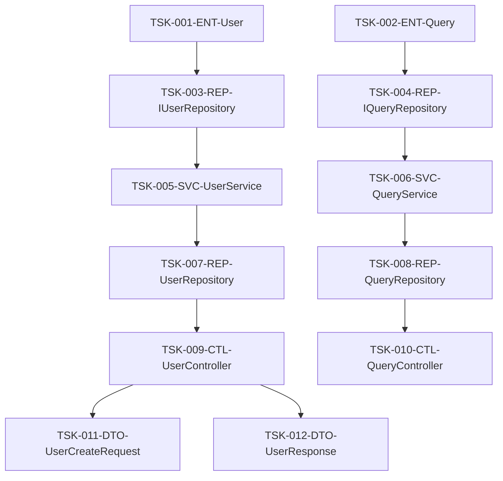

## 4. Progress Management

### 4.1 Status Definitions
| Status | Description | Next Action |
|--------|-------------|-------------|
| Not Started | Task not started | Prepare to start |
| In Progress | Implementation in progress | Continue implementation |
| Review Pending | Implementation complete, review requested | Conduct review |
| Fixing | Addressing review feedback | Complete fixes |
| Complete | All work complete | Start next task |

### 4.2 Progress Tracking
| Task ID | Status | Progress % | Start Date | Expected Completion | Actual |
|---------|--------|------------|------------|-------------------|--------|
| TSK-001-ENT-User | Complete | 100% | MM/DD | MM/DD | 3h |
| TSK-002-ENT-Query | In Progress | 60% | MM/DD | MM/DD | 2h |

## 5. Completion Confirmation
- [ ] All files are defined as tasks
- [ ] Dependencies are correctly set
- [ ] Estimated times are realistic
- [ ] Assignees are properly allocated
- [ ] Progress management method is clear
````

### 6.2 Task Management Table (tasks/task-management.md)

#### Required Sections

````markdown
# Task Management Table

## Metadata
| Item | Content |
|------|---------|
| Document ID | MGMT-001 |
| Related Documents | TASK-001 |
| Creation Date | YYYY-MM-DD |

## 1. Task Management Policy

### 1.1 Management Principles
- Practice Issue-driven development
- 1 task = 1 Issue = 1 Pull Request
- Mandatory execution of standard subtasks
- Automatic checking of quality gates

### 1.2 Workflow
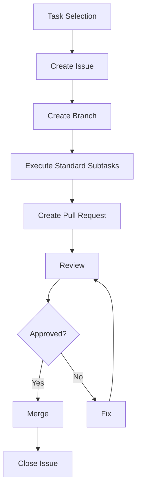

## 2. Issue Management

### 2.1 Issue Creation Template
```markdown
## Overview
[Task overview description]

## Implementation Target
- File: [File path]
- Class/Function: [Implementation target]

## Implementation Specification
### Method List
- method1(): [Function description]
- method2(): [Function description]

### Dependencies
- Referenced classes: [Class list]
- Provided interfaces: [Interface list]

## Test Requirements
- [ ] Normal case test
- [ ] Abnormal case test
- [ ] Boundary value test

## Completion Criteria
- [ ] Implementation complete
- [ ] Unit test coverage 90% or higher
- [ ] Coding standards compliance
- [ ] Review complete

## Related Information
- Design document: [Link]
- Dependent tasks: [Task ID]
```

### 2.2 Label Management
| Label | Purpose | Color |
|-------|---------|-------|
| feature | New feature implementation | Green |
| bug | Bug fix | Red |
| enhancement | Improvement | Blue |
| documentation | Documentation | Yellow |
| layer:presentation | Presentation layer | Purple |
| layer:application | Application layer | Orange |
| layer:domain | Domain layer | Brown |
| layer:infrastructure | Infrastructure layer | Gray |
| priority:high | High priority | Red |
| priority:medium | Medium priority | Yellow |
| priority:low | Low priority | Green |

## 3. Standard Subtask Management

### 3.1 Subtask Checklist
Mandatory execution of the following 7 subtasks for each task:

#### 1. Specification Confirmation
- [ ] Understanding of design document
- [ ] Confirmation of dependencies
- [ ] Confirmation of interface specifications
- [ ] Understanding of exception handling policy

#### 2. Coding
- [ ] Implementation of classes and methods
- [ ] Compliance with coding standards
- [ ] Implementation of error handling
- [ ] Implementation of logging

#### 3. Test Coding
- [ ] Implementation of unit tests
- [ ] Creation of mocks and stubs
- [ ] Preparation of test data
- [ ] Implementation of boundary value tests

#### 4. Unit Test Execution
- [ ] Execution of all test cases
- [ ] Confirmation of coverage 90% or higher
- [ ] Recording of test results
- [ ] Fixing of failed cases

#### 5. Repository Commit
- [ ] Appropriate commit message
- [ ] Linking to related Issue
- [ ] Resolution of conflicts
- [ ] Execution of push

#### 6. ToDo Check
- [ ] Confirmation of all subtask completion
- [ ] Confirmation of quality standard achievement
- [ ] Document updates
- [ ] Confirmation of impact on next tasks

#### 7. Issue Close
- [ ] Achievement of all completion criteria
- [ ] Reflection of review results
- [ ] Update of related documents
- [ ] Report to stakeholders

### 3.2 Quality Checkpoints
| Check Item | Criteria | Automated |
|------------|----------|-----------|
| Coding Standards | ESLint errors 0 | ○ |
| Test Coverage | 90% or higher | ○ |
| Static Analysis | SonarQube A grade | ○ |
| Security | Vulnerabilities 0 | ○ |
| Build | Success | ○ |

## 4. Completion Confirmation
- [ ] Issue management process is defined
- [ ] Standard subtasks are clearly defined
- [ ] Quality checkpoints are set
- [ ] Workflow is clear
````

### 6.3 Issue & Specification Set (tasks/specifications/)

#### Required Sections

````markdown
# TSK-001-ENT-User Task Specification

## Metadata
| Item | Content |
|------|---------|
| Document ID | SPEC-TSK-001 |
| Task ID | TSK-001-ENT-User |
| Related Documents | CLASS-001 |
| Creation Date | YYYY-MM-DD |

## 1. Task Overview

### 1.1 Basic Information
| Item | Content |
|------|---------|
| Implementation Target | User entity class |
| File Path | src/domain/entities/User.ts |
| Responsibility | User information management |
| Estimated Time | 3 hours |

### 1.2 Implementation Specification
#### Class Definition
```typescript
export class User {
  private readonly id: UserId;
  private name: UserName;
  private email: Email;
  private createdAt: Date;
  private updatedAt: Date;

  constructor(
    id: UserId,
    name: UserName,
    email: Email
  ) {
    this.id = id;
    this.name = name;
    this.email = email;
    this.createdAt = new Date();
    this.updatedAt = new Date();
  }

  // Getters and setters
  getId(): UserId { return this.id; }
  getName(): UserName { return this.name; }
  getEmail(): Email { return this.email; }
  
  // Business logic
  updateName(name: UserName): void;
  updateEmail(email: Email): void;
  isActive(): boolean;
}
```

#### Value Objects
```typescript
export class UserId {
  constructor(private readonly value: string) {
    if (!value || value.length === 0) {
      throw new Error('UserId cannot be empty');
    }
  }
  
  getValue(): string { return this.value; }
  equals(other: UserId): boolean { return this.value === other.value; }
}

export class UserName {
  constructor(private readonly value: string) {
    if (!value || value.length < 2 || value.length > 50) {
      throw new Error('UserName must be between 2 and 50 characters');
    }
  }
  
  getValue(): string { return this.value; }
}

export class Email {
  constructor(private readonly value: string) {
    if (!this.isValidEmail(value)) {
      throw new Error('Invalid email format');
    }
  }
  
  private isValidEmail(email: string): boolean {
    const emailRegex = /^[^\s@]+@[^\s@]+\.[^\s@]+$/;
    return emailRegex.test(email);
  }
  
  getValue(): string { return this.value; }
}
```

## 2. Test Requirements

### 2.1 Test Case List
| Test Case ID | Test Viewpoint | Input | Expected Result |
|--------------|----------------|-------|-----------------|
| TC-001 | Normal case - User creation | Valid values | User creation success |
| TC-002 | Abnormal case - Invalid ID | Empty string | Error occurs |
| TC-003 | Abnormal case - Invalid name | 1 character | Error occurs |
| TC-004 | Abnormal case - Invalid email | Invalid format | Error occurs |
| TC-005 | Boundary value - Name minimum | 2 characters | Normal creation |
| TC-006 | Boundary value - Name maximum | 50 characters | Normal creation |

### 2.2 Test Implementation Example
```typescript
describe('User', () => {
  describe('constructor', () => {
    it('should create user with valid parameters', () => {
      // Arrange
      const id = new UserId('user-001');
      const name = new UserName('John Doe');
      const email = new Email('john@example.com');

      // Act
      const user = new User(id, name, email);

      // Assert
      expect(user.getId()).toEqual(id);
      expect(user.getName()).toEqual(name);
      expect(user.getEmail()).toEqual(email);
    });
  });

  describe('updateName', () => {
    it('should update name successfully', () => {
      // Arrange
      const user = createTestUser();
      const newName = new UserName('Jane Doe');

      // Act
      user.updateName(newName);

      // Assert
      expect(user.getName()).toEqual(newName);
    });
  });
});
```

## 3. Implementation Checklist

### 3.1 Design Compliance
- [ ] Follows domain-driven design principles
- [ ] Invariants are properly protected
- [ ] Value objects are properly implemented
- [ ] Business rules are included in entity

### 3.2 Code Quality
- [ ] TypeScript type definitions are appropriate
- [ ] Error handling is implemented
- [ ] Naming conventions are followed
- [ ] Comments are properly written

### 3.3 Test Quality
- [ ] Unit test coverage 90% or higher
- [ ] Normal, abnormal, and boundary value tests are covered
- [ ] Test code is maintainable
- [ ] Mocks are properly used

## 4. Completion Confirmation
- [ ] All methods implemented
- [ ] Unit tests implemented
- [ ] Test coverage 90% or higher achieved
- [ ] Coding standards compliance
- [ ] Review complete
- [ ] Documentation updated
````

---

## STEP 7: Coding & Test Execution Documents

### 7.1 Execution Log & Progress Management (execution/progress.md)

#### Required Sections

````markdown
# Execution Log & Progress Management

## Metadata
| Item | Content |
|------|---------|
| Document ID | EXEC-001 |
| Related Documents | TASK-001, MGMT-001 |
| Creation Date | YYYY-MM-DD |

## 1. Progress Summary

### 1.1 Overall Progress
| Item | Plan | Actual | Progress Rate |
|------|------|--------|---------------|
| Total Tasks | 12 | 8 completed | 67% |
| Total Estimated Time | 48h | 32h consumed | 67% |
| Expected Completion | YYYY-MM-DD | YYYY-MM-DD | On track |

### 1.2 Progress by Phase
| Phase | Task Count | Completed | Progress Rate | Status |
|-------|------------|-----------|---------------|--------|
| Domain Layer | 4 | 4 | 100% | Complete |
| Application Layer | 2 | 2 | 100% | Complete |
| Infrastructure Layer | 2 | 2 | 100% | Complete |
| Presentation Layer | 4 | 0 | 0% | Not Started |

## 2. Daily Execution Log

### 2.1 YYYY-MM-DD Execution Log
| Time | Task ID | Action | Result | Notes |
|------|---------|--------|--------|-------|
| 09:00 | TSK-001-ENT-User | Start specification confirmation | Complete | Design document confirmed |
| 09:30 | TSK-001-ENT-User | Start coding | In Progress | Implementing User class |
| 11:00 | TSK-001-ENT-User | Coding complete | Complete | All methods implemented |
| 11:30 | TSK-001-ENT-User | Start test coding | In Progress | Creating unit tests |
| 14:00 | TSK-001-ENT-User | Test coding complete | Complete | Coverage 95% |
| 14:30 | TSK-001-ENT-User | Execute unit tests | Complete | All tests pass |
| 15:00 | TSK-001-ENT-User | Commit | Complete | PR #123 created |
| 15:30 | TSK-001-ENT-User | Close Issue | Complete | Task complete |

### 2.2 Quality Metrics
| Date | Test Coverage | Static Analysis Score | Build Result | Security |
|------|---------------|----------------------|--------------|-----------|
| MM/DD | 95% | A | Success | 0 vulnerabilities |
| MM/DD | 93% | A | Success | 0 vulnerabilities |

## 3. Issue & Risk Management

### 3.1 Issues Occurred
| Issue ID | Date | Content | Impact | Response Status | Resolution Date |
|----------|------|---------|--------|-----------------|-----------------|
| ISS-001 | MM/DD | TypeScript type error | Medium | Resolved | MM/DD |
| ISS-002 | MM/DD | Test data preparation delay | Low | In Progress | - |

### 3.2 Risk Status
| Risk ID | Content | Probability | Impact | Countermeasure Status |
|---------|---------|-------------|--------|----------------------|
| R-001 | External API specification change | Low | High | Monitoring |
| R-002 | Developer resource shortage | Medium | Medium | Buffer secured |

## 4. Next Actions

### 4.1 Tomorrow's Schedule
| Time | Task ID | Planned Action | Assignee |
|------|---------|----------------|----------|
| 09:00 | TSK-009-CTL-UserController | Specification confirmation | [Assignee 1] |
| 10:00 | TSK-009-CTL-UserController | Start coding | [Assignee 1] |
| 14:00 | TSK-010-CTL-QueryController | Specification confirmation | [Assignee 2] |

### 4.2 Weekly Goals
- Complete presentation layer
- Execute integration tests
- Update API documentation

## 5. Completion Confirmation
- [ ] Daily progress is accurately recorded
- [ ] Quality metrics are continuously measured
- [ ] Issues and risks are properly managed
- [ ] Next actions are clearly defined
````

### 7.2 Deliverables & Quality Records (execution/deliverables.md)

#### Required Sections

````markdown
# Deliverables & Quality Records

## Metadata
| Item | Content |
|------|---------|
| Document ID | DELIV-001 |
| Related Documents | EXEC-001 |
| Creation Date | YYYY-MM-DD |

## 1. Deliverable List

### 1.1 Implementation Files
| File Path | Task ID | Completion Date | Lines | Complexity | Quality Score |
|-----------|---------|-----------------|-------|------------|---------------|
| src/domain/entities/User.ts | TSK-001 | MM/DD | 120 | 5.2 | A |
| src/domain/entities/Query.ts | TSK-002 | MM/DD | 95 | 4.8 | A |
| src/application/services/UserService.ts | TSK-005 | MM/DD | 180 | 7.1 | B+ |

### 1.2 Test Files
| File Path | Target File | Test Count | Coverage | Execution Time |
|-----------|-------------|------------|----------|----------------|
| tests/unit/entities/User.spec.ts | User.ts | 15 | 98% | 0.2s |
| tests/unit/entities/Query.spec.ts | Query.ts | 12 | 95% | 0.1s |
| tests/unit/services/UserService.spec.ts | UserService.ts | 20 | 92% | 0.5s |

### 1.3 Documentation
| Document | Update Date | Version | Review Status |
|----------|-------------|---------|---------------|
| API Specification | MM/DD | 1.2 | Approved |
| Database Design | MM/DD | 1.1 | Under Review |
| User Manual | MM/DD | 1.0 | Not Started |

## 2. Quality Analysis

### 2.1 Code Quality Metrics
| Metric | Target Value | Actual Value | Achievement Rate | Trend |
|--------|--------------|--------------|------------------|-------|
| Test Coverage | 90% | 95% | 106% | ↗ |
| Cyclomatic Complexity | <10 | 6.2 | Good | → |
| Code Duplication | <5% | 2.1% | Good | ↘ |
| Technical Debt | <4h | 2.5h | Good | ↘ |

### 2.2 Test Quality Analysis
| Test Type | Executed | Passed | Failed | Success Rate | Execution Time |
|-----------|----------|--------|--------|--------------|----------------|
| Unit Tests | 47 | 47 | 0 | 100% | 1.2s |
| Integration Tests | 12 | 12 | 0 | 100% | 8.5s |
| E2E Tests | 5 | 5 | 0 | 100% | 45s |

### 2.3 Security Analysis
| Analysis Item | Detected | High Severity | Medium Severity | Low Severity | Response Status |
|---------------|----------|---------------|-----------------|--------------|-----------------|
| Vulnerability Scan | 0 | 0 | 0 | 0 | No action needed |
| Dependency Check | 1 | 0 | 1 | 0 | Resolved |
| Static Analysis | 3 | 0 | 0 | 3 | Resolved |

## 3. Performance Analysis

### 3.1 Build & Deploy Time
| Item | Target Time | Actual Time | Achievement |
|------|-------------|-------------|-------------|
| Build Time | <3 min | 2 min 15 sec | Good |
| Test Execution Time | <5 min | 3 min 30 sec | Good |
| Deploy Time | <10 min | 7 min 45 sec | Good |

### 3.2 Application Performance
| Metric | Target Value | Actual Value | Achievement |
|--------|--------------|--------------|-------------|
| API Response Time | <200ms | 145ms | Good |
| Page Load Time | <2 sec | 1.3 sec | Good |
| Memory Usage | <512MB | 380MB | Good |

## 4. Improvement Proposals

### 4.1 Quality Improvement Items
| Item | Current | Target | Improvement Plan | Priority |
|------|---------|--------|------------------|----------|
| Code Review Time | 2 hours | 1 hour | Enhance automated checks | Medium |
| Test Execution Time | 3.5 min | 2 min | Introduce parallel execution | High |
| Documentation Update | Manual | Automatic | Introduce auto-generation | Medium |

### 4.2 Process Improvement Items
| Item | Current | Target | Improvement Plan | Priority |
|------|---------|--------|------------------|----------|
| Task Estimation Accuracy | 80% | 95% | Use historical data | High |
| Bug Discovery Phase | Integration test | Unit test | Strengthen testing | High |
| Release Frequency | Weekly | Daily | Improve CI/CD | Medium |

## 5. Completion Confirmation
- [ ] All deliverables meet quality standards
- [ ] Test coverage achieves target values
- [ ] Security vulnerabilities are resolved
- [ ] Performance requirements are met
- [ ] Documentation is up to date
- [ ] Improvement proposals are reflected in next planning
````

### 7.3 Final System (execution/final-system.md)

#### Required Sections

````markdown
# Final System

## Metadata
| Item | Content |
|------|---------|
| Document ID | FINAL-001 |
| Related Documents | DELIV-001 |
| Creation Date | YYYY-MM-DD |
| Completion Date | YYYY-MM-DD |

## 1. System Overview

### 1.1 Final System Specifications
| Item | Content |
|------|---------|
| System Name | [System Name] |
| Version | 1.0.0 |
| Development Period | [Start Date] - [End Date] |
| Total Effort | XXX person-days |
| Participants | X people |

### 1.2 Implemented Features
| Feature ID | Feature Name | Implementation Status | Test Status | Quality Score |
|------------|--------------|----------------------|-------------|---------------|
| F-001 | User Management | Complete | Complete | A |
| F-002 | Query Processing | Complete | Complete | A |
| F-003 | Data Persistence | Complete | Complete | B+ |
| F-004 | API Provision | Complete | Complete | A |

### 1.3 Architecture Implementation Status
| Layer | Implemented Files | Completion Rate | Quality Score |
|-------|------------------|-----------------|---------------|
| Presentation | 6 | 100% | A |
| Application | 4 | 100% | A |
| Domain | 8 | 100% | A |
| Infrastructure | 5 | 100% | B+ |

## 2. Quality Achievement Status

### 2.1 Quality Goal Achievement
| Quality Item | Target Value | Actual Value | Achievement Rate | Evaluation |
|--------------|--------------|--------------|------------------|------------|
| Test Coverage | 90% | 95% | 106% | ✅ |
| Static Analysis Score | A grade | A grade | 100% | ✅ |
| Security Vulnerabilities | 0 | 0 | 100% | ✅ |
| API Response Time | <200ms | 145ms | 127% | ✅ |
| Availability | 99.9% | 99.95% | 100% | ✅ |

### 2.2 Non-functional Requirements Achievement
| Requirement Item | Target Value | Actual Value | Achievement Status |
|------------------|--------------|--------------|-------------------|
| Concurrent Connections | 1000 | 1200 | ✅ |
| Data Processing Volume | 10MB/s | 12MB/s | ✅ |
| Recovery Time | <1 hour | 30 min | ✅ |
| Backup | Daily | Daily | ✅ |

## 3. Deployment Information

### 3.1 Production Environment Configuration
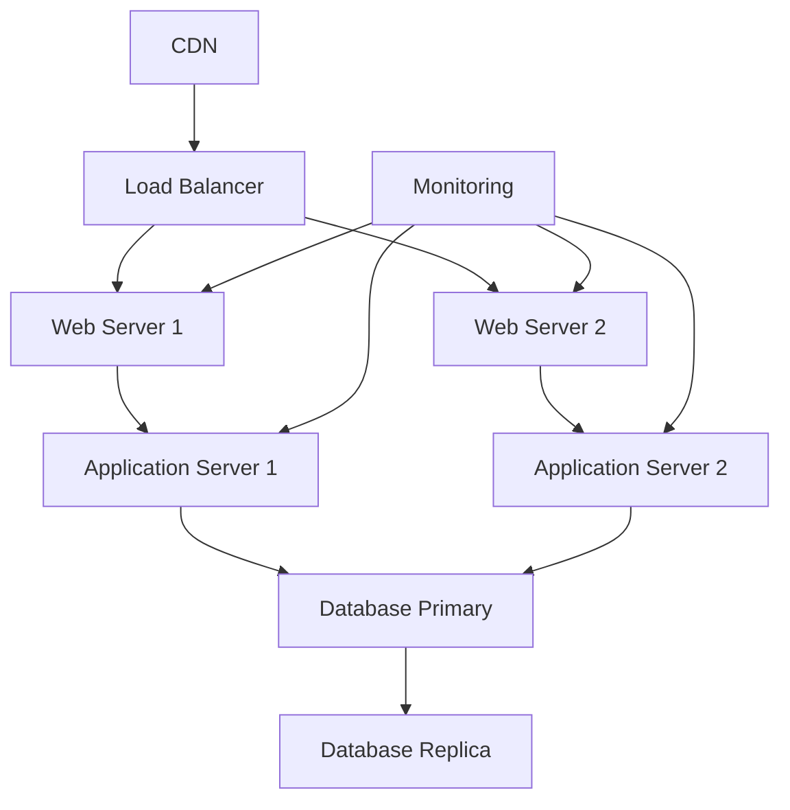

### 3.2 Environment-specific Configuration
| Environment | URL | Database | Monitoring | Backup |
|-------------|-----|----------|------------|--------|
| Production | https://prod.example.com | PostgreSQL Primary | 24/7 | Daily |
| Staging | https://staging.example.com | PostgreSQL Replica | Business hours | Weekly |
| Development | http://dev.example.com | PostgreSQL Local | None | None |

### 3.3 Operation Procedures
| Procedure | Frequency | Assignee | Automated |
|-----------|-----------|----------|-----------|
| Deploy | At release | DevOps | ✅ |
| Backup | Daily | System | ✅ |
| Monitor Check | Daily | Operations team | Partial |
| Security Patch | Monthly | DevOps | Partial |

## 4. Operation & Maintenance Plan

### 4.1 Monitoring & Alert Settings
| Monitor Item | Threshold | Alert Method | Responder |
|--------------|-----------|--------------|-----------|
| CPU Usage | >80% | Slack notification | Infrastructure team |
| Memory Usage | >85% | Slack notification | Infrastructure team |
| Error Rate | >1% | Email notification | Development team |
| Response Time | >500ms | Slack notification | Development team |

### 4.2 Maintenance Schedule
| Maintenance Item | Frequency | Timing | Duration |
|------------------|-----------|--------|----------|
| Regular Maintenance | Monthly | 2nd Sunday | 2 hours |
| Security Update | As needed | Emergency | 1 hour |
| Version Upgrade | Quarterly | Planned | 4 hours |
| Disaster Recovery Drill | Semi-annually | Planned | 1 day |

### 4.3 Support System
| Role | Assignee | Support Hours | Contact Method |
|------|----------|---------------|----------------|
| 1st Level Support | Help Desk | 9-18:00 | Phone・Email |
| 2nd Level Support | Development Team | 9-18:00 | Slack・Phone |
| 3rd Level Support | Architect | On-call | Phone |
| Emergency Response | DevOps | 24/7 | Phone |

## 5. Future Expansion Plan

### 5.1 Short-term Plan (3 months)
| Item | Content | Priority | Effort |
|------|---------|----------|--------|
| Feature Addition | Notification feature | High | 20 person-days |
| Performance Improvement | Cache introduction | Medium | 15 person-days |
| UI Improvement | Responsive support | Medium | 10 person-days |

### 5.2 Medium-term Plan (6 months)
| Item | Content | Priority | Effort |
|------|---------|----------|--------|
| Microservices | Architecture change | High | 60 person-days |
| AI Feature Addition | Machine learning integration | Medium | 40 person-days |
| Multi-language Support | Internationalization | Low | 30 person-days |

### 5.3 Long-term Plan (1 year)
| Item | Content | Priority | Effort |
|------|---------|----------|--------|
| Cloud Native | Kubernetes migration | High | 80 person-days |
| Big Data Support | Data analysis platform | Medium | 100 person-days |
| Mobile App | Native app development | Low | 120 person-days |

## 6. Completion Confirmation
- [ ] All features are working properly
- [ ] Quality goals are achieved
- [ ] Production environment is running normally
- [ ] Operation and maintenance system is established
- [ ] Documentation is complete
- [ ] Future expansion plan is formulated
````

---

## Common Format Elements

### A. Metadata Section (Common to All Documents)

#### Required Items
```markdown
## Metadata
| Item | Content |
|------|---------|
| Document ID | [Unique ID] |
| Creation Date | YYYY-MM-DD |
| Last Updated | YYYY-MM-DD |
| Author | [Author Name] |
| Reviewer | [Reviewer Name] |
| Approver | [Approver Name] |
| Version | X.Y |
| Related Documents | [Related Document ID] |
```

#### Optional Items
- Status (In Progress/Under Review/Approved)
- Next Review Date
- Distribution List
- Confidentiality Level

### B. Completion Confirmation Checklist (Common to All Documents)

#### Basic Check Items
```markdown
## Completion Confirmation
- [ ] All required sections are described
- [ ] Diagrams are properly placed
- [ ] Consistency with related documents is confirmed
- [ ] Review is complete
- [ ] Approval is obtained
```

#### Quality Check Items
```markdown
## Quality Confirmation
- [ ] No typos
- [ ] No inconsistent notation
- [ ] Diagram numbers are correct
- [ ] Links work properly
- [ ] Format is unified
```

### C. Mermaid Diagram Notation (Common to All Documents)

#### Basic Notation
````markdown
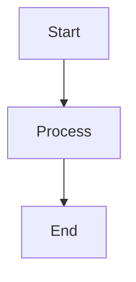
````

#### Nested Notation (Using 4 backticks)
`````markdown
````mermaid

````
`````

#### Diagram Types
| Diagram Type | Purpose | Notation |
|--------------|---------|----------|
| Flowchart | Process diagram | `graph TD` |
| Sequence Diagram | Processing order | `sequenceDiagram` |
| Class Diagram | Class relationships | `classDiagram` |
| ER Diagram | Data relationships | `erDiagram` |
| Gantt Chart | Schedule | `gantt` |

### D. Table Format (Common to All Documents)

#### Basic Table Format
```markdown
| Item | Content | Notes |
|------|---------|-------|
| Item 1 | Content 1 | Note 1 |
| Item 2 | Content 2 | Note 2 |
```

#### Complex Table Format
```markdown
| Item | Required | Type | Description | Example |
|------|:--------:|:----:|-------------|---------|
| name | ○ | string | Name | "John" |
| age | × | number | Age | 25 |
```

### E. Code Blocks (Common to All Documents)

#### TypeScript Example
```typescript
interface User {
  id: string;
  name: string;
  email: string;
}

class UserService {
  async createUser(userData: User): Promise<User> {
    // Implementation
    return userData;
  }
}
```

#### JSON Example
```json
{
  "name": "example-project",
  "version": "1.0.0",
  "dependencies": {
    "typescript": "^4.9.0"
  }
}
```

#### YAML Example
```yaml
name: CI/CD Pipeline
on:
  push:
    branches: [main]
jobs:
  test:
    runs-on: ubuntu-latest
    steps:
      - uses: actions/checkout@v3
      - name: Run tests
        run: npm test
```