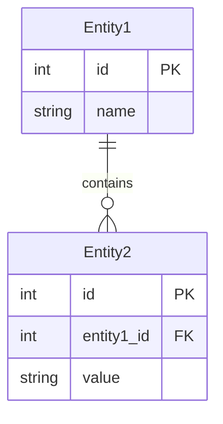

# Requirements Specification

## Metadata
```yaml
purpose: Define comprehensive functional and non-functional requirements
category: Requirements
target_user: Business Analyst, Product Owner
usage_phase: Requirements Definition (Step 1)
related_templates:
  - step1-use-cases-template.md
  - step1-non-functional-template.md
  - step0-goal-statement-template.md
  - quality-gate-1-template.md
```

- **Document ID**: REQ-001
- **Related Documents**: 
  - UC-001 (Use Case List)
  - NFR-001 (Non-Functional Requirements List)
  - GOAL-001 (Goal Statement)
  - QG1-001 (Quality Gate 1 Judgment Results)
- **Creation Date**: YYYY-MM-DD
- **Last Updated**: YYYY-MM-DD
- **Author**: [Business Analyst Name]
- **Approver**: [Product Owner Name]
- **Version**: 1.0
- **Status**: [Draft/Under Review/Approved]

## 1. Functional Requirements

### 1.1 Function List
| Function ID | Function Name | Priority | Related UC | Description |
|-------------|---------------|----------|------------|-------------|
| F-001 | [Function1] | Required | UC-001 | [Description1] |
| F-002 | [Function2] | Important | UC-002 | [Description2] |

### 1.2 Function Details

#### F-001: [Function Name]
**Overview**: [Function overview]
**Input**: [Input data/format]
**Processing**: [Processing details]
**Output**: [Output data/format]
**Exception Handling**: [Exception cases and responses]

**Detailed Specifications**:
- [Specification1]
- [Specification2]
- [Specification3]

**Constraints**:
- [Constraint1]
- [Constraint2]

## 2. Non-Functional Requirements Summary

### 2.1 Performance Requirements
| Item | Requirement |
|------|-------------|
| Response Time | [Requirement1] |
| Throughput | [Requirement2] |

### 2.2 Quality Requirements
| Item | Requirement |
|------|-------------|
| Availability | [Requirement1] |
| Security | [Requirement2] |

## 3. Interface Requirements

### 3.1 User Interface
- [UI Requirement1]
- [UI Requirement2]

### 3.2 System Interface
| IF-ID | Interface Name | Type | Protocol | Data Format |
|-------|----------------|------|----------|-------------|
| IF-001 | [IF Name1] | [Type1] | [Protocol1] | [Format1] |

## 4. Data Requirements

### 4.1 Data Items
| Data ID | Data Name | Type | Required | Description |
|---------|-----------|------|----------|-------------|
| D-001 | [Data1] | [Type1] | ○ | [Description1] |

### 4.2 Data Relationship Diagram

````mermaid

````

## 5. Completion Checklist
- [ ] Functional requirements are comprehensively defined
- [ ] Non-functional requirements are properly integrated
- [ ] Interface requirements are clearly defined
- [ ] Data requirements are described in detail
- [ ] Constraints are clearly documented