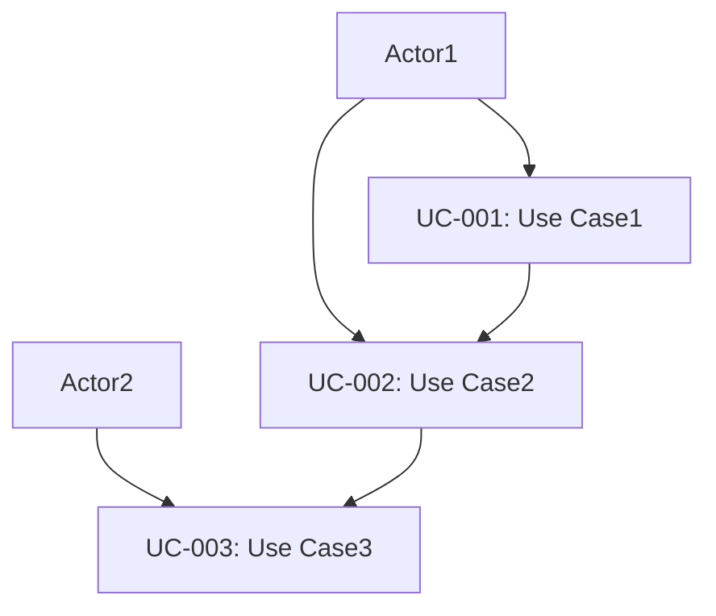

# Use Case List

## Metadata
```yaml
purpose: Define system use cases from the perspective of user interactions
category: Requirements
target_user: Business Analyst, Product Owner
usage_phase: Requirements Definition (Step 1)
related_templates:
  - step0-goal-statement-template.md
  - step0-stakeholders-template.md
  - step1-requirements-specification-template.md
  - step1-non-functional-template.md
```

| Item | Content |
|------|---------|
| Document ID | UC-001 |
| Related Documents | GOAL-001 (Goal Definition)<br>STAKE-001 (Stakeholder Definition)<br>REQ-001 (Functional Requirements)<br>NFR-001 (Non-Functional Requirements) |
| Creation Date | YYYY-MM-DD |
| Last Updated | YYYY-MM-DD |
| Author | [Author Name] |
| Approver | [Approver Name] |
| Version | 1.0 |
| Status | Draft |

## 1. Use Case Overview

### 1.1 Actor Definition
| Actor ID | Actor Name | Description | Permission Level |
|----------|------------|-------------|------------------|
| AC-001 | [Actor1] | [Description1] | [Permission1] |
| AC-002 | [Actor2] | [Description2] | [Permission2] |

### 1.2 Use Case List
| UC-ID | Use Case Name | Actor | Priority | Complexity |
|-------|---------------|-------|----------|------------|
| UC-001 | [Use Case1] | AC-001 | High | Medium |
| UC-002 | [Use Case2] | AC-002 | Medium | Low |

## 2. Use Case Details

### UC-001: [Use Case Name]
**Overview**: [Use case overview]
**Actor**: [Primary actor]
**Goal**: [Goal to achieve]
**Frequency**: [Execution frequency]

#### Preconditions
- [Precondition1]
- [Precondition2]

#### Main Scenario
1. [Step1]
2. [Step2]
3. [Step3]

#### Alternative Scenarios
**A1: [Exception Case1]**
- 1a. [Exception handling1]
- 1b. [Exception handling2]

#### Postconditions
- [Postcondition1]
- [Postcondition2]

#### Non-Functional Requirements
- **Performance**: [Performance requirement]
- **Security**: [Security requirement]
- **Availability**: [Availability requirement]

## 3. Use Case Relationship Diagram

````mermaid

````

## 4. Completion Checklist
- [ ] All actors are identified
- [ ] Use cases are comprehensively defined
- [ ] Main scenarios are described in detail
- [ ] Alternative scenarios are properly defined
- [ ] Pre and postconditions are clear