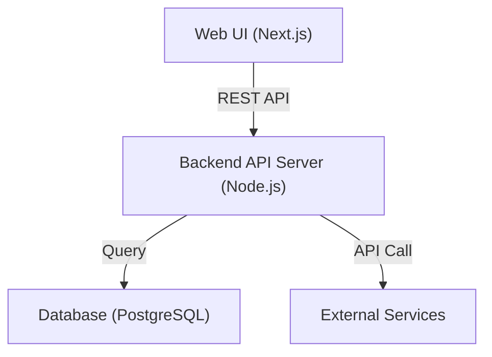
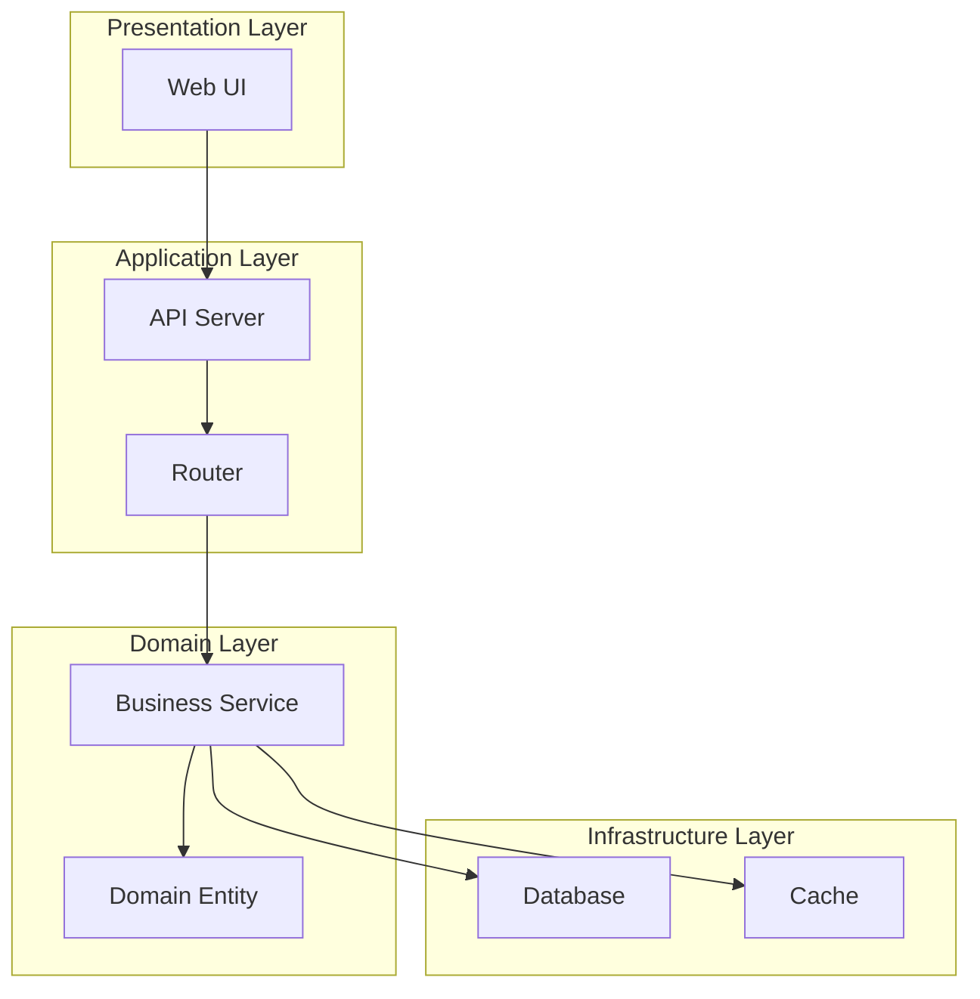

# System Architecture Diagram

## Metadata
- **Purpose**: Define system architecture and component relationships
- **Category**: System Design
- **Target User**: System Architect, Development Team
- **Usage Phase**: Step 2 - System Design
- **Related Templates**: 
  - step1-requirements-specification-template.md
  - step2-tech-stack-template.md
  - step3-class-design-template.md

| Item | Content |
|------|---------|
| Document ID | ARCH-001 |
| Related Documents | REQ-001 (Functional Requirements)<br>NFR-001 (Non-Functional Requirements)<br>UC-001 (Use Case List)<br>TECH-001 (Technology Stack Selection) |
| Created Date | YYYY-MM-DD |
| Last Updated | YYYY-MM-DD |
| Author | [Author Name] |
| Approver | [Approver Name] |
| Version | 1.0 |
| Status | Draft |

## 1. Overall System Architecture

````mermaid

````

## 2. Layer Configuration

| Layer | Content | Technology | Responsibility |
|-------|---------|------------|----------------|
| Presentation Layer | [Content1] | [Technology1] | [Responsibility1] |
| Application Layer | [Content2] | [Technology2] | [Responsibility2] |
| Domain Layer | [Content3] | [Technology3] | [Responsibility3] |
| Infrastructure Layer | [Content4] | [Technology4] | [Responsibility4] |

## 3. Component Architecture Diagram

````mermaid

````

## 4. Design Principles

### 4.1 Architecture Principles
- [Principle1]: [Description1]
- [Principle2]: [Description2]
- [Principle3]: [Description3]

### 4.2 Design Patterns
| Pattern Name | Applied Location | Purpose |
|--------------|------------------|---------|
| [Pattern1] | [Location1] | [Purpose1] |
| [Pattern2] | [Location2] | [Purpose2] |

## 5. Completion Checklist
- [ ] Overall system view is clearly expressed
- [ ] Layer configuration is properly defined
- [ ] Component relationships are clear
- [ ] Design principles are documented