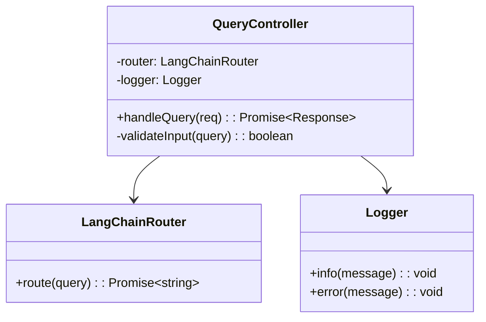

# Class Design Table

## Metadata
- **Purpose**: Define detailed class structure and relationships for implementation
- **Category**: Detailed Design
- **Target User**: Software Architect, Development Team
- **Usage Phase**: Step 3 - Detailed Design
- **Related Templates**: 
  - step2-system-architecture-template.md
  - step3-interfaces-template.md
  - step4-test-targets-template.md

- **Document ID**: CLASS-001
- **Related Documents**: 
  - ARCH-001 (System Architecture Diagram)
  - TECH-001 (Technology Stack and Dependencies)
  - LAYER-001 (Layer Configuration Map)
  - QG3-001 (Quality Gate 3 Assessment Results)
- **Created Date**: YYYY-MM-DD
- **Last Updated**: YYYY-MM-DD
- **Author**: [Software Architect Name]
- **Approver**: [Technical Lead Name]
- **Version**: 1.0
- **Status**: [Draft/Under Review/Approved]

## 1. Class List

| Class ID | Class Name | Layer | Responsibility | Dependencies |
|----------|------------|-------|----------------|--------------|
| CL-001 | QueryController | Presentation | [Responsibility 1] | [Dependency 1] |
| CL-002 | UserService | Application | [Responsibility 2] | [Dependency 2] |

## 2. Detailed Class Design

### CL-001: QueryController

#### Basic Information
- **Package**: controllers
- **File**: queryController.ts
- **Responsibility**: Receive HTTP requests and return responses
- **Design Principles**: Single Responsibility Principle, Dependency Inversion Principle

#### Attributes
| Attribute Name | Type | Visibility | Initial Value | Description |
|----------------|------|------------|---------------|-------------|
| router | LangChainRouter | private | - | [Description 1] |
| logger | Logger | private | - | [Description 2] |

#### Methods
| Method Name | Visibility | Parameters | Return Type | Description |
|-------------|------------|------------|-------------|-------------|
| handleQuery | public | req: Request | Promise<Response> | [Description 1] |
| validateInput | private | query: string | boolean | [Description 2] |

#### Dependency Diagram

````mermaid

````

#### Exception Handling
| Exception | Occurrence Condition | Handling Method |
|-----------|---------------------|-----------------|
| ValidationError | [Condition 1] | [Handling 1] |
| SystemError | [Condition 2] | [Handling 2] |

## 3. Completion Checklist
- [ ] All classes follow the Single Responsibility Principle
- [ ] Dependencies are clearly defined
- [ ] Interfaces are properly designed
- [ ] Exception handling is considered