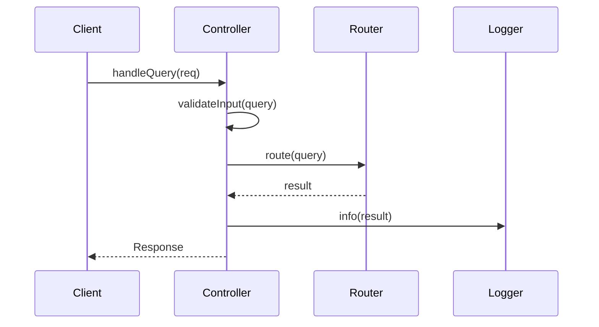

# Method Interface List

## Metadata
- **Purpose**: Define detailed method interfaces and API contracts
- **Category**: Detailed Design
- **Target User**: Software Architect, Development Team
- **Usage Phase**: Step 3 - Detailed Design
- **Related Templates**: 
  - step3-class-design-template.md
  - step2-system-architecture-template.md
  - step4-test-cases-template.md

| Item | Content |
|------|---------|
| Document ID | [STEP3-IF-001] |
| Version | [v1.0] |
| Created Date | [YYYY-MM-DD] |
| Last Updated | [YYYY-MM-DD] |
| Status | [Draft/Under Review/Approved/Deprecated] |
| Author | [Author Name] |
| Approver | [Approver Name (if Status is Approved)] |
| Tags | #step3-detailed-design #interfaces #api-design |
| Related Documents | [[CLASS-001](./step3-class-design-template.md)] [[ARCH-001](./step2-system-architecture-template.md)] |
| Change History | [v1.0] YYYY-MM-DD: Initial version created<br>[v1.1] YYYY-MM-DD: Added interfaces (IF-003, IF-004) |

## 1. Interface List

| IF-ID | Class Name | Method Name | Type | Priority |
|-------|------------|-------------|------|----------|
| IF-001 | QueryController | handleQuery | public | High |
| IF-002 | LangChainRouter | route | public | High |

## 2. Interface Details

### IF-001: QueryController.handleQuery

#### Basic Information
- **Purpose**: Receive user query and return processing results
- **Caller**: Express Router
- **Callee**: LangChainRouter.route

#### Signature
```typescript
async handleQuery(req: Request): Promise<Response>
```

#### Parameters
| Parameter Name | Type | Required | Description | Constraints |
|----------------|------|----------|-------------|-------------|
| req | Request | ○ | HTTP request object | [Constraint 1] |

#### Return Value
| Type | Description | Example |
|------|-------------|---------|
| Promise<Response> | HTTP response object | [Example 1] |

#### Exceptions
| Exception Name | Occurrence Condition | Handling Method |
|----------------|---------------------|-----------------|
| ValidationError | [Condition 1] | [Handling 1] |
| SystemError | [Condition 2] | [Handling 2] |

#### Processing Flow
````mermaid

````

#### Implementation Example
```typescript
async handleQuery(req: Request): Promise<Response> {
    try {
        const query = req.body.query;
        
        if (!this.validateInput(query)) {
            throw new ValidationError('Invalid query format');
        }
        
        const result = await this.router.route(query);
        this.logger.info(`Query processed: ${query}`);
        
        return {
            status: 200,
            data: result
        };
    } catch (error) {
        this.logger.error(`Query processing failed: ${error.message}`);
        throw error;
    }
}
```

## 3. Completion Checklist
- [ ] All method signatures are defined
- [ ] Parameters and return values are described in detail
- [ ] Exception handling is properly defined
- [ ] Processing flows are illustrated
- [ ] Implementation examples are provided