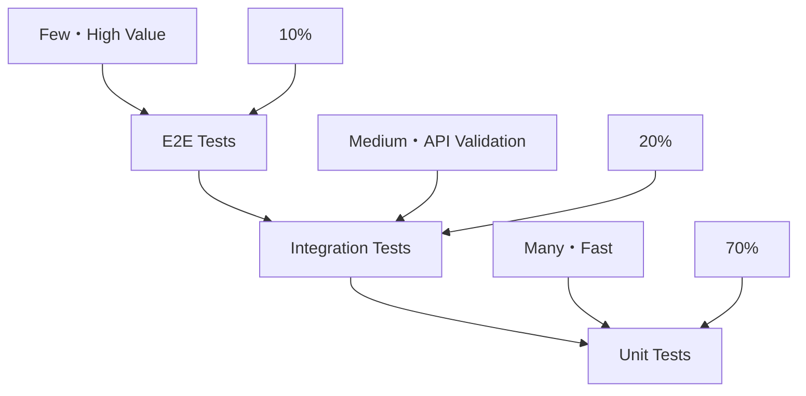

# Test Strategy Document

## Metadata
- **Purpose**: Define comprehensive test strategy and quality criteria
- **Category**: Test Design
- **Target User**: Test Manager, QA Lead, Development Team
- **Usage Phase**: Step 4 - Test Design
- **Related Templates**: 
  - step1-requirements-specification-template.md
  - step4-test-targets-template.md
  - step4-test-cases-template.md

| Item | Content |
|------|---------|
| Document ID | [STEP4-STRATEGY-001] |
| Version | [v1.0] |
| Created Date | [YYYY-MM-DD] |
| Last Updated | [YYYY-MM-DD] |
| Status | [Draft/Under Review/Approved/Deprecated] |
| Author | [Author Name] |
| Approver | [Approver Name (if Status is Approved)] |
| Tags | #step4-test-design #test-strategy #quality-assurance |
| Related Documents | [[REQ-001](./step1-requirements-specification-template.md)] [[CLASS-001](./step3-class-design-template.md)] |
| Change History | [v1.0] YYYY-MM-DD: Initial version created<br>[v1.1] YYYY-MM-DD: Updated quality criteria (revised coverage targets) |

## 1. Test Policy

### 1.1 Test Objectives
- [Objective 1]: [Description 1]
- [Objective 2]: [Description 2]
- [Objective 3]: [Description 3]

### 1.2 Test Scope
| Target | Included | Excluded | Reason |
|--------|----------|----------|--------|
| [Target 1] | [Included Item 1] | [Excluded Item 1] | [Reason 1] |
| [Target 2] | [Included Item 2] | [Excluded Item 2] | [Reason 2] |

## 2. Test Levels

### 2.1 Test Pyramid
````mermaid

````

### 2.2 Test Level Details
| Level | Purpose | Target | Execution Frequency | Automation Rate |
|-------|---------|--------|---------------------|-----------------|
| Unit Test | [Purpose 1] | [Target 1] | [Frequency 1] | 100% |
| Integration Test | [Purpose 2] | [Target 2] | [Frequency 2] | 90% |
| E2E Test | [Purpose 3] | [Target 3] | [Frequency 3] | 80% |

## 3. Quality Criteria

### 3.1 Coverage Targets
| Test Level | Coverage Type | Target | Minimum |
|------------|---------------|--------|---------|
| Unit Test | Line | 95% | 90% |
| Unit Test | Branch | 90% | 85% |
| Integration Test | API | 100% | 95% |

### 3.2 Quality Gates
| Item | Criteria | Measurement Method |
|------|----------|-------------------|
| Test Success Rate | 100% | Automated test execution |
| Coverage | 90% or higher | Jest Coverage |
| Performance | Response time < 200ms | Load testing |

## 4. Test Environment

### 4.1 Environment Configuration
| Environment Name | Purpose | Data | Update Frequency |
|-----------------|---------|------|------------------|
| Development | Developer testing | Mock data | As needed |
| Test | Automated testing | Test data | Daily |
| Staging | Acceptance testing | Production-like data | Weekly |

### 4.2 Test Data Management
| Data Type | Creation Method | Update Method | Protection Level |
|-----------|-----------------|---------------|------------------|
| [Data 1] | [Method 1] | [Update 1] | [Level 1] |

## 5. Completion Checklist
- [ ] Test policy is clearly defined
- [ ] Test levels are properly designed
- [ ] Quality criteria are quantitatively set
- [ ] Test environment is appropriately planned