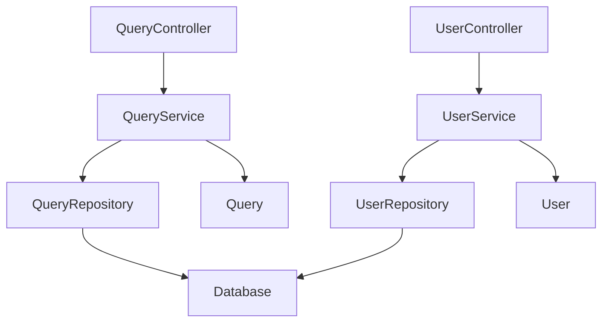

# Implementation Components List

## Metadata
| Item | Content |
|------|---------|
| Document ID | COMP-001 |
| Version | 1.0 |
| Created Date | YYYY-MM-DD |
| Last Updated | YYYY-MM-DD |
| Status | Draft/Under Review/Approved |
| Author | [Author Name] |
| Reviewer | [Reviewer Name] |
| Approver | [Approver Name] |
| Related Documents | CLASS-001 (Class Design Document), TARGET-001 (Test Target Definition) |
| Change History | 1.0: Initial creation (YYYY-MM-DD) |

## 1. Component Classification

### 1.1 Components by Layer
| Layer | Component Count | Implementation Priority | Dependencies |
|-------|-----------------|------------------------|--------------|
| Presentation | 5 | High | Application |
| Application | 8 | High | Domain |
| Domain | 6 | Medium | None |
| Infrastructure | 4 | Medium | Domain |

### 1.2 Component Details
| Component ID | Name | Layer | File | Priority | Estimated Time |
|-------------|------|-------|------|----------|----------------|
| COMP-001 | QueryController | Presentation | QueryController.ts | High | 4h |
| COMP-002 | UserService | Application | UserService.ts | High | 6h |
| COMP-003 | User | Domain | User.ts | Medium | 3h |

## 2. Dependency Map

````mermaid

````

## 3. Implementation Order

### 3.1 Phase 1: Foundation Components
| Order | Component | Reason | Duration |
|-------|-----------|--------|----------|
| 1 | Domain Entities | No other dependencies | 1 week |
| 2 | Repository Interfaces | Domain layer completion | 3 days |

### 3.2 Phase 2: Application Layer
| Order | Component | Reason | Duration |
|-------|-----------|--------|----------|
| 3 | Application Services | Business logic implementation | 1 week |
| 4 | Repository Implementations | Data access implementation | 5 days |

### 3.3 Phase 3: Presentation Layer
| Order | Component | Reason | Duration |
|-------|-----------|--------|----------|
| 5 | Controllers | API implementation | 1 week |
| 6 | DTOs | Data transfer objects | 3 days |

## 4. Completion Checklist
- [ ] All components have been identified
- [ ] Dependencies are clearly defined
- [ ] Implementation order is logical
- [ ] Time estimates are realistic