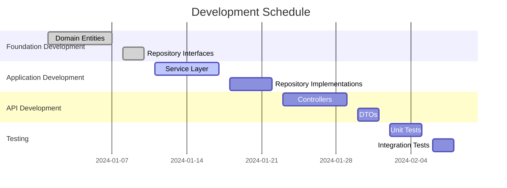

# Development Schedule

## Metadata
| Item | Content |
|------|---------|
| Document ID | SCHED-001 |
| Version | 1.0 |
| Created Date | YYYY-MM-DD |
| Last Updated | YYYY-MM-DD |
| Status | Draft/Under Review/Approved |
| Author | [Author Name] |
| Reviewer | [Reviewer Name] |
| Approver | [Approver Name] |
| Related Documents | COMP-001 (Implementation Components List) |
| Change History | 1.0: Initial creation (YYYY-MM-DD) |

## 1. Project Overview

### 1.1 Duration and Effort
| Item | Content |
|------|---------|
| Start Date | YYYY-MM-DD |
| End Date | YYYY-MM-DD |
| Total Effort | XXX person-days |
| Number of Participants | X people |

### 1.2 Milestones
| Milestone | Date | Deliverable | Completion Criteria |
|-----------|------|-------------|-------------------|
| M1: Foundation Complete | YYYY-MM-DD | Domain layer | [Criteria 1] |
| M2: Features Complete | YYYY-MM-DD | Application layer | [Criteria 2] |
| M3: API Complete | YYYY-MM-DD | Presentation layer | [Criteria 3] |

## 2. Detailed Schedule

### 2.1 Gantt Chart

````mermaid

````

### 2.2 Weekly Plan
| Week | Period | Main Tasks | Deliverables | Assignee |
|------|--------|------------|--------------|----------|
| W1 | MM/DD-MM/DD | [Task 1] | [Deliverable 1] | [Assignee 1] |
| W2 | MM/DD-MM/DD | [Task 2] | [Deliverable 2] | [Assignee 2] |

## 3. Risk Management

### 3.1 Risk List
| Risk ID | Risk Description | Impact | Probability | Mitigation |
|---------|-----------------|--------|-------------|------------|
| R-001 | [Risk 1] | High | Medium | [Mitigation 1] |
| R-002 | [Risk 2] | Medium | High | [Mitigation 2] |

### 3.2 Buffer Plan
| Item | Buffer | Reason |
|------|--------|--------|
| Technical Research | 20% | New technology learning |
| Testing | 30% | Quality assurance |

## 4. Completion Checklist
- [ ] Schedule is realistic
- [ ] Milestones are clearly defined
- [ ] Risks are properly managed
- [ ] Buffers are appropriately set