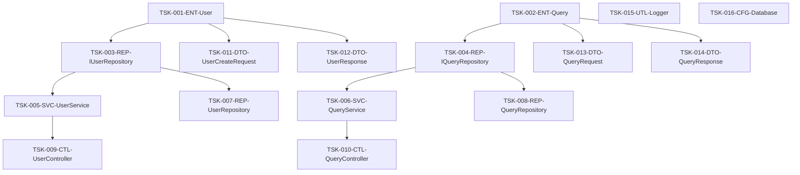

# File-Unit Task List

## Metadata
| Item | Content |
|------|---------|
| Document ID | TASK-001 |
| Version | 1.0 |
| Created Date | YYYY-MM-DD |
| Last Updated | YYYY-MM-DD |
| Status | Draft/Under Review/Approved |
| Author | [Author Name] |
| Reviewer | [Reviewer Name] |
| Approver | [Approver Name] |
| Related Documents | COMP-001 (Implementation Components List), DIR-001 (Directory Structure Map), CLASS-001 (Class Design Table) |
| Change History | 1.0: Initial creation (YYYY-MM-DD) |

## Overview

This document is a task list summarizing the results of identifying implementation target files and assigning task IDs, created in STEP 2 of the STEP 6 creation procedure.

**Purpose**:
- Complete understanding of implementation target files
- Unique identification through task IDs
- Clarification of dependencies
- Setting of estimated time

## Reference Documents
- `docs/implementation/directory-structure.md` - Directory Structure Map
- `docs/implementation/components.md` - Implementation Components List
- `docs/detailed-design/classes.md` - Class Design Table
- `docs/detailed-design/interfaces.md` - Method I/F List

---

## Task List

### Basic Information
- **Total Tasks**: [X] tasks
- **Total Estimated Time**: [X] hours
- **Implementation Period**: [Start Date] - [End Date]

### Task List

| Task ID | File Name | Layer | Priority | Dependency Tasks | Estimated Time | Complexity | Notes |
|---------|-----------|-------|----------|-----------------|----------------|------------|-------|
| TSK-001-ENT-User | User.ts | Domain | High | None | 4h | High | Core entity |
| TSK-002-ENT-Query | Query.ts | Domain | High | None | 3h | Medium | Search query |
| TSK-003-REP-IUserRepository | IUserRepository.ts | Domain | High | TSK-001 | 2h | Low | Interface |
| TSK-004-REP-IQueryRepository | IQueryRepository.ts | Domain | High | TSK-002 | 2h | Low | Interface |
| TSK-005-SVC-UserService | UserService.ts | Application | High | TSK-003 | 6h | High | Business logic |
| TSK-006-SVC-QueryService | QueryService.ts | Application | High | TSK-004 | 5h | High | Search processing |
| TSK-007-REP-UserRepository | UserRepository.ts | Infrastructure | Medium | TSK-003 | 5h | Medium | Data access |
| TSK-008-REP-QueryRepository | QueryRepository.ts | Infrastructure | Medium | TSK-004 | 4h | Medium | Search data access |
| TSK-009-CTL-UserController | UserController.ts | Presentation | High | TSK-005 | 4h | Medium | REST API |
| TSK-010-CTL-QueryController | QueryController.ts | Presentation | High | TSK-006 | 4h | Medium | Search API |
| TSK-011-DTO-UserCreateRequest | UserCreateRequest.ts | Presentation | Medium | TSK-001 | 2h | Low | Request DTO |
| TSK-012-DTO-UserResponse | UserResponse.ts | Presentation | Medium | TSK-001 | 2h | Low | Response DTO |
| TSK-013-DTO-QueryRequest | QueryRequest.ts | Presentation | Medium | TSK-002 | 2h | Low | Search request |
| TSK-014-DTO-QueryResponse | QueryResponse.ts | Presentation | Medium | TSK-002 | 2h | Low | Search response |
| TSK-015-UTL-Logger | Logger.ts | Infrastructure | Low | None | 3h | Low | Logging feature |
| TSK-016-CFG-Database | Database.ts | Infrastructure | Medium | None | 4h | Medium | DB configuration |

---

## Summary by Layer

### Domain Layer
| Layer | Task Count | Estimated Time | Average Complexity |
|-------|------------|----------------|-------------------|
| Entity | 2 | 7h | Medium-High |
| Repository Interface | 2 | 4h | Low |
| **Subtotal** | **4** | **11h** | **Medium** |

### Application Layer
| Layer | Task Count | Estimated Time | Average Complexity |
|-------|------------|----------------|-------------------|
| Service | 2 | 11h | High |
| **Subtotal** | **2** | **11h** | **High** |

### Infrastructure Layer
| Layer | Task Count | Estimated Time | Average Complexity |
|-------|------------|----------------|-------------------|
| Repository Implementation | 2 | 9h | Medium |
| Utility | 1 | 3h | Low |
| Configuration | 1 | 4h | Medium |
| **Subtotal** | **4** | **16h** | **Medium** |

### Presentation Layer
| Layer | Task Count | Estimated Time | Average Complexity |
|-------|------------|----------------|-------------------|
| Controller | 2 | 8h | Medium |
| DTO | 4 | 8h | Low |
| **Subtotal** | **6** | **16h** | **Low-Medium** |

### Overall Summary
- **Total Tasks**: 16
- **Total Estimated Time**: 54 hours
- **Average Task Time**: 3.4 hours

---

## Dependency Map

### Implementation Order (by Dependencies)

#### Phase 1: Foundation Layer (No Dependencies)
```
TSK-001-ENT-User (4h)
TSK-002-ENT-Query (3h)
TSK-015-UTL-Logger (3h)
TSK-016-CFG-Database (4h)
```
**Phase 1 Total**: 14 hours

#### Phase 2: Interface Layer
```
TSK-003-REP-IUserRepository (2h) ← TSK-001
TSK-004-REP-IQueryRepository (2h) ← TSK-002
```
**Phase 2 Total**: 4 hours

#### Phase 3: Service & Repository Implementation
```
TSK-005-SVC-UserService (6h) ← TSK-003
TSK-006-SVC-QueryService (5h) ← TSK-004
TSK-007-REP-UserRepository (5h) ← TSK-003
TSK-008-REP-QueryRepository (4h) ← TSK-004
```
**Phase 3 Total**: 20 hours

#### Phase 4: Presentation Layer
```
TSK-009-CTL-UserController (4h) ← TSK-005
TSK-010-CTL-QueryController (4h) ← TSK-006
TSK-011-DTO-UserCreateRequest (2h) ← TSK-001
TSK-012-DTO-UserResponse (2h) ← TSK-001
TSK-013-DTO-QueryRequest (2h) ← TSK-002
TSK-014-DTO-QueryResponse (2h) ← TSK-002
```
**Phase 4 Total**: 16 hours

### Dependency Diagram



---

## Classification by Priority

### High Priority (Critical Path)
| Task ID | File Name | Reason |
|---------|-----------|--------|
| TSK-001-ENT-User | User.ts | Core entity, many tasks depend on it |
| TSK-002-ENT-Query | Query.ts | Foundation of search functionality |
| TSK-003-REP-IUserRepository | IUserRepository.ts | Prerequisite for service layer |
| TSK-004-REP-IQueryRepository | IQueryRepository.ts | Prerequisite for search service |
| TSK-005-SVC-UserService | UserService.ts | Core of business logic |
| TSK-006-SVC-QueryService | QueryService.ts | Core of search functionality |
| TSK-009-CTL-UserController | UserController.ts | Provides user API |
| TSK-010-CTL-QueryController | QueryController.ts | Provides search API |

### Medium Priority
| Task ID | File Name | Reason |
|---------|-----------|--------|
| TSK-007-REP-UserRepository | UserRepository.ts | Data persistence |
| TSK-008-REP-QueryRepository | QueryRepository.ts | Search data access |
| TSK-011-DTO-UserCreateRequest | UserCreateRequest.ts | API specification |
| TSK-012-DTO-UserResponse | UserResponse.ts | API specification |
| TSK-013-DTO-QueryRequest | QueryRequest.ts | Search API specification |
| TSK-014-DTO-QueryResponse | QueryResponse.ts | Search API specification |
| TSK-016-CFG-Database | Database.ts | Infrastructure configuration |

### Low Priority
| Task ID | File Name | Reason |
|---------|-----------|--------|
| TSK-015-UTL-Logger | Logger.ts | Supporting feature |

---

## Complexity Analysis

### High Complexity (Detailed Subtask Expansion Recommended)
| Task ID | File Name | Complexity Factors |
|---------|-----------|-------------------|
| TSK-001-ENT-User | User.ts | Business rules, validation |
| TSK-005-SVC-UserService | UserService.ts | Multiple methods, business logic |
| TSK-006-SVC-QueryService | QueryService.ts | Search algorithms, performance |

### Medium Complexity (Standard Subtasks)
| Task ID | File Name | Complexity Factors |
|---------|-----------|-------------------|
| TSK-002-ENT-Query | Query.ts | Search condition combinations |
| TSK-007-REP-UserRepository | UserRepository.ts | Data access processing |
| TSK-008-REP-QueryRepository | QueryRepository.ts | Complex queries |
| TSK-009-CTL-UserController | UserController.ts | REST API, error handling |
| TSK-010-CTL-QueryController | QueryController.ts | Search parameter processing |
| TSK-016-CFG-Database | Database.ts | Configuration management |

### Low Complexity (Simplified Subtasks)
| Task ID | File Name | Complexity Factors |
|---------|-----------|-------------------|
| TSK-003-REP-IUserRepository | IUserRepository.ts | Interface definition only |
| TSK-004-REP-IQueryRepository | IQueryRepository.ts | Interface definition only |
| TSK-011-DTO-UserCreateRequest | UserCreateRequest.ts | Simple data structure |
| TSK-012-DTO-UserResponse | UserResponse.ts | Simple data structure |
| TSK-013-DTO-QueryRequest | QueryRequest.ts | Simple data structure |
| TSK-014-DTO-QueryResponse | QueryResponse.ts | Simple data structure |
| TSK-015-UTL-Logger | Logger.ts | Generic utility |

---

## Risk Analysis

### High Risk Tasks
| Task ID | Risk Factors | Mitigation |
|---------|--------------|------------|
| TSK-005-SVC-UserService | Complex business logic, specification change possibility | Strengthen detailed design review |
| TSK-006-SVC-QueryService | Performance requirements, algorithm selection | Create prototype |

### Medium Risk Tasks
| Task ID | Risk Factors | Mitigation |
|---------|--------------|------------|
| TSK-007-REP-UserRepository | Database design dependency | Wait for DB design finalization |
| TSK-008-REP-QueryRepository | Search performance requirements | Confirm index design |

---

## Supplementary Information for Estimation Accuracy

### Estimation Basis
- **Entity (High Complexity)**: 4 hours (Design 1h + Implementation 2h + Testing 1h)
- **Entity (Medium Complexity)**: 3 hours (Design 0.5h + Implementation 1.5h + Testing 1h)
- **Service (High Complexity)**: 6 hours (Design 1.5h + Implementation 3h + Testing 1.5h)
- **Repository Interface**: 2 hours (Design 0.5h + Implementation 1h + Testing 0.5h)
- **Repository Implementation**: 4-5 hours (Design 1h + Implementation 2-3h + Testing 1h)
- **Controller**: 4 hours (Design 1h + Implementation 2h + Testing 1h)
- **DTO**: 2 hours (Design 0.5h + Implementation 1h + Testing 0.5h)

### Prerequisites
- Developer skill level: Intermediate
- Technology proficiency: Medium
- Design document completeness: 80%
- External dependency stability: High

---

## Next Steps

### Items to Hand Over to STEP 3
1. **Category Division Policy Decision**
   - Project scale: [Small/Medium/Large]
   - Selected management unit: [Layer/Function Module/Phase]

2. **Subtask Expansion Level Decision**
   - High complexity tasks: Detailed expansion
   - Medium complexity tasks: Standard expansion
   - Low complexity tasks: Simplified expansion

3. **ToDo List Creation Preparation**
   - Template selection: `docs/templates/step6-todo-list-updated-template.md`
   - Progress management method finalization

## Completion Checklist
- [ ] All implementation files are defined as tasks
- [ ] Task IDs follow naming conventions
- [ ] Dependencies are correctly set
- [ ] Estimated times are set
- [ ] Priorities are set
- [ ] Complexity is evaluated
- [ ] Risk analysis is complete
- [ ] Information for next step handover is organized