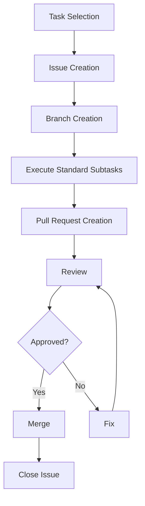

# Task Management Table

## Metadata
| Item | Content |
|------|---------|
| Document ID | MGMT-001 |
| Version | 1.0 |
| Created Date | YYYY-MM-DD |
| Last Updated | YYYY-MM-DD |
| Status | Draft/Under Review/Approved |
| Author | [Author Name] |
| Reviewer | [Reviewer Name] |
| Approver | [Approver Name] |
| Related Documents | TASK-001 (File-Unit Task List) |
| Change History | 1.0: Initial creation (YYYY-MM-DD) |

## 1. Task Management Policy

### 1.1 Management Principles
- Practice issue-driven development
- 1 Task = 1 Issue = 1 Pull Request
- Mandatory execution of standard subtasks
- Automatic quality gate checks

### 1.2 Workflow



## 2. Issue Management

### 2.1 Issue Creation Template
```markdown
## Overview
[Describe the task overview]

## Implementation Target
- File: [File path]
- Class/Function: [Implementation target]

## Implementation Specification
### Method List
- method1(): [Function description]
- method2(): [Function description]

### Dependencies
- Referenced classes: [Class list]
- Provided interfaces: [Interface list]

## Test Requirements
- [ ] Normal case tests
- [ ] Error case tests
- [ ] Boundary value tests

## Completion Criteria
- [ ] Implementation complete
- [ ] Unit test coverage ≥90%
- [ ] Coding standards compliance
- [ ] Review complete

## Related Information
- Design document: [Link]
- Dependent tasks: [Task ID]
```

### 2.2 Label Management
| Label | Usage | Color |
|-------|-------|-------|
| feature | New feature implementation | Green |
| bug | Bug fix | Red |
| enhancement | Improvement | Blue |
| documentation | Documentation | Yellow |
| layer:presentation | Presentation layer | Purple |
| layer:application | Application layer | Orange |
| layer:domain | Domain layer | Brown |
| layer:infrastructure | Infrastructure layer | Gray |
| priority:high | High priority | Red |
| priority:medium | Medium priority | Yellow |
| priority:low | Low priority | Green |

## 3. Standard Subtask Management

### 3.1 Subtask Checklist
The following 7 subtasks are mandatory for each task:

#### 1. Specification Confirmation
- [ ] Understanding of design documents
- [ ] Confirmation of dependencies
- [ ] Confirmation of interface specifications
- [ ] Understanding of exception handling policy

#### 2. Coding
- [ ] Implementation of classes and methods
- [ ] Compliance with coding standards
- [ ] Implementation of error handling
- [ ] Implementation of logging

#### 3. Test Coding
- [ ] Implementation of unit tests
- [ ] Creation of mocks and stubs
- [ ] Preparation of test data
- [ ] Implementation of boundary value tests

#### 4. Unit Test Execution
- [ ] Execution of all test cases
- [ ] Confirmation of coverage ≥90%
- [ ] Recording of test results
- [ ] Fixing of failed cases

#### 5. Repository Commit
- [ ] Appropriate commit message
- [ ] Linking with related issues
- [ ] Resolution of conflicts
- [ ] Execution of push

#### 6. ToDo Check
- [ ] Confirmation of all subtask completion
- [ ] Confirmation of quality standards achievement
- [ ] Update of documentation
- [ ] Confirmation of impact on next task

#### 7. Issue Close
- [ ] Achievement of all completion criteria
- [ ] Reflection of review results
- [ ] Update of related documentation
- [ ] Report to stakeholders

### 3.2 Quality Checkpoints
| Check Item | Criteria | Automated |
|------------|----------|-----------|
| Coding Standards | ESLint 0 errors | ○ |
| Test Coverage | ≥90% | ○ |
| Static Analysis | SonarQube A grade | ○ |
| Security | 0 vulnerabilities | ○ |
| Build | Success | ○ |

## 4. Completion Checklist
- [ ] Issue management process is defined
- [ ] Standard subtasks are clearly defined
- [ ] Quality checkpoints are set
- [ ] Workflow is clear