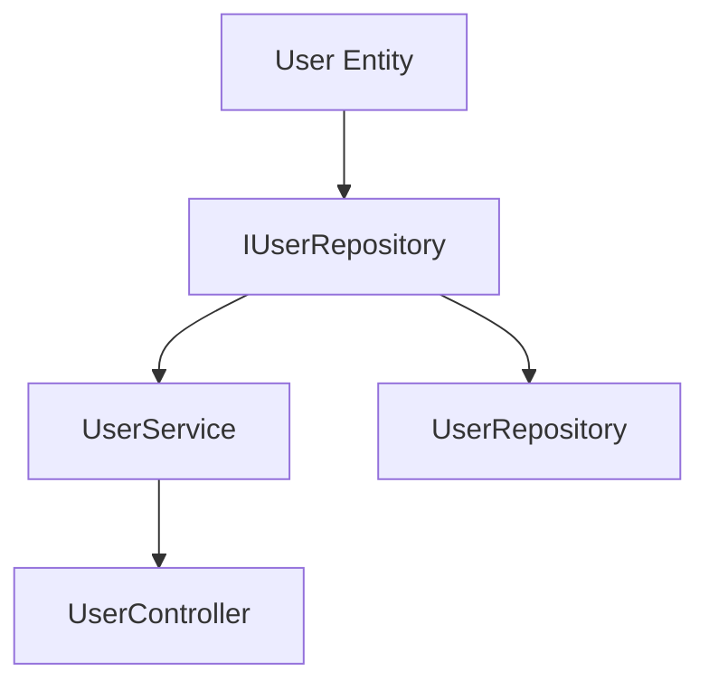

# STEP 6: ToDo List Creation Guide

## Metadata
| Item | Content |
|------|---------|
| Document ID | GUIDE-006 |
| Related Documents | TODO-001, COMP-001, DIR-001 |
| Created Date | YYYY-MM-DD |
| Last Updated | YYYY-MM-DD |

## Overview

This guide provides specific procedures for creating a hierarchical checkbox-format ToDo list suitable for academic publication in STEP 6 "ToDo List Creation".

**Important**: This ToDo list is the core part of the process engineering methodology, implementing file-unit task management and quality assurance through 7 standard subtasks.

## Prerequisites

### Required Deliverables (STEP 5 Completed)
- [ ] Directory structure map (`docs/implementation/directory-structure.md`)
- [ ] Implementation components list (`docs/implementation/components.md`)
- [ ] Class design table (`docs/detailed-design/classes.md`)
- [ ] Method I/F list (`docs/detailed-design/interfaces.md`)

### Reference Documents
- `docs/templates/step6-todo-list-template.md` - Template
- `docs/templates/cline-process-engineering-rules.md` - Implementation rules

## Creation Procedure

### STEP 1: Identify Implementation Target Files

#### 1.1 Confirm Directory Structure
```bash
# Confirm implementation targets from directory structure map
cat docs/implementation/directory-structure.md
```

#### 1.2 Create Implementation File List
Identify implementation files in the following order:

1. **Domain Layer** (`src/domain/`)
   - Entity files (*.ts)
   - Repository interface files (*.ts)

2. **Application Layer** (`src/application/`)
   - Service files (*.ts)
   - Use case files (*.ts)

3. **Infrastructure Layer** (`src/infrastructure/`)
   - Repository implementation files (*.ts)
   - External API integration files (*.ts)

4. **Presentation Layer** (`src/presentation/`)
   - Controller files (*.ts)
   - DTO files (*.ts)

#### 1.3 Organize Dependencies
```markdown
## Dependency Map Example
Entity → Repository Interface → Service → Controller
Entity → Repository Implementation (Infrastructure)
```

### STEP 2: Assign Task IDs and Create Task List

#### 2.1 Apply Naming Convention
**Format**: `TSK-{3-digit sequence}-{Layer}-{FileName}`

#### 2.2 Use Layer Abbreviations
| Abbreviation | Meaning | Example |
|--------------|---------|---------|
| ENT | Entity | TSK-001-ENT-User |
| SVC | Service | TSK-002-SVC-UserService |
| REP | Repository | TSK-003-REP-UserRepository |
| CTL | Controller | TSK-004-CTL-UserController |
| DTO | Data Transfer Object | TSK-005-DTO-UserRequest |
| UTL | Utility | TSK-006-UTL-Logger |

#### 2.3 Determine Implementation Order
Determine implementation order based on dependencies:
```
1. ENT (Entity) - No dependencies
2. REP Interface - Depends on ENT
3. SVC (Service) - Depends on ENT, REP Interface
4. REP Implementation - Depends on ENT, REP Interface
5. CTL (Controller) - Depends on SVC, DTO
6. DTO - Depends on ENT
```

#### 2.4 Create Task List Document
**Deliverable**: `docs/tasks/task-list.md`

Create a tabular task list based on STEP 1-2 results:

```markdown
# File-Unit Task List

## Task List

| Task ID | File Name | Layer | Priority | Dependent Tasks | Estimated Time |
|---------|-----------|-------|----------|-----------------|----------------|
| TSK-001-ENT-User | User.ts | Domain | High | None | 4h |
| TSK-002-REP-IUserRepository | IUserRepository.ts | Domain | High | TSK-001 | 2h |
| TSK-003-SVC-UserService | UserService.ts | Application | High | TSK-002 | 6h |
| TSK-004-REP-UserRepository | UserRepository.ts | Infrastructure | Medium | TSK-002 | 5h |
| TSK-005-CTL-UserController | UserController.ts | Presentation | High | TSK-003 | 4h |
| TSK-006-DTO-UserRequest | UserRequest.ts | Presentation | Medium | TSK-001 | 2h |
```

### STEP 3: Structure ToDo List (Category-Based Management)

#### 3.1 Determine ToDo List Management Unit

**Important**: Since expanding subtasks per file would be massive, manage by the following category units:

1. **Function Module Unit**: User management, authentication, reports, etc.
2. **Layer Unit**: Domain layer, application layer, etc.
3. **Implementation Phase Unit**: MVP, feature expansion, optimization, etc.

#### 3.2 Category Division Rules

**Small Projects (Less than 10 files)**:
```markdown
## 1. Domain Layer Implementation
### 1.1 Entity Implementation
### 1.2 Repository Interface Implementation

## 2. Application Layer Implementation
### 2.1 Service Implementation

## 3. Infrastructure & Presentation Layer Implementation
### 3.1 Repository Implementation
### 3.2 Controller & DTO Implementation
```

**Medium Projects (10-30 files)**:
```markdown
## 1. User Management Feature
### 1.1 User Entity & Repository
### 1.2 User Service & Controller

## 2. Authentication Feature
### 2.1 Authentication Entity & Repository
### 2.2 Authentication Service & Controller

## 3. Report Feature
### 3.1 Report Entity & Repository
### 3.2 Report Service & Controller
```

**Large Projects (30+ files)**:
```markdown
## Phase 1: MVP Implementation
### 1.1 Core Features (User Management)
### 1.2 Basic Authentication

## Phase 2: Feature Expansion
### 2.1 Advanced Search Features
### 2.2 Report Features

## Phase 3: Optimization & Operations
### 3.1 Performance Optimization
### 3.2 Monitoring & Logging Features
```

#### 3.3 Task Definition Within Categories
Group related tasks within each category:

```markdown
## 1. User Management Feature
### 1.1 User Entity & Repository
- [ ] **TSK-001-ENT-User**: User.ts creation & verification
- [ ] **TSK-002-REP-IUserRepository**: IUserRepository.ts creation & verification
- [ ] **TSK-004-REP-UserRepository**: UserRepository.ts creation & verification

### 1.2 User Service & Controller
- [ ] **TSK-003-SVC-UserService**: UserService.ts creation & verification
- [ ] **TSK-005-CTL-UserController**: UserController.ts creation & verification
- [ ] **TSK-006-DTO-UserRequest**: UserRequest.ts creation & verification
```

### STEP 4: Selective Expansion of 7 Standard Subtasks

#### 4.1 Subtask Expansion Policy

**Full Expansion**: Only for high-importance, complex tasks
**Simplified Expansion**: For routine, simple tasks

#### 4.2 Full Expansion Example for Important Tasks

**Complex Service Class (Full Expansion)**:

```markdown
- [ ] **TSK-001-ENT-User**: User.ts creation & verification
  - [ ] Specification confirmation & design understanding
    - [ ] Confirm detailed design documents
    - [ ] Understand interface specifications
    - [ ] Confirm dependencies
    - [ ] Understand exception handling policy
  - [ ] Coding
    - [ ] Implement classes/functions
    - [ ] Implement error handling
    - [ ] Implement logging
    - [ ] Comply with coding standards
  - [ ] Test coding
    - [ ] Implement normal case tests
    - [ ] Implement error case tests
    - [ ] Implement boundary value tests
    - [ ] Implement mocks and stubs
  - [ ] Unit test execution
    - [ ] Execute all test cases
    - [ ] Confirm coverage ≥90%
    - [ ] Confirm performance requirements
    - [ ] Check for memory leaks
  - [ ] Repository commit
    - [ ] Comply with commit message conventions
    - [ ] Link related issues
    - [ ] Commit at appropriate granularity
    - [ ] Resolve conflicts
  - [ ] ToDo check
    - [ ] Confirm all subtasks completed
    - [ ] Confirm quality standards achieved
    - [ ] Update documentation
    - [ ] Confirm impact on next task
  - [ ] Issue close
    - [ ] Achieve all completion criteria
    - [ ] Reflect review results
    - [ ] Update related documentation
    - [ ] Report to stakeholders
```

#### 4.3 Simplified Expansion Example

**Simple DTO Class (Simplified Expansion)**:
```markdown
- [ ] **TSK-006-DTO-UserRequest**: UserRequest.ts creation & verification
  - [ ] Specification confirmation & design understanding
  - [ ] Coding
  - [ ] Test coding
  - [ ] Unit test execution
  - [ ] Repository commit
  - [ ] ToDo check
  - [ ] Issue close
```

#### 4.4 Criteria for Expansion Level

| File Type | Complexity | Expansion Level | Reason |
|-----------|------------|-----------------|--------|
| Entity | High | Full expansion | Complex business logic |
| Service | High | Full expansion | Multiple methods, complex processing |
| Controller | Medium | Medium expansion | Depends on API specifications |
| Repository | Medium | Medium expansion | Data access processing |
| DTO | Low | Simplified expansion | Simple data structure |
| Utility | Low | Simplified expansion | Generic processing |

#### 4.5 Customizing Detailed Subtasks
Customize detailed subtasks according to file characteristics:

**For Entities:**
```markdown
  - [ ] Coding
    - [ ] Implement entity class
    - [ ] Implement properties
    - [ ] Implement business rule methods
    - [ ] Implement validation processing
```

**For Controllers:**
```markdown
  - [ ] Coding
    - [ ] Implement REST API endpoints
    - [ ] Implement request/response processing
    - [ ] Implement validation processing
    - [ ] Implement error handling
```

**For DTOs:**
```markdown
  - [ ] Coding
    - [ ] Define data structure
    - [ ] Add validation annotations
```

#### 4.6 Progress Management by Category

**Category-Level Progress Display:**
```markdown
## 1. User Management Feature [████████░░] 80% (4/5 tasks completed)
### 1.1 User Entity & Repository [██████████] 100% (3/3 tasks completed)
- [x] **TSK-001-ENT-User**: User.ts creation & verification
- [x] **TSK-002-REP-IUserRepository**: IUserRepository.ts creation & verification
- [x] **TSK-004-REP-UserRepository**: UserRepository.ts creation & verification

### 1.2 User Service & Controller [██████░░░░] 60% (1/2 tasks completed)
- [x] **TSK-003-SVC-UserService**: UserService.ts creation & verification
- [ ] **TSK-005-CTL-UserController**: UserController.ts creation & verification
  - [x] Specification confirmation & design understanding
  - [x] Coding
  - [ ] Test coding
  - [ ] Unit test execution
  - [ ] Repository commit
  - [ ] ToDo check
  - [ ] Issue close
```

### STEP 5: Add Progress Management Features

#### 5.1 Add Progress Visualization Section
```markdown
## Progress Management

### Progress Visualization
```text
Overall Progress: [░░░░░░░░░░] 0% (0/10 tasks completed)

Progress by Phase:
- Phase 1: [░░░░░░░░░░] 0% (0/3 tasks completed)
- Phase 2: [░░░░░░░░░░] 0% (0/4 tasks completed)
- Phase 3: [░░░░░░░░░░] 0% (0/3 tasks completed)
```

### Completion Criteria
- [ ] All main tasks are completed
- [ ] All 7 standard subtasks for each task are completed
- [ ] Quality standards (test coverage ≥90%, etc.) are met
- [ ] Related documentation is updated
- [ ] All issues are closed
```

#### 5.2 Add Task ID Naming Convention Section
```markdown
## Task ID Naming Convention

### Basic Format
**TSK-{3-digit sequence}-{Layer}-{FileName}**

### Layer Abbreviations
| Abbreviation | Meaning | Example |
|--------------|---------|---------|
| ENT | Entity | TSK-001-ENT-User |
| SVC | Service | TSK-002-SVC-UserService |
| REP | Repository | TSK-003-REP-UserRepository |
| CTL | Controller | TSK-004-CTL-UserController |
| DTO | Data Transfer Object | TSK-005-DTO-UserRequest |
| UTL | Utility | TSK-006-UTL-Logger |
```

### STEP 6: Incorporate Quality Checks

#### 6.1 Add Completion Confirmation Checklist
```markdown
## Completion Confirmation
- [ ] All files are defined as tasks
- [ ] Each task has 7 standard subtasks set
- [ ] Task IDs follow naming conventions
- [ ] Dependencies are considered
- [ ] Progress management method is clear
- [ ] Quality standards are set
```

## Practical Example

### Example: Creating ToDo List for User Management System

#### STEP 1: File Identification
```
src/domain/entities/User.ts
src/domain/repositories/IUserRepository.ts
src/application/services/UserService.ts
src/infrastructure/repositories/UserRepository.ts
src/presentation/controllers/UserController.ts
src/presentation/dto/UserCreateRequest.ts
src/presentation/dto/UserResponse.ts
```

#### STEP 2: Task ID Assignment
```
TSK-001-ENT-User
TSK-002-REP-IUserRepository
TSK-003-SVC-UserService
TSK-004-REP-UserRepository
TSK-005-CTL-UserController
TSK-006-DTO-UserCreateRequest
TSK-007-DTO-UserResponse
```

#### STEP 3: Dependency Organization
```
TSK-001 → TSK-002 → TSK-003 → TSK-005
TSK-001 → TSK-002 → TSK-004
TSK-001 → TSK-006, TSK-007
```

#### STEP 4: ToDo List Creation
Create hierarchical ToDo list using template

## Common Issues and Solutions

### Issue 1: Too Many Files
**Solution**: Subdivide phases and set priorities
```markdown
## 1. Minimum Feature Implementation (MVP)
### 1.1 Core Entities
### 1.2 Basic CRUD Operations

## 2. Feature Expansion
### 2.1 Advanced Search Features
### 2.2 Report Features
```

### Issue 2: Complex Dependencies
**Solution**: Create dependency diagram


### Issue 3: Too Many Subtasks
**Solution**: Adjust subtasks according to file complexity
- Simple DTO: Simplify detailed subtasks
- Complex Service: Detail detailed subtasks

## Checklist

### Pre-Creation Check
- [ ] Deliverables up to STEP 5 are completed
- [ ] Implementation target files are clear
- [ ] Dependencies are organized
- [ ] Templates are prepared

### During Creation Check
- [ ] Task IDs follow naming conventions
- [ ] 7 standard subtasks are set for all tasks
- [ ] Arranged in dependency order
- [ ] Detailed subtasks are appropriately customized

### Post-Creation Check
- [ ] All implementation files are covered
- [ ] Progress management features are incorporated
- [ ] Quality standards are clearly defined
- [ ] Completion confirmation checklist is included

## Completion Confirmation
- [ ] ToDo list creation procedure is clearly defined
- [ ] Practical examples are included
- [ ] Common issues and solutions are documented
- [ ] Checklists are complete
- [ ] Consistency with templates is ensured