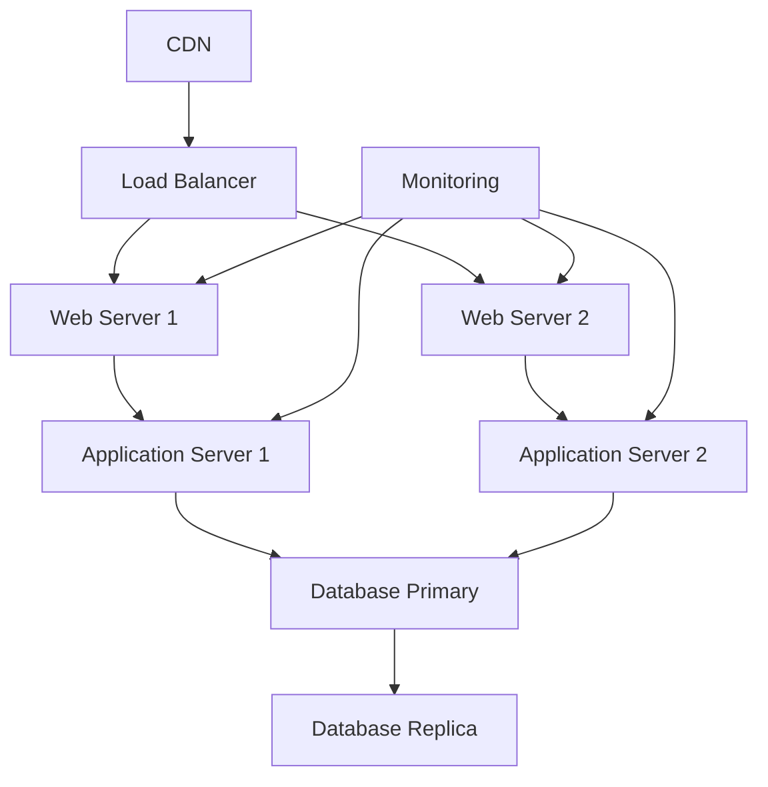

# Final System

## Metadata
| Item | Content |
|------|---------|
| purpose | Document the completed system, operational readiness, and future plans |
| category | Implementation Management |
| target_user | Project Manager, Operations Team, Stakeholders |
| usage_phase | STEP 7: Coding & Testing (Completion) |
| related_templates | step7-deliverables-template.md, step7-progress-template.md |

| Item | Content |
|------|---------|
| Document ID | FINAL-001 |
| Version | 1.0 |
| Created Date | YYYY-MM-DD |
| Last Updated | YYYY-MM-DD |
| Status | Draft/Under Review/Approved |
| Author | [Author Name] |
| Reviewer | [Reviewer Name] |
| Approver | [Approver Name] |
| Related Documents | DELIV-001 (Deliverables & Quality Records) |
| Change History | 1.0: Initial version created (YYYY-MM-DD) |
| Completion Date | YYYY-MM-DD |

## 1. System Overview

### 1.1 Completed System Specifications
| Item | Content |
|------|---------|
| System Name | [System Name] |
| Version | 1.0.0 |
| Development Period | [Start Date] - [End Date] |
| Total Effort | XXX person-days |
| Number of Participants | X people |

### 1.2 Implemented Features
| Feature ID | Feature Name | Implementation Status | Test Status | Quality Score |
|------------|--------------|----------------------|-------------|---------------|
| F-001 | User Management | Complete | Complete | A |
| F-002 | Query Processing | Complete | Complete | A |
| F-003 | Data Persistence | Complete | Complete | B+ |
| F-004 | API Provision | Complete | Complete | A |

### 1.3 Architecture Implementation Status
| Layer | Number of Files | Completion Rate | Quality Score |
|-------|-----------------|-----------------|---------------|
| Presentation | 6 | 100% | A |
| Application | 4 | 100% | A |
| Domain | 8 | 100% | A |
| Infrastructure | 5 | 100% | B+ |

## 2. Quality Achievement Status

### 2.1 Quality Target Achievement
| Quality Item | Target | Actual | Achievement Rate | Evaluation |
|--------------|--------|--------|------------------|------------|
| Test Coverage | 90% | 95% | 106% | ✅ |
| Static Analysis Score | A grade | A grade | 100% | ✅ |
| Security Vulnerabilities | 0 | 0 | 100% | ✅ |
| API Response Time | <200ms | 145ms | 127% | ✅ |
| Availability | 99.9% | 99.95% | 100% | ✅ |

### 2.2 Non-Functional Requirements Achievement
| Requirement Item | Target | Actual | Achievement Status |
|------------------|--------|--------|--------------------|
| Concurrent Connections | 1000 | 1200 | ✅ |
| Data Processing Rate | 10MB/s | 12MB/s | ✅ |
| Recovery Time | <1 hour | 30 min | ✅ |
| Backup | Daily | Daily | ✅ |

## 3. Deployment Information

### 3.1 Production Environment Configuration
````mermaid

````

### 3.2 Environment Configuration
| Environment | URL | Database | Monitoring | Backup |
|-------------|-----|----------|------------|--------|
| Production | https://prod.example.com | PostgreSQL Primary | 24/7 | Daily |
| Staging | https://staging.example.com | PostgreSQL Replica | Business Hours | Weekly |
| Development | http://dev.example.com | PostgreSQL Local | None | None |

### 3.3 Operational Procedures
| Procedure | Frequency | Responsible | Automated |
|-----------|-----------|-------------|-----------|
| Deployment | Per Release | DevOps | ✅ |
| Backup | Daily | System | ✅ |
| Monitoring Check | Daily | Operations Team | Partial |
| Security Patches | Monthly | DevOps | Partial |

## 4. Operations & Maintenance Plan

### 4.1 Monitoring & Alert Settings
| Monitoring Item | Threshold | Alert Method | Responder |
|-----------------|-----------|--------------|-----------|
| CPU Usage | >80% | Slack Notification | Infrastructure Team |
| Memory Usage | >85% | Slack Notification | Infrastructure Team |
| Error Rate | >1% | Email Notification | Development Team |
| Response Time | >500ms | Slack Notification | Development Team |

### 4.2 Maintenance Schedule
| Maintenance Item | Frequency | Execution Time | Duration |
|------------------|-----------|----------------|----------|
| Regular Maintenance | Monthly | 2nd Sunday | 2 hours |
| Security Updates | As Needed | Emergency | 1 hour |
| Version Upgrades | Quarterly | Planned | 4 hours |
| Disaster Recovery Drill | Semi-annual | Planned | 1 day |

### 4.3 Support Structure
| Role | Responsible | Support Hours | Contact Method |
|------|-------------|---------------|----------------|
| 1st Level Support | Help Desk | 9-18:00 | Phone/Email |
| 2nd Level Support | Development Team | 9-18:00 | Slack/Phone |
| 3rd Level Support | Architect | On-call | Phone |
| Emergency Response | DevOps | 24/7 | Phone |

## 5. Future Expansion Plan

### 5.1 Short-term Plan (3 months)
| Item | Content | Priority | Effort |
|------|---------|----------|--------|
| Feature Addition | Notification Feature | High | 20 person-days |
| Performance Improvement | Cache Implementation | Medium | 15 person-days |
| UI Improvement | Responsive Design | Medium | 10 person-days |

### 5.2 Medium-term Plan (6 months)
| Item | Content | Priority | Effort |
|------|---------|----------|--------|
| Microservices Migration | Architecture Change | High | 60 person-days |
| AI Feature Addition | Machine Learning Integration | Medium | 40 person-days |
| Multi-language Support | Internationalization | Low | 30 person-days |

### 5.3 Long-term Plan (1 year)
| Item | Content | Priority | Effort |
|------|---------|----------|--------|
| Cloud Native Migration | Kubernetes Migration | High | 80 person-days |
| Big Data Support | Data Analytics Platform | Medium | 100 person-days |
| Mobile Application | Native App Development | Low | 120 person-days |

## 6. Completion Checklist
- [ ] All features are functioning properly
- [ ] Quality targets have been achieved
- [ ] Production environment is operating normally
- [ ] Operations and maintenance structure is in place
- [ ] Documentation is complete
- [ ] Future expansion plan has been formulated