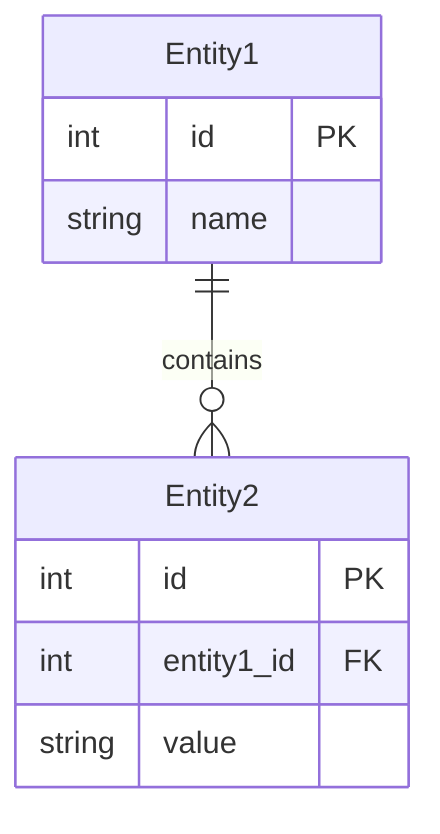

# 要求仕様書

## メタデータ
- **文書ID**: REQ-001
- **関連文書**: 
  - UC-001（ユースケース一覧）
  - NFR-001（非機能要件リスト）
  - GOAL-001（ゴールステートメント）
  - QG1-001（品質ゲート1判定結果）
- **作成日**: YYYY-MM-DD
- **最終更新日**: YYYY-MM-DD
- **作成者**: [ビジネスアナリスト名]
- **承認者**: [プロダクトオーナー名]
- **バージョン**: 1.0
- **ステータス**: [ドラフト/レビュー中/承認済み]

## 1. 機能要件

### 1.1 機能一覧
| 機能ID | 機能名 | 優先度 | 関連UC | 説明 |
|--------|--------|--------|--------|------|
| F-001 | [機能1] | 必須 | UC-001 | [説明1] |
| F-002 | [機能2] | 重要 | UC-002 | [説明2] |

### 1.2 機能詳細

#### F-001: [機能名]
**概要**: [機能の概要]
**入力**: [入力データ・形式]
**処理**: [処理内容]
**出力**: [出力データ・形式]
**例外処理**: [例外ケースと対応]

**詳細仕様**:
- [仕様1]
- [仕様2]
- [仕様3]

**制約事項**:
- [制約1]
- [制約2]

## 2. 非機能要件サマリ

### 2.1 性能要件
| 項目 | 要件 |
|------|------|
| 応答時間 | [要件1] |
| スループット | [要件2] |

### 2.2 品質要件
| 項目 | 要件 |
|------|------|
| 可用性 | [要件1] |
| セキュリティ | [要件2] |

## 3. インターフェース要件

### 3.1 ユーザーインターフェース
- [UI要件1]
- [UI要件2]

### 3.2 システムインターフェース
| IF-ID | インターフェース名 | 種別 | プロトコル | データ形式 |
|-------|-------------------|------|------------|------------|
| IF-001 | [IF名1] | [種別1] | [プロトコル1] | [形式1] |

## 4. データ要件

### 4.1 データ項目
| データID | データ名 | 型 | 必須 | 説明 |
|----------|----------|----|----- |------|
| D-001 | [データ1] | [型1] | ○ | [説明1] |

### 4.2 データ関係図

````mermaid

````

## 5. 完了確認
- [ ] 機能要件が網羅的に定義されている
- [ ] 非機能要件が適切に統合されている
- [ ] インターフェース要件が明確に定義されている
- [ ] データ要件が詳細に記述されている
- [ ] 制約事項が明確に記載されている
