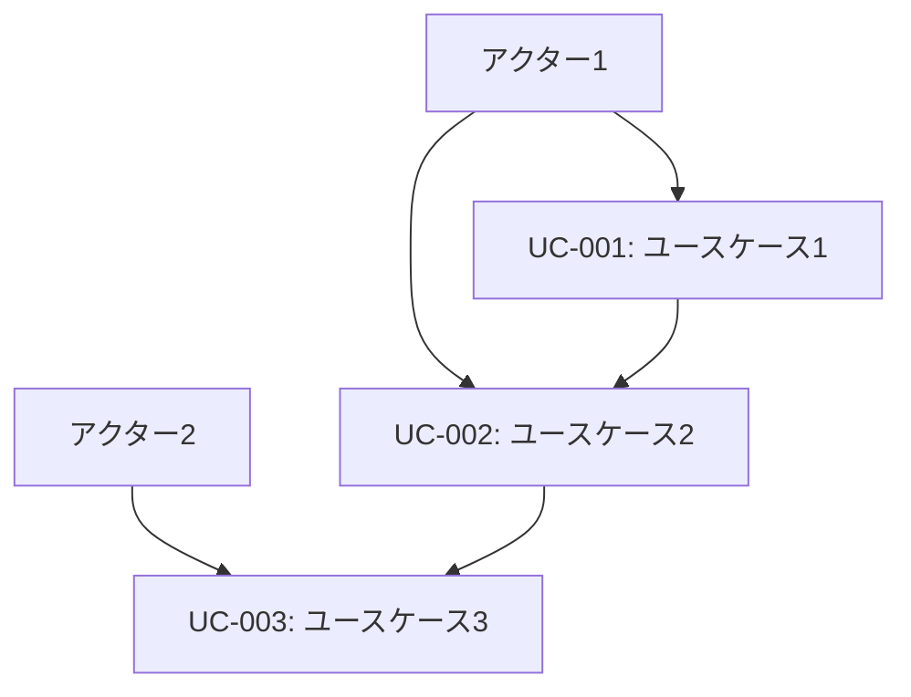

# ユースケース一覧

## メタデータ
| 項目 | 内容 |
|------|------|
| 文書ID | UC-001 |
| 関連文書 | GOAL-001 (ゴール定義書)<br>STAKE-001 (ステークホルダー定義書)<br>REQ-001 (機能要件定義書)<br>NFR-001 (非機能要件定義書) |
| 作成日 | YYYY-MM-DD |
| 最終更新日 | YYYY-MM-DD |
| 作成者 | [作成者名] |
| 承認者 | [承認者名] |
| バージョン | 1.0 |
| ステータス | ドラフト |

## 1. ユースケース概要

### 1.1 アクター定義
| アクターID | アクター名 | 説明 | 権限レベル |
|------------|------------|------|------------|
| AC-001 | [アクター1] | [説明1] | [権限1] |
| AC-002 | [アクター2] | [説明2] | [権限2] |

### 1.2 ユースケース一覧
| UC-ID | ユースケース名 | アクター | 優先度 | 複雑度 |
|-------|----------------|----------|--------|--------|
| UC-001 | [ユースケース1] | AC-001 | 高 | 中 |
| UC-002 | [ユースケース2] | AC-002 | 中 | 低 |

## 2. ユースケース詳細

### UC-001: [ユースケース名]
**概要**: [ユースケースの概要]
**アクター**: [主要アクター]
**目的**: [達成したい目標]
**頻度**: [実行頻度]

#### 事前条件
- [事前条件1]
- [事前条件2]

#### 主要シナリオ
1. [ステップ1]
2. [ステップ2]
3. [ステップ3]

#### 代替シナリオ
**A1: [例外ケース1]**
- 1a. [例外処理1]
- 1b. [例外処理2]

#### 事後条件
- [事後条件1]
- [事後条件2]

#### 非機能要件
- **性能**: [性能要件]
- **セキュリティ**: [セキュリティ要件]
- **可用性**: [可用性要件]

## 3. ユースケース関係図

````mermaid

````

## 4. 完了確認
- [ ] 全アクターが特定されている
- [ ] ユースケースが網羅的に定義されている
- [ ] 主要シナリオが詳細に記述されている
- [ ] 代替シナリオが適切に定義されている
- [ ] 事前・事後条件が明確である
