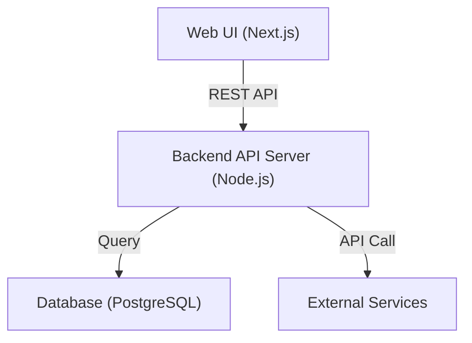
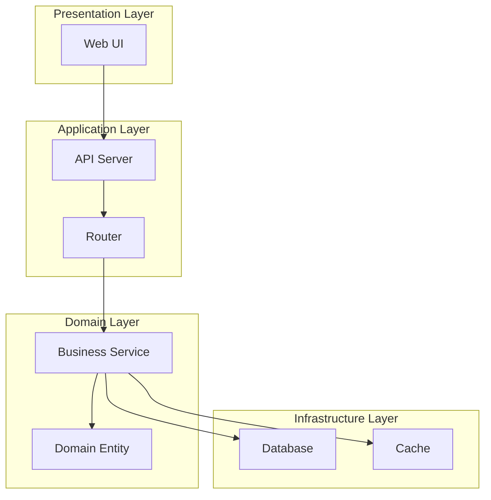

# システム構成図

## メタデータ
| 項目 | 内容 |
|------|------|
| 文書ID | ARCH-001 |
| 関連文書 | REQ-001 (機能要件定義書)<br>NFR-001 (非機能要件定義書)<br>UC-001 (ユースケース一覧)<br>TECH-001 (技術スタック選定書) |
| 作成日 | YYYY-MM-DD |
| 最終更新日 | YYYY-MM-DD |
| 作成者 | [作成者名] |
| 承認者 | [承認者名] |
| バージョン | 1.0 |
| ステータス | ドラフト |

## 1. システム全体アーキテクチャ

````mermaid

````

## 2. レイヤー構成

| レイヤー | 内容 | 技術 | 責任 |
|----------|------|------|------|
| Presentation Layer | [内容1] | [技術1] | [責任1] |
| Application Layer | [内容2] | [技術2] | [責任2] |
| Domain Layer | [内容3] | [技術3] | [責任3] |
| Infrastructure Layer | [内容4] | [技術4] | [責任4] |

## 3. コンポーネント構成図

````mermaid

````

## 4. 設計原則

### 4.1 アーキテクチャ原則
- [原則1]: [説明1]
- [原則2]: [説明2]
- [原則3]: [説明3]

### 4.2 設計パターン
| パターン名 | 適用箇所 | 目的 |
|------------|----------|------|
| [パターン1] | [箇所1] | [目的1] |
| [パターン2] | [箇所2] | [目的2] |

## 5. 完了確認
- [ ] システム全体像が明確に表現されている
- [ ] レイヤー構成が適切に定義されている
- [ ] コンポーネント間の関係が明確である
- [ ] 設計原則が明文化されている
