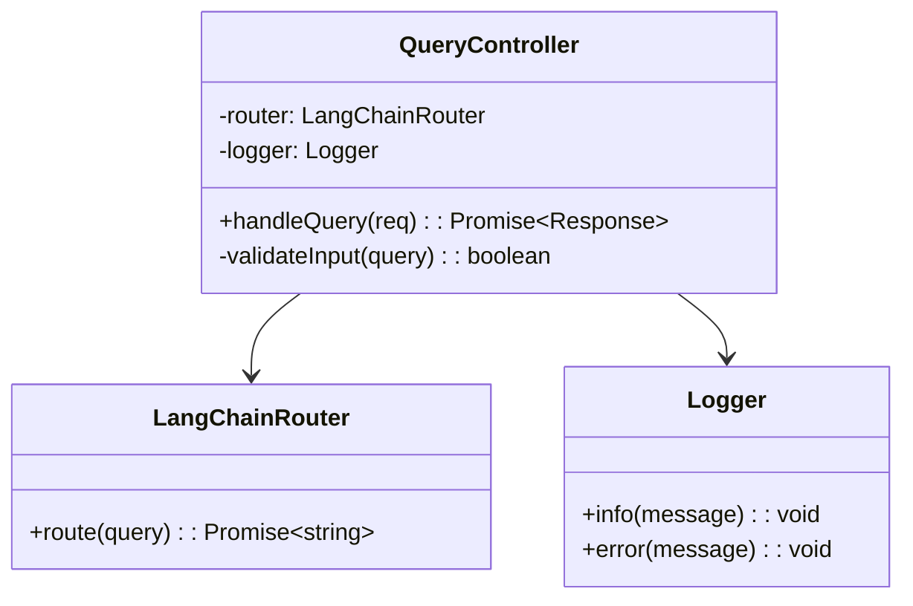

# クラス設計表

## メタデータ
- **文書ID**: CLASS-001
- **関連文書**: 
  - ARCH-001（システム構成図）
  - TECH-001（技術選定・依存関係定義書）
  - LAYER-001（レイヤー構成マップ）
  - QG3-001（品質ゲート3判定結果）
- **作成日**: YYYY-MM-DD
- **最終更新日**: YYYY-MM-DD
- **作成者**: [ソフトウェアアーキテクト名]
- **承認者**: [テクニカルリード名]
- **バージョン**: 1.0
- **ステータス**: [ドラフト/レビュー中/承認済み]

## 1. クラス一覧

| クラスID | クラス名 | レイヤー | 責任 | 依存関係 |
|----------|----------|----------|------|----------|
| CL-001 | QueryController | Presentation | [責任1] | [依存1] |
| CL-002 | UserService | Application | [責任2] | [依存2] |

## 2. クラス詳細設計

### CL-001: QueryController

#### 基本情報
- **パッケージ**: controllers
- **ファイル**: queryController.ts
- **責任**: HTTPリクエストの受信と応答の返却
- **設計原則**: 単一責任原則、依存性逆転原則

#### 属性
| 属性名 | 型 | 可視性 | 初期値 | 説明 |
|--------|----|---------|---------|----- |
| router | LangChainRouter | private | - | [説明1] |
| logger | Logger | private | - | [説明2] |

#### メソッド
| メソッド名 | 可視性 | 引数 | 戻り値 | 説明 |
|------------|--------|------|--------|------|
| handleQuery | public | req: Request | Promise<Response> | [説明1] |
| validateInput | private | query: string | boolean | [説明2] |

#### 依存関係図

````mermaid

````

#### 例外処理
| 例外 | 発生条件 | 処理方法 |
|------|----------|----------|
| ValidationError | [条件1] | [処理1] |
| SystemError | [条件2] | [処理2] |

## 3. 完了確認
- [ ] 全クラスが単一責任原則に従っている
- [ ] 依存関係が明確に定義されている
- [ ] インターフェースが適切に設計されている
- [ ] 例外処理が考慮されている
