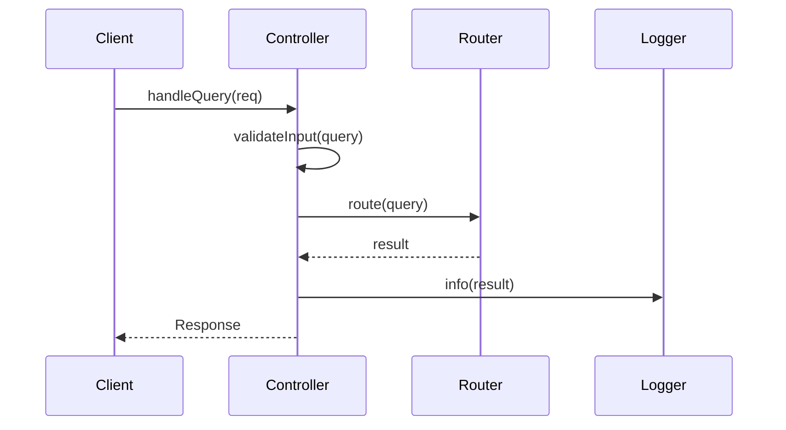

# メソッドインターフェースリスト

## メタデータ
| 項目 | 内容 |
|------|------|
| ドキュメントID | [STEP3-IF-001] |
| バージョン | [v1.0] |
| 作成日 | [YYYY-MM-DD] |
| 最終更新日 | [YYYY-MM-DD] |
| ステータス | [ドラフト/レビュー中/承認済み/非推奨] |
| 作成者 | [作成者名] |
| 承認者 | [承認者名（ステータスが承認済みの場合）] |
| タグ | #step3-detailed-design #interfaces #api-design |
| 関連文書 | [[CLASS-001](./step3-class-design-template.md)] [[ARCH-001](./step2-system-architecture-template.md)] |
| 変更履歴 | [v1.0] YYYY-MM-DD: 初版作成<br>[v1.1] YYYY-MM-DD: インターフェース追加（IF-003, IF-004） |

## 1. インターフェース一覧

| IF-ID | クラス名 | メソッド名 | 種別 | 優先度 |
|-------|----------|------------|------|--------|
| IF-001 | QueryController | handleQuery | public | 高 |
| IF-002 | LangChainRouter | route | public | 高 |

## 2. インターフェース詳細

### IF-001: QueryController.handleQuery

#### 基本情報
- **目的**: ユーザークエリを受信し、処理結果を返却する
- **呼び出し元**: Express Router
- **呼び出し先**: LangChainRouter.route

#### シグネチャ
```typescript
async handleQuery(req: Request): Promise<Response>
```

#### パラメータ
| パラメータ名 | 型 | 必須 | 説明 | 制約 |
|-------------|----|----- |------|------|
| req | Request | ○ | HTTPリクエストオブジェクト | [制約1] |

#### 戻り値
| 型 | 説明 | 例 |
|----|------|-----|
| Promise<Response> | HTTPレスポンスオブジェクト | [例1] |

#### 例外
| 例外名 | 発生条件 | 対処方法 |
|--------|----------|----------|
| ValidationError | [条件1] | [対処1] |
| SystemError | [条件2] | [対処2] |

#### 処理フロー
````mermaid

````

#### 実装例
```typescript
async handleQuery(req: Request): Promise<Response> {
    try {
        const query = req.body.query;
        
        if (!this.validateInput(query)) {
            throw new ValidationError('Invalid query format');
        }
        
        const result = await this.router.route(query);
        this.logger.info(`Query processed: ${query}`);
        
        return {
            status: 200,
            data: result
        };
    } catch (error) {
        this.logger.error(`Query processing failed: ${error.message}`);
        throw error;
    }
}
```

## 3. 完了確認
- [ ] 全メソッドのシグネチャが定義されている
- [ ] パラメータと戻り値が詳細に記述されている
- [ ] 例外処理が適切に定義されている
- [ ] 処理フローが図示されている
- [ ] 実装例が提供されている
