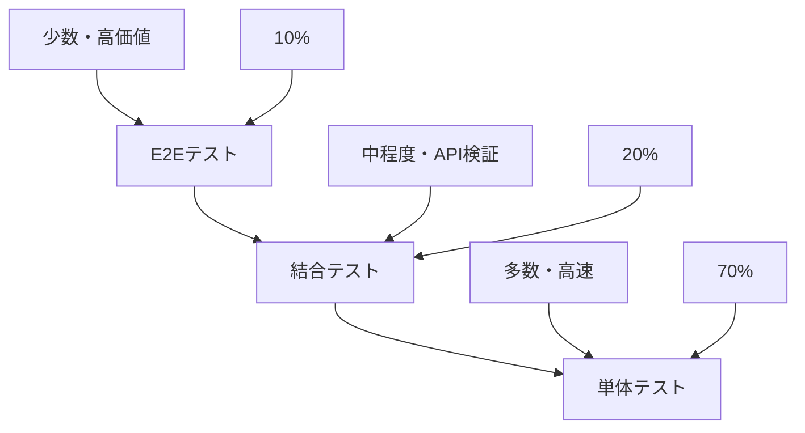

# テスト戦略書

## メタデータ
| 項目 | 内容 |
|------|------|
| ドキュメントID | [STEP4-STRATEGY-001] |
| バージョン | [v1.0] |
| 作成日 | [YYYY-MM-DD] |
| 最終更新日 | [YYYY-MM-DD] |
| ステータス | [ドラフト/レビュー中/承認済み/非推奨] |
| 作成者 | [作成者名] |
| 承認者 | [承認者名（ステータスが承認済みの場合）] |
| タグ | #step4-test-design #test-strategy #quality-assurance |
| 関連文書 | [[REQ-001](./step1-requirements-specification-template.md)] [[CLASS-001](./step3-class-design-template.md)] |
| 変更履歴 | [v1.0] YYYY-MM-DD: 初版作成<br>[v1.1] YYYY-MM-DD: 品質基準の更新（カバレッジ目標値の見直し） |

## 1. テスト方針

### 1.1 テスト目的
- [目的1]: [説明1]
- [目的2]: [説明2]
- [目的3]: [説明3]

### 1.2 テスト範囲
| 対象 | 含む | 含まない | 理由 |
|------|------|----------|------|
| [対象1] | [含む項目1] | [除外項目1] | [理由1] |
| [対象2] | [含む項目2] | [除外項目2] | [理由2] |

## 2. テストレベル

### 2.1 テストピラミッド
````mermaid

````

### 2.2 テストレベル詳細
| レベル | 目的 | 対象 | 実行頻度 | 自動化率 |
|--------|------|------|----------|----------|
| 単体テスト | [目的1] | [対象1] | [頻度1] | 100% |
| 結合テスト | [目的2] | [対象2] | [頻度2] | 90% |
| E2Eテスト | [目的3] | [対象3] | [頻度3] | 80% |

## 3. 品質基準

### 3.1 カバレッジ目標
| テストレベル | カバレッジ種別 | 目標値 | 最低値 |
|-------------|---------------|--------|--------|
| 単体テスト | ライン | 95% | 90% |
| 単体テスト | ブランチ | 90% | 85% |
| 結合テスト | API | 100% | 95% |

### 3.2 品質ゲート
| 項目 | 基準 | 測定方法 |
|------|------|----------|
| テスト成功率 | 100% | 自動テスト実行 |
| カバレッジ | 90%以上 | Jest Coverage |
| 性能 | 応答時間<200ms | 負荷テスト |

## 4. テスト環境

### 4.1 環境構成
| 環境名 | 用途 | データ | 更新頻度 |
|--------|------|--------|----------|
| 開発 | 開発者テスト | モックデータ | 随時 |
| テスト | 自動テスト | テストデータ | 日次 |
| ステージング | 受け入れテスト | 本番類似データ | 週次 |

### 4.2 テストデータ管理
| データ種別 | 作成方法 | 更新方法 | 保護レベル |
|------------|----------|----------|------------|
| [データ1] | [方法1] | [更新1] | [レベル1] |

## 5. 完了確認
- [ ] テスト方針が明確に定義されている
- [ ] テストレベルが適切に設計されている
- [ ] 品質基準が定量的に設定されている
- [ ] テスト環境が適切に計画されている
