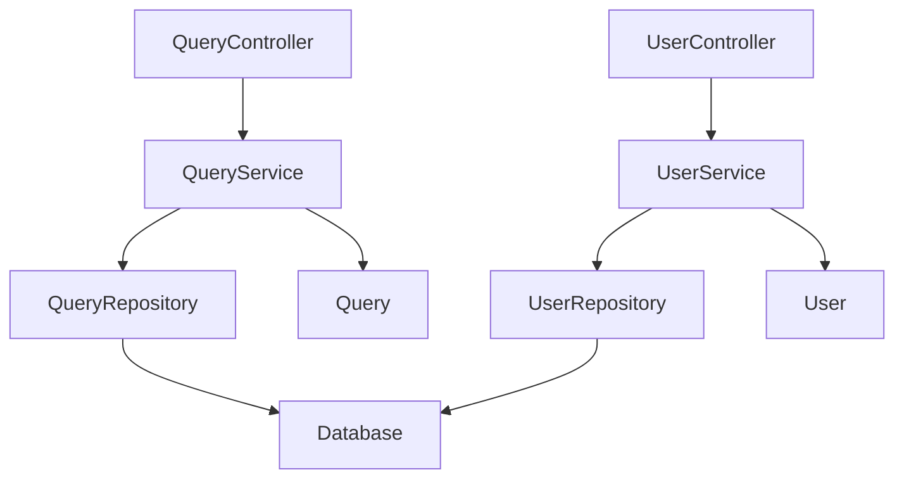

# 実装コンポーネント一覧

## メタデータ
| 項目 | 内容 |
|------|------|
| ドキュメントID | COMP-001 |
| バージョン | 1.0 |
| 作成日 | YYYY-MM-DD |
| 最終更新日 | YYYY-MM-DD |
| ステータス | ドラフト/レビュー中/承認済み |
| 作成者 | [作成者名] |
| レビュー者 | [レビュー者名] |
| 承認者 | [承認者名] |
| 関連文書 | CLASS-001 (クラス設計書), TARGET-001 (テスト対象定義書) |
| 変更履歴 | 1.0: 初版作成 (YYYY-MM-DD) |

## 1. コンポーネント分類

### 1.1 レイヤー別コンポーネント
| レイヤー | コンポーネント数 | 実装優先度 | 依存関係 |
|----------|------------------|------------|----------|
| Presentation | 5 | 高 | Application |
| Application | 8 | 高 | Domain |
| Domain | 6 | 中 | なし |
| Infrastructure | 4 | 中 | Domain |

### 1.2 コンポーネント詳細
| コンポーネントID | 名前 | レイヤー | ファイル | 優先度 | 見積時間 |
|------------------|------|----------|---------|--------|----------|
| COMP-001 | QueryController | Presentation | QueryController.ts | 高 | 4h |
| COMP-002 | UserService | Application | UserService.ts | 高 | 6h |
| COMP-003 | User | Domain | User.ts | 中 | 3h |

## 2. 依存関係マップ

````mermaid

````

## 3. 実装順序

### 3.1 フェーズ1: 基盤コンポーネント
| 順序 | コンポーネント | 理由 | 期間 |
|------|----------------|------|------|
| 1 | Domain Entities | 他の依存関係なし | 1週間 |
| 2 | Repository Interfaces | ドメイン層の完成 | 3日 |

### 3.2 フェーズ2: アプリケーション層
| 順序 | コンポーネント | 理由 | 期間 |
|------|----------------|------|------|
| 3 | Application Services | ビジネスロジック実装 | 1週間 |
| 4 | Repository Implementations | データアクセス実装 | 5日 |

### 3.3 フェーズ3: プレゼンテーション層
| 順序 | コンポーネント | 理由 | 期間 |
|------|----------------|------|------|
| 5 | Controllers | API実装 | 1週間 |
| 6 | DTOs | データ転送オブジェクト | 3日 |

## 4. 完了確認
- [ ] 全コンポーネントが特定されている
- [ ] 依存関係が明確に定義されている
- [ ] 実装順序が論理的である
- [ ] 見積時間が現実的である
