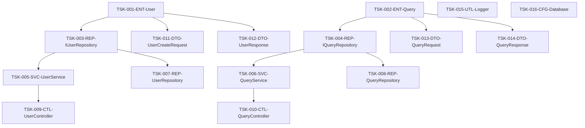

# ファイル単位タスクリスト

## メタデータ
| 項目 | 内容 |
|------|------|
| ドキュメントID | TASK-001 |
| バージョン | 1.0 |
| 作成日 | YYYY-MM-DD |
| 最終更新日 | YYYY-MM-DD |
| ステータス | ドラフト/レビュー中/承認済み |
| 作成者 | [作成者名] |
| レビュー者 | [レビュー者名] |
| 承認者 | [承認者名] |
| 関連文書 | COMP-001 (実装コンポーネント一覧), DIR-001 (ディレクトリ構造マップ), CLASS-001 (クラス設計表) |
| 変更履歴 | 1.0: 初版作成 (YYYY-MM-DD) |

## 概要

本文書は、STEP 6作成手順書のSTEP 2で作成される、実装対象ファイルの洗い出しとタスクID付与の結果をまとめたタスクリストです。

**目的**:
- 実装対象ファイルの完全な把握
- タスクIDによる一意識別
- 依存関係の明確化
- 見積時間の設定

## 参照文書
- `docs/implementation/directory-structure.md` - ディレクトリ構造マップ
- `docs/implementation/components.md` - 実装コンポーネント一覧
- `docs/detailed-design/classes.md` - クラス設計表
- `docs/detailed-design/interfaces.md` - メソッドI/Fリスト

---

## タスク一覧

### 基本情報
- **総タスク数**: [X]個
- **総見積時間**: [X]時間
- **実装期間**: [開始日] ～ [終了日]

### タスクリスト

| タスクID | ファイル名 | レイヤー | 優先度 | 依存タスク | 見積時間 | 複雑度 | 備考 |
|----------|------------|----------|--------|------------|----------|--------|------|
| TSK-001-ENT-User | User.ts | Domain | 高 | なし | 4h | 高 | コアエンティティ |
| TSK-002-ENT-Query | Query.ts | Domain | 高 | なし | 3h | 中 | 検索クエリ |
| TSK-003-REP-IUserRepository | IUserRepository.ts | Domain | 高 | TSK-001 | 2h | 低 | インターフェース |
| TSK-004-REP-IQueryRepository | IQueryRepository.ts | Domain | 高 | TSK-002 | 2h | 低 | インターフェース |
| TSK-005-SVC-UserService | UserService.ts | Application | 高 | TSK-003 | 6h | 高 | ビジネスロジック |
| TSK-006-SVC-QueryService | QueryService.ts | Application | 高 | TSK-004 | 5h | 高 | 検索処理 |
| TSK-007-REP-UserRepository | UserRepository.ts | Infrastructure | 中 | TSK-003 | 5h | 中 | データアクセス |
| TSK-008-REP-QueryRepository | QueryRepository.ts | Infrastructure | 中 | TSK-004 | 4h | 中 | 検索データアクセス |
| TSK-009-CTL-UserController | UserController.ts | Presentation | 高 | TSK-005 | 4h | 中 | REST API |
| TSK-010-CTL-QueryController | QueryController.ts | Presentation | 高 | TSK-006 | 4h | 中 | 検索API |
| TSK-011-DTO-UserCreateRequest | UserCreateRequest.ts | Presentation | 中 | TSK-001 | 2h | 低 | リクエストDTO |
| TSK-012-DTO-UserResponse | UserResponse.ts | Presentation | 中 | TSK-001 | 2h | 低 | レスポンスDTO |
| TSK-013-DTO-QueryRequest | QueryRequest.ts | Presentation | 中 | TSK-002 | 2h | 低 | 検索リクエスト |
| TSK-014-DTO-QueryResponse | QueryResponse.ts | Presentation | 中 | TSK-002 | 2h | 低 | 検索レスポンス |
| TSK-015-UTL-Logger | Logger.ts | Infrastructure | 低 | なし | 3h | 低 | ログ機能 |
| TSK-016-CFG-Database | Database.ts | Infrastructure | 中 | なし | 4h | 中 | DB設定 |

---

## レイヤー別集計

### ドメイン層 (Domain)
| レイヤー | タスク数 | 見積時間 | 平均複雑度 |
|----------|----------|----------|------------|
| Entity | 2 | 7h | 中～高 |
| Repository Interface | 2 | 4h | 低 |
| **小計** | **4** | **11h** | **中** |

### アプリケーション層 (Application)
| レイヤー | タスク数 | 見積時間 | 平均複雑度 |
|----------|----------|----------|------------|
| Service | 2 | 11h | 高 |
| **小計** | **2** | **11h** | **高** |

### インフラ層 (Infrastructure)
| レイヤー | タスク数 | 見積時間 | 平均複雑度 |
|----------|----------|----------|------------|
| Repository Implementation | 2 | 9h | 中 |
| Utility | 1 | 3h | 低 |
| Configuration | 1 | 4h | 中 |
| **小計** | **4** | **16h** | **中** |

### プレゼンテーション層 (Presentation)
| レイヤー | タスク数 | 見積時間 | 平均複雑度 |
|----------|----------|----------|------------|
| Controller | 2 | 8h | 中 |
| DTO | 4 | 8h | 低 |
| **小計** | **6** | **16h** | **低～中** |

### 全体集計
- **総タスク数**: 16個
- **総見積時間**: 54時間
- **平均タスク時間**: 3.4時間

---

## 依存関係マップ

### 実装順序（依存関係順）

#### フェーズ1: 基盤層（依存なし）
```
TSK-001-ENT-User (4h)
TSK-002-ENT-Query (3h)
TSK-015-UTL-Logger (3h)
TSK-016-CFG-Database (4h)
```
**フェーズ1合計**: 14時間

#### フェーズ2: インターフェース層
```
TSK-003-REP-IUserRepository (2h) ← TSK-001
TSK-004-REP-IQueryRepository (2h) ← TSK-002
```
**フェーズ2合計**: 4時間

#### フェーズ3: サービス・リポジトリ実装
```
TSK-005-SVC-UserService (6h) ← TSK-003
TSK-006-SVC-QueryService (5h) ← TSK-004
TSK-007-REP-UserRepository (5h) ← TSK-003
TSK-008-REP-QueryRepository (4h) ← TSK-004
```
**フェーズ3合計**: 20時間

#### フェーズ4: プレゼンテーション層
```
TSK-009-CTL-UserController (4h) ← TSK-005
TSK-010-CTL-QueryController (4h) ← TSK-006
TSK-011-DTO-UserCreateRequest (2h) ← TSK-001
TSK-012-DTO-UserResponse (2h) ← TSK-001
TSK-013-DTO-QueryRequest (2h) ← TSK-002
TSK-014-DTO-QueryResponse (2h) ← TSK-002
```
**フェーズ4合計**: 16時間

### 依存関係図



---

## 優先度別分類

### 高優先度（クリティカルパス）
| タスクID | ファイル名 | 理由 |
|----------|------------|------|
| TSK-001-ENT-User | User.ts | コアエンティティ、多数のタスクが依存 |
| TSK-002-ENT-Query | Query.ts | 検索機能の基盤 |
| TSK-003-REP-IUserRepository | IUserRepository.ts | サービス層の前提条件 |
| TSK-004-REP-IQueryRepository | IQueryRepository.ts | 検索サービスの前提条件 |
| TSK-005-SVC-UserService | UserService.ts | ビジネスロジックの中核 |
| TSK-006-SVC-QueryService | QueryService.ts | 検索機能の中核 |
| TSK-009-CTL-UserController | UserController.ts | ユーザーAPI提供 |
| TSK-010-CTL-QueryController | QueryController.ts | 検索API提供 |

### 中優先度
| タスクID | ファイル名 | 理由 |
|----------|------------|------|
| TSK-007-REP-UserRepository | UserRepository.ts | データ永続化 |
| TSK-008-REP-QueryRepository | QueryRepository.ts | 検索データアクセス |
| TSK-011-DTO-UserCreateRequest | UserCreateRequest.ts | API仕様 |
| TSK-012-DTO-UserResponse | UserResponse.ts | API仕様 |
| TSK-013-DTO-QueryRequest | QueryRequest.ts | 検索API仕様 |
| TSK-014-DTO-QueryResponse | QueryResponse.ts | 検索API仕様 |
| TSK-016-CFG-Database | Database.ts | インフラ設定 |

### 低優先度
| タスクID | ファイル名 | 理由 |
|----------|------------|------|
| TSK-015-UTL-Logger | Logger.ts | 補助機能 |

---

## 複雑度別分析

### 高複雑度（詳細サブタスク展開推奨）
| タスクID | ファイル名 | 複雑度要因 |
|----------|------------|------------|
| TSK-001-ENT-User | User.ts | ビジネスルール、バリデーション |
| TSK-005-SVC-UserService | UserService.ts | 複数メソッド、ビジネスロジック |
| TSK-006-SVC-QueryService | QueryService.ts | 検索アルゴリズム、パフォーマンス |

### 中複雑度（標準サブタスク）
| タスクID | ファイル名 | 複雑度要因 |
|----------|------------|------------|
| TSK-002-ENT-Query | Query.ts | 検索条件の組み合わせ |
| TSK-007-REP-UserRepository | UserRepository.ts | データアクセス処理 |
| TSK-008-REP-QueryRepository | QueryRepository.ts | 複雑なクエリ |
| TSK-009-CTL-UserController | UserController.ts | REST API、エラーハンドリング |
| TSK-010-CTL-QueryController | QueryController.ts | 検索パラメータ処理 |
| TSK-016-CFG-Database | Database.ts | 設定管理 |

### 低複雑度（簡略サブタスク）
| タスクID | ファイル名 | 複雑度要因 |
|----------|------------|------------|
| TSK-003-REP-IUserRepository | IUserRepository.ts | インターフェース定義のみ |
| TSK-004-REP-IQueryRepository | IQueryRepository.ts | インターフェース定義のみ |
| TSK-011-DTO-UserCreateRequest | UserCreateRequest.ts | 単純なデータ構造 |
| TSK-012-DTO-UserResponse | UserResponse.ts | 単純なデータ構造 |
| TSK-013-DTO-QueryRequest | QueryRequest.ts | 単純なデータ構造 |
| TSK-014-DTO-QueryResponse | QueryResponse.ts | 単純なデータ構造 |
| TSK-015-UTL-Logger | Logger.ts | 汎用ユーティリティ |

---

## リスク分析

### 高リスクタスク
| タスクID | リスク要因 | 対策 |
|----------|------------|------|
| TSK-005-SVC-UserService | ビジネスロジック複雑、仕様変更可能性 | 詳細設計レビュー強化 |
| TSK-006-SVC-QueryService | パフォーマンス要件、アルゴリズム選択 | プロトタイプ作成 |

### 中リスクタスク
| タスクID | リスク要因 | 対策 |
|----------|------------|------|
| TSK-007-REP-UserRepository | データベース設計依存 | DB設計確定待ち |
| TSK-008-REP-QueryRepository | 検索性能要件 | インデックス設計確認 |

---

## 見積精度向上のための補足情報

### 見積根拠
- **Entity（高複雑度）**: 4時間（設計1h + 実装2h + テスト1h）
- **Entity（中複雑度）**: 3時間（設計0.5h + 実装1.5h + テスト1h）
- **Service（高複雑度）**: 6時間（設計1.5h + 実装3h + テスト1.5h）
- **Repository Interface**: 2時間（設計0.5h + 実装1h + テスト0.5h）
- **Repository Implementation**: 4-5時間（設計1h + 実装2-3h + テスト1h）
- **Controller**: 4時間（設計1h + 実装2h + テスト1h）
- **DTO**: 2時間（設計0.5h + 実装1h + テスト0.5h）

### 前提条件
- 開発者のスキルレベル: 中級
- 使用技術への習熟度: 中程度
- 設計文書の完成度: 80%
- 外部依存の安定性: 高

---

## 次ステップ

### STEP 3への引き継ぎ事項
1. **カテゴリ分割方針の決定**
   - プロジェクト規模: [小規模/中規模/大規模]
   - 選択した管理単位: [レイヤー/機能モジュール/フェーズ]

2. **サブタスク展開レベルの決定**
   - 高複雑度タスク: 詳細展開
   - 中複雑度タスク: 標準展開
   - 低複雑度タスク: 簡略展開

3. **ToDoリスト作成の準備**
   - テンプレート選択: `docs/templates/step6-todo-list-updated-template.md`
   - 進捗管理方式の確定

## 完了確認
- [ ] 全実装ファイルがタスクとして定義されている
- [ ] タスクIDが命名規則に従っている
- [ ] 依存関係が正しく設定されている
- [ ] 見積時間が設定されている
- [ ] 優先度が設定されている
- [ ] 複雑度が評価されている
- [ ] リスク分析が完了している
- [ ] 次ステップへの引き継ぎ情報が整理されている
