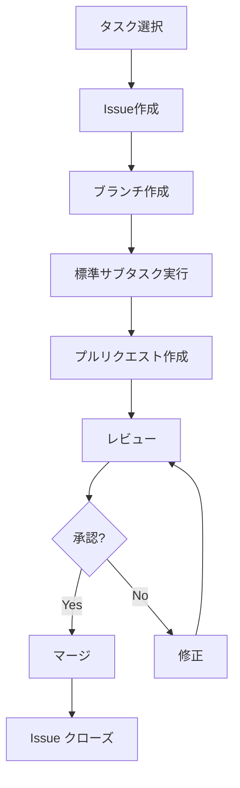

# タスク管理表

## メタデータ
| 項目 | 内容 |
|------|------|
| ドキュメントID | MGMT-001 |
| バージョン | 1.0 |
| 作成日 | YYYY-MM-DD |
| 最終更新日 | YYYY-MM-DD |
| ステータス | ドラフト/レビュー中/承認済み |
| 作成者 | [作成者名] |
| レビュー者 | [レビュー者名] |
| 承認者 | [承認者名] |
| 関連文書 | TASK-001 (ファイル単位タスクリスト) |
| 変更履歴 | 1.0: 初版作成 (YYYY-MM-DD) |

## 1. タスク管理方針

### 1.1 管理原則
- Issue駆動開発の実践
- 1タスク = 1Issue = 1プルリクエスト
- 標準サブタスクの必須実行
- 品質ゲートの自動チェック

### 1.2 ワークフロー



## 2. Issue管理

### 2.1 Issue作成テンプレート
```markdown
## 概要
[タスクの概要を記述]

## 実装対象
- ファイル: [ファイルパス]
- クラス/関数: [実装対象]

## 実装仕様
### メソッド一覧
- method1(): [機能説明]
- method2(): [機能説明]

### 依存関係
- 参照するクラス: [クラス一覧]
- 提供するインターフェース: [IF一覧]

## テスト要件
- [ ] 正常系テスト
- [ ] 異常系テスト
- [ ] 境界値テスト

## 完了条件
- [ ] 実装完了
- [ ] 単体テスト90%以上カバレッジ
- [ ] コーディング規約準拠
- [ ] レビュー完了

## 関連情報
- 設計書: [リンク]
- 依存タスク: [タスクID]
```

### 2.2 ラベル管理
| ラベル | 用途 | 色 |
|--------|------|-----|
| feature | 新機能実装 | 緑 |
| bug | バグ修正 | 赤 |
| enhancement | 改善 | 青 |
| documentation | ドキュメント | 黄 |
| layer:presentation | プレゼンテーション層 | 紫 |
| layer:application | アプリケーション層 | オレンジ |
| layer:domain | ドメイン層 | 茶 |
| layer:infrastructure | インフラ層 | グレー |
| priority:high | 高優先度 | 赤 |
| priority:medium | 中優先度 | 黄 |
| priority:low | 低優先度 | 緑 |

## 3. 標準サブタスク管理

### 3.1 サブタスクチェックリスト
各タスクで以下の7つのサブタスクを必須実行：

#### 1. 仕様確認
- [ ] 設計書の理解
- [ ] 依存関係の確認
- [ ] インターフェース仕様の確認
- [ ] 例外処理方針の理解

#### 2. コーディング
- [ ] クラス・メソッドの実装
- [ ] コーディング規約の遵守
- [ ] エラーハンドリングの実装
- [ ] ログ出力の実装

#### 3. テストコーディング
- [ ] 単体テストの実装
- [ ] モック・スタブの作成
- [ ] テストデータの準備
- [ ] 境界値テストの実装

#### 4. 単体テスト実行
- [ ] 全テストケースの実行
- [ ] カバレッジ90%以上の確認
- [ ] テスト結果の記録
- [ ] 失敗ケースの修正

#### 5. リポジトリコミット
- [ ] 適切なコミットメッセージ
- [ ] 関連Issueの紐付け
- [ ] コンフリクトの解決
- [ ] プッシュの実行

#### 6. ToDoチェック
- [ ] 全サブタスクの完了確認
- [ ] 品質基準の達成確認
- [ ] ドキュメントの更新
- [ ] 次タスクへの影響確認

#### 7. Issueクローズ
- [ ] 完了条件の全項目達成
- [ ] レビュー結果の反映
- [ ] 関連ドキュメントの更新
- [ ] ステークホルダーへの報告

### 3.2 品質チェックポイント
| チェック項目 | 基準 | 自動化 |
|-------------|------|--------|
| コーディング規約 | ESLint エラー0件 | ○ |
| テストカバレッジ | 90%以上 | ○ |
| 静的解析 | SonarQube A grade | ○ |
| セキュリティ | 脆弱性0件 | ○ |
| ビルド | 成功 | ○ |

## 4. 完了確認
- [ ] Issue管理プロセスが定義されている
- [ ] 標準サブタスクが明確に定義されている
- [ ] 品質チェックポイントが設定されている
- [ ] ワークフローが明確である
