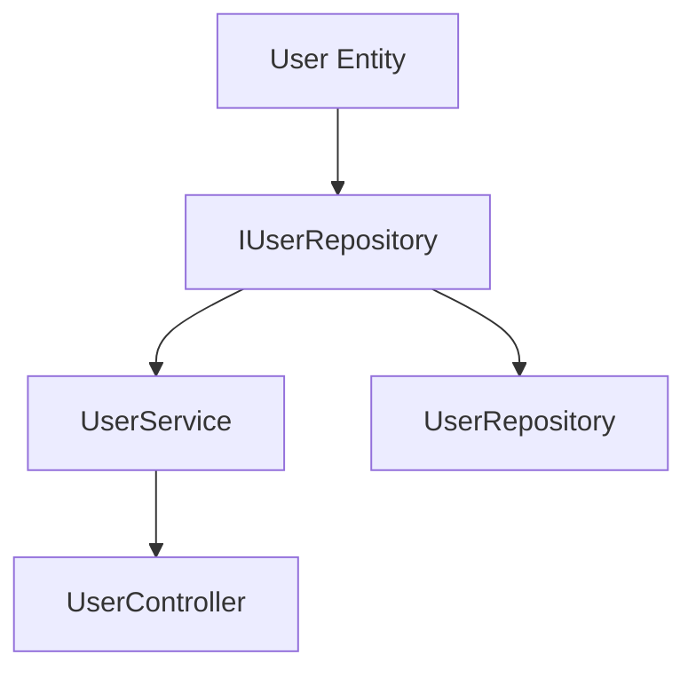

# STEP 6: ToDoリスト作成手順書

## メタデータ
| 項目 | 内容 |
|------|------|
| ドキュメントID | GUIDE-006 |
| 関連文書 | TODO-001, COMP-001, DIR-001 |
| 作成日 | YYYY-MM-DD |
| 最終更新日 | YYYY-MM-DD |

## 概要

本手順書は、STEP 6「ToDoリスト作成」において、論文想定の階層構造チェックボックス形式のtoDoリストを作成するための具体的な手順を示します。

**重要**: このtoDoリストは、プロセスエンジニアリング手法の核心部分であり、ファイル単位タスク管理と7つの標準サブタスクによる品質保証を実現します。

## 前提条件

### 必要な成果物（STEP 5まで完了）
- [ ] ディレクトリ構造マップ (`docs/implementation/directory-structure.md`)
- [ ] 実装コンポーネント一覧 (`docs/implementation/components.md`)
- [ ] クラス設計表 (`docs/detailed-design/classes.md`)
- [ ] メソッドI/Fリスト (`docs/detailed-design/interfaces.md`)

### 参照文書
- `docs/templates/step6-todo-list-template.md` - テンプレート
- `docs/templates/cline-process-engineering-rules.md` - 実装ルール

## 作成手順

### STEP 1: 実装対象ファイルの洗い出し

#### 1.1 ディレクトリ構造の確認
```bash
# ディレクトリ構造マップから実装対象を確認
cat docs/implementation/directory-structure.md
```

#### 1.2 実装ファイル一覧の作成
以下の順序で実装ファイルを特定：

1. **ドメイン層** (`src/domain/`)
   - エンティティファイル (*.ts)
   - リポジトリインターフェースファイル (*.ts)

2. **アプリケーション層** (`src/application/`)
   - サービスファイル (*.ts)
   - ユースケースファイル (*.ts)

3. **インフラ層** (`src/infrastructure/`)
   - リポジトリ実装ファイル (*.ts)
   - 外部API連携ファイル (*.ts)

4. **プレゼンテーション層** (`src/presentation/`)
   - コントローラファイル (*.ts)
   - DTOファイル (*.ts)

#### 1.3 依存関係の整理
```markdown
## 依存関係マップ例
Entity → Repository Interface → Service → Controller
Entity → Repository Implementation (Infrastructure)
```

### STEP 2: タスクIDの付与とタスクリスト作成

#### 2.1 命名規則の適用
**形式**: `TSK-{連番3桁}-{レイヤー}-{ファイル名}`

#### 2.2 レイヤー略語の使用
| 略語 | 意味 | 例 |
|------|------|-----|
| ENT | Entity | TSK-001-ENT-User |
| SVC | Service | TSK-002-SVC-UserService |
| REP | Repository | TSK-003-REP-UserRepository |
| CTL | Controller | TSK-004-CTL-UserController |
| DTO | Data Transfer Object | TSK-005-DTO-UserRequest |
| UTL | Utility | TSK-006-UTL-Logger |

#### 2.3 実装順序の決定
依存関係に基づいて実装順序を決定：
```
1. ENT (Entity) - 依存なし
2. REP Interface - ENTに依存
3. SVC (Service) - ENT, REP Interfaceに依存
4. REP Implementation - ENT, REP Interfaceに依存
5. CTL (Controller) - SVC, DTOに依存
6. DTO - ENTに依存
```

#### 2.4 タスクリスト文書の作成
**成果物**: `docs/tasks/task-list.md`

STEP 1-2の結果を基に、表形式のタスクリストを作成：

```markdown
# ファイル単位タスクリスト

## タスク一覧

| タスクID | ファイル名 | レイヤー | 優先度 | 依存タスク | 見積時間 |
|----------|------------|----------|--------|------------|----------|
| TSK-001-ENT-User | User.ts | Domain | 高 | なし | 4h |
| TSK-002-REP-IUserRepository | IUserRepository.ts | Domain | 高 | TSK-001 | 2h |
| TSK-003-SVC-UserService | UserService.ts | Application | 高 | TSK-002 | 6h |
| TSK-004-REP-UserRepository | UserRepository.ts | Infrastructure | 中 | TSK-002 | 5h |
| TSK-005-CTL-UserController | UserController.ts | Presentation | 高 | TSK-003 | 4h |
| TSK-006-DTO-UserRequest | UserRequest.ts | Presentation | 中 | TSK-001 | 2h |
```

### STEP 3: ToDoリストの構造化（カテゴリ単位管理）

#### 3.1 ToDoリスト管理単位の決定

**重要**: ファイル単位でサブタスクを展開すると膨大になるため、以下のカテゴリ単位で管理：

1. **機能モジュール単位**: ユーザー管理、認証、レポート等
2. **レイヤー単位**: ドメイン層、アプリケーション層等
3. **実装フェーズ単位**: MVP、機能拡張、最適化等

#### 3.2 カテゴリ分割ルール

**小規模プロジェクト（10ファイル未満）**:
```markdown
## 1. ドメイン層実装
### 1.1 エンティティ実装
### 1.2 リポジトリインターフェース実装

## 2. アプリケーション層実装
### 2.1 サービス実装

## 3. インフラ・プレゼンテーション層実装
### 3.1 リポジトリ実装
### 3.2 コントローラ・DTO実装
```

**中規模プロジェクト（10-30ファイル）**:
```markdown
## 1. ユーザー管理機能
### 1.1 ユーザーエンティティ・リポジトリ
### 1.2 ユーザーサービス・コントローラ

## 2. 認証機能
### 2.1 認証エンティティ・リポジトリ
### 2.2 認証サービス・コントローラ

## 3. レポート機能
### 3.1 レポートエンティティ・リポジトリ
### 3.2 レポートサービス・コントローラ
```

**大規模プロジェクト（30ファイル以上）**:
```markdown
## フェーズ1: MVP実装
### 1.1 コア機能（ユーザー管理）
### 1.2 基本認証

## フェーズ2: 機能拡張
### 2.1 高度な検索機能
### 2.2 レポート機能

## フェーズ3: 最適化・運用
### 3.1 パフォーマンス最適化
### 3.2 監視・ログ機能
```

#### 3.3 カテゴリ内タスク定義
各カテゴリ内で関連するタスクをグループ化：

```markdown
## 1. ユーザー管理機能
### 1.1 ユーザーエンティティ・リポジトリ
- [ ] **TSK-001-ENT-User**: User.ts作成・検証
- [ ] **TSK-002-REP-IUserRepository**: IUserRepository.ts作成・検証
- [ ] **TSK-004-REP-UserRepository**: UserRepository.ts作成・検証

### 1.2 ユーザーサービス・コントローラ
- [ ] **TSK-003-SVC-UserService**: UserService.ts作成・検証
- [ ] **TSK-005-CTL-UserController**: UserController.ts作成・検証
- [ ] **TSK-006-DTO-UserRequest**: UserRequest.ts作成・検証
```

### STEP 4: 7つの標準サブタスクの選択的展開

#### 4.1 サブタスク展開の方針

**全展開**: 重要度が高く、複雑なタスクのみ
**簡略展開**: 定型的で単純なタスク

#### 4.2 重要タスクの全展開例

**複雑なサービスクラス（全展開）**:

```markdown
- [ ] **TSK-001-ENT-User**: User.ts作成・検証
  - [ ] 仕様確認・設計理解
    - [ ] 詳細設計文書の確認
    - [ ] インターフェース仕様の理解
    - [ ] 依存関係の確認
    - [ ] 例外処理方針の理解
  - [ ] コーディング
    - [ ] クラス/関数の実装
    - [ ] エラーハンドリングの実装
    - [ ] ログ出力の実装
    - [ ] コーディング規約の遵守
  - [ ] テストコーディング
    - [ ] 正常系テストの実装
    - [ ] 異常系テストの実装
    - [ ] 境界値テストの実装
    - [ ] モック・スタブの実装
  - [ ] 単体テスト実行
    - [ ] 全テストケースの実行
    - [ ] カバレッジ90%以上の確認
    - [ ] パフォーマンス要件の確認
    - [ ] メモリリークの確認
  - [ ] リポジトリコミット
    - [ ] コミットメッセージ規約の遵守
    - [ ] 関連Issueの紐付け
    - [ ] 適切な粒度でのコミット
    - [ ] コンフリクトの解決
  - [ ] ToDoチェック
    - [ ] 全サブタスクの完了確認
    - [ ] 品質基準の達成確認
    - [ ] ドキュメントの更新
    - [ ] 次タスクへの影響確認
  - [ ] Issueクローズ
    - [ ] 完了条件の全項目達成
    - [ ] レビュー結果の反映
    - [ ] 関連ドキュメントの更新
    - [ ] ステークホルダーへの報告
```

#### 4.3 簡略展開の例

**単純なDTOクラス（簡略展開）**:
```markdown
- [ ] **TSK-006-DTO-UserRequest**: UserRequest.ts作成・検証
  - [ ] 仕様確認・設計理解
  - [ ] コーディング
  - [ ] テストコーディング
  - [ ] 単体テスト実行
  - [ ] リポジトリコミット
  - [ ] ToDoチェック
  - [ ] Issueクローズ
```

#### 4.4 展開レベルの判断基準

| ファイル種別 | 複雑度 | 展開レベル | 理由 |
|-------------|--------|------------|------|
| Entity | 高 | 全展開 | ビジネスロジック複雑 |
| Service | 高 | 全展開 | 多数のメソッド、複雑な処理 |
| Controller | 中 | 中展開 | API仕様に依存 |
| Repository | 中 | 中展開 | データアクセス処理 |
| DTO | 低 | 簡略展開 | 単純なデータ構造 |
| Utility | 低 | 簡略展開 | 汎用的な処理 |

#### 4.5 詳細サブタスクのカスタマイズ
ファイルの特性に応じて詳細サブタスクをカスタマイズ：

**エンティティの場合:**
```markdown
  - [ ] コーディング
    - [ ] エンティティクラスの実装
    - [ ] プロパティの実装
    - [ ] ビジネスルールメソッドの実装
    - [ ] バリデーション処理の実装
```

**コントローラの場合:**
```markdown
  - [ ] コーディング
    - [ ] REST APIエンドポイントの実装
    - [ ] リクエスト/レスポンス処理の実装
    - [ ] バリデーション処理の実装
    - [ ] エラーハンドリングの実装
```

**DTOの場合:**
```markdown
  - [ ] コーディング
    - [ ] データ構造の定義
    - [ ] バリデーションアノテーションの追加
```

#### 4.6 カテゴリ単位での進捗管理

**カテゴリレベルの進捗表示:**
```markdown
## 1. ユーザー管理機能 [████████░░] 80% (4/5タスク完了)
### 1.1 ユーザーエンティティ・リポジトリ [██████████] 100% (3/3タスク完了)
- [x] **TSK-001-ENT-User**: User.ts作成・検証
- [x] **TSK-002-REP-IUserRepository**: IUserRepository.ts作成・検証
- [x] **TSK-004-REP-UserRepository**: UserRepository.ts作成・検証

### 1.2 ユーザーサービス・コントローラ [██████░░░░] 60% (1/2タスク完了)
- [x] **TSK-003-SVC-UserService**: UserService.ts作成・検証
- [ ] **TSK-005-CTL-UserController**: UserController.ts作成・検証
  - [x] 仕様確認・設計理解
  - [x] コーディング
  - [ ] テストコーディング
  - [ ] 単体テスト実行
  - [ ] リポジトリコミット
  - [ ] ToDoチェック
  - [ ] Issueクローズ
```

### STEP 5: 進捗管理機能の追加

#### 5.1 進捗可視化セクションの追加
```markdown
## 進捗管理

### 進捗の可視化
```text
全体進捗: [░░░░░░░░░░] 0% (0/10タスク完了)

フェーズ別進捗:
- フェーズ1: [░░░░░░░░░░] 0% (0/3タスク完了)
- フェーズ2: [░░░░░░░░░░] 0% (0/4タスク完了)
- フェーズ3: [░░░░░░░░░░] 0% (0/3タスク完了)
```

### 完了基準
- [ ] 全メインタスクが完了している
- [ ] 各タスクの7つの標準サブタスクがすべて完了している
- [ ] 品質基準（テストカバレッジ90%以上等）を満たしている
- [ ] 関連ドキュメントが更新されている
- [ ] 全Issueがクローズされている
```

#### 5.2 タスクID命名規則セクションの追加
```markdown
## タスクID命名規則

### 基本形式
**TSK-{連番3桁}-{レイヤー}-{ファイル名}**

### レイヤー略語
| 略語 | 意味 | 例 |
|------|------|-----|
| ENT | Entity（エンティティ） | TSK-001-ENT-User |
| SVC | Service（サービス） | TSK-002-SVC-UserService |
| REP | Repository（リポジトリ） | TSK-003-REP-UserRepository |
| CTL | Controller（コントローラ） | TSK-004-CTL-UserController |
| DTO | Data Transfer Object | TSK-005-DTO-UserRequest |
| UTL | Utility（ユーティリティ） | TSK-006-UTL-Logger |
```

### STEP 6: 品質チェックの組み込み

#### 6.1 完了確認チェックリストの追加
```markdown
## 完了確認
- [ ] 全ファイルがタスクとして定義されている
- [ ] 各タスクに7つの標準サブタスクが設定されている
- [ ] タスクIDが命名規則に従っている
- [ ] 依存関係が考慮されている
- [ ] 進捗管理方法が明確である
- [ ] 品質基準が設定されている
```

## 実践例

### 例: ユーザー管理システムのToDoリスト作成

#### STEP 1: ファイル洗い出し
```
src/domain/entities/User.ts
src/domain/repositories/IUserRepository.ts
src/application/services/UserService.ts
src/infrastructure/repositories/UserRepository.ts
src/presentation/controllers/UserController.ts
src/presentation/dto/UserCreateRequest.ts
src/presentation/dto/UserResponse.ts
```

#### STEP 2: タスクID付与
```
TSK-001-ENT-User
TSK-002-REP-IUserRepository
TSK-003-SVC-UserService
TSK-004-REP-UserRepository
TSK-005-CTL-UserController
TSK-006-DTO-UserCreateRequest
TSK-007-DTO-UserResponse
```

#### STEP 3: 依存関係整理
```
TSK-001 → TSK-002 → TSK-003 → TSK-005
TSK-001 → TSK-002 → TSK-004
TSK-001 → TSK-006, TSK-007
```

#### STEP 4: ToDoリスト作成
テンプレートを使用して階層構造のToDoリストを作成

## よくある問題と対処法

### 問題1: ファイル数が多すぎる
**対処法**: フェーズを細分化し、優先度を設定
```markdown
## 1. 最小機能実装（MVP）
### 1.1 コアエンティティ
### 1.2 基本CRUD操作

## 2. 機能拡張
### 2.1 高度な検索機能
### 2.2 レポート機能
```

### 問題2: 依存関係が複雑
**対処法**: 依存関係図を作成


### 問題3: サブタスクが多すぎる
**対処法**: ファイルの複雑度に応じてサブタスクを調整
- 簡単なDTO: 詳細サブタスクを簡略化
- 複雑なサービス: 詳細サブタスクを詳細化

## チェックリスト

### 作成前チェック
- [ ] STEP 5までの成果物が完成している
- [ ] 実装対象ファイルが明確になっている
- [ ] 依存関係が整理されている
- [ ] テンプレートが準備されている

### 作成中チェック
- [ ] タスクIDが命名規則に従っている
- [ ] 7つの標準サブタスクが全タスクに設定されている
- [ ] 依存関係順に並んでいる
- [ ] 詳細サブタスクが適切にカスタマイズされている

### 作成後チェック
- [ ] 全実装ファイルがカバーされている
- [ ] 進捗管理機能が組み込まれている
- [ ] 品質基準が明確に定義されている
- [ ] 完了確認チェックリストが含まれている

## 完了確認
- [ ] ToDoリスト作成手順が明確に定義されている
- [ ] 実践例が含まれている
- [ ] よくある問題と対処法が記載されている
- [ ] チェックリストが完備されている
- [ ] テンプレートとの整合性が確保されている
