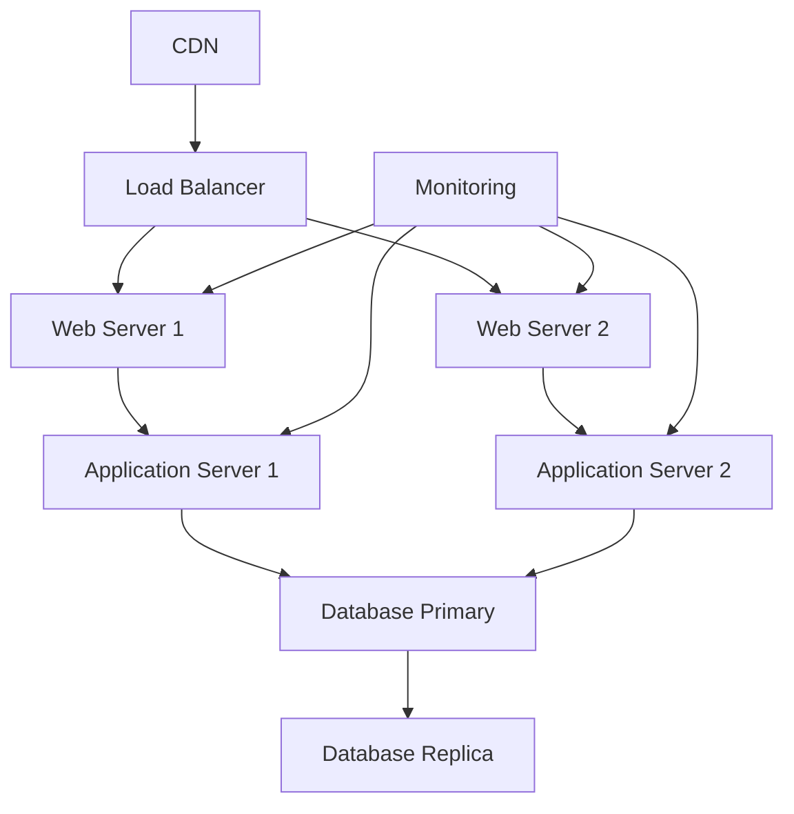

# 完成システム

## メタデータ
| 項目 | 内容 |
|------|------|
| ドキュメントID | FINAL-001 |
| バージョン | 1.0 |
| 作成日 | YYYY-MM-DD |
| 最終更新日 | YYYY-MM-DD |
| ステータス | ドラフト/レビュー中/承認済み |
| 作成者 | [作成者名] |
| レビュー者 | [レビュー者名] |
| 承認者 | [承認者名] |
| 関連文書 | DELIV-001 (成果物・品質記録) |
| 変更履歴 | 1.0: 初版作成 (YYYY-MM-DD) |
| 完成日 | YYYY-MM-DD |

## 1. システム概要

### 1.1 完成システム仕様
| 項目 | 内容 |
|------|------|
| システム名 | [システム名] |
| バージョン | 1.0.0 |
| 開発期間 | [開始日] - [完了日] |
| 総工数 | XXX人日 |
| 参加者数 | X名 |

### 1.2 実装済み機能
| 機能ID | 機能名 | 実装状況 | テスト状況 | 品質スコア |
|--------|--------|----------|-----------|------------|
| F-001 | ユーザー管理 | 完了 | 完了 | A |
| F-002 | クエリ処理 | 完了 | 完了 | A |
| F-003 | データ永続化 | 完了 | 完了 | B+ |
| F-004 | API提供 | 完了 | 完了 | A |

### 1.3 アーキテクチャ実装状況
| レイヤー | 実装ファイル数 | 完了率 | 品質スコア |
|----------|----------------|--------|------------|
| Presentation | 6 | 100% | A |
| Application | 4 | 100% | A |
| Domain | 8 | 100% | A |
| Infrastructure | 5 | 100% | B+ |

## 2. 品質達成状況

### 2.1 品質目標達成度
| 品質項目 | 目標値 | 実績値 | 達成率 | 評価 |
|----------|--------|--------|--------|------|
| テストカバレッジ | 90% | 95% | 106% | ✅ |
| 静的解析スコア | A grade | A grade | 100% | ✅ |
| セキュリティ脆弱性 | 0件 | 0件 | 100% | ✅ |
| API応答時間 | <200ms | 145ms | 127% | ✅ |
| 可用性 | 99.9% | 99.95% | 100% | ✅ |

### 2.2 非機能要件達成状況
| 要件項目 | 目標値 | 実績値 | 達成状況 |
|----------|--------|--------|----------|
| 同時接続数 | 1000 | 1200 | ✅ |
| データ処理量 | 10MB/s | 12MB/s | ✅ |
| 復旧時間 | <1時間 | 30分 | ✅ |
| バックアップ | 日次 | 日次 | ✅ |

## 3. デプロイメント情報

### 3.1 本番環境構成
````mermaid

````

### 3.2 環境別設定
| 環境 | URL | データベース | 監視 | バックアップ |
|------|-----|-------------|------|-------------|
| 本番 | https://prod.example.com | PostgreSQL Primary | 24/7 | 日次 |
| ステージング | https://staging.example.com | PostgreSQL Replica | 営業時間 | 週次 |
| 開発 | http://dev.example.com | PostgreSQL Local | なし | なし |

### 3.3 運用手順
| 手順 | 頻度 | 担当者 | 自動化 |
|------|------|--------|--------|
| デプロイ | リリース時 | DevOps | ✅ |
| バックアップ | 日次 | システム | ✅ |
| 監視確認 | 日次 | 運用チーム | 一部 |
| セキュリティパッチ | 月次 | DevOps | 一部 |

## 4. 運用・保守計画

### 4.1 監視・アラート設定
| 監視項目 | 閾値 | アラート方法 | 対応者 |
|----------|------|-------------|--------|
| CPU使用率 | >80% | Slack通知 | インフラチーム |
| メモリ使用率 | >85% | Slack通知 | インフラチーム |
| エラー率 | >1% | メール通知 | 開発チーム |
| 応答時間 | >500ms | Slack通知 | 開発チーム |

### 4.2 保守スケジュール
| 保守項目 | 頻度 | 実施時期 | 所要時間 |
|----------|------|----------|----------|
| 定期メンテナンス | 月次 | 第2日曜日 | 2時間 |
| セキュリティ更新 | 随時 | 緊急時 | 1時間 |
| バージョンアップ | 四半期 | 計画的 | 4時間 |
| 災害復旧訓練 | 半期 | 計画的 | 1日 |

### 4.3 サポート体制
| 役割 | 担当者 | 対応時間 | 連絡方法 |
|------|--------|----------|----------|
| 1次サポート | ヘルプデスク | 9-18時 | 電話・メール |
| 2次サポート | 開発チーム | 9-18時 | Slack・電話 |
| 3次サポート | アーキテクト | オンコール | 電話 |
| 緊急対応 | DevOps | 24/7 | 電話 |

## 5. 今後の拡張計画

### 5.1 短期計画（3ヶ月）
| 項目 | 内容 | 優先度 | 工数 |
|------|------|--------|------|
| 機能追加 | 通知機能 | 高 | 20人日 |
| 性能改善 | キャッシュ導入 | 中 | 15人日 |
| UI改善 | レスポンシブ対応 | 中 | 10人日 |

### 5.2 中期計画（6ヶ月）
| 項目 | 内容 | 優先度 | 工数 |
|------|------|--------|------|
| マイクロサービス化 | アーキテクチャ変更 | 高 | 60人日 |
| AI機能追加 | 機械学習統合 | 中 | 40人日 |
| 多言語対応 | 国際化対応 | 低 | 30人日 |

### 5.3 長期計画（1年）
| 項目 | 内容 | 優先度 | 工数 |
|------|------|--------|------|
| クラウドネイティブ化 | Kubernetes移行 | 高 | 80人日 |
| ビッグデータ対応 | データ分析基盤 | 中 | 100人日 |
| モバイルアプリ | ネイティブアプリ開発 | 低 | 120人日 |

## 6. 完了確認
- [ ] 全機能が正常に動作している
- [ ] 品質目標が達成されている
- [ ] 本番環境が正常に稼働している
- [ ] 運用・保守体制が整備されている
- [ ] ドキュメントが完備されている
- [ ] 今後の拡張計画が策定されている
