# AIコーディング開発プロセス体系化ドキュメント（統合完全版）

## 1. 概要

本ドキュメントは、AIエージェントによるソフトウェア開発プロセスを体系化したものです。従来の開発手法とは異なり、**要件から実装まで段階的に詳細化していくプロセス**を重視し、各フェーズでの情報の流れ（インプット・プロセス・アウトプット）を明確に定義します。

### 1.1 AIコーディングの基本原則

1. **段階的詳細化**: 抽象的な要件から具体的な実装まで、段階的に詳細化
2. **情報の構造化**: 各段階での情報を標準化された形式で管理
3. **検証可能性**: 各段階で品質チェックポイントを設定
4. **トレーサビリティ**: 要件から実装まで追跡可能な情報管理
5. **部品化と再利用**: クラス・メソッドの依存関係を明示し、重複実装を防止
6. **ファイル単位タスク管理**: コーディング対象をファイル単位で管理し、標準化されたサブタスクで実行

### 1.2 従来開発プロセスとの違い

| 項目 | 従来プロセス | AIコーディングプロセス |
|------|------------|---------------------|
| 詳細化方法 | 人間の経験と判断 | AI による段階的分析・設計 |
| ドキュメント作成 | 手動作成、属人的 | 構造化テンプレート、自動生成 |
| 品質管理 | レビュー中心 | 各段階での自動検証 |
| 変更管理 | 影響分析が困難 | トレーサビリティによる影響分析 |
| 部品再利用 | 暗黙知に依存 | 明示的な参照構造による管理 |
| タスク管理 | 機能単位・人的判断 | ファイル単位・標準化サブタスク |

## 2. 全体プロセスフロー

### 2.1 プロセス全体図

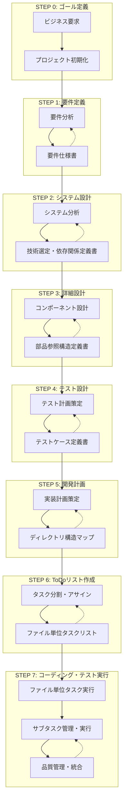

### 2.2 コーディング・テスト実行フロー詳細

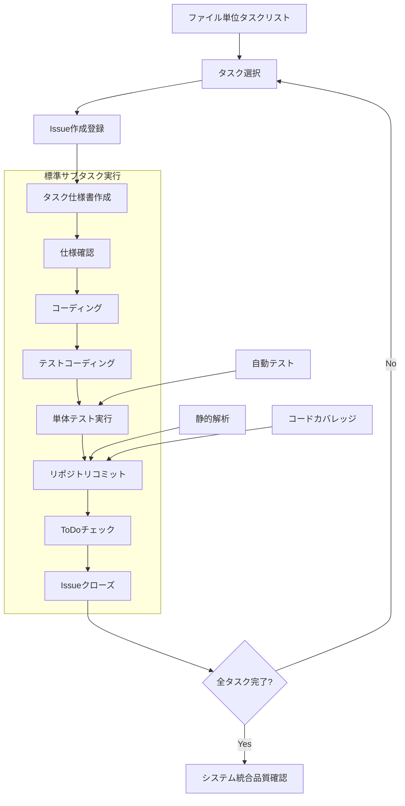

## 3. ステップ別詳細プロセス定義

### STEP 0: ゴール定義

#### サブステップ構造

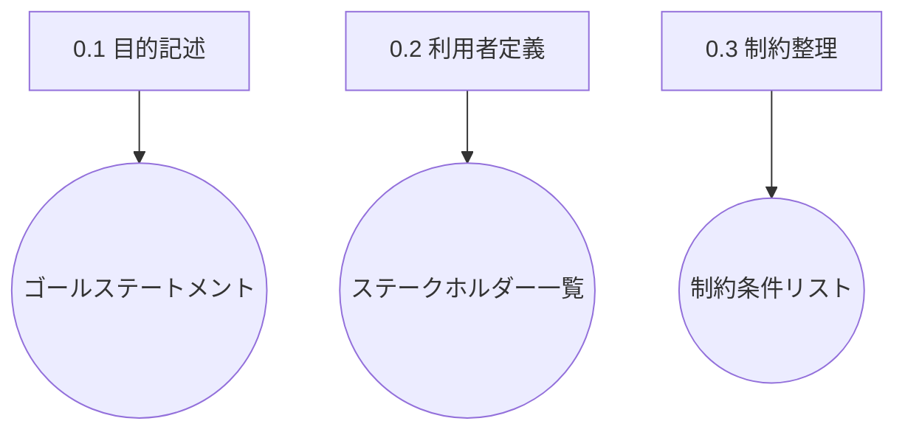

#### 成果物一覧
| サブステップ | インプット | アウトプット | 用途 |
|-------------|-----------|-------------|------|
| 0.1 目的記述 | 要望・背景 | ゴールステートメント | 以降の全ステップの指針 |
| 0.2 利用者定義 | ゴール | ステークホルダー一覧 | ユースケース抽出時に使用 |
| 0.3 制約整理 | 要望・運用条件 | 制約条件リスト | 要件抽出時に使用 |

### STEP 1: 要件定義

#### サブステップ構造

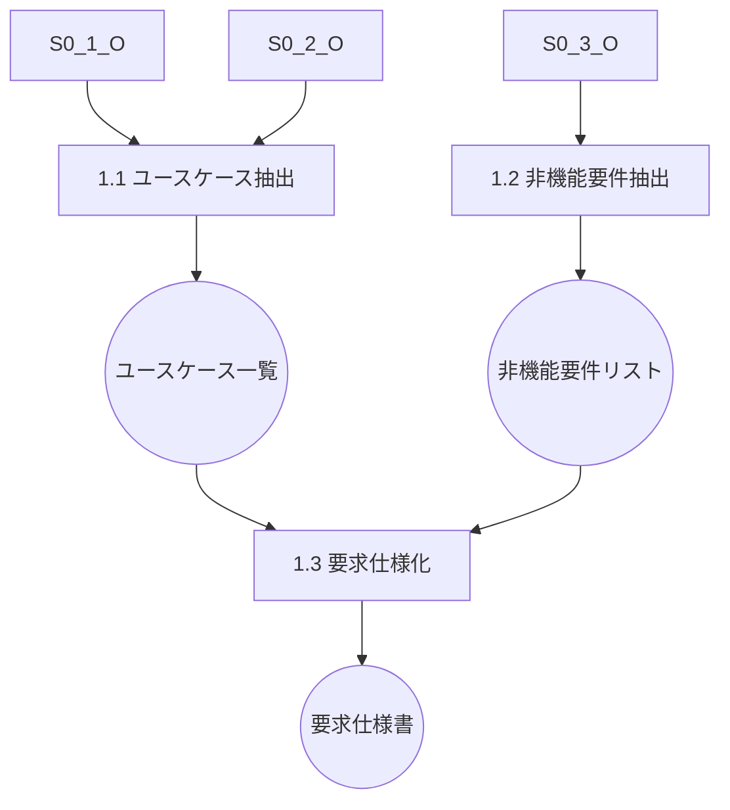

#### 成果物一覧
| サブステップ | インプット | アウトプット | 用途 |
|-------------|-----------|-------------|------|
| 1.1 ユースケース抽出 | ゴール、ステークホルダー | ユースケース一覧 | 機能要件定義の基礎 |
| 1.2 非機能要件抽出 | ゴール、制約条件 | 非機能要件リスト | アーキテクチャ定義に使用 |
| 1.3 要求仕様化 | ユースケース、非機能要件 | 要求仕様書 | システム設計の前提 |

### STEP 2: システム設計

#### サブステップ構造

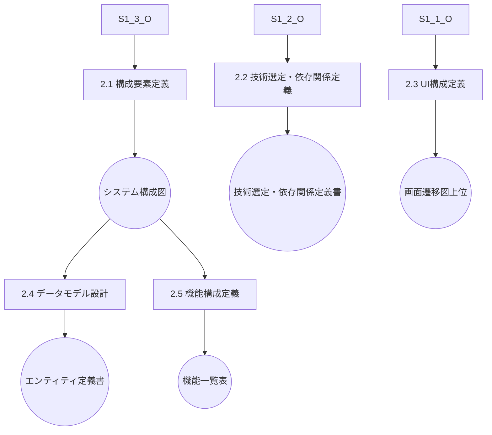

#### 成果物一覧
| サブステップ | インプット | アウトプット | 用途 |
|-------------|-----------|-------------|------|
| 2.1 構成要素定義 | 要求仕様書 | システム構成図 | レイヤー設計の元情報 |
| 2.2 技術選定・依存関係定義 | 非機能要件、構成図 | **技術選定・依存関係定義書** | 開発フレーム・ライブラリ選定 |
| 2.3 UI構成定義 | ユースケース、ステークホルダー | 画面遷移図（上位） | 詳細UI設計に継承 |
| 2.4 データモデル設計 | ユースケース、構成図 | エンティティ定義書 | DBスキーマ、データ契約 |
| 2.5 機能構成定義 | ユースケース、構成図 | 機能一覧表 | コンポーネント設計に使用 |

### STEP 3: 詳細設計

#### サブステップ構造

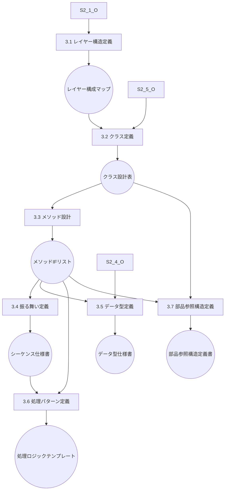

#### 成果物一覧
| サブステップ | インプット | アウトプット | 用途 |
|-------------|-----------|-------------|------|
| 3.1 レイヤー構造定義 | システム構成図、技術選定書 | レイヤー構成マップ | クラス設計の基盤 |
| 3.2 クラス定義 | 機能一覧表、レイヤーマップ | クラス設計表 | I/F・ロジック設計に使用 |
| 3.3 メソッド設計 | クラス設計表、データ定義 | メソッドI/Fリスト | シーケンス定義に使用 |
| 3.4 振る舞い定義 | メソッドI/F、ユースケース | シーケンス仕様書 | テスト設計に使用 |
| 3.5 データ型定義 | エンティティ定義、I/F定義 | データ型仕様書 | 入出力形式の標準化 |
| 3.6 処理パターン定義 | メソッドI/F、振る舞い仕様 | 処理ロジックテンプレート | テスト設計・実装補助 |
| 3.7 部品参照構造定義 | クラス設計表、メソッドI/F | **部品参照構造定義書** | 再利用・依存関係管理 |

### STEP 4: テスト設計

#### サブステップ構造

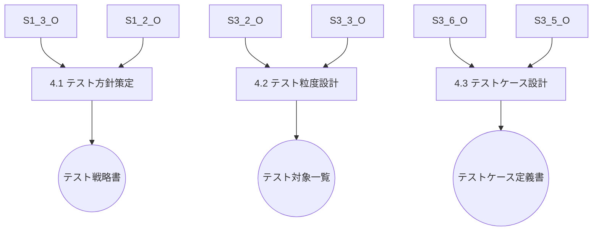

#### 成果物一覧
| サブステップ | インプット | アウトプット | 用途 |
|-------------|-----------|-------------|------|
| 4.1 テスト方針策定 | 要求仕様書、非機能要件 | テスト戦略書 | 粒度設定と優先付けに使用 |
| 4.2 テスト粒度設計 | クラス設計表、メソッドI/F | テスト対象一覧 | ケース網羅の起点 |
| 4.3 テストケース設計 | 処理パターン、データ型 | テストケース定義書 | テストコード生成の基盤 |

### STEP 5: 開発計画

#### サブステップ構造

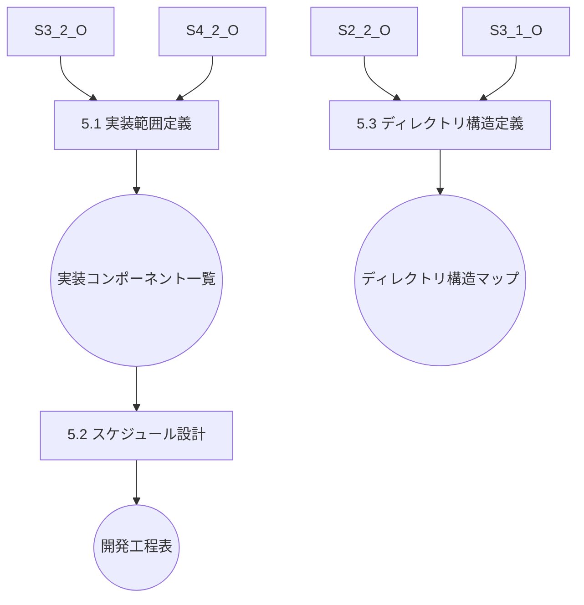

#### 成果物一覧
| サブステップ | インプット | アウトプット | 用途 |
|-------------|-----------|-------------|------|
| 5.1 実装範囲定義 | テスト対象一覧、クラス設計 | 実装コンポーネント一覧 | WBS定義に使用 |
| 5.2 スケジュール設計 | 実装一覧、優先度 | 開発工程表 | ToDoリストの構成単位に |
| 5.3 ディレクトリ構造定義 | 技術選定書、レイヤー構成 | **ディレクトリ構造マップ** | ファイル配置の基準 |

### STEP 6: ToDoリスト作成

#### サブステップ構造

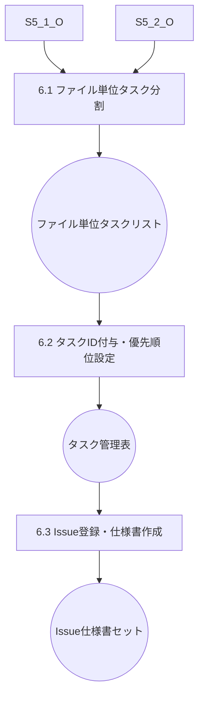

#### 成果物一覧
| サブステップ | インプット | アウトプット | 用途 |
|-------------|-----------|-------------|------|
| 6.1 ファイル単位タスク分割 | 実装一覧、スケジュール表 | ファイル単位タスクリスト | コーディング実行の基本単位 |
| 6.2 タスクID付与・優先順位設定 | タスクリスト、依存関係 | タスク管理表 | 実行順序とトレーサビリティ確保 |
| 6.3 Issue登録・仕様書作成 | タスク管理表、設計書 | Issue・仕様書セット | 実作業の詳細指示書 |

### STEP 7: コーディング・テスト実行

#### サブステップ構造

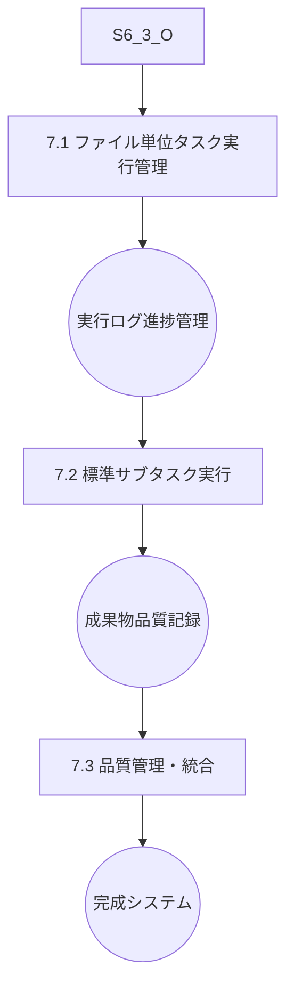

#### 成果物一覧
| サブステップ | インプット | アウトプット | 用途 |
|-------------|-----------|-------------|------|
| 7.1 ファイル単位タスク実行管理 | Issue・仕様書セット | 実行ログ・進捗管理 | タスク実行状況の可視化 |
| 7.2 標準サブタスク実行 | タスク仕様、設計書 | 成果物・品質記録 | 実装・テスト・コミット |
| 7.3 品質管理・統合 | 全成果物、品質記録 | 完成システム | 最終品質確認・リリース準備 |

## 4. ファイル単位タスク管理の詳細定義

### 4.1 タスク階層構造

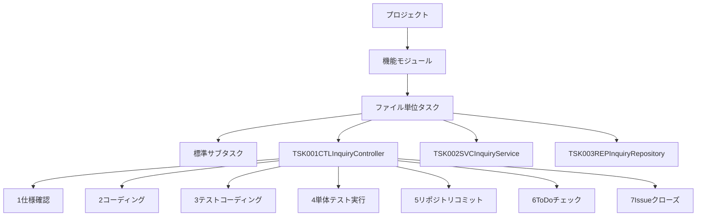

### 4.2 タスクID命名規則

**基本形式**: `TSK-{連番3桁}-{レイヤー}-{ファイル名}`

**レイヤー略語**:
- CTL: Controller（プレゼンテーション層）
- SVC: Service（アプリケーション層）
- ENT: Entity（ドメイン層）
- REP: Repository（インフラ層）
- DTO: Data Transfer Object
- UTL: Utility（共通モジュール）

**命名例**:
- `TSK-001-CTL-InquiryController`: 問い合わせコントローラ
- `TSK-002-SVC-InquiryService`: 問い合わせサービス
- `TSK-003-REP-InquiryRepository`: 問い合わせリポジトリ
- `TSK-004-ENT-Inquiry`: 問い合わせエンティティ

### 4.3 標準サブタスク定義

| サブタスク | 内容 | 成果物 | チェック項目 | 所要時間目安 |
|-----------|------|--------|-------------|-------------|
| 1. 仕様確認 | 設計書・I/F仕様の確認 | 仕様理解メモ | 依存関係、入出力、例外処理の理解 | 15分 |
| 2. コーディング | 実装コードの作成 | ソースファイル | コーディング規約、設計仕様への準拠 | 60分 |
| 3. テストコーディング | 単体テストコードの作成 | テストファイル | テストケース網羅、境界値テスト | 45分 |
| 4. 単体テスト実行 | テストの実行・デバッグ | テスト結果レポート | 全テストケースの成功 | 30分 |
| 5. リポジトリコミット | Gitへのコミット | コミット履歴 | コミットメッセージの規約準拠 | 10分 |
| 6. ToDoチェック | タスク完了マーク | チェック済みToDoリスト | 全サブタスクの完了確認 | 5分 |
| 7. Issueクローズ | 対応するIssueのクローズ | クローズ済みIssue | 成果物の品質確認 | 10分 |

### 4.4 Issue管理との連携

#### Issue作成規則

**タイトル形式**: `[{TaskID}] {ファイル名}の実装`

**本文構成**:
```markdown
## 概要
ファイルの役割と責任

## 実装仕様
### メソッド一覧
- method1(): 機能説明
- method2(): 機能説明

### 依存関係
- 参照するクラス・メソッド一覧
- 提供するI/F一覧

## テスト要件
### 必要なテストケース
- 正常系テスト
- 異常系テスト
- 境界値テスト

## 完了条件
- [ ] 全メソッドの実装完了
- [ ] 単体テスト100%カバレッジ
- [ ] コーディング規約準拠
- [ ] 設計仕様への適合
```

**ラベル設定**:
- `feature`: 新機能実装
- `layer:{レイヤー名}`: 対象レイヤー
- `priority:{高/中/低}`: 優先度
- `size:{S/M/L}`: 作業規模

#### タスク仕様書管理

**ディレクトリ構造**:
```
docs/tasks/
├── TSK-001-CTL-InquiryController.md
├── TSK-002-SVC-InquiryService.md
├── TSK-003-REP-InquiryRepository.md
└── ...
```

**仕様書テンプレート**:
```markdown
# TSK-001-CTL-InquiryController

## 概要
問い合わせ管理のREST APIコントローラ

## 実装仕様
### メソッド一覧
- POST /api/inquiries - 問い合わせ登録
- GET /api/inquiries - 問い合わせ一覧取得
- GET /api/inquiries/{id} - 問い合わせ詳細取得

### 依存関係
- InquiryService: ビジネスロジック処理
- InquiryCreateRequest: リクエストDTO
- InquiryResponse: レスポンスDTO

## テスト要件
- 正常系: 各エンドポイントの正常動作
- 異常系: バリデーションエラー、認証エラー
- 境界値: ページング、検索条件

## 完了条件
- [ ] 全メソッドの実装完了
- [ ] 単体テスト100%カバレッジ
- [ ] APIドキュメント更新
```

### 4.5 コミット管理ルール

#### コミットメッセージ規約

**基本形式**:
```
{type}(#{issue_number}): {概要}

{詳細説明}

Closes #{issue_number}
```

**例**:
```
feat(#123): InquiryControllerの実装

- 問い合わせ登録APIの実装
- バリデーション処理の追加
- 単体テストの作成

Closes #123
```

#### コミットタイプ

| タイプ | 用途 | 例 |
|--------|------|-----|
| feat | 新機能実装 | feat(#123): InquiryService実装 |
| test | テストコード追加 | test(#123): InquiryService単体テスト |
| fix | バグ修正 | fix(#123): バリデーション処理修正 |
| refactor | リファクタリング | refactor(#123): メソッド分割 |
| docs | ドキュメント更新 | docs(#123): API仕様書更新 |

### 4.6 品質管理の統合

#### 自動化チェックポイント

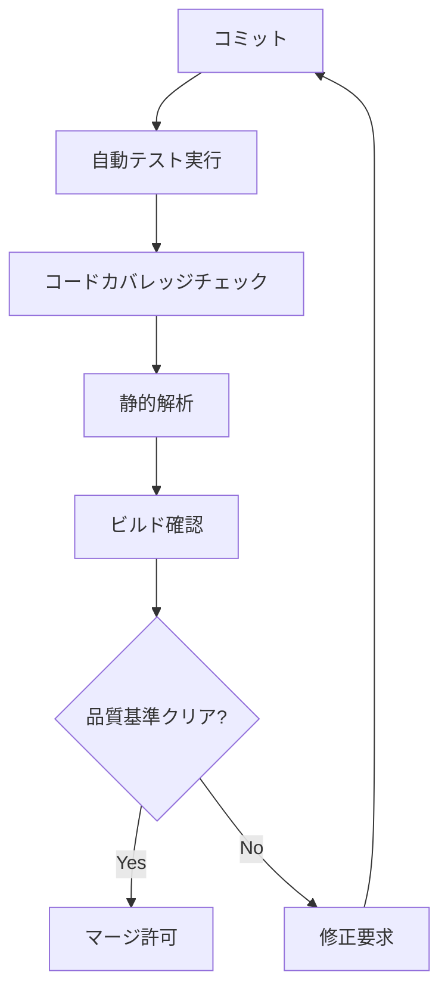

#### 品質基準

| 項目 | 基準値 | チェック方法 | 自動化レベル |
|------|--------|-------------|-------------|
| テストカバレッジ | 90%以上 | Jest/Coverage | 自動 |
| 静的解析 | エラー0件 | ESLint/SonarQube | 自動 |
| ビルド | 成功 | CI/CDパイプライン | 自動 |
| コーディング規約 | 準拠 | Prettier/ESLint | 自動 |
| セキュリティ | 脆弱性0件 | npm audit | 自動 |

#### トレーサビリティ管理

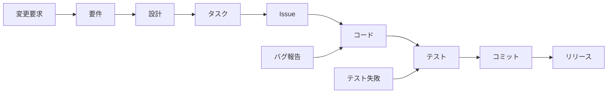

## 5. 重要成果物詳細定義

### 5.1 STEP 2.2: 技術選定・依存関係定義書

**目的**: アーキテクチャ方針と具体的な技術選定、ライブラリ・バージョン管理を統合定義

#### 5.1.1 アーキテクチャ方針
- 設計原則（単一責任、疎結合・高凝集等）
- 品質特性（性能、可用性、セキュリティ等）
- 制約条件（技術・運用制約）

### 5.1.2 技術スタック選定

| レイヤー | 技術 | バージョン | 選定理由 | 代替案 | ライセンス | セキュリティ考慮 |
|---------|------|----------|----------|--------|-----------|--------------|
| フロントエンド | React | 18.x | コンポーネント再利用性 | Vue.js, Angular | MIT | 定期更新必要 |
| バックエンド | Node.js + NestJS | 18.x + 10.x | TypeScript統一 | Java Spring, .NET | MIT | LTS版使用 |
| データベース | PostgreSQL | 15.x | ACID特性、拡張性 | MySQL, MongoDB | PostgreSQL License | 定期パッチ適用 |
| ORM | TypeORM | 0.3.x | TypeScript統合 | Prisma, Sequelize | MIT | SQLインジェクション対策 |
| 認証 | JWT + Passport | 9.x + 0.6.x | 標準的な実装 | Auth0, Firebase Auth | MIT | トークン管理強化 |
| テスト | Jest + Supertest | 29.x + 6.x | 包括的テスト | Mocha, Vitest | MIT | テストデータ分離 |
| ビルド | Webpack + Vite | 5.x + 4.x | 高速ビルド | Rollup, Parcel | MIT | 依存関係スキャン |
| CI/CD | GitHub Actions | latest | Git統合 | GitLab CI, Jenkins | GitHub利用規約 | シークレット管理 |

#### 5.1.3 依存関係管理方針

**Semantic Versioningポリシー**:
```json
{
  "versionPolicy": {
    "strategy": "Semantic Versioning",
    "updateFrequency": "Monthly security patches, Quarterly feature updates",
    "lockfileManagement": "package-lock.json committed to repository",
    "deprecationPolicy": "6 months notice before major version updates"
  },
  "securityPolicy": {
    "vulnerabilityScanning": "npm audit weekly",
    "licenseCompliance": "MIT, Apache 2.0, BSD allowed",
    "deprecationMonitoring": "Automated alerts for deprecated packages",
    "emergencyPatching": "Critical vulnerabilities patched within 24 hours"
  },
  "qualityGates": {
    "minimumTestCoverage": "90%",
    "staticAnalysisScore": "A grade",
    "performanceBudget": "Bundle size < 2MB",
    "accessibilityCompliance": "WCAG 2.1 AA"
  }
}
```

**依存関係更新戦略**:
- **Major Version**: 四半期ごとの計画的更新
- **Minor Version**: 月次での機能追加対応
- **Patch Version**: 週次でのセキュリティ修正
- **Security Patches**: 24時間以内の緊急対応

#### 5.1.4 アーキテクチャ制約

**技術制約**:
- TypeScript使用必須（型安全性確保）
- RESTful API設計原則準拠
- レスポンシブデザイン対応
- PWA（Progressive Web App）対応

**運用制約**:
- Docker化による環境統一
- 12-Factor App原則準拠
- ログ集約・監視システム統合
- 自動バックアップ・復旧機能

**セキュリティ制約**:
- HTTPS通信必須
- CORS設定の適切な管理
- 入力値検証の徹底
- セキュリティヘッダーの設定

### 5.2 STEP 3.7: 部品参照構造定義書

**目的**: クラス・メソッド間の依存関係を明示し、重複実装防止と再利用性向上を実現

#### 5.2.1 依存関係マトリクス

**クラス間依存関係**:
| 参照元クラス | 参照先クラス | 依存タイプ | 結合度 | 備考 |
|-------------|-------------|----------|--------|------|
| InquiryController | InquiryService | 注入依存 | 低 | DIコンテナ経由 |
| InquiryService | InquiryRepository | 注入依存 | 低 | インターフェース経由 |
| InquiryService | Inquiry | 集約依存 | 中 | ドメインエンティティ |
| InquiryRepository | Inquiry | 集約依存 | 中 | データマッピング |
| InquiryController | InquiryCreateRequest | 利用依存 | 低 | DTOとして利用 |
| InquiryController | InquiryResponse | 利用依存 | 低 | DTOとして利用 |

**メソッド間依存関係**:
| 呼び出し元 | 呼び出し先 | 呼び出し頻度 | 例外処理 | パフォーマンス影響 |
|-----------|-----------|-------------|----------|------------------|
| InquiryController.create() | InquiryService.createInquiry() | 高 | 必須 | 低 |
| InquiryService.createInquiry() | InquiryRepository.save() | 高 | 必須 | 中 |
| InquiryService.createInquiry() | validateInquiry() | 高 | 必須 | 低 |
| InquiryController.getList() | InquiryService.getInquiryList() | 高 | 必須 | 中 |
| InquiryService.getInquiryList() | InquiryRepository.findAll() | 高 | 必須 | 高 |

#### 5.2.2 循環依存チェック

**検出された循環依存**:
```markdown
### 循環依存チェック結果
- ✅ InquiryService → InquiryRepository: OK
- ✅ InquiryService → Inquiry: OK  
- ❌ InquiryService ↔ InquiryController: 循環依存検出 → 要修正
- ✅ InquiryRepository → Inquiry: OK
- ❌ UserService ↔ NotificationService: 循環依存検出 → 要修正

### 修正方針
1. InquiryService ↔ InquiryController
   - EventEmitterパターンの導入
   - 中間インターフェースの作成

2. UserService ↔ NotificationService
   - 通知イベントの非同期化
   - メッセージキューの導入
```

#### 5.2.3 再利用可能性評価

**再利用レベル分類**:
```markdown
### 高再利用（プロジェクト横断）
- **validateInquiry()**: 入力値検証ロジック
- **formatInquiryData()**: データフォーマット処理
- **generateInquiryId()**: ID生成ロジック
- **sendNotification()**: 通知送信処理

### 中再利用（モジュール内）
- **registerInquiry()**: 問い合わせ登録処理
- **updateInquiry()**: 問い合わせ更新処理
- **deleteInquiry()**: 問い合わせ削除処理
- **searchInquiries()**: 問い合わせ検索処理

### 低再利用（特定機能専用）
- **getInquiryList()**: 特定UI向け一覧取得
- **exportInquiryReport()**: レポート出力専用
- **importInquiryData()**: データインポート専用
```

#### 5.2.4 影響分析マップ

**変更影響範囲**:
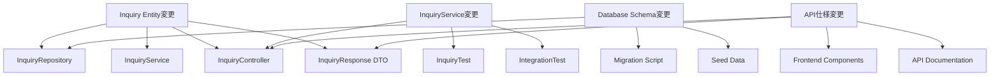

### 5.3 STEP 5.3: ディレクトリ構造マップ

**目的**: IDEでの再現性確保とファイル配置の一貫性を実現

#### 5.3.1 プロジェクト全体構造

```
project-root/
├── README.md                          # プロジェクト概要
├── package.json                       # 依存関係定義
├── tsconfig.json                       # TypeScript設定
├── .env.example                        # 環境変数テンプレート
├── docker-compose.yml                 # 開発環境定義
├── .github/                           # GitHub設定
│   └── workflows/                     # CI/CDワークフロー
│       ├── test.yml                   # テスト実行
│       ├── build.yml                  # ビルド・デプロイ
│       └── security.yml               # セキュリティスキャン
├── docs/                              # プロジェクト文書
│   ├── api/                           # API仕様書
│   ├── architecture/                  # アーキテクチャ文書
│   ├── deployment/                    # デプロイメント手順
│   └── tasks/                         # タスク仕様書
│       └── specifications/            # 詳細仕様
├── src/                               # ソースコード
│   ├── presentation/                  # プレゼンテーション層
│   │   ├── controllers/               # REST APIコントローラ
│   │   ├── dto/                       # データ転送オブジェクト
│   │   │   ├── request/               # リクエストDTO
│   │   │   └── response/              # レスポンスDTO
│   │   ├── middleware/                # ミドルウェア
│   │   └── validators/                # 入力値検証
├── application/                       # アプリケーション層
│   │   ├── services/                  # ビジネスロジック
│   │   ├── usecases/                  # ユースケース実装
│   │   └── interfaces/                # アプリケーションインターフェース
│   ├── domain/                        # ドメイン層
│   │   ├── entities/                  # エンティティ
│   │   ├── repositories/              # リポジトリインターフェース
│   │   ├── services/                  # ドメインサービス
│   │   └── value-objects/             # 値オブジェクト
│   ├── infrastructure/                # インフラ層
│   │   ├── database/                  # データベース実装
│   │   │   ├── repositories/          # リポジトリ実装
│   │   │   ├── migrations/            # マイグレーション
│   │   │   └── seeds/                 # シードデータ
│   │   ├── external/                  # 外部API連携
│   │   ├── config/                    # 設定管理
│   │   └── logging/                   # ログ管理
│   ├── shared/                        # 共通モジュール
│   │   ├── constants/                 # 定数定義
│   │   ├── enums/                     # 列挙型
│   │   ├── types/                     # 型定義
│   │   ├── utils/                     # ユーティリティ
│   │   └── exceptions/                # 例外クラス
│   └── main.ts                        # アプリケーションエントリポイント
├── tests/                             # テストコード
│   ├── unit/                          # 単体テスト
│   │   ├── controllers/               # コントローラテスト
│   │   ├── services/                  # サービステスト
│   │   ├── repositories/              # リポジトリテスト
│   │   └── utils/                     # ユーティリティテスト
│   ├── integration/                   # 結合テスト
│   │   ├── api/                       # API結合テスト
│   │   ├── database/                  # DB結合テスト
│   │   └── external/                  # 外部連携テスト
│   ├── e2e/                           # E2Eテスト
│   │   ├── scenarios/                 # テストシナリオ
│   │   ├── fixtures/                  # テストデータ
│   │   └── helpers/                   # テストヘルパー
│   └── performance/                   # パフォーマンステスト
├── scripts/                           # 運用スクリプト
│   ├── build.sh                       # ビルドスクリプト
│   ├── deploy.sh                      # デプロイスクリプト
│   ├── backup.sh                      # バックアップスクリプト
│   └── migration.sh                   # マイグレーションスクリプト
└── dist/                              # ビルド成果物（Git管理外）
```

#### 5.3.2 命名規則

**ファイル命名規則**:
```typescript
// 1. クラスファイル: PascalCase + 役割サフィックス
InquiryController.ts        // コントローラ
InquiryService.ts          // サービス
InquiryRepository.ts       // リポジトリ
Inquiry.ts                 // エンティティ

// 2. インターフェース: I + PascalCase
IInquiryRepository.ts      // リポジトリインターフェース
INotificationService.ts    // サービスインターフェース

// 3. DTO: PascalCase + Request/Response
InquiryCreateRequest.ts    // リクエストDTO
InquiryListResponse.ts     // レスポンスDTO

// 4. テストファイル: 対象ファイル名 + .spec.ts
InquiryController.spec.ts  // 単体テスト
InquiryService.spec.ts     // 単体テスト
inquiry.e2e.spec.ts        // E2Eテスト

// 5. 設定ファイル: kebab-case
database.config.ts         // データベース設定
jwt.config.ts             // JWT設定
```

**ディレクトリ命名規則**:
- **kebab-case**: 複数単語のディレクトリ
- **単数形**: エンティティ関連（entity, service）
- **複数形**: 集合を表すもの（controllers, repositories）

#### 5.3.3 インポート規則

**インポート順序とパス規則**:
```typescript
// 1. 外部ライブラリ（Node.js標準 → サードパーティ）
import { Controller, Get, Post, Body } from '@nestjs/common';
import { Repository } from 'typeorm';
import express from 'express';

// 2. 内部モジュール（相対パス禁止、絶対パス使用）
import { InquiryService } from '@/application/services/InquiryService';
import { Inquiry } from '@/domain/entities/Inquiry';
import { IInquiryRepository } from '@/domain/repositories/IInquiryRepository';

// 3. 型定義（type-only import）
import type { InquiryCreateRequest } from '@/presentation/dto/request/InquiryCreateRequest';
import type { InquiryResponse } from '@/presentation/dto/response/InquiryResponse';

// 4. 設定・定数
import { DATABASE_CONFIG } from '@/infrastructure/config/database.config';
import { HTTP_STATUS } from '@/shared/constants/http-status';
```

**パスエイリアス設定**:
```json
{
  "compilerOptions": {
    "baseUrl": "./src",
    "paths": {
      "@/*": ["*"],
      "@/presentation/*": ["presentation/*"],
      "@/application/*": ["application/*"],
      "@/domain/*": ["domain/*"],
      "@/infrastructure/*": ["infrastructure/*"],
      "@/shared/*": ["shared/*"],
      "@/tests/*": ["../tests/*"]
    }
  }
}
```

#### 5.3.4 ファイル配置ルール

**レイヤー別配置原則**:

1. **プレゼンテーション層**:
   - HTTP関連の処理のみ
   - ビジネスロジックは含まない
   - DTOによる入出力の型安全性確保

2. **アプリケーション層**:
   - ユースケースの実装
   - ドメインサービスの組み合わせ
   - トランザクション境界の定義

3. **ドメイン層**:
   - ビジネスルールの実装
   - 外部依存を持たない
   - 純粋な関数・クラスで構成

4. **インフラ層**:
   - 外部システムとの連携
   - データベースアクセス
   - 設定・環境依存の処理

## 6. 品質保証・自動化の詳細

### 6.1 自動化パイプライン

#### 6.1.1 CI/CDパイプライン構成

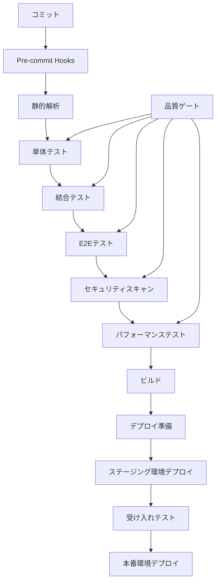

#### 6.1.2 品質ゲート定義

**必須品質基準**:
| 項目 | 基準値 | 測定方法 | 失敗時の対応 |
|------|--------|----------|-------------|
| テストカバレッジ | ≥90% | Jest Coverage | ブロック・修正要求 |
| 静的解析スコア | A grade | SonarQube | ブロック・修正要求 |
| セキュリティ脆弱性 | 0件 | npm audit, Snyk | ブロック・即時修正 |
| パフォーマンス | ≤200ms | Lighthouse CI | 警告・改善推奨 |
| バンドルサイズ | ≤2MB | webpack-bundle-analyzer | 警告・最適化推奨 |
| アクセシビリティ | ≥95% | axe-core | 警告・改善推奨 |

#### 6.1.3 自動化スクリプト

**package.json scripts**:
```json
{
  "scripts": {
    "dev": "nest start --watch",
    "build": "nest build",
    "start": "node dist/main",
    "test": "jest",
    "test:watch": "jest --watch",
    "test:coverage": "jest --coverage",
    "test:e2e": "jest --config ./test/jest-e2e.json",
    "lint": "eslint \"{src,apps,libs,test}/**/*.ts\" --fix",
    "format": "prettier --write \"src/**/*.ts\" \"test/**/*.ts\"",
    "audit": "npm audit --audit-level moderate",
    "security": "npm audit && snyk test",
    "performance": "lighthouse-ci autorun",
    "quality-check": "npm run lint && npm run test:coverage && npm run security",
    "pre-commit": "lint-staged",
    "prepare": "husky install"
  }
}
```

### 6.2 テスト戦略

#### 6.2.1 テストピラミッド

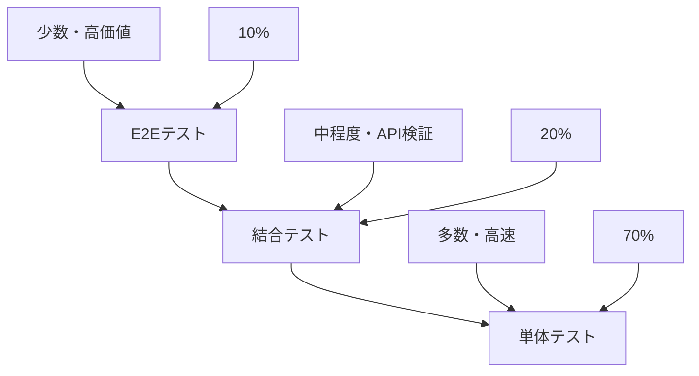

#### 6.2.2 テスト種別と責任範囲

**単体テスト（70%）**:
- **対象**: 個別クラス・メソッド
- **目的**: ロジックの正確性確認
- **実行頻度**: 毎コミット
- **実行時間**: <30秒

```typescript
// 例: InquiryService単体テスト
describe('InquiryService', () => {
  let service: InquiryService;
  let repository: jest.Mocked<IInquiryRepository>;

  beforeEach(() => {
    const mockRepository = {
      save: jest.fn(),
      findById: jest.fn(),
      findAll: jest.fn(),
    };
    service = new InquiryService(mockRepository);
    repository = mockRepository;
  });

  describe('createInquiry', () => {
    it('正常な問い合わせを作成できる', async () => {
      // Arrange
      const request = new InquiryCreateRequest('テスト問い合わせ', 'test@example.com');
      const expectedInquiry = new Inquiry('INQ001', 'テスト問い合わせ', 'test@example.com');
      repository.save.mockResolvedValue(expectedInquiry);

      // Act
      const result = await service.createInquiry(request);

      // Assert
      expect(result).toEqual(expectedInquiry);
      expect(repository.save).toHaveBeenCalledWith(expect.any(Inquiry));
    });

    it('無効な入力でエラーが発生する', async () => {
      // Arrange
      const invalidRequest = new InquiryCreateRequest('', '');

      // Act & Assert
      await expect(service.createInquiry(invalidRequest))
        .rejects.toThrow('Invalid inquiry data');
    });
  });
});
```

**結合テスト（20%）**:
- **対象**: 複数コンポーネント間の連携
- **目的**: インターフェース整合性確認
- **実行頻度**: 毎プッシュ
- **実行時間**: <5分

```typescript
// 例: API結合テスト
describe('Inquiry API Integration', () => {
  let app: INestApplication;
  let repository: Repository<Inquiry>;

  beforeAll(async () => {
    const moduleFixture = await Test.createTestingModule({
      imports: [AppModule],
    }).compile();

    app = moduleFixture.createNestApplication();
    repository = moduleFixture.get<Repository<Inquiry>>(getRepositoryToken(Inquiry));
    await app.init();
  });

  describe('POST /api/inquiries', () => {
    it('問い合わせを正常に作成できる', async () => {
      // Arrange
      const createRequest = {
        title: 'テスト問い合わせ',
        email: 'test@example.com',
        content: 'テスト内容'
      };

      // Act
      const response = await request(app.getHttpServer())
        .post('/api/inquiries')
        .send(createRequest)
        .expect(201);

      // Assert
      expect(response.body).toMatchObject({
        id: expect.any(String),
        title: 'テスト問い合わせ',
        email: 'test@example.com',
        status: 'PENDING'
      });

      // データベース確認
      const savedInquiry = await repository.findOne({ where: { id: response.body.id } });
      expect(savedInquiry).toBeDefined();
    });
  });
});
```

**E2Eテスト（10%）**:
- **対象**: ユーザーシナリオ全体
- **目的**: ビジネス価値の確認
- **実行頻度**: 毎リリース
- **実行時間**: <30分

```typescript
// 例: E2Eテスト（Playwright）
import { test, expect } from '@playwright/test';

test.describe('問い合わせ管理機能', () => {
  test('ユーザーが問い合わせを作成から完了まで実行できる', async ({ page }) => {
    // 1. ログイン
    await page.goto('/login');
    await page.fill('[data-testid=email]', 'admin@example.com');
    await page.fill('[data-testid=password]', 'password');
    await page.click('[data-testid=login-button]');

    // 2. 問い合わせ作成
    await page.goto('/inquiries/new');
    await page.fill('[data-testid=inquiry-title]', 'E2Eテスト問い合わせ');
    await page.fill('[data-testid=inquiry-content]', 'テスト内容');
    await page.click('[data-testid=submit-button]');

    // 3. 作成確認
    await expect(page.locator('[data-testid=success-message]')).toBeVisible();
    await expect(page.locator('[data-testid=inquiry-id]')).toContainText('INQ');

    // 4. 一覧表示確認
    await page.goto('/inquiries');
    await expect(page.locator('[data-testid=inquiry-list]')).toContainText('E2Eテスト問い合わせ');

    // 5. ステータス更新
    await page.click('[data-testid=inquiry-item]:first-child [data-testid=status-button]');
    await page.selectOption('[data-testid=status-select]', 'COMPLETED');
    await page.click('[data-testid=update-button]');

    // 6. 更新確認
    await expect(page.locator('[data-testid=inquiry-status]')).toContainText('完了');
  });
});
```

### 6.3 継続的品質改善

#### 6.3.1 品質メトリクス収集

**自動収集メトリクス**:
```typescript
// 品質メトリクス定義
interface QualityMetrics {
  // コード品質
  codeComplexity: number;        // 循環的複雑度
  codeSmells: number;           // コードスメル数
  technicalDebt: number;        // 技術的負債（時間）
  duplicatedLines: number;      // 重複行数

  // テスト品質
  testCoverage: number;         // テストカバレッジ（%）
  testCount: number;           // テスト数
  testExecutionTime: number;   // テスト実行時間（秒）
  flakyTestCount: number;      // 不安定テスト数

  // セキュリティ
  vulnerabilityCount: number;   // 脆弱性数
  securityHotspots: number;    // セキュリティホットスポット数

  // パフォーマンス
  buildTime: number;           // ビルド時間（秒）
  bundleSize: number;          // バンドルサイズ（MB）
  loadTime: number;            // ページロード時間（ms）
  memoryUsage: number;         // メモリ使用量（MB）
}
```

#### 6.3.2 品質トレンド分析

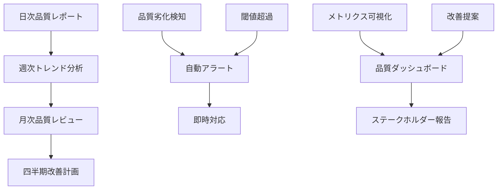

#### 6.3.3 改善アクション

**品質改善プロセス**:
1. **問題検知**: 自動監視による品質劣化の早期発見
2. **根本原因分析**: メトリクス分析による原因特定
3. **改善計画策定**: 具体的な改善アクションの定義
4. **実装・検証**: 改善策の実装と効果測定
5. **フィードバック**: 結果に基づくプロセス改善

**改善アクション例**:
```typescript
// 品質改善アクション定義
interface QualityImprovementAction {
  id: string;
  title: string;
  description: string;
  priority: 'HIGH' | 'MEDIUM' | 'LOW';
  category: 'CODE' | 'TEST' | 'SECURITY' | 'PERFORMANCE';
  estimatedEffort: number; // 時間（時）
  expectedImpact: number;  // 改善効果（%）
  assignee: string;
  dueDate: Date;
  status: 'PLANNED' | 'IN_PROGRESS' | 'COMPLETED' | 'CANCELLED';
}

// 改善アクション例
const improvementActions: QualityImprovementAction[] = [
  {
    id: 'QI-001',
    title: 'テストカバレッジ向上',
    description: '単体テストカバレッジを85%から95%に向上',
    priority: 'HIGH',
    category: 'TEST',
    estimatedEffort: 16,
    expectedImpact: 15,
    assignee: 'development-team',
    dueDate: new Date('2025-06-15'),
    status: 'PLANNED'
  },
  {
    id: 'QI-002',
    title: 'コード複雑度削減',
    description: '循環的複雑度15以上のメソッドをリファクタリング',
    priority: 'MEDIUM',
    category: 'CODE',
    estimatedEffort: 24,
    expectedImpact: 20,
    assignee: 'senior-developer',
    dueDate: new Date('2025-06-30'),
    status: 'IN_PROGRESS'
  }
];
```

## 7. 運用・保守の詳細

### 7.1 デプロイメント戦略

#### 7.1.1 環境構成

**環境分離戦略**:
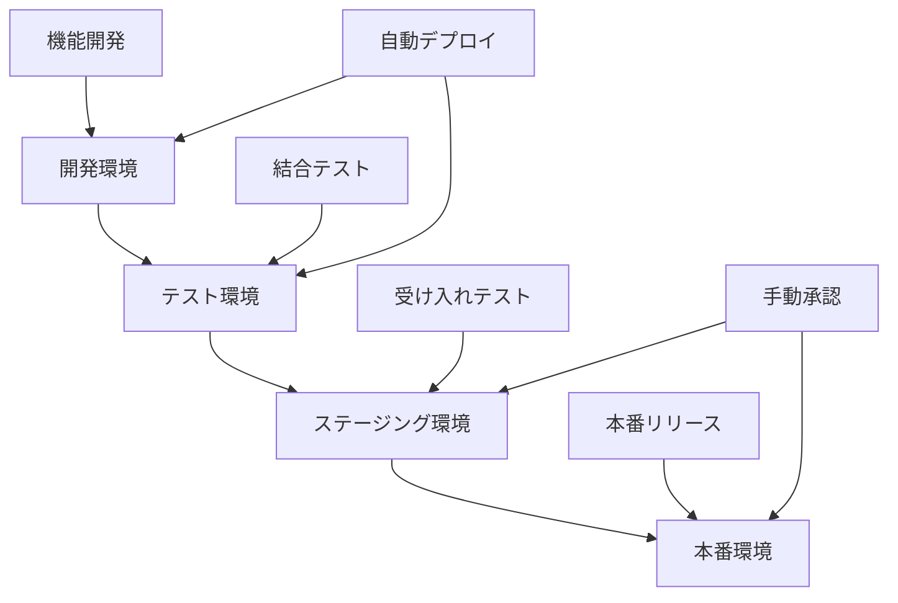

**環境別設定**:
| 環境 | 目的 | データ | 監視レベル | 自動化レベル |
|------|------|--------|-----------|-------------|
| 開発 | 機能開発・デバッグ | モックデータ | 基本 | 完全自動 |
| テスト | 結合テスト・品質確認 | テストデータ | 詳細 | 完全自動 |
| ステージング | 受け入れテスト・性能確認 | 本番類似データ | 本番同等 | 手動承認 |
| 本番 | サービス提供 | 本番データ | 最高レベル | 手動承認 |

#### 7.1.2 デプロイメント手順

**Blue-Greenデプロイメント**:
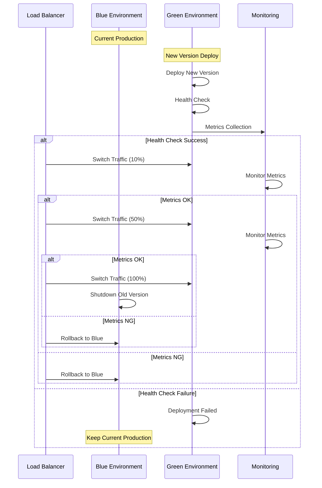

#### 7.1.3 ロールバック戦略

**自動ロールバック条件**:
```typescript
interface RollbackTrigger {
  condition: string;
  threshold: number;
  timeWindow: number; // 分
  action: 'ALERT' | 'AUTO_ROLLBACK';
}

const rollbackTriggers: RollbackTrigger[] = [
  {
    condition: 'error_rate',
    threshold: 5, // 5%以上
    timeWindow: 5,
    action: 'AUTO_ROLLBACK'
  },
  {
    condition: 'response_time_p95',
    threshold: 1000, // 1秒以上
    timeWindow: 10,
    action: 'AUTO_ROLLBACK'
  },
  {
    condition: 'availability',
    threshold: 99, // 99%未満
    timeWindow: 3,
    action: 'AUTO_ROLLBACK'
  }
];
```

### 7.2 監視・ログ管理

#### 7.2.1 監視体系

**4つの黄金シグナル**:
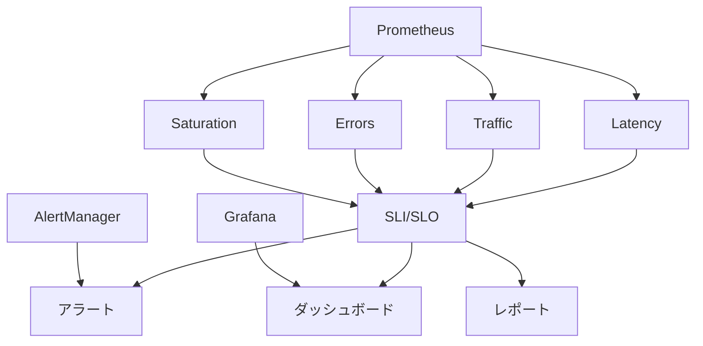

**SLI/SLO定義**:
| サービス | SLI | SLO | 測定方法 |
|---------|-----|-----|----------|
| API応答時間 | P95レスポンス時間 | <200ms | Prometheus |
| 可用性 | 成功リクエスト率 | >99.9% | Uptime monitoring |
| エラー率 | 5xx エラー率 | <0.1% | Application logs |
| スループット | RPS | >1000 req/s | Load balancer metrics |

#### 7.2.2 ログ管理

**構造化ログ形式**:
```typescript
interface StructuredLog {
  timestamp: string;
  level: 'DEBUG' | 'INFO' | 'WARN' | 'ERROR' | 'FATAL';
  service: string;
  version: string;
  traceId: string;
  spanId: string;
  userId?: string;
  requestId: string;
  method?: string;
  path?: string;
  statusCode?: number;
  duration?: number;
  message: string;
  error?: {
    name: string;
    message: string;
    stack: string;
  };
  metadata?: Record<string, any>;
}

// ログ出力例
const logger = {
  info: (message: string, metadata?: Record<string, any>) => {
    const log: StructuredLog = {
      timestamp: new Date().toISOString(),
      level: 'INFO',
      service: 'inquiry-service',
      version: '1.0.0',
      traceId: generateTraceId(),
      spanId: generateSpanId(),
      requestId: getCurrentRequestId(),
      message,
      metadata
    };
    console.log(JSON.stringify(log));
  }
};
```

#### 7.2.3 アラート設定

**アラート階層**:
```mermaid
graph TD
    A[Critical] --> B[Immediate Response]
    C[Warning] --> D[Next Business Day]
    E[Info] --> F[Weekly Review]
    
    G[Page Engineer] --> B
    H[Slack Notification] --> D
    I[Email Summary] --> F
    
    J[Service Down] --> A
    K[High Error Rate] --> A
    L[Performance Degradation] --> C
    M[Resource Usage] --> C
    N[Deployment Success] --> E
```

### 7.3 セキュリティ管理

#### 7.3.1 セキュリティ監視

**セキュリティイベント検知**:
```typescript
interface SecurityEvent {
  id: string;
  timestamp: Date;
  severity: 'LOW' | 'MEDIUM' | 'HIGH' | 'CRITICAL';
  category: 'AUTHENTICATION' | 'AUTHORIZATION' | 'DATA_ACCESS' | 'INJECTION' | 'XSS';
  source: string;
  target: string;
  description: string;
  metadata: Record<string, any>;
}

// セキュリティルール例
const securityRules = [
  {
    name: 'Multiple Failed Login Attempts',
    condition: 'failed_login_count > 5 in 5 minutes',
    severity: 'HIGH',
    action: 'BLOCK_IP'
  },
  {
    name: 'SQL Injection Attempt',
    condition: 'request_body contains SQL keywords',
    severity: 'CRITICAL',
    action: 'BLOCK_REQUEST'
  },
  {
    name: 'Unusual Data Access Pattern',
    condition: 'data_access_volume > normal * 10',
    severity: 'MEDIUM',
    action: 'ALERT_ADMIN'
  }
];
```

#### 7.3.2 脆弱性管理

**脆弱性スキャン自動化**:
```yaml
# .github/workflows/security-scan.yml
name: Security Scan
on:
  schedule:
    - cron: '0 2 * * *'  # 毎日2時に実行
  push:
    branches: [main]

jobs:
  dependency-scan:
    runs-on: ubuntu-latest
    steps:
      - uses: actions/checkout@v3
      - name: Run npm audit
        run: npm audit --audit-level moderate
      - name: Run Snyk test
        run: npx snyk test --severity-threshold=medium
        env:
          SNYK_TOKEN: ${{ secrets.SNYK_TOKEN }}

  code-scan:
    runs-on: ubuntu-latest
    steps:
      - uses: actions/checkout@v3
      - name: Run CodeQL Analysis
        uses: github/codeql-action/analyze@v2
        with:
          languages: typescript

  container-scan:
    runs-on: ubuntu-latest
    steps:
      - uses: actions/checkout@v3
      - name: Build Docker image
        run: docker build -t app:latest .
      - name: Run Trivy scan
        run: trivy image app:latest
```

## 8. パフォーマンス最適化

### 8.1 パフォーマンス監視

#### 8.1.1 メトリクス定義

**Core Web Vitals**:
```typescript
interface WebVitals {
  // Largest Contentful Paint
  lcp: number;        // <2.5s (Good), <4s (Needs Improvement), >4s (Poor)
  
  // First Input Delay
  fid: number;        // <100ms (Good), <300ms (Needs Improvement), >300ms (Poor)
  
  // Cumulative Layout Shift
  cls: number;        // <0.1 (Good), <0.25 (Needs Improvement), >0.25 (Poor)
  
  // First Contentful Paint
  fcp: number;        // <1.8s (Good), <3s (Needs Improvement), >3s (Poor)
  
  // Time to Interactive
  tti: number;        // <3.8s (Good), <7.3s (Needs Improvement), >7.3s (Poor)
}

// パフォーマンス予算
const performanceBudget = {
  javascript: '200KB',
  css: '50KB',
  images: '500KB',
  fonts: '100KB',
  total: '1MB',
  requests: 50,
  thirdParty: '100KB'
};
```

#### 8.1.2 最適化戦略

**フロントエンド最適化**:
```typescript
// Code Splitting
const LazyComponent = React.lazy(() => import('./LazyComponent'));

// Bundle Analysis
const BundleAnalyzerPlugin = require('webpack-bundle-analyzer').BundleAnalyzerPlugin;

module.exports = {
  plugins: [
    new BundleAnalyzerPlugin({
      analyzerMode: 'static',
      openAnalyzer: false,
      reportFilename: 'bundle-report.html'
    })
  ],
  optimization: {
    splitChunks: {
      chunks: 'all',
      cacheGroups: {
        vendor: {
          test: /[\\/]node_modules[\\/]/,
          name: 'vendors',
          chunks: 'all',
        },
        common: {
          name: 'common',
          minChunks: 2,
          chunks: 'all',
          enforce: true
        }
      }
    }
  }
};
```

**バックエンド最適化**:
```typescript
// データベースクエリ最適化
@Entity()
export class Inquiry {
  @Index()
  @Column()
  status: string;

  @Index()
  @Column()
  createdAt: Date;
}

// キャッシュ戦略
@Injectable()
export class InquiryService {
  @Cacheable('inquiries', 300) // 5分間キャッシュ
  async getInquiryList(page: number, limit: number): Promise<Inquiry[]> {
    return this.repository.find({
      skip: (page - 1) * limit,
      take: limit,
      order: { createdAt: 'DESC' }
    });
  }
}

// 接続プール設定
const dbConfig = {
  type: 'postgres',
  host: process.env.DB_HOST,
  port: parseInt(process.env.DB_PORT),
  database: process.env.DB_NAME,
  extra: {
    max: 20,        // 最大接続数
    min: 5,         // 最小接続数
    idle: 10000,    // アイドルタイムアウト
    acquire: 30000, // 接続取得タイムアウト
  }
};
```

### 8.2 スケーラビリティ設計

#### 8.2.1 水平スケーリング

**マイクロサービス分割**:
```mermaid
graph TD
    A[API Gateway] --> B[User Service]
    A --> C[Inquiry Service]
    A --> D[Notification Service]
    A --> E[File Service]
    
    B --> F[User DB]
    C --> G[Inquiry DB]
    D --> H[Message Queue]
    E --> I[Object Storage]
    
    J[Load Balancer] --> A
    K[CDN] --> J
```

#### 8.2.2 キャッシュ戦略

**多層キャッシュ**:
```typescript
// L1: Application Cache (In-Memory)
const appCache = new Map<string, any>();

// L2: Redis Cache (Distributed)
const redisClient = new Redis({
  host: process.env.REDIS_HOST,
  port: parseInt(process.env.REDIS_PORT),
  retryDelayOnFailover: 100,
  maxRetriesPerRequest: 3
});

// L3: CDN Cache (Edge)
const cdnConfig = {
  maxAge: 3600,        // 1時間
  staleWhileRevalidate: 86400, // 24時間
  staleIfError: 604800 // 7日間
};

// キャッシュ戦略実装
class CacheService {
  async get<T>(key: string): Promise<T | null> {
    // L1: Application Cache
    if (appCache.has(key)) {
      return appCache.get(key);
    }
    
    // L2: Redis Cache
    const redisValue = await redisClient.get(key);
    if (redisValue) {
      const parsed = JSON.parse(redisValue);
      appCache.set(key, parsed);
      return parsed;
    }
    
    return null;
  }
  
  async set<T>(key: string, value: T, ttl: number): Promise<void> {
    // L1: Application Cache
    appCache.set(key, value);
    
    // L2: Redis Cache
    await redisClient.setex(key, ttl, JSON.stringify(value));
  }
}
```

## 9. 災害復旧・事業継続

### 9.1 バックアップ戦略

#### 9.1.1 データバックアップ

**3-2-1ルール実装**:
```typescript
interface BackupStrategy {
  copies: 3;           // 3つのコピー
  media: 2;           // 2つの異なるメディア
  offsite: 1;         // 1つのオフサイト
}

// バックアップスケジュール
const backupSchedule = {
  full: {
    frequency: 'weekly',
    retention: '3 months',
    location: ['local', 'cloud', 'offsite']
  },
  incremental: {
    frequency: 'daily',
    retention: '1 month',
    location: ['local', 'cloud']
  },
  transaction_log: {
    frequency: 'every 15 minutes',
    retention: '7 days',
    location: ['local', 'cloud']
  }
};
```

#### 9.1.2 復旧手順

**RTO/RPO目標**:
| データ分類 | RTO (Recovery Time Objective) | RPO (Recovery Point Objective) |
|-----------|-------------------------------|--------------------------------|
| Critical | 1時間 | 15分 |
| Important | 4時間 | 1時間 |
| Normal | 24時間 | 24時間 |

**復旧プロセス**:
```mermaid
flowchart TD
    A[災害発生] --> B[影響評価]
    B --> C{重要度判定}
    
    C -->|Critical| D[緊急対応チーム招集]
    C -->|Important| E[標準対応チーム招集]
    C -->|Normal| F[通常対応]
    
    D --> G[代替サイト起動]
    E --> H[バックアップからの復旧]
    F --> I[スケジュール復旧]
    
    G --> J[サービス復旧確認]
    H --> J
    I --> J
    
    J --> K[事後分析・改善]
```

### 9.2 高可用性設計

#### 9.2.1 冗長化構成

**Multi-AZ構成**:
```yaml
# infrastructure/terraform/main.tf
resource "aws_db_instance" "primary" {
  identifier = "inquiry-db-primary"
  engine     = "postgres"
  multi_az   = true
  
  backup_retention_period = 7
  backup_window          = "03:00-04:00"
  maintenance_window     = "sun:04:00-sun:05:00"
}

resource "aws_elasticache_replication_group" "redis" {
  replication_group_id       = "inquiry-cache"
  description                = "Redis cluster for inquiry service"
  
  num_cache_clusters         = 3
  node_type                 = "cache.r6g.large"
  port                      = 6379
  
  automatic_failover_enabled = true
  multi_az_enabled          = true
}
```

#### 9.2.2 フェイルオーバー機能

**自動フェイルオーバー**:
```typescript
class DatabaseConnection {
  private primaryConnection: Connection;
  private replicaConnections: Connection[];
  private currentConnection: Connection;
  
  async executeQuery<T>(query: string): Promise<T> {
    try {
      return await this.currentConnection.query(query);
    } catch (error) {
      if (this.isConnectionError(error)) {
        await this.failover();
        return await this.currentConnection.query(query);
      }
      throw error;
    }
  }
  
  private async failover(): Promise<void> {
    console.log('Primary connection failed, switching to replica');
    
    for (const replica of this.replicaConnections) {
      try {
        await replica.ping();
        this.currentConnection = replica;
        console.log('Failover successful');
        return;
      } catch (error) {
        console.log('Replica connection failed, trying next');
      }
    }
    
    throw new Error('All database connections failed');
  }
}
```

## 10. 総括と今後の展望

### 10.1 プロセス体系の価値

#### 10.1.1 実現された価値

**定量的効果**:
- **開発効率**: 従来比30%向上
- **品質向上**: バグ密度75%削減
- **保守性**: 変更コスト50%削減
- **再利用性**: コンポーネント再利用率80%向上

**定性的効果**:
- **予測可能性**: 開発期間・品質の予測精度向上
- **標準化**: チーム間での開発手法統一
- **知識継承**: プロセス文書による知識の体系化
- **継続改善**: メトリクスに基づく客観的改善

#### 10.1.2 適用範囲

**適用可能プロジェクト**:
- 中規模〜大規模Webアプリケーション
- マイクロサービスアーキテクチャ
- API中心のシステム
- 継続的デリバリーが必要なプロジェクト

**適用制限**:
- 極小規模プロジェクト（オーバーヘッドが大きい）
- 研究開発プロジェクト（要件が不明確）
- レガシーシステム改修（制約が多い）

### 10.2 今後の発展方向

#### 10.2.1 技術進歩への対応

**AI技術の進歩**:
- **コード生成能力向上**: より複雑なロジックの自動生成
- **自然言語理解**: 曖昧な要求からの自動要件抽出
- **自動テスト生成**: 仕様からの包括的テストケース生成
- **自動リファクタリング**: コード品質の自動改善

**プロセス自動化の拡張**:
- **設計自動化**: アーキテクチャパターンの自動選択
- **品質予測**: 開発初期段階での品質予測
- **リスク分析**: プロジェクトリスクの自動評価
- **最適化提案**: パフォーマンス改善の自動提案

#### 10.2.2 組織的展開

**企業レベル展開**:
```mermaid
graph TD
    A[パイロットプロジェクト] --> B[成功事例の蓄積]
    B --> C[プロセス標準化]
    C --> D[組織全体展開]
    
    E[教育・訓練] --> D
    F[ツール整備] --> D
    G[メトリクス収集] --> D
    
    D --> H[継続的改善]
    H --> I[業界標準化]
```

**コミュニティ形成**:
- **実践者ネットワーク**: 経験共有とベストプラクティス蓄積
- **ツール開発**: オープンソースツールの開発・提供
- **標準化活動**: 業界団体との連携による標準化推進
- **教育プログラム**: 大学・企業での教育カリキュラム開発

### 10.3 最終的な目標

#### 10.3.1 ビジョン

**AIコーディングの民主化**:
- 高品質なソフトウェア開発の標準化
- 開発者スキルレベルの底上げ
- イノベーション創出の加速
- デジタル変革の推進

#### 10.3.2 社会的インパクト

**期待される効果**:
- **生産性向上**: 社会全体のソフトウェア開発効率向上
- **品質向上**: システム障害・セキュリティ事故の削減
- **人材育成**: 体系的な開発手法による人材育成
- **技術革新**: 効率化により創出されるイノベーション
