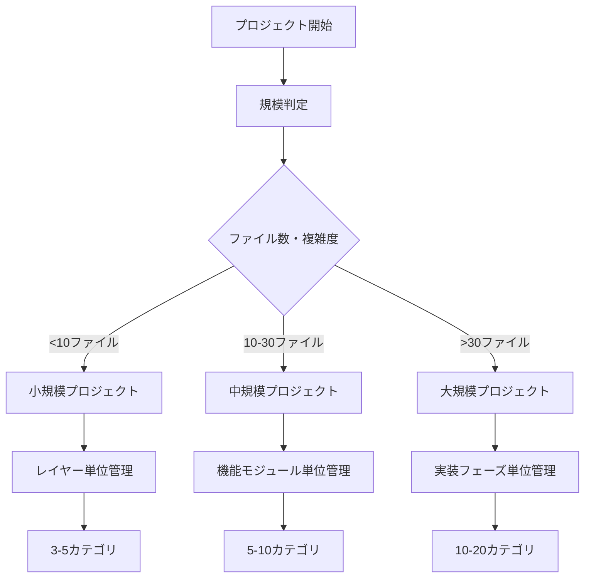
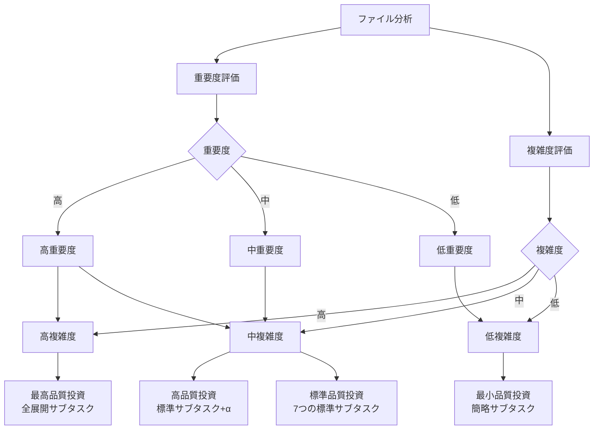
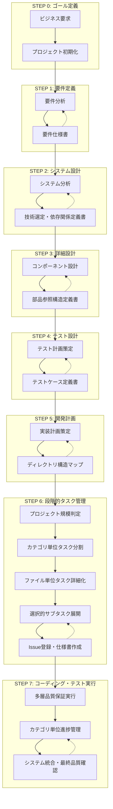
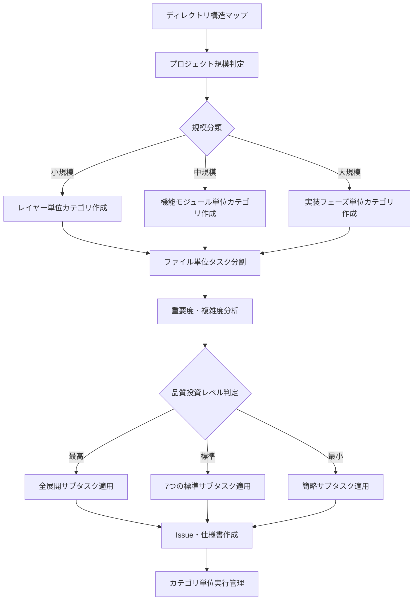
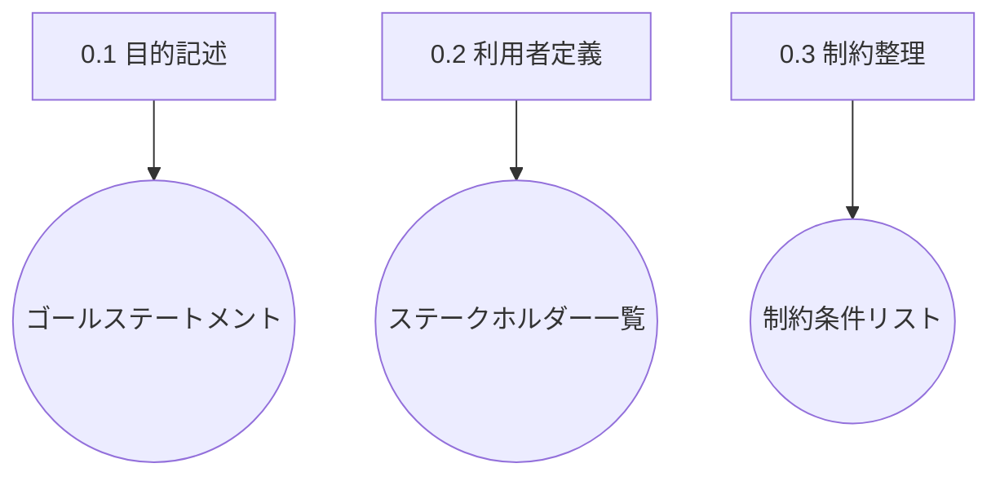
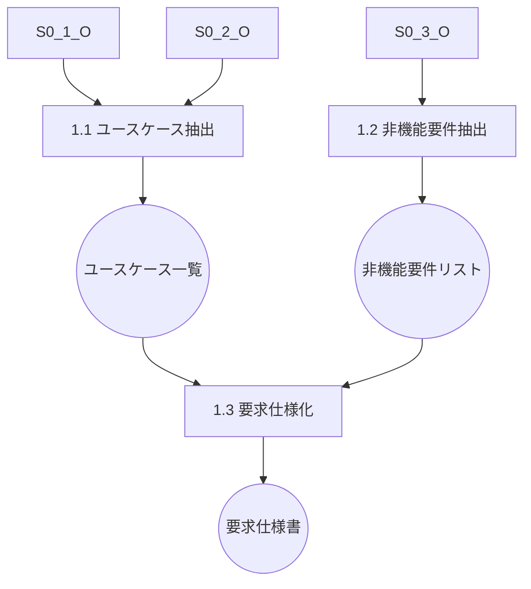
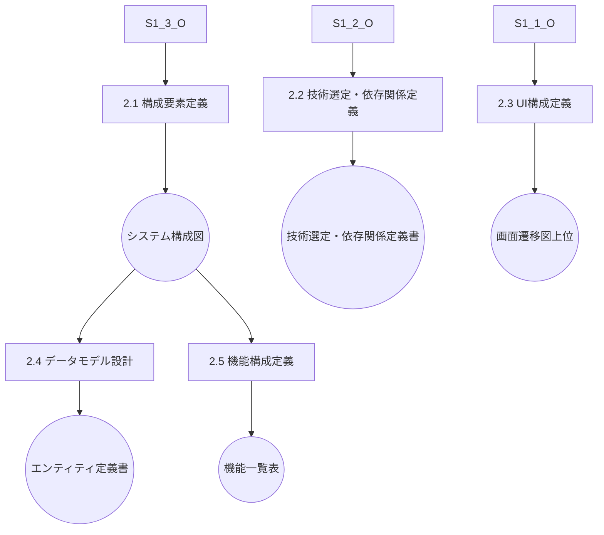
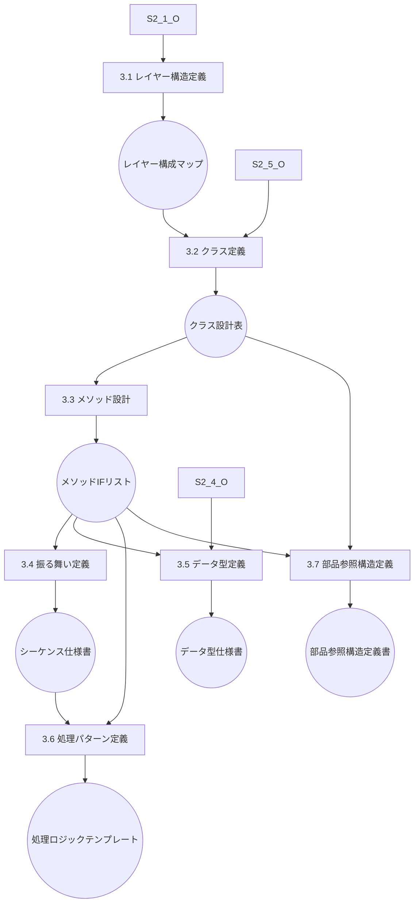
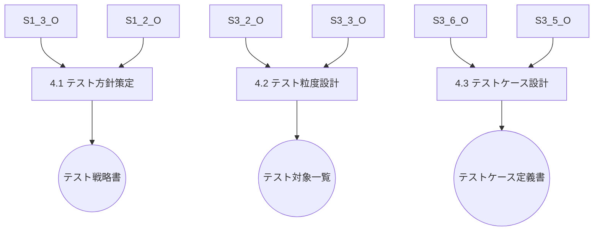
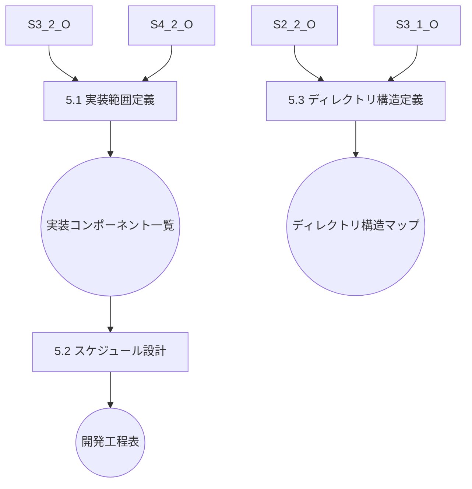

# AIコーディング開発プロセス体系化ドキュメント v1.2（Part 1/3）

## 1. 概要

本ドキュメントは、AIエージェントによるソフトウェア開発プロセスを体系化したものです。従来の開発手法とは異なり、**段階的タスク管理アプローチ**を核心とし、プロジェクト規模に応じた最適な管理手法と選択的品質投資により、効率的かつ高品質な開発を実現します。

### 1.1 AIコーディングの基本原則

1. **段階的詳細化**: 抽象的な要件から具体的な実装まで、段階的に詳細化
2. **段階的タスク管理**: プロジェクト規模に応じたカテゴリ単位管理の適用
3. **選択的品質投資**: 重要度・複雑度に応じた最適な品質保証レベル
4. **多層品質保証**: タスク・カテゴリ・プロジェクトレベルでの統合品質管理
5. **情報の構造化**: 各段階での情報を標準化された形式で管理
6. **検証可能性**: 各段階で品質チェックポイントを設定
7. **トレーサビリティ**: 要件から実装まで追跡可能な情報管理

### 1.2 段階的タスク管理アプローチの概要

#### 1.2.1 プロジェクト規模による管理手法の使い分け

#### 1.2.2 選択的品質投資の概念

### 1.3 従来開発プロセスとの違い

| 項目 | 従来プロセス | AIコーディングプロセス v1.2 |
|------|------------|---------------------------|
| タスク管理 | 機能単位・人的判断 | 段階的タスク管理・規模別最適化 |
| 品質管理 | 一律の品質基準 | 選択的品質投資・多層品質保証 |
| 詳細化方法 | 人間の経験と判断 | AI による段階的分析・設計 |
| ドキュメント作成 | 手動作成、属人的 | 構造化テンプレート、自動生成 |
| 変更管理 | 影響分析が困難 | トレーサビリティによる影響分析 |
| 部品再利用 | 暗黙知に依存 | 明示的な参照構造による管理 |
| 進捗管理 | 主観的な進捗評価 | カテゴリ単位での客観的進捗管理 |

## 2. 全体プロセスフロー

### 2.1 プロセス全体図

### 2.2 段階的タスク管理フロー詳細

## 3. ステップ別詳細プロセス定義

### STEP 0: ゴール定義

#### サブステップ構造

#### 成果物一覧
| サブステップ | インプット | アウトプット | 用途 |
|-------------|-----------|-------------|------|
| 0.1 目的記述 | 要望・背景 | ゴールステートメント | 以降の全ステップの指針 |
| 0.2 利用者定義 | ゴール | ステークホルダー一覧 | ユースケース抽出時に使用 |
| 0.3 制約整理 | 要望・運用条件 | 制約条件リスト | 要件抽出時に使用 |

### STEP 1: 要件定義

#### サブステップ構造

#### 成果物一覧
| サブステップ | インプット | アウトプット | 用途 |
|-------------|-----------|-------------|------|
| 1.1 ユースケース抽出 | ゴール、ステークホルダー | ユースケース一覧 | 機能要件定義の基礎 |
| 1.2 非機能要件抽出 | ゴール、制約条件 | 非機能要件リスト | アーキテクチャ定義に使用 |
| 1.3 要求仕様化 | ユースケース、非機能要件 | 要求仕様書 | システム設計の前提 |

### STEP 2: システム設計

#### サブステップ構造

#### 成果物一覧
| サブステップ | インプット | アウトプット | 用途 |
|-------------|-----------|-------------|------|
| 2.1 構成要素定義 | 要求仕様書 | システム構成図 | レイヤー設計の元情報 |
| 2.2 技術選定・依存関係定義 | 非機能要件、構成図 | **技術選定・依存関係定義書** | 開発フレーム・ライブラリ選定 |
| 2.3 UI構成定義 | ユースケース、ステークホルダー | 画面遷移図（上位） | 詳細UI設計に継承 |
| 2.4 データモデル設計 | ユースケース、構成図 | エンティティ定義書 | DBスキーマ、データ契約 |
| 2.5 機能構成定義 | ユースケース、構成図 | 機能一覧表 | コンポーネント設計に使用 |

### STEP 3: 詳細設計

#### サブステップ構造

#### 成果物一覧
| サブステップ | インプット | アウトプット | 用途 |
|-------------|-----------|-------------|------|
| 3.1 レイヤー構造定義 | システム構成図、技術選定書 | レイヤー構成マップ | クラス設計の基盤 |
| 3.2 クラス定義 | 機能一覧表、レイヤーマップ | クラス設計表 | I/F・ロジック設計に使用 |
| 3.3 メソッド設計 | クラス設計表、データ定義 | メソッドI/Fリスト | シーケンス定義に使用 |
| 3.4 振る舞い定義 | メソッドI/F、ユースケース | シーケンス仕様書 | テスト設計に使用 |
| 3.5 データ型定義 | エンティティ定義、I/F定義 | データ型仕様書 | 入出力形式の標準化 |
| 3.6 処理パターン定義 | メソッドI/F、振る舞い仕様 | 処理ロジックテンプレート | テスト設計・実装補助 |
| 3.7 部品参照構造定義 | クラス設計表、メソッドI/F | **部品参照構造定義書** | 再利用・依存関係管理 |

### STEP 4: テスト設計

#### サブステップ構造

#### 成果物一覧
| サブステップ | インプット | アウトプット | 用途 |
|-------------|-----------|-------------|------|
| 4.1 テスト方針策定 | 要求仕様書、非機能要件 | テスト戦略書 | 粒度設定と優先付けに使用 |
| 4.2 テスト粒度設計 | クラス設計表、メソッドI/F | テスト対象一覧 | ケース網羅の起点 |
| 4.3 テストケース設計 | 処理パターン、データ型 | テストケース定義書 | テストコード生成の基盤 |

### STEP 5: 開発計画

#### サブステップ構造

#### 成果物一覧
| サブステップ | インプット | アウトプット | 用途 |
|-------------|-----------|-------------|------|
| 5.1 実装範囲定義 | テスト対象一覧、クラス設計 | 実装コンポーネント一覧 | WBS定義に使用 |
| 5.2 スケジュール設計 | 実装一覧、優先度 | 開発工程表 | ToDoリストの構成単位に |
| 5.3 ディレクトリ構造定義 | 技術選定書、レイヤー構成 | **ディレクトリ構造マップ** | ファイル配置の基準 |
