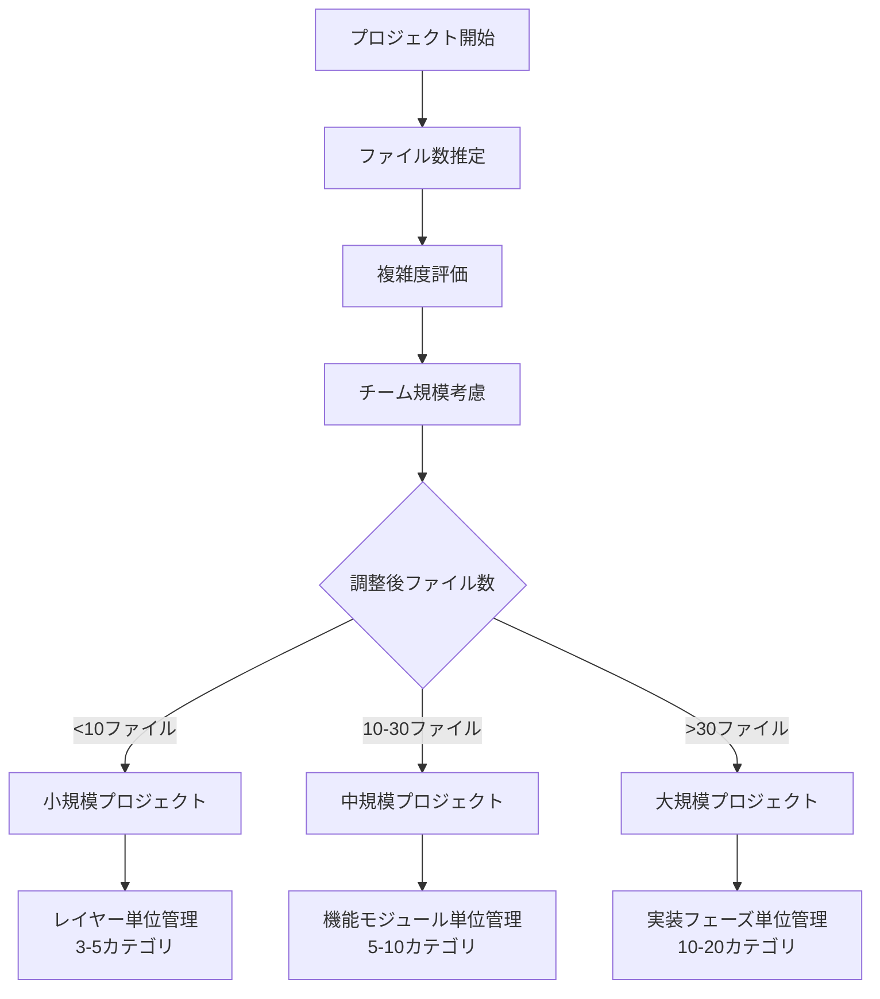
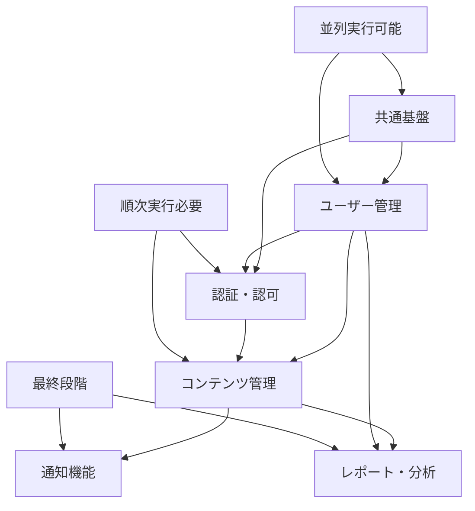
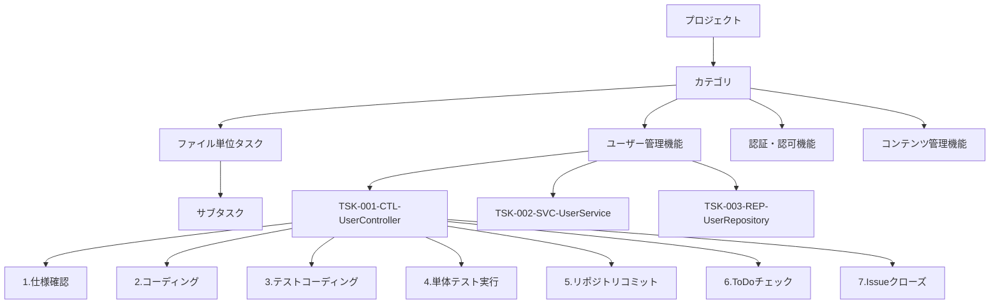
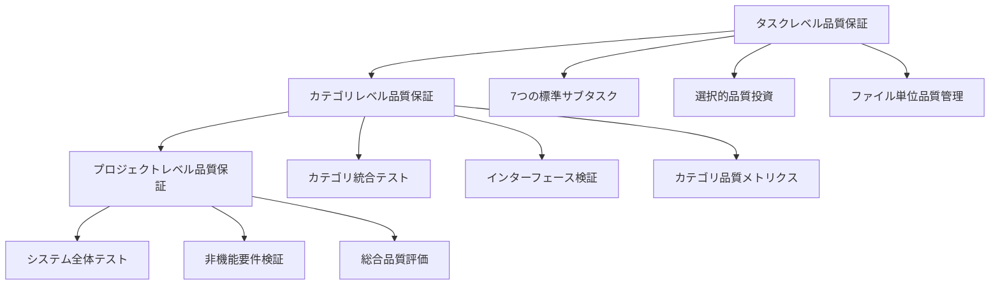

# AIコーディング開発プロセス体系化ドキュメント v1.2（Part 2/3）

## 4. STEP 6: 段階的タスク管理（詳細）

### 4.1 プロジェクト規模判定

#### 4.1.1 判定基準

**基本判定フロー**


**複雑度調整係数**
```typescript
interface ComplexityFactor {
  domainComplexity: number;    // ビジネスロジックの複雑さ (1.0-2.0)
  technicalComplexity: number; // 技術的複雑さ (1.0-2.0)
  integrationComplexity: number; // 外部連携の複雑さ (1.0-1.5)
  teamSize: number;           // チームサイズ (1.0-1.3)
}

// 調整後ファイル数 = 実ファイル数 × 複雑度係数
const adjustedFileCount = actualFileCount * 
  (domainComplexity * technicalComplexity * integrationComplexity * teamSize);
```

#### 4.1.2 規模別管理手法

**小規模プロジェクト（<10ファイル）: レイヤー単位管理**
```markdown
### 特徴
- シンプルな3層アーキテクチャ
- 開発期間: 1-2週間
- チーム規模: 1-2人

### カテゴリ構成例
1. プレゼンテーション層 [Controllers, DTOs]
2. アプリケーション層 [Services, UseCases]
3. インフラストラクチャ層 [Repositories, External APIs]

### 管理方針
- レイヤー単位での進捗管理
- 依存関係の明確化
- シンプルな品質基準
```

**中規模プロジェクト（10-30ファイル）: 機能モジュール単位管理**
```markdown
### 特徴
- 複数の機能モジュール
- 開発期間: 1-3ヶ月
- チーム規模: 3-5人

### カテゴリ構成例
1. ユーザー管理機能
2. 認証・認可機能
3. コンテンツ管理機能
4. 通知機能
5. レポート機能
6. 共通基盤

### 管理方針
- 機能モジュール単位での進捗管理
- モジュール間依存関係の管理
- 段階的品質投資
```

**大規模プロジェクト（>30ファイル）: 実装フェーズ単位管理**
```markdown
### 特徴
- 複数フェーズでの段階的実装
- 開発期間: 3ヶ月以上
- チーム規模: 6人以上

### カテゴリ構成例
#### フェーズ1: MVP実装
1. コア機能（ユーザー管理）
2. 基本認証機能
3. 基本UI/API
4. 基盤インフラ

#### フェーズ2: 機能拡張
5. 高度なユーザー機能
6. 高度なコンテンツ機能
7. 通知・コミュニケーション
8. 分析・レポート

#### フェーズ3: 最適化・スケール
9. パフォーマンス最適化
10. スケーラビリティ
11. 運用・監視

### 管理方針
- フェーズ単位での段階的リリース
- 複数チームでの並列開発
- 高度な品質保証システム
```

### 4.2 カテゴリ単位タスク分割

#### 4.2.1 カテゴリ設計原則

**カテゴリ設計の基本原則**
1. **単一責任**: 1カテゴリ = 1つの明確な責任
2. **適切な粒度**: 5-10タスクで構成
3. **疎結合**: カテゴリ間の依存関係を最小化
4. **高凝集**: 関連性の高いタスクをグループ化
5. **並列性**: 可能な限り並列実行可能な設計

#### 4.2.2 カテゴリ間依存関係管理

**依存関係マップ**


#### 4.2.3 カテゴリ別進捗管理

**進捗可視化テンプレート**
```markdown
## カテゴリ別進捗状況

### 1. ユーザー管理機能 [██████████] 100% (6/6タスク完了)
- **状況**: ✅ 完了
- **最終更新**: 2025-05-25
- **担当者**: 田中
- **品質スコア**: 95/100

### 2. 認証・認可機能 [████████░░] 80% (4/5タスク完了)
- **状況**: 🔄 進行中
- **最終更新**: 2025-05-28
- **担当者**: 佐藤
- **残りタスク**: TSK-015-SVC-AuthService
- **品質スコア**: 88/100

### 3. コンテンツ管理機能 [██████░░░░] 60% (6/10タスク完了)
- **状況**: 🔄 進行中
- **最終更新**: 2025-05-27
- **担当者**: 鈴木
- **課題**: データベース接続の設定問題
- **品質スコア**: 82/100

### 4. 通知機能 [████░░░░░░] 40% (2/5タスク完了)
- **状況**: ⚠️ 遅延
- **最終更新**: 2025-05-26
- **担当者**: 山田
- **課題**: 外部API連携の遅れ
- **品質スコア**: 75/100
```

### 4.3 ファイル単位タスク詳細化

#### 4.3.1 タスク階層構造



#### 4.3.2 タスクID命名規則

**基本形式**: `TSK-{連番3桁}-{レイヤー}-{ファイル名}`

**レイヤー略語**:
- **CTL**: Controller（プレゼンテーション層）
- **SVC**: Service（アプリケーション層）
- **ENT**: Entity（ドメイン層）
- **REP**: Repository（インフラ層）
- **DTO**: Data Transfer Object
- **UTL**: Utility（共通モジュール）
- **CFG**: Configuration（設定）
- **MID**: Middleware（ミドルウェア）

**命名例**:
```
TSK-001-CTL-UserController      # ユーザーコントローラ
TSK-002-SVC-UserService         # ユーザーサービス
TSK-003-ENT-User                # ユーザーエンティティ
TSK-004-REP-UserRepository      # ユーザーリポジトリ
TSK-005-DTO-UserCreateRequest   # ユーザー作成リクエストDTO
TSK-006-DTO-UserResponse        # ユーザーレスポンスDTO
TSK-007-UTL-PasswordHasher      # パスワードハッシュユーティリティ
TSK-008-CFG-DatabaseConfig      # データベース設定
```

### 4.4 選択的サブタスク展開

#### 4.4.1 品質投資レベル判定

**重要度・複雑度マトリクス**
| 重要度 | 複雑度 | 投資レベル | サブタスク展開 | 対象ファイル例 |
|--------|--------|-----------|---------------|---------------|
| 高 | 高 | 最高 | 全展開（12-15サブタスク） | Entity, Service |
| 高 | 中 | 高 | 拡張（9-11サブタスク） | Controller, Repository |
| 中 | 高 | 高 | 拡張（9-11サブタスク） | Middleware, Validator |
| 中 | 中 | 標準 | 標準（7サブタスク） | 一般的なクラス |
| 中 | 低 | 標準 | 標準（7サブタスク） | 単純なController |
| 低 | 中 | 最小 | 簡略（4-5サブタスク） | DTO, Configuration |
| 低 | 低 | 最小 | 簡略（4-5サブタスク） | Utility, Constants |

#### 4.4.2 サブタスク展開パターン

**最高品質投資（全展開）**
```markdown
### Entity, Service等の重要ファイル
1. 要件・仕様確認
2. 設計レビュー
3. コーディング
4. コードレビュー
5. 単体テストコーディング
6. テストレビュー
7. 単体テスト実行
8. 結合テスト準備
9. 結合テスト実行
10. パフォーマンステスト
11. セキュリティテスト
12. リポジトリコミット
13. ドキュメント更新
14. ToDoチェック
15. Issueクローズ
```

**標準品質投資（7つの標準サブタスク）**
```markdown
### 一般的なファイル
1. 仕様確認・設計理解
2. コーディング
3. テストコーディング
4. 単体テスト実行
5. リポジトリコミット
6. ToDoチェック
7. Issueクローズ
```

**最小品質投資（簡略展開）**
```markdown
### DTO, Configuration等の単純ファイル
1. 仕様確認
2. コーディング
3. 基本テスト
4. リポジトリコミット
5. Issueクローズ
```

#### 4.4.3 品質投資レベル自動判定

**判定アルゴリズム**
```typescript
interface FileAnalysis {
  fileName: string;
  fileType: 'Entity' | 'Service' | 'Controller' | 'Repository' | 'DTO' | 'Config' | 'Utility';
  linesOfCode: number;
  cyclomaticComplexity: number;
  dependencies: string[];
  businessLogicRatio: number;
  testCoverage: number;
}

function determineQualityInvestmentLevel(file: FileAnalysis): QualityLevel {
  // 重要度評価
  const importance = calculateImportance(file);
  
  // 複雑度評価
  const complexity = calculateComplexity(file);
  
  // 投資レベル決定
  if (importance >= 0.8 && complexity >= 0.8) {
    return 'MAXIMUM'; // 最高投資
  } else if (importance >= 0.6 || complexity >= 0.6) {
    return 'HIGH';    // 高投資
  } else if (importance >= 0.4 || complexity >= 0.4) {
    return 'STANDARD'; // 標準投資
  } else {
    return 'MINIMUM';  // 最小投資
  }
}

function calculateImportance(file: FileAnalysis): number {
  let score = 0;
  
  // ファイルタイプによる基本スコア
  const typeScores = {
    'Entity': 0.9,
    'Service': 0.8,
    'Controller': 0.6,
    'Repository': 0.6,
    'DTO': 0.2,
    'Config': 0.1,
    'Utility': 0.3
  };
  score += typeScores[file.fileType] || 0.5;
  
  // ビジネスロジック比率
  score += file.businessLogicRatio * 0.3;
  
  // 依存関係数（影響範囲）
  score += Math.min(file.dependencies.length / 10, 0.2);
  
  return Math.min(score, 1.0);
}

function calculateComplexity(file: FileAnalysis): number {
  let score = 0;
  
  // コード行数
  score += Math.min(file.linesOfCode / 500, 0.3);
  
  // 循環的複雑度
  score += Math.min(file.cyclomaticComplexity / 20, 0.4);
  
  // テストカバレッジ（逆相関）
  score += (1 - file.testCoverage) * 0.3;
  
  return Math.min(score, 1.0);
}
```

### 4.5 Issue登録・仕様書作成

#### 4.5.1 Issue作成規則

**タイトル形式**: `[{TaskID}] {ファイル名}の実装`

**本文構成テンプレート**:
```markdown
## 概要
{ファイルの役割と責任の説明}

## 実装仕様
### 品質投資レベル
- **レベル**: {最高/高/標準/最小}
- **理由**: {重要度・複雑度の評価結果}

### メソッド一覧
- method1(): 機能説明
- method2(): 機能説明

### 依存関係
- **参照するクラス・メソッド**: 一覧
- **提供するI/F**: 一覧

## テスト要件
### 必要なテストケース
- 正常系テスト
- 異常系テスト
- 境界値テスト
{品質投資レベルに応じた追加テスト}

## サブタスク
{選択的展開による適切なサブタスクリスト}

## 完了条件
- [ ] 全メソッドの実装完了
- [ ] 品質基準達成（カバレッジ、静的解析等）
- [ ] コーディング規約準拠
- [ ] 設計仕様への適合
```

#### 4.5.2 タスク仕様書管理

**ディレクトリ構造**:
```
docs/tasks/
├── specifications/
│   ├── category-user-management/
│   │   ├── TSK-001-CTL-UserController.md
│   │   ├── TSK-002-SVC-UserService.md
│   │   └── TSK-003-REP-UserRepository.md
│   ├── category-auth/
│   │   ├── TSK-004-SVC-AuthService.md
│   │   └── TSK-005-MID-AuthMiddleware.md
│   └── category-content/
│       ├── TSK-006-CTL-ContentController.md
│       └── TSK-007-SVC-ContentService.md
├── progress/
│   ├── category-progress.md
│   └── overall-progress.md
└── quality/
    ├── quality-metrics.md
    └── quality-reports/
```

#### 4.5.3 品質投資レベル別仕様書例

**最高品質投資の仕様書例**
```markdown
# TSK-002-SVC-UserService

## 概要
ユーザー管理のコアビジネスロジックを担当するサービスクラス

## 品質投資レベル
- **レベル**: 最高
- **理由**: 
  - 重要度: 0.9（ビジネスロジック中心、影響範囲大）
  - 複雑度: 0.8（複雑なバリデーション、外部連携）

## 実装仕様
### メソッド一覧
- createUser(userData: CreateUserRequest): Promise<User>
- updateUser(id: string, userData: UpdateUserRequest): Promise<User>
- deleteUser(id: string): Promise<void>
- getUserById(id: string): Promise<User>
- getUserList(filter: UserFilter): Promise<UserList>
- validateUserData(userData: UserData): Promise<ValidationResult>

### 依存関係
- **参照**: UserRepository, EmailService, ValidationService
- **提供**: UserController, NotificationService

## テスト要件
### 包括的テストケース
- **正常系**: 全メソッドの正常動作
- **異常系**: バリデーションエラー、DB接続エラー、外部API障害
- **境界値**: 最大・最小文字数、特殊文字、大量データ
- **セキュリティ**: SQLインジェクション、XSS対策
- **パフォーマンス**: 大量データでの応答時間
- **並行処理**: 同時アクセス時の整合性

## サブタスク（全展開）
- [ ] 1. 要件・仕様確認
- [ ] 2. 設計レビュー
- [ ] 3. コーディング
- [ ] 4. コードレビュー
- [ ] 5. 単体テストコーディング
- [ ] 6. テストレビュー
- [ ] 7. 単体テスト実行
- [ ] 8. 結合テスト準備
- [ ] 9. 結合テスト実行
- [ ] 10. パフォーマンステスト
- [ ] 11. セキュリティテスト
- [ ] 12. リポジトリコミット
- [ ] 13. ドキュメント更新
- [ ] 14. ToDoチェック
- [ ] 15. Issueクローズ

## 完了条件
- [ ] 全メソッドの実装完了
- [ ] 単体テストカバレッジ 95%以上
- [ ] 結合テスト成功
- [ ] パフォーマンステスト通過（100ms以内）
- [ ] セキュリティテスト通過
- [ ] コードレビュー承認
- [ ] ドキュメント更新完了
```

**最小品質投資の仕様書例**
```markdown
# TSK-005-DTO-UserCreateRequest

## 概要
ユーザー作成リクエストのデータ転送オブジェクト

## 品質投資レベル
- **レベル**: 最小
- **理由**: 
  - 重要度: 0.2（単純なデータ構造）
  - 複雑度: 0.1（バリデーションアノテーションのみ）

## 実装仕様
### プロパティ一覧
- email: string (バリデーション: @IsEmail)
- password: string (バリデーション: @MinLength(8))
- name: string (バリデーション: @IsNotEmpty)
- age?: number (バリデーション: @IsOptional, @Min(0))

## テスト要件
### 基本テストケース
- **正常系**: 有効なデータでのバリデーション成功
- **異常系**: 無効なメール、短いパスワード、空の名前

## サブタスク（簡略展開）
- [ ] 1. 仕様確認
- [ ] 2. コーディング
- [ ] 3. 基本テスト
- [ ] 4. リポジトリコミット
- [ ] 5. Issueクローズ

## 完了条件
- [ ] 全プロパティの定義完了
- [ ] バリデーションテスト成功
- [ ] コーディング規約準拠
```

## 5. STEP 7: 多層品質保証実行

### 5.1 多層品質保証システム

#### 5.1.1 品質保証の3層構造



#### 5.1.2 タスクレベル品質保証

**7つの標準サブタスクでの品質管理**
```markdown
### 1. 仕様確認・設計理解
**品質チェック項目**:
- [ ] 要件の完全理解
- [ ] 設計仕様との整合性確認
- [ ] 依存関係の明確化
- [ ] 例外処理方針の理解
- [ ] パフォーマンス要件の確認

**完了基準**:
- 仕様理解メモの作成
- 不明点の解決
- レビュー担当者の承認

### 2. コーディング
**品質チェック項目**:
- [ ] コーディング規約準拠
- [ ] 設計仕様への適合
- [ ] セキュリティ要件の実装
- [ ] エラーハンドリングの実装
- [ ] ログ出力の適切な実装

**完了基準**:
- ESLint エラー 0件
- TypeScript コンパイルエラー 0件
- セキュリティスキャン通過
- コードレビュー完了

### 3. テストコーディング
**品質チェック項目**:
- [ ] 正常系テストの網羅
- [ ] 異常系テストの実装
- [ ] 境界値テストの実装
- [ ] モック・スタブの適切な使用
- [ ] テストデータの分離

**完了基準**:
- テストカバレッジ目標達成
- 全テストケース実装
- テストコードレビュー完了

### 4. 単体テスト実行
**品質チェック項目**:
- [ ] 全テストケースの成功
- [ ] カバレッジ基準の達成
- [ ] パフォーマンス要件の確認
- [ ] メモリリークの確認
- [ ] 並行処理の安全性確認

**完了基準**:
- テスト成功率 100%
- カバレッジ基準達成
- パフォーマンステスト通過

### 5. リポジトリコミット
**品質チェック項目**:
- [ ] コミットメッセージ規約準拠
- [ ] 関連Issue番号の紐付け
- [ ] 適切な粒度でのコミット
- [ ] コンフリクトの解決
- [ ] CI/CDパイプライン成功

**完了基準**:
- コミット規約準拠
- CI/CD成功
- コードレビュー承認

### 6. ToDoチェック
**品質チェック項目**:
- [ ] 全サブタスクの完了確認
- [ ] 品質基準の達成確認
- [ ] ドキュメントの更新
- [ ] 次タスクへの影響確認
- [ ] 技術的負債の記録

**完了基準**:
- チェックリスト100%完了
- 品質メトリクス達成
- ドキュメント更新完了

### 7. Issueクローズ
**品質チェック項目**:
- [ ] 完了条件の全項目達成
- [ ] レビュー結果の反映
- [ ] 関連ドキュメントの更新
- [ ] ステークホルダーへの報告
- [ ] 知識ベースの更新

**完了基準**:
- 受け入れ基準100%達成
- ステークホルダー承認
- 知識ベース更新
```

#### 5.1.3 カテゴリレベル品質保証

**カテゴリ統合テスト**
```typescript
// ユーザー管理機能の統合テスト例
describe('User Management Category Integration', () => {
  let app: INestApplication;
  let userService: UserService;
  let authService: AuthService;
  let database: TestDatabase;

  beforeAll(async () => {
    // テスト環境セットアップ
    const moduleFixture = await Test.createTestingModule({
      imports: [UserModule, AuthModule, DatabaseModule],
    }).compile();

    app = moduleFixture.createNestApplication();
    userService = moduleFixture.get<UserService>(UserService);
    authService = moduleFixture.get<AuthService>(AuthService);
    database = moduleFixture.get<TestDatabase>(TestDatabase);
    
    await app.init();
  });

  describe('Complete User Flow', () => {
    it('should complete user registration and authentication flow', async () => {
      // 1. ユーザー登録
      const userData = {
        email: 'test@example.com',
        password: 'password123',
        name: 'Test User'
      };
      
      const user = await userService.createUser(userData);
      expect(user.id).toBeDefined();
      expect(user.email).toBe(userData.email);
      
      // 2. 認証テスト
      const authResult = await authService.authenticate(
        userData.email, 
        userData.password
      );
      expect(authResult.token).toBeDefined();
      expect(authResult.user.id).toBe(user.id);
      
      // 3. 認証済みユーザーでのAPI呼び出し
      const response = await request(app.getHttpServer())
        .get('/users/profile')
        .set('Authorization', `Bearer ${authResult.token}`)
        .expect(200);
        
      expect(response.body.id).toBe(user.id);
      expect(response.body.email).toBe(userData.email);
    });
  });
});
```

#### 5.1.4 プロジェクトレベル品質保証

**システム全体テスト（E2E）**
```typescript
// E2Eテストの実装例（Playwright）
import { test, expect } from '@playwright/test';

describe('Complete System E2E Tests', () => {
  test('User journey from registration to content creation', async ({ page }) => {
    // 1. ユーザー登録
    await page.goto('/register');
    await page.fill('[data-testid=email]', 'e2e-test@example.com');
