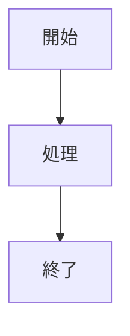
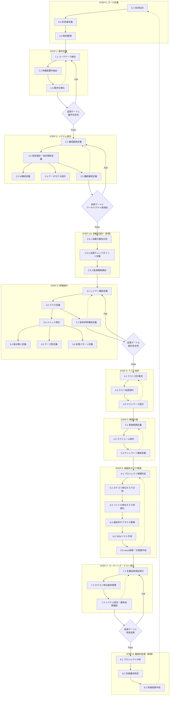

# AIコーディング開発プロセス体系化ドキュメント v1.3（完全版）

## 1. 概要

本ドキュメントは、AIエージェントによるソフトウェア開発プロセスv1.3の完全定義です。v1.2の段階的タスク管理アプローチを基盤とし、実証実験で判明した問題点への対策として、品質ゲート、フィードバックループ、継続的改善プロセスを追加しています。

### 1.1 v1.3の主要改善点

1. **品質ゲートの導入**: 各ステップ間に品質チェックポイントを設置
2. **フィードバックループの確立**: 問題の早期発見と修正
3. **設計実装整合性の強化**: 継続的な整合性チェックプロセス
4. **自動化設計プロセス（STEP 2.5）**: 自動化戦略の明確化
5. **継続的改善プロセス（STEP 8）**: プロジェクト完了後の振り返り

### 1.2 文書メタデータ標準

#### 1.2.1 必須メタデータ項目
全ての成果物ドキュメントは以下のメタデータ構造を持つ：

| 項目 | 内容 | 例 |
|------|------|-----|
| ドキュメントID | 一意識別子 | GOAL-001, UC-001, CLASS-001 |
| バージョン | セマンティックバージョニング | 1.0, 1.1, 2.0 |
| 作成日 | YYYY-MM-DD形式 | 2025-01-28 |
| 最終更新日 | YYYY-MM-DD形式 | 2025-01-28 |
| ステータス | 文書状態 | ドラフト/レビュー中/承認済み |
| 作成者 | 作成責任者 | [作成者名] |
| レビュー者 | レビュー責任者 | [レビュー者名] |
| 承認者 | 承認責任者 | [承認者名] |
| 関連文書 | 依存文書リスト | GOAL-001, STAK-001 |
| 変更履歴 | 変更記録 | 1.0: 初版作成 (YYYY-MM-DD) |

#### 1.2.2 ドキュメントID命名規則
**基本形式**: `{文書種別}-{連番3桁}`

**文書種別略語**:
- GOAL: ゴールステートメント
- STAK: ステークホルダー一覧
- CONST: 制約条件リスト
- UC: ユースケース一覧
- NFR: 非機能要件リスト
- REQ: 要求仕様書
- ARCH: システム構成図
- TECH: 技術選定書
- UI: 画面遷移図
- ENT: エンティティ定義書
- FUNC: 機能一覧表
- AUTO: 自動化機会リスト
- QCP: 品質チェックポイント定義書
- MON: 監視戦略書
- LAYER: レイヤー構成マップ
- CLASS: クラス設計表
- IF: インターフェース定義書
- SEQ: シーケンス仕様書
- TYPE: データ型仕様書
- LOGIC: 処理ロジックテンプレート
- DEP: 部品参照構造定義書
- TEST: テスト戦略書
- TARGET: テスト対象一覧
- CASE: テストケース定義書
- COMP: 実装コンポーネント一覧
- SCHED: 開発工程表
- DIR: ディレクトリ構造マップ
- SCALE: プロジェクト規模判定結果
- CAT: カテゴリ定義書
- TASK: ファイル単位タスクリスト
- SUB: サブタスク展開リスト
- ISSUE: Issue登録リスト・タスク仕様書
- TODO: 実装ToDoリスト
- QA: 品質保証実行結果
- PROG: カテゴリ進捗レポート
- SYS: システム品質レポート
- PROJ: プロジェクト分析レポート
- IMP: 改善機会リスト
- PROP: プロセス改善提案書
- QG1: 品質ゲート1判定結果
- QG2: 品質ゲート2判定結果
- QG3: 品質ゲート3判定結果
- QG4: 品質ゲート4判定結果
- DICC: 設計実装整合性チェック結果
- FBL: フィードバック分析レポート

#### 1.2.3 関連文書参照方法
**形式**: `{ドキュメントID}（{文書名}）`
**例**: `GOAL-001（ゴールステートメント）`, `UC-001（ユースケース一覧）`

### 1.3 図表作成標準

#### 1.3.1 Mermaid記法の使用
全ての図表はMermaid記法を使用し、以下の標準に従う：

**基本記法**:
````markdown

````

**ネスト記法（文書内でMermaidコードを表示する場合）**:
`````markdown
````mermaid

````
`````

**図表の種類と用途**:
- flowchart: プロセスフロー、ワークフロー
- graph: 依存関係、構造図
- sequenceDiagram: シーケンス図、相互作用
- classDiagram: クラス図、オブジェクト関係
- gantt: スケジュール、タイムライン
- gitgraph: ブランチ戦略、バージョン管理

**スタイリング規則**:
- 重要な要素: `style A fill:#f99,stroke:#333,stroke-width:3px`
- 処理中の要素: `style B fill:#bbf,stroke:#333,stroke-width:2px`
- 完了した要素: `style C fill:#9f9,stroke:#333,stroke-width:2px`

### 1.4 成果物名称対照表

| プロセス定義名 | テンプレートファイル名 | 統一名称 | ドキュメントID |
|---------------|---------------------|----------|---------------|
| ゴールステートメント | step0-goal-statement-template.md | ゴールステートメント | GOAL-001 |
| ステークホルダー一覧 | step0-stakeholders-template.md | ステークホルダー一覧 | STAK-001 |
| 制約条件リスト | step0-constraints-template.md | 制約条件リスト | CONST-001 |
| ユースケース一覧 | step1-use-cases-template.md | ユースケース一覧 | UC-001 |
| 非機能要件リスト | step1-non-functional-template.md | 非機能要件リスト | NFR-001 |
| 要求仕様書 | step1-requirements-specification-template.md | 要求仕様書 | REQ-001 |
| システム構成図 | step2-system-architecture-template.md | システム構成図 | ARCH-001 |
| 技術選定書 | step2-tech-stack-template.md | 技術選定書 | TECH-001 |
| 自動化機会リスト | step2.5-automation-opportunities-template.md | 自動化機会リスト | AUTO-001 |
| 品質チェックポイント定義書 | step2.5-quality-checkpoints-template.md | 品質チェックポイント定義書 | QCP-001 |
| 監視戦略書 | step2.5-monitoring-strategy-template.md | 監視戦略書 | MON-001 |
| クラス設計表 | step3-class-design-template.md | クラス設計表 | CLASS-001 |
| インターフェース定義書 | step3-interfaces-template.md | インターフェース定義書 | IF-001 |
| テスト戦略書 | step4-test-strategy-template.md | テスト戦略書 | TEST-001 |
| テスト対象一覧 | step4-test-targets-template.md | テスト対象一覧 | TARGET-001 |
| テストケース定義書 | step4-test-cases-template.md | テストケース定義書 | CASE-001 |
| 実装コンポーネント一覧 | step5-components-template.md | 実装コンポーネント一覧 | COMP-001 |
| 開発工程表 | step5-schedule-template.md | 開発工程表 | SCHED-001 |
| ディレクトリ構造マップ | step5-directory-structure-template.md | ディレクトリ構造マップ | DIR-001 |
| ファイル単位タスクリスト | step6-task-list-template.md | ファイル単位タスクリスト | TASK-001 |
| タスク管理表 | step6-task-management-template.md | タスク管理表 | MGMT-001 |
| タスク仕様書 | step6-task-specification-template.md | タスク仕様書 | SPEC-001 |
| 実装ToDoリスト | step6-todo-list-template.md | 実装ToDoリスト | TODO-001 |
| 実行ログ・進捗管理 | step7-progress-template.md | 実行ログ・進捗管理 | PROG-001 |
| 成果物・品質記録 | step7-deliverables-template.md | 成果物・品質記録 | DELIV-001 |
| 完成システム | step7-final-system-template.md | 完成システム | FINAL-001 |
| プロジェクト分析 | step8-project-analysis-template.md | プロジェクト分析 | PROJ-001 |
| 改善機会リスト | step8-improvement-opportunities-template.md | 改善機会リスト | IMP-001 |
| プロセス改善提案書 | step8-improvement-proposals-template.md | プロセス改善提案書 | PROP-001 |

### 1.5 補足ドキュメント

本プロセスの実施にあたり、以下の補足ドキュメントを参照してください：

#### 品質ゲート関連
- [品質ゲート詳細仕様書](./quality-gate-detailed-specifications-v1.3.md): 全品質ゲートの詳細仕様
- [品質ゲートチェックリスト](./quality-gate-checklists-v1.3.md): 実施時のチェックリスト
- [品質ゲート実施手順書](./quality-gate-implementation-guide-v1.3.md): 具体的な実施手順
- [品質ゲート1テンプレート](../templates/quality-gate-1-template.md): 要件完全性チェック
- [品質ゲート2テンプレート](../templates/quality-gate-2-template.md): アーキテクチャ実現可能性チェック
- [品質ゲート3テンプレート](../templates/quality-gate-3-template.md): 設計完全性チェック
- [品質ゲート4テンプレート](../templates/quality-gate-4-template.md): 実装品質チェック

#### ステップ別テンプレート
##### STEP 0: ゴール定義
- [ゴールステートメントテンプレート](../templates/step0-goal-statement-template.md)
- [ステークホルダー一覧テンプレート](../templates/step0-stakeholders-template.md)
- [制約条件リストテンプレート](../templates/step0-constraints-template.md)

##### STEP 1: 要件定義
- [ユースケース一覧テンプレート](../templates/step1-use-cases-template.md)
- [非機能要件リストテンプレート](../templates/step1-non-functional-template.md)
- [要求仕様書テンプレート](../templates/step1-requirements-specification-template.md)

##### STEP 2: システム設計
- [システム構成図テンプレート](../templates/step2-system-architecture-template.md)
- [技術選定書テンプレート](../templates/step2-tech-stack-template.md)

##### STEP 2.5: 自動化設計（v1.3新規）
- [自動化機会リストテンプレート](../templates/step2.5-automation-opportunities-template.md)
- [品質チェックポイント定義テンプレート](../templates/step2.5-quality-checkpoints-template.md)
- [監視戦略テンプレート](../templates/step2.5-monitoring-strategy-template.md)

##### STEP 3: 詳細設計
- [クラス設計表テンプレート](../templates/step3-class-design-template.md)
- [インターフェース定義テンプレート](../templates/step3-interfaces-template.md)

##### STEP 4: テスト設計
- [テスト戦略書テンプレート](../templates/step4-test-strategy-template.md)
- [テスト対象一覧テンプレート](../templates/step4-test-targets-template.md)
- [テストケース定義書テンプレート](../templates/step4-test-cases-template.md)

##### STEP 5: 開発計画
- [実装コンポーネント一覧テンプレート](../templates/step5-components-template.md)
- [開発工程表テンプレート](../templates/step5-schedule-template.md)
- [ディレクトリ構造マップテンプレート](../templates/step5-directory-structure-template.md)

##### STEP 6: 段階的タスク管理
- [カテゴリ定義書テンプレート](../templates/step6-task-management-template.md)
- [ファイル単位タスクリストテンプレート](../templates/step6-task-list-template.md)
- [タスク仕様書テンプレート](../templates/step6-task-specification-template.md)
- [実装ToDoリストテンプレート](../templates/step6-todo-list-template.md)
- [ToDo作成ガイド](../templates/step6-todo-creation-guide.md)

##### STEP 7: コーディング・テスト実行
- [実行ログ・進捗管理テンプレート](../templates/step7-progress-template.md)
- [成果物・品質記録テンプレート](../templates/step7-deliverables-template.md)
- [完成システムテンプレート](../templates/step7-final-system-template.md)

##### STEP 8: 継続的改善（v1.3新規）
- [プロジェクト分析テンプレート](../templates/step8-project-analysis-template.md)
- [改善機会リストテンプレート](../templates/step8-improvement-opportunities-template.md)
- [プロセス改善提案書テンプレート](../templates/step8-improvement-proposals-template.md)

#### その他のテンプレート
- [設計実装整合性テンプレート](../templates/design-implementation-consistency-template.md)
- [フィードバック分析テンプレート](../templates/feedback-analysis-template.md)

#### 多言語対応テンプレート
各テンプレートは日本語版・英語版を提供：

**日本語版**:
- [ゴールステートメントテンプレート](../templates/step0-goal-statement-template.md)
- [ユースケース一覧テンプレート](../templates/step1-use-cases-template.md)
- [システム構成図テンプレート](../templates/step2-system-architecture-template.md)

**英語版**:
- [Goal Statement Template](../templates/en/step0-goal-statement-template.md)
- [Use Cases Template](../templates/en/step1-use-cases-template.md)
- [System Architecture Template](../templates/en/step2-system-architecture-template.md)

**使用指針**:
- 国内プロジェクト: 日本語版を使用
- 国際プロジェクト: 英語版を使用
- 多国籍チーム: 英語版を使用し、必要に応じて日本語版を併用

## 2. 全体プロセスフロー v1.3



## 3. ステップ別詳細プロセス定義

### STEP 0: ゴール定義

#### サブステップ 0.1: 目的記述

| 項目 | 内容 |
|------|------|
| **プロセス** | プロジェクトの背景、動機、達成目標を明文化する |
| **インプット** | - ビジネス要求<br/>- 市場分析<br/>- 競合情報 |
| **インプット情報項目** | - business_needs: ビジネスニーズ<br/>- market_situation: 市場状況<br/>- competitor_analysis: 競合分析<br/>- stakeholder_requests: ステークホルダー要求<br/>- budget_constraints: 予算制約<br/>- timeline_requirements: 期限要求 |
| **アウトプット** | ゴールステートメント |
| **アウトプット情報項目** | - project_name: プロジェクト名<br/>- objective: 目的（1文で表現）<br/>- scope: 実装範囲<br/>- deliverables: 期待成果物<br/>- success_criteria: 成功基準（定量的指標3つ以上）<br/>- business_value: ビジネス価値<br/>- constraints: 前提条件・制約<br/>- exclusions: 除外事項<br/>- risks: 主要リスク（Top 5）<br/>- opportunities: 機会<br/>- milestones: 初期マイルストーン<br/>- critical_success_factors: 成功要因<br/>- quality_targets: 品質目標<br/>- **メタデータ**: GOAL-001, バージョン1.0, 関連文書リスト |
| **ファイル名** | goal-statement.md |
| **テンプレート** | [ゴールステートメントテンプレート](../templates/step0-goal-statement-template.md) |
| **完了確認チェックリスト** | - [ ] 必須セクションが全て記述されている<br/>- [ ] メタデータが適切に設定されている<br/>- [ ] プロジェクト目的が1文で明確に表現されている<br/>- [ ] 成功基準が定量的指標3つ以上で定義されている<br/>- [ ] スコープが明確に定義されている<br/>- [ ] 関連文書との整合性が確認されている<br/>- [ ] ステークホルダーレビューが完了している |
| **次プロセス** | 0.2 利用者定義 |

#### サブステップ 0.2: 利用者定義

| 項目 | 内容 |
|------|------|
| **プロセス** | システムの利用者と各ステークホルダーの役割を定義する |
| **インプット** | ゴールステートメント（0.1より） |
| **インプット情報項目** | - objective: 目的<br/>- expected_outcomes: 期待成果<br/>- project_scope: プロジェクトスコープ<br/>- business_context: ビジネス文脈 |
| **アウトプット** | ステークホルダー一覧 |
| **アウトプット情報項目** | - stakeholder_id: ID<br/>- name: 名前<br/>- role: 役割<br/>- responsibilities: 責任範囲<br/>- expectations: 期待事項<br/>- influence_level: 影響力レベル<br/>- interest_level: 関心度レベル<br/>- communication_preference: コミュニケーション方法<br/>- decision_authority: 意思決定権限<br/>- **メタデータ**: STAK-001, バージョン1.0, 関連文書: GOAL-001 |
| **ファイル名** | stakeholders.md |
| **テンプレート** | [ステークホルダー一覧テンプレート](../templates/step0-stakeholders-template.md) |
| **完了確認チェックリスト** | - [ ] 全ステークホルダーが特定されている<br/>- [ ] 影響力・関心度マトリクスが作成されている<br/>- [ ] 各ステークホルダーの期待事項が明確である<br/>- [ ] コミュニケーション方法が定義されている<br/>- [ ] 意思決定権限が明確である<br/>- [ ] メタデータが適切に設定されている |
| **次プロセス** | 0.3 制約整理 |

#### サブステップ 0.3: 制約整理

| 項目 | 内容 |
|------|------|
| **プロセス** | プロジェクトの制約条件を洗い出し、整理する |
| **インプット** | - ゴールステートメント（0.1より）<br/>- ステークホルダー一覧（0.2より） |
| **インプット情報項目** | - project_scope: スコープ<br/>- stakeholder_constraints: ステークホルダー制約<br/>- business_constraints: ビジネス制約<br/>- technical_constraints: 技術制約<br/>- regulatory_requirements: 規制要件 |
| **アウトプット** | 制約条件リスト |
| **アウトプット情報項目** | - constraint_id: ID<br/>- type: 制約タイプ（技術/予算/期間/規制/品質/リソース）<br/>- description: 説明<br/>- impact: 影響度（高/中/低）<br/>- severity: 重要度（必須/重要/推奨）<br/>- mitigation: 緩和策<br/>- workaround: 回避策<br/>- validation_method: 検証方法<br/>- **メタデータ**: CONST-001, バージョン1.0, 関連文書: GOAL-001, STAK-001 |
| **ファイル名** | constraints.md |
| **テンプレート** | [制約条件リストテンプレート](../templates/step0-constraints-template.md) |
| **次プロセス** | STEP 1: 要件定義（1.1 ユースケース抽出） |

### STEP 1: 要件定義

#### サブステップ 1.1: ユースケース抽出

| 項目 | 内容 |
|------|------|
| **プロセス** | ステークホルダーの利用シナリオからユースケースを抽出する |
| **インプット** | - ゴールステートメント（STEP 0より）<br/>- ステークホルダー一覧（STEP 0より） |
| **インプット情報項目** | - stakeholders: ステークホルダー情報<br/>- project_objective: プロジェクト目的<br/>- business_processes: ビジネスプロセス<br/>- user_scenarios: ユーザーシナリオ |
| **アウトプット** | ユースケース一覧 |
| **アウトプット情報項目** | - usecase_id: ID<br/>- actor: アクター<br/>- description: 説明<br/>- precondition: 事前条件<br/>- main_flow: 基本フロー<br/>- alternate_flow: 代替フロー<br/>- exception_flow: 例外フロー<br/>- postcondition: 事後条件<br/>- business_value: ビジネス価値<br/>- priority: 優先度（高/中/低）<br/>- complexity: 複雑度（高/中/低）<br/>- **メタデータ**: UC-001, バージョン1.0, 関連文書: GOAL-001, STAK-001 |
| **ファイル名** | use-cases.md |
| **テンプレート** | [ユースケース一覧テンプレート](../templates/step1-use-cases-template.md) |
| **次プロセス** | 1.2 非機能要件抽出、1.3 要求仕様化 |

#### サブステップ 1.2: 非機能要件抽出

| 項目 | 内容 |
|------|------|
| **プロセス** | 品質要件、性能要件、制約条件から非機能要件を定義する |
| **インプット** | - ゴールステートメント（STEP 0より）<br/>- 制約条件リスト（STEP 0より） |
| **インプット情報項目** | - constraints: 制約条件<br/>- quality_expectations: 品質期待値<br/>- performance_requirements: 性能要件<br/>- security_requirements: セキュリティ要件<br/>- usability_requirements: ユーザビリティ要件 |
| **アウトプット** | 非機能要件リスト |
| **アウトプット情報項目** | - nfr_id: ID<br/>- category: カテゴリ（性能/セキュリティ/可用性/保守性/移植性/ユーザビリティ）<br/>- requirement: 要件内容<br/>- measurement: 測定方法<br/>- threshold: 閾値<br/>- priority: 優先度（必須/重要/推奨）<br/>- rationale: 根拠<br/>- verification_method: 検証方法<br/>- **メタデータ**: NFR-001, バージョン1.0, 関連文書: GOAL-001, CONST-001 |
| **ファイル名** | non-functional-requirements.md |
| **テンプレート** | [非機能要件リストテンプレート](../templates/step1-non-functional-template.md) |
| **次プロセス** | 1.3 要求仕様化 |

#### サブステップ 1.3: 要求仕様化

| 項目 | 内容 |
|------|------|
| **プロセス** | ユースケースと非機能要件を統合し、要求仕様書を作成する |
| **インプット** | - ユースケース一覧（1.1より）<br/>- 非機能要件リスト（1.2より） |
| **インプット情報項目** | - use_cases: 全ユースケース<br/>- non_functional_requirements: 全非機能要件<br/>- business_rules: ビジネスルール<br/>- data_requirements: データ要件 |
| **アウトプット** | 要求仕様書 |
| **アウトプット情報項目** | - functional_requirements: 機能要件一覧<br/>- non_functional_requirements: 非機能要件一覧<br/>- priority_matrix: 優先度マトリクス<br/>- acceptance_criteria: 受入基準<br/>- traceability_matrix: トレーサビリティマトリクス<br/>- assumptions: 前提条件<br/>- dependencies: 依存関係<br/>- risks: リスク一覧<br/>- **メタデータ**: REQ-001, バージョン1.0, 関連文書: UC-001, NFR-001, GOAL-001 |
| **ファイル名** | requirements-specification.md |
| **テンプレート** | [要求仕様書テンプレート](../templates/step1-requirements-specification-template.md) |
| **次プロセス** | 品質ゲート1 → STEP 2: システム設計（2.1 構成要素定義） |

### 品質ゲート1: 要件完全性チェック

| 項目 | 内容 |
|------|------|
| **プロセス** | 要件定義の完全性と実現可能性を検証する |
| **インプット** | - 要求仕様書（STEP 1より）<br/>- 制約条件リスト（STEP 0より） |
| **チェック項目** | - 全ステークホルダーの要件カバレッジ<br/>- 測定可能な受入基準の存在<br/>- 優先順位の明確化<br/>- 技術的実現可能性 |
| **アウトプット** | 品質ゲート判定結果（QG1-001） |
| **判定基準** | - カバレッジ100%<br/>- 受入基準の具体性<br/>- ステークホルダー承認 |
| **不合格時アクション** | STEP 1.1へのフィードバック |
| **詳細仕様** | [品質ゲート詳細仕様書 - 品質ゲート1](./quality-gate-detailed-specifications-v1.3.md#2-品質ゲート1-要件完全性チェック) |
| **チェックリスト** | [品質ゲート1チェックリスト](./quality-gate-checklists-v1.3.md#1-品質ゲート1チェックリスト-要件完全性) |
| **実施手順** | [品質ゲート1実施手順](./quality-gate-implementation-guide-v1.3.md#2-品質ゲート1-実施手順) |
| **テンプレート** | [品質ゲート1テンプレート](../templates/quality-gate-1-template.md) |

**詳細チェック手順**:

1. **ゴール定義の完全性チェック**
   - プロジェクト目的の明確性（1文で説明されているか）
   - 成功基準の定量性（測定可能な指標が3つ以上あるか）
   - スコープの明確性（含む/含まない範囲が明確か）
   - 成果物リストの完全性（全ての成果物が列挙されているか）

2. **ステークホルダー分析の完全性**
   - 全ステークホルダーの特定（漏れがないか）
   - 影響力・関心度マトリクスの作成
   - コミュニケーション計画の策定
   - 合意形成プロセスの定義

3. **要件定義の品質確認**
   - ユースケースの完全性（全機能がカバーされているか）
   - 非機能要件の具体性（測定可能な基準があるか）
   - 要件間の整合性（矛盾がないか）
   - トレーサビリティの確保（要件IDで追跡可能か）

4. **定量的基準の評価**
   - ユースケースカバレッジ: 100%
   - 要件定義率: 100%
   - ステークホルダー合意率: 100%
   - トレーサビリティ完成度: 100%

5. **判定とアクション**
   - Pass: 全ての必須項目がチェック済み、定量基準を全て満たす
   - Conditional Pass: 必須項目は満たすが、推奨改善項目がある
   - Fail: 必須項目に未達成がある

**不合格時のフィードバックループ**:
1. 問題の根本原因分析
2. 修正計画の策定
3. 修正作業の実施
4. 再チェックの実行
5. 改善提案の作成

### STEP 2: システム設計

#### サブステップ 2.1: 構成要素定義

| 項目 | 内容 |
|------|------|
| **プロセス** | システムの主要構成要素とその責任を定義する |
| **インプット** | 要求仕様書（STEP 1より） |
| **インプット情報項目** | - functional_requirements: 機能要件<br/>- system_scope: システムスコープ<br/>- architectural_patterns: アーキテクチャパターン<br/>- quality_attributes: 品質属性 |
| **アウトプット** | システム構成図 |
| **アウトプット情報項目** | - components: コンポーネント一覧<br/>- responsibilities: 責任定義<br/>- interfaces: インターフェース概要<br/>- deployment_view: 配置ビュー<br/>- logical_view: 論理ビュー<br/>- process_view: プロセスビュー<br/>- **メタデータ**: ARCH-001, バージョン1.0, 関連文書: REQ-001, NFR-001 |
| **ファイル名** | system-architecture.md |
| **テンプレート** | [システム構成図テンプレート](../templates/step2-system-architecture-template.md) |
| **次プロセス** | 2.2 技術選定・依存関係定義 |

#### サブステップ 2.2: 技術選定・依存関係定義

| 項目 | 内容 |
|------|------|
| **プロセス** | 技術スタックの選定と外部依存関係を定義する |
| **インプット** | - システム構成図（2.1より）<br/>- 非機能要件リスト（STEP 1より） |
| **インプット情報項目** | - components: コンポーネント<br/>- performance_requirements: 性能要件<br/>- security_requirements: セキュリティ要件<br/>- scalability_requirements: スケーラビリティ要件<br/>- integration_requirements: 統合要件 |
| **アウトプット** | 技術選定書 |
| **アウトプット情報項目** | - technology_stack: 技術スタック<br/>- external_dependencies: 外部依存<br/>- version_constraints: バージョン制約<br/>- rationale: 選定理由<br/>- alternatives_considered: 検討した代替案<br/>- risk_assessment: リスク評価<br/>- migration_strategy: 移行戦略<br/>- **メタデータ**: TECH-001, バージョン1.0, 関連文書: ARCH-001, NFR-001 |
| **ファイル名** | tech-stack.md |
| **テンプレート** | [技術選定書テンプレート](../templates/step2-tech-stack-template.md) |
| **次プロセス** | 2.3 UI構成定義、2.4 データモデル設計、2.5 機能構成定義 |

#### サブステップ 2.3: UI構成定義

| 項目 | 内容 |
|------|------|
| **プロセス** | ユーザーインターフェースの基本構成を定義する |
| **インプット** | - ユースケース一覧（STEP 1より）<br/>- ステークホルダー一覧（STEP 0より） |
| **インプット情報項目** | - user_scenarios: ユーザーシナリオ<br/>- actor_types: アクタータイプ |
| **アウトプット** | 画面遷移図（上位） |
| **アウトプット情報項目** | - screen_list: 画面一覧<br/>- navigation_flow: 遷移フロー<br/>- ui_components: UIコンポーネント |
| **次プロセス** | STEP 3: 詳細設計 |

#### サブステップ 2.4: データモデル設計

| 項目 | 内容 |
|------|------|
| **プロセス** | システムで扱うデータの概念モデルを設計する |
| **インプット** | - システム構成図（2.1より）<br/>- ユースケース一覧（STEP 1より） |
| **インプット情報項目** | - data_requirements: データ要件<br/>- business_entities: ビジネスエンティティ |
| **アウトプット** | エンティティ定義書 |
| **アウトプット情報項目** | - entities: エンティティ一覧<br/>- attributes: 属性定義<br/>- relationships: リレーション<br/>- constraints: 制約条件 |
| **次プロセス** | STEP 3: 詳細設計（3.5 データ型定義） |

#### サブステップ 2.5: 機能構成定義

| 項目 | 内容 |
|------|------|
| **プロセス** | システムの機能構成と機能間の関係を定義する |
| **インプット** | - システム構成図（2.1より）<br/>- ユースケース一覧（STEP 1より） |
| **インプット情報項目** | - components: コンポーネント<br/>- use_cases: ユースケース |
| **アウトプット** | 機能一覧表 |
| **アウトプット情報項目** | - function_id: 機能ID<br/>- function_name: 機能名<br/>- description: 説明<br/>- component_mapping: コンポーネントマッピング |
| **次プロセス** | 品質ゲート2 → STEP 2.5: 自動化設計（2.5.1 自動化機会分析） |

### 品質ゲート2: アーキテクチャ実現可能性チェック

| 項目 | 内容 |
|------|------|
| **プロセス** | システムアーキテクチャが要件を満たし、実装可能であることを検証する |
| **インプット** | - システム設計成果物一式（STEP 2より）<br/>- 要求仕様書（STEP 1より） |
| **チェック項目** | - 要件カバレッジ<br/>- 技術的実現可能性<br/>- 非機能要件の達成可能性<br/>- リスク評価 |
| **アウトプット** | 品質ゲート判定結果 |
| **詳細仕様** | [品質ゲート2テンプレート](../templates/quality-gate-2-template.md) |
| **チェックリスト** | [品質ゲート2チェックリスト](../templates/quality-gate-2-template.md#8-完了チェックリスト) |
| **実施手順** | [品質ゲート2実施ガイド](./quality-gate-implementation-guide-v1.3.md#3-品質ゲート2-実施手順) |
| **判定基準** | - 全要件のマッピング完了<br/>- 技術的実証<br/>- リスク対策の明確化 |
| **不合格時アクション** | STEP 2.1へのフィードバック |

### STEP 2.5: 自動化設計（v1.3新規）

#### サブステップ 2.5.1: 自動化機会分析

| 項目 | 内容 |
|------|------|
| **プロセス** | 開発プロセスにおける自動化可能な作業を特定し、費用対効果を分析する |
| **インプット** | - システム設計成果物（STEP 2より）<br/>- 非機能要件リスト（STEP 1より） |
| **インプット情報項目** | - architecture: アーキテクチャ<br/>- quality_requirements: 品質要件<br/>- development_constraints: 開発制約 |
| **アウトプット** | 自動化機会リスト |
| **アウトプット情報項目** | - automation_target: 自動化対象<br/>- automation_type: 自動化タイプ<br/>- cost_benefit: 費用対効果<br/>- priority: 優先度 |
| **次プロセス** | 2.5.2 品質チェックポイント定義 |

#### サブステップ 2.5.2: 品質チェックポイント定義

| 項目 | 内容 |
|------|------|
| **プロセス** | 各開発フェーズにおける品質チェックポイントを定義する |
| **インプット** | - 自動化機会リスト（2.5.1より）<br/>- 品質要件（STEP 1より） |
| **インプット情報項目** | - quality_targets: 品質目標<br/>- development_phases: 開発フェーズ |
| **アウトプット** | 品質チェックポイント定義書 |
| **アウトプット情報項目** | - checkpoint_id: ID<br/>- phase: 実施フェーズ<br/>- check_items: チェック項目<br/>- pass_criteria: 合格基準<br/>- automation_level: 自動化レベル |
| **次プロセス** | 2.5.3 監視戦略策定 |

#### サブステップ 2.5.3: 開発プロセス監視戦略策定

| 項目 | 内容 |
|------|------|
| **プロセス** | 開発プロセスの継続的監視戦略を策定する |
| **インプット** | - 品質チェックポイント定義書（2.5.2より）<br/>- 自動化機会リスト（2.5.1より） |
| **インプット情報項目** | - quality_checkpoints: 品質チェックポイント<br/>- automation_targets: 自動化対象<br/>- ci_cd_pipeline: CI/CDパイプライン定義 |
| **アウトプット** | 開発プロセス監視戦略書 |
| **アウトプット情報項目** | - process_monitoring_targets: プロセス監視対象<br/>- development_metrics: 開発メトリクス定義<br/>- quality_thresholds: 品質閾値<br/>- process_alert_rules: プロセスアラートルール<br/>- automation_triggers: 自動化トリガー<br/>- dashboard_design: 開発ダッシュボード設計<br/>- **メタデータ**: MON-001, バージョン1.0, 関連文書: AUTO-001, QCP-001, TECH-001 |
| **ファイル名** | development-process-monitoring-strategy.md |
| **テンプレート** | [開発プロセス監視戦略テンプレート](../templates/step2.5-monitoring-strategy-template.md) |
| **次プロセス** | STEP 3: 詳細設計（3.1 レイヤー構造定義） |

### STEP 3: 詳細設計

#### サブステップ 3.1: レイヤー構造定義

| 項目 | 内容 |
|------|------|
| **プロセス** | システムのレイヤー構造と各レイヤーの責任を定義する |
| **インプット** | - システム構成図（STEP 2より）<br/>- 技術選定書（STEP 2より）<br/>- 開発プロセス監視戦略書（STEP 2.5より） |
| **インプット情報項目** | - components: コンポーネント<br/>- technology_stack: 技術スタック<br/>- process_monitoring_points: プロセス監視ポイント |
| **アウトプット** | レイヤー構成マップ |
| **アウトプット情報項目** | - layers: レイヤー定義<br/>- layer_responsibilities: レイヤー責任<br/>- layer_interfaces: レイヤー間インターフェース |
| **次プロセス** | 3.2 クラス定義 |

#### サブステップ 3.2: クラス定義

| 項目 | 内容 |
|------|------|
| **プロセス** | 各レイヤーのクラス構造と責任を定義する |
| **インプット** | - レイヤー構成マップ（3.1より）<br/>- 機能一覧表（STEP 2より） |
| **インプット情報項目** | - layer_structure: レイヤー構造<br/>- functions: 機能一覧 |
| **アウトプット** | クラス設計表 |
| **アウトプット情報項目** | - class_id: クラスID<br/>- class_name: クラス名<br/>- layer: 所属レイヤー<br/>- responsibility: 責任<br/>- attributes: 属性<br/>- methods_overview: メソッド概要 |
| **次プロセス** | 3.3 メソッド設計、3.7 部品参照構造定義 |

#### サブステップ 3.3: メソッド設計

| 項目 | 内容 |
|------|------|
| **プロセス** | 各クラスのメソッドインターフェースを詳細に定義する |
| **インプット** | - クラス設計表（3.2より）<br/>- エンティティ定義書（STEP 2より） |
| **インプット情報項目** | - classes: クラス定義<br/>- data_types: データ型 |
| **アウトプット** | メソッドI/Fリスト |
| **アウトプット情報項目** | - method_id: メソッドID<br/>- method_name: メソッド名<br/>- parameters: パラメータ定義<br/>- return_type: 戻り値型<br/>- exceptions: 例外定義<br/>- description: 説明 |
| **次プロセス** | 3.4 振る舞い定義、3.5 データ型定義、3.6 処理パターン定義 |

#### サブステップ 3.4: 振る舞い定義

| 項目 | 内容 |
|------|------|
| **プロセス** | メソッド間の相互作用と処理の流れを定義する |
| **インプット** | - メソッドI/Fリスト（3.3より）<br/>- ユースケース一覧（STEP 1より） |
| **インプット情報項目** | - method_interfaces: メソッドインターフェース<br/>- use_case_flows: ユースケースフロー |
| **アウトプット** | シーケンス仕様書 |
| **アウトプット情報項目** | - sequence_id: シーケンスID<br/>- scenario: シナリオ<br/>- actors: アクター<br/>- interactions: 相互作用<br/>- conditions: 条件分岐 |
| **次プロセス** | 3.6 処理パターン定義 |

#### サブステップ 3.5: データ型定義

| 項目 | 内容 |
|------|------|
| **プロセス** | システムで使用するデータ型を詳細に定義する |
| **インプット** | - エンティティ定義書（STEP 2より）<br/>- メソッドI/Fリスト（3.3より） |
| **インプット情報項目** | - entities: エンティティ<br/>- method_parameters: メソッドパラメータ |
| **アウトプット** | データ型仕様書 |
| **アウトプット情報項目** | - type_id: 型ID<br/>- type_name: 型名<br/>- properties: プロパティ定義<br/>- validations: バリデーション<br/>- serialization: シリアライズ形式 |
| **次プロセス** | STEP 4: テスト設計（4.3 テストケース設計） |

#### サブステップ 3.6: 処理パターン定義

| 項目 | 内容 |
|------|------|
| **プロセス** | 共通的な処理パターンとアルゴリズムを定義する |
| **インプット** | - メソッドI/Fリスト（3.3より）<br/>- シーケンス仕様書（3.4より） |
| **インプット情報項目** | - method_specifications: メソッド仕様<br/>- processing_flows: 処理フロー |
| **アウトプット** | 処理ロジックテンプレート |
| **アウトプット情報項目** | - pattern_id: パターンID<br/>- pattern_name: パターン名<br/>- algorithm: アルゴリズム<br/>- error_handling: エラー処理<br/>- performance_notes: 性能考慮事項 |
| **次プロセス** | STEP 4: テスト設計（4.3 テストケース設計） |

#### サブステップ 3.7: 部品参照構造定義

| 項目 | 内容 |
|------|------|
| **プロセス** | クラス間の依存関係と再利用構造を定義する |
| **インプット** | - クラス設計表（3.2より）<br/>- メソッドI/Fリスト（3.3より） |
| **インプット情報項目** | - classes: クラス一覧<br/>- method_calls: メソッド呼び出し関係 |
| **アウトプット** | 部品参照構造定義書 |
| **アウトプット情報項目** | - dependency_map: 依存関係マップ<br/>- interface_contracts: インターフェース契約<br/>- reusable_components: 再利用可能コンポーネント<br/>- circular_dependencies: 循環依存（要解決） |
| **次プロセス** | 品質ゲート3 → STEP 4: テスト設計（4.1 テスト方針策定） |

### 品質ゲート3: 設計完全性チェック

| 項目 | 内容 |
|------|------|
| **プロセス** | 詳細設計の完全性と実装可能性を検証する |
| **インプット** | - 詳細設計成果物一式（STEP 3より）<br/>- システム設計成果物（STEP 2より） |
| **チェック項目** | - インターフェース定義の完全性<br/>- データモデルの整合性<br/>- 設計パターンの適切性<br/>- 循環依存の有無 |
| **アウトプット** | 品質ゲート判定結果 |
| **詳細仕様** | [品質ゲート3テンプレート](../templates/quality-gate-3-template.md) |
| **チェックリスト** | [品質ゲート3チェックリスト](../templates/quality-gate-3-template.md#10-完了チェックリスト) |
| **実施手順** | [品質ゲート3実施ガイド](./quality-gate-implementation-guide-v1.3.md#4-品質ゲート3-実施手順) |
| **判定基準** | - 全インターフェース定義完了<br/>- データモデル正規化<br/>- 設計レビュー承認 |
| **不合格時アクション** | STEP 3.1へのフィードバック |

### STEP 4: テスト設計

#### サブステップ 4.1: テスト方針策定

| 項目 | 内容 |
|------|------|
| **プロセス** | プロジェクト全体のテスト戦略と方針を策定する |
| **インプット** | - 要求仕様書（STEP 1より）<br/>- 非機能要件リスト（STEP 1より）<br/>- 品質チェックポイント定義書（STEP 2.5より） |
| **インプット情報項目** | - quality_requirements: 品質要件<br/>- risk_areas: リスク領域<br/>- quality_checkpoints: 品質チェックポイント |
| **アウトプット** | テスト戦略書 |
| **アウトプット情報項目** | - test_levels: テストレベル定義<br/>- test_types: テストタイプ<br/>- coverage_targets: カバレッジ目標<br/>- priority_matrix: 優先度マトリクス |
| **次プロセス** | 4.2 テスト粒度設計 |

#### サブステップ 4.2: テスト粒度設計

| 項目 | 内容 |
|------|------|
| **プロセス** | テスト対象の粒度と網羅性を設計する |
| **インプット** | - クラス設計表（STEP 3より）<br/>- メソッドI/Fリスト（STEP 3より）<br/>- テスト戦略書（4.1より） |
| **インプット情報項目** | - classes: クラス一覧<br/>- methods: メソッド一覧<br/>- complexity_metrics: 複雑度メトリクス |
| **アウトプット** | テスト対象一覧 |
| **アウトプット情報項目** | - test_target_id: テスト対象ID<br/>- target_type: 対象タイプ<br/>- test_level: テストレベル<br/>- priority: 優先度 |
| **次プロセス** | 4.3 テストケース設計 |

#### サブステップ 4.3: テストケース設計

| 項目 | 内容 |
|------|------|
| **プロセス** | テスト対象の仕様に基づいて網羅的なテストケースを設計する |
| **インプット** | - テスト対象一覧（4.2より）<br/>- 処理ロジックテンプレート（STEP 3より）<br/>- データ型仕様書（STEP 3より）<br/>- 要求仕様書（STEP 1より） |
| **インプット情報項目** | - test_targets: テスト対象（詳細仕様付き）<br/>- specification_complexity: 仕様複雑度<br/>- business_rules: ビジネスルール<br/>- data_patterns: データパターン<br/>- error_conditions: エラー条件<br/>- processing_patterns: 処理パターン<br/>- data_constraints: データ制約 |
| **アウトプット** | テストケース定義書 |
| **アウトプット情報項目** | - test_case_summary: テストケースサマリ（カテゴリ別件数）<br/>- coverage_analysis: カバレッジ分析<br/>- test_case_files: テストケース定義ファイル群<br/>- traceability_matrix: トレーサビリティマトリクス<br/>- target_case_mapping: 対象-ケース対応表<br/>- quality_gate_metrics: 品質ゲート評価メトリクス<br/>- testcase_id: テストケースID<br/>- test_scenario: テストシナリオ<br/>- test_data: テストデータ<br/>- expected_result: 期待結果<br/>- test_steps: テスト手順<br/>- **メタデータ**: CASE-001, バージョン1.0, 関連文書: TARGET-001, LOGIC-001, TYPE-001, REQ-001 |
| **ファイル名** | test-cases-definition.md |
| **テンプレート** | [テストケース定義テンプレート](../templates/step4-test-cases-template.md) |
| **展開ルール** | 仕様分析ベース展開：入力パターン数・ビジネスルール数・エラー条件数・データ状態数に基づく動的展開 |
| **品質基準** | テスト対象一覧との整合性率 ≥ 95%、カバレッジ完全性 = 100%、トレーサビリティ = 100% |
| **次プロセス** | STEP 5: 開発計画（5.1 実装範囲定義）、STEP 7: コーディング・テスト実行 |

### STEP 5: 開発計画

#### サブステップ 5.1: 実装範囲定義

| 項目 | 内容 |
|------|------|
| **プロセス** | 実装すべきコンポーネントの範囲を定義する |
| **インプット** | - クラス設計表（STEP 3より）<br/>- テスト対象一覧（STEP 4より） |
| **インプット情報項目** | - all_classes: 全クラス<br/>- test_priorities: テスト優先度 |
| **アウトプット** | 実装コンポーネント一覧 |
| **アウトプット情報項目** | - component_id: コンポーネントID<br/>- implementation_scope: 実装範囲<br/>- dependencies: 依存関係<br/>- priority: 実装優先度 |
| **次プロセス** | 5.2 スケジュール設計 |

#### サブステップ 5.2: スケジュール設計

| 項目 | 内容 |
|------|------|
| **プロセス** | STEP 7実行を前提とした3フェーズ実装スケジュールを設計する |
| **インプット** | - 実装コンポーネント一覧（5.1より）<br/>- 制約条件リスト（STEP 0より）<br/>- テスト戦略書（STEP 4より）<br/>- テストケース定義書（STEP 4より）<br/>- 品質チェックポイント定義書（STEP 2.5より） |
| **インプット情報項目** | - components: コンポーネント<br/>- time_constraints: 時間制約<br/>- resource_constraints: リソース制約<br/>- test_strategy: テスト戦略<br/>- test_cases: テストケース<br/>- quality_checkpoints: 品質チェックポイント |
| **アウトプット** | 3フェーズ実装工程表 |
| **アウトプット情報項目** | - phase1_schedule: Phase 1実装・単体テストスケジュール<br/>- phase2_schedule: Phase 2結合テストスケジュール<br/>- phase3_schedule: Phase 3 E2Eテストスケジュール<br/>- step7_execution_plan: STEP 7実行計画<br/>- test_integration_schedule: テスト統合スケジュール<br/>- quality_gate_schedule: 品質ゲートスケジュール<br/>- integration_checklist: STEP 5・7整合性チェックリスト |
| **ファイル名** | 3-phase-implementation-schedule.md |
| **テンプレート** | [3フェーズ実装スケジュールテンプレート](../templates/step5-schedule-template.md) |
| **品質基準** | - テスト戦略書との完全整合性確認必須<br/>- STEP 7サブプロセスとの対応関係明確化必須<br/>- 3フェーズ実装モデルの完全実装必須<br/>- テストケース数に基づく工数見積必須 |
| **次プロセス** | 5.3 ディレクトリ構造定義 |

#### サブステップ 5.3: ディレクトリ構造定義

| 項目 | 内容 |
|------|------|
| **プロセス** | プロジェクトのディレクトリ構造を定義する |
| **インプット** | - 技術選定書（STEP 2より）<br/>- レイヤー構成マップ（STEP 3より）<br/>- 自動化戦略書（STEP 2.5より） |
| **インプット情報項目** | - technology_conventions: 技術規約<br/>- layer_structure: レイヤー構造<br/>- automation_plan: 自動化計画 |
| **アウトプット** | ディレクトリ構造マップ |
| **アウトプット情報項目** | - directory_tree: ディレクトリツリー<br/>- naming_conventions: 命名規則<br/>- file_organization: ファイル編成<br/>- module_boundaries: モジュール境界 |
| **次プロセス** | STEP 6: 段階的タスク管理（6.1 プロジェクト規模判定） |

### STEP 6: 段階的タスク管理

#### サブステップ 6.1: プロジェクト規模判定

| 項目 | 内容 |
|------|------|
| **プロセス** | プロジェクトの規模を判定し、適切な管理手法を選択する |
| **インプット** | - ディレクトリ構造マップ（STEP 5より）<br/>- 実装コンポーネント一覧（STEP 5より） |
| **インプット情報項目** | - file_count: ファイル数<br/>- complexity_metrics: 複雑度メトリクス<br/>- team_size: チーム規模 |
| **アウトプット** | プロジェクト規模判定結果 |
| **アウトプット情報項目** | - project_scale: 規模（小/中/大）<br/>- management_approach: 管理手法<br/>- category_count: カテゴリ数目安 |
| **次プロセス** | 6.2 カテゴリ単位タスク分割 |

#### サブステップ 6.2: カテゴリ単位タスク分割

| 項目 | 内容 |
|------|------|
| **プロセス** | プロジェクトを管理可能なカテゴリに分割する |
| **インプット** | - プロジェクト規模判定結果（6.1より）<br/>- 機能一覧表（STEP 2より）<br/>- 開発工程表（STEP 5より） |
| **インプット情報項目** | - management_approach: 管理手法<br/>- functions: 機能一覧<br/>- dependencies: 依存関係 |
| **アウトプット** | カテゴリ定義書 |
| **アウトプット情報項目** | - category_id: カテゴリID<br/>- category_name: カテゴリ名<br/>- scope: スコープ<br/>- dependencies: カテゴリ間依存 |
| **次プロセス** | 6.3 ファイル単位タスク詳細化 |

#### サブステップ 6.3: ファイル単位タスク詳細化

| 項目 | 内容 |
|------|------|
| **プロセス** | カテゴリ内のファイル単位でタスクを詳細化する |
| **インプット** | - カテゴリ定義書（6.2より）<br/>- クラス設計表（STEP 3より）<br/>- 部品参照構造定義書（STEP 3より） |
| **インプット情報項目** | - categories: カテゴリ<br/>- classes: クラス一覧<br/>- file_mapping: ファイルマッピング |
| **アウトプット** | ファイル単位タスクリスト |
| **アウトプット情報項目** | - task_id: タスクID（TSK-XXX-YYY形式）<br/>- file_path: ファイルパス<br/>- task_type: タスクタイプ<br/>- complexity: 複雑度 |
| **次プロセス** | 6.4 選択的サブタスク展開 |

#### サブステップ 6.4: 選択的サブタスク展開

| 項目 | 内容 |
|------|------|
| **プロセス** | ファイルの重要度・複雑度に応じてサブタスクを展開する |
| **インプット** | - ファイル単位タスクリスト（6.3より）<br/>- 品質要件（STEP 1より） |
| **インプット情報項目** | - file_tasks: ファイルタスク<br/>- importance_matrix: 重要度マトリクス<br/>- quality_targets: 品質目標 |
| **アウトプット** | サブタスク展開リスト |
| **アウトプット情報項目** | - task_id: タスクID<br/>- subtasks: サブタスクリスト<br/>- quality_level: 品質投資レベル<br/>- estimated_effort: 見積工数<br/>- **メタデータ**: SUB-001, バージョン1.0, 関連文書: TASK-001, NFR-001 |
| **ファイル名** | subtask-expansion.md |
| **テンプレート** | [サブタスク展開テンプレート](../templates/step6-subtask-expansion-template.md) |
| **次プロセス** | 6.5 ToDoリスト作成 |

#### サブステップ 6.5: ToDoリスト作成

| 項目 | 内容 |
|------|------|
| **プロセス** | 階層構造チェックボックス形式のToDoリストを作成し、カテゴリ単位で進捗管理を実現する |
| **インプット** | - サブタスク展開リスト（6.4より）<br/>- カテゴリ定義書（6.2より）<br/>- プロジェクト規模判定結果（6.1より） |
| **インプット情報項目** | - expanded_tasks: 展開済みタスク<br/>- categories: カテゴリ定義<br/>- project_scale: プロジェクト規模<br/>- management_approach: 管理手法 |
| **アウトプット** | 実装ToDoリスト |
| **アウトプット情報項目** | - hierarchical_tasks: 階層構造タスク<br/>- progress_tracking: 進捗追跡機能<br/>- category_management: カテゴリ単位管理<br/>- subtask_expansion: サブタスク展開レベル<br/>- **メタデータ**: TODO-001, バージョン1.0, 関連文書: SUB-001, CAT-001, SCALE-001 |
| **ファイル名** | todo-list.md |
| **テンプレート** | [実装ToDoリストテンプレート](../templates/step6-todo-list-template.md) |
| **次プロセス** | 6.6 Issue登録・仕様書作成 |

**ToDoリスト作成の詳細手順**:

1. **プロジェクト規模別テンプレート選択**
   - 小規模（10ファイル未満）: レイヤー単位管理
   - 中規模（10-50ファイル）: 機能モジュール単位管理
   - 大規模（50ファイル以上）: フェーズ単位管理

2. **階層構造の構築**
   ```markdown
   ## 1. [カテゴリ名] [進捗バー] X% (Y/Z タスク完了)

   ### TSK-001-ENT-User [■■■■■■■■░░] 80% (4/5 サブタスク完了)
   - [x] 1. 仕様確認・設計理解
   - [x] 2. コーディング
   - [x] 3. テストコーディング
   - [x] 4. 単体テスト実行
   - [ ] 5. リポジトリコミット
   - [ ] 6. ToDoチェック
   - [ ] 7. Issueクローズ
   ```

3. **7つの標準サブタスクの統一適用**
   - 仕様確認・設計理解
   - コーディング
   - テストコーディング
   - 単体テスト実行
   - リポジトリコミット
   - ToDoチェック
   - Issueクローズ

4. **選択的サブタスク展開の適用**
   - 全展開: Entity、Service（重要度高、複雑度高）
   - 中展開: Controller、Repository（重要度中、複雑度中）
   - 簡略展開: DTO、Utility（重要度低、複雑度低）

5. **進捗可視化機能**
   - カテゴリレベル進捗バー
   - タスクレベル進捗バー
   - 全体進捗サマリ

#### サブステップ 6.6: Issue登録・仕様書作成

| 項目 | 内容 |
|------|------|
| **プロセス** | ToDoリストの各タスクをIssueとして登録し、詳細仕様書を作成する |
| **インプット** | - 実装ToDoリスト（6.5より）<br/>- サブタスク展開リスト（6.4より）<br/>- メソッドI/Fリスト（STEP 3より）<br/>- テストケース定義書（STEP 4より） |
| **インプット情報項目** | - todo_tasks: ToDoタスク<br/>- expanded_tasks: 展開済みタスク<br/>- method_specifications: メソッド仕様<br/>- test_requirements: テスト要件 |
| **アウトプット** | Issue登録リスト・タスク仕様書 |
| **アウトプット情報項目** | - issue_id: Issue ID<br/>- issue_title: タイトル<br/>- task_specification: タスク仕様<br/>- acceptance_criteria: 受入基準<br/>- todo_reference: ToDoリスト参照<br/>- **メタデータ**: ISSUE-001, バージョン1.0, 関連文書: TODO-001, SUB-001, IF-001, CASE-001 |
| **ファイル名** | issue-list-task-specifications.md |
| **テンプレート** | [タスク仕様書テンプレート](../templates/step6-task-specification-template.md) |
| **次プロセス** | STEP 7: コーディング・テスト実行（7.1 多層品質保証実行） |

### STEP 7: コーディング・テスト実行

#### サブステップ 7.1: 多層品質保証実行

| 項目 | 内容 |
|------|------|
| **プロセス** | Phase 1（実装・単体テスト）をファイル単位で品質保証実行する |
| **インプット** | - タスク仕様書（STEP 6より）<br/>- テストケース定義書（STEP 4より）<br/>- 3フェーズ実装工程表（STEP 5より）<br/>- 品質チェックポイント定義書（STEP 2.5より）<br/>- STEP 5・7整合性チェックリスト（STEP 5より） |
| **インプット情報項目** | - task_specifications: タスク仕様<br/>- unit_test_cases: 単体テストケース<br/>- phase1_schedule: Phase 1スケジュール<br/>- quality_checkpoints: 品質チェックポイント<br/>- integration_checklist: 整合性チェックリスト |
| **アウトプット** | Phase 1品質保証実行結果 |
| **アウトプット情報項目** | - file_level_quality: ファイルレベル品質結果<br/>- unit_test_results: 単体テスト実行結果<br/>- implementation_progress: 実装進捗<br/>- phase1_completion_status: Phase 1完了状況 |
| **ファイル名** | phase1-execution-results.md |
| **テンプレート** | [Phase 1実行結果テンプレート](../templates/step7-progress-template.md) |
| **品質基準** | - 全単体テストケースの実行・成功必須<br/>- ファイル単位品質基準達成必須<br/>- Phase 1完了条件達成必須 |
| **次プロセス** | 7.2 カテゴリ単位進捗管理（Phase 2実行） |

#### サブステップ 7.2: カテゴリ単位進捗管理

| 項目 | 内容 |
|------|------|
| **プロセス** | Phase 2（結合テスト）をカテゴリ単位で進捗管理・品質保証実行する |
| **インプット** | - Phase 1品質保証実行結果（7.1より）<br/>- カテゴリ定義書（STEP 6より）<br/>- テストケース定義書（STEP 4より）<br/>- 3フェーズ実装工程表（STEP 5より）<br/>- STEP 5・7整合性チェックリスト（STEP 5より） |
| **インプット情報項目** | - phase1_results: Phase 1実行結果<br/>- category_dependencies: カテゴリ依存関係<br/>- integration_test_cases: 結合テストケース<br/>- phase2_schedule: Phase 2スケジュール<br/>- integration_checklist: 整合性チェックリスト |
| **アウトプット** | Phase 2品質保証実行結果 |
| **アウトプット情報項目** | - category_level_quality: カテゴリレベル品質結果<br/>- integration_test_results: 結合テスト実行結果<br/>- module_integration_status: モジュール統合状況<br/>- phase2_completion_status: Phase 2完了状況 |
| **ファイル名** | phase2-execution-results.md |
| **テンプレート** | [Phase 2実行結果テンプレート](../templates/step7-progress-template.md) |
| **品質基準** | - 全結合テストケースの実行・成功必須<br/>- カテゴリ間連携品質基準達成必須<br/>- Phase 2完了条件達成必須 |
| **次プロセス** | 7.3 システム統合・最終品質確認（Phase 3実行） |

#### サブステップ 7.3: システム統合・最終品質確認

| 項目 | 内容 |
|------|------|
| **プロセス** | Phase 3（E2Eテスト）でシステム統合・最終品質確認を実行する |
| **インプット** | - Phase 2品質保証実行結果（7.2より）<br/>- 非機能要件リスト（STEP 1より）<br/>- テストケース定義書（STEP 4より）<br/>- 3フェーズ実装工程表（STEP 5より）<br/>- STEP 5・7整合性チェックリスト（STEP 5より） |
| **インプット情報項目** | - phase2_results: Phase 2実行結果<br/>- system_requirements: システム要件<br/>- e2e_test_cases: E2Eテストケース<br/>- phase3_schedule: Phase 3スケジュール<br/>- integration_checklist: 整合性チェックリスト |
| **アウトプット** | システム品質レポート |
| **アウトプット情報項目** | - system_test_results: システムテスト結果<br/>- e2e_test_results: E2Eテスト実行結果<br/>- performance_metrics: 性能メトリクス<br/>- release_readiness: リリース準備状況<br/>- phase3_completion_status: Phase 3完了状況 |
| **ファイル名** | system-quality-report.md |
| **テンプレート** | [システム品質レポートテンプレート](../templates/step7-deliverables-template.md) |
| **品質基準** | - 全E2Eテストケースの実行・成功必須<br/>- システム全体品質基準達成必須<br/>- リリース基準達成必須 |
| **次プロセス** | 品質ゲート4 → STEP 8: 継続的改善（8.1 プロジェクト分析） |

### 品質ゲート4: 実装品質チェック

| 項目 | 内容 |
|------|------|
| **プロセス** | 実装の品質と設計準拠性を検証する |
| **詳細仕様** | [品質ゲート4テンプレート](../templates/quality-gate-4-template.md) |
| **チェックリスト** | [品質ゲート4チェックリスト](../templates/quality-gate-4-template.md#11-完了チェックリスト) |
| **実施手順** | [品質ゲート4実施ガイド](./quality-gate-implementation-guide-v1.3.md#5-品質ゲート4-実施手順) |
| **インプット** | - システム品質レポート（STEP 7より）<br/>- 詳細設計書（STEP 3より） |
| **チェック項目** | - コーディング規約準拠<br/>- テストカバレッジ達成<br/>- 設計準拠性<br/>- 性能要件達成 |
| **アウトプット** | 品質ゲート判定結果 |
| **判定基準** | - 全品質基準達成<br/>- 設計との整合性確認<br/>- リリース基準充足 |
| **不合格時アクション** | STEP 7.1へのフィードバック |

### STEP 8: 継続的改善（v1.3新規）

#### サブステップ 8.1: プロジェクト分析

| 項目 | 内容 |
|------|------|
| **プロセス** | プロジェクト全体のメトリクスを収集し、分析する |
| **インプット** | - 全品質レポート（各STEPより）<br/>- プロジェクト実績データ<br/>- 品質ゲート通過記録 |
| **インプット情報項目** | - quality_metrics: 品質メトリクス<br/>- process_metrics: プロセスメトリクス<br/>- team_feedback: チームフィードバック |
| **アウトプット** | プロジェクト分析レポート |
| **アウトプット情報項目** | - achievements: 達成事項<br/>- issues: 問題点<br/>- root_causes: 根本原因<br/>- metrics_summary: メトリクスサマリ |
| **次プロセス** | 8.2 改善機会特定 |

#### サブステップ 8.2: 改善機会特定

| 項目 | 内容 |
|------|------|
| **プロセス** | 分析結果から改善機会を特定する |
| **インプット** | プロジェクト分析レポート（8.1より） |
| **インプット情報項目** | - problem_areas: 問題領域<br/>- performance_gaps: パフォーマンスギャップ |
| **アウトプット** | 改善機会リスト |
| **アウトプット情報項目** | - improvement_id: 改善ID<br/>- area: 改善領域<br/>- current_state: 現状<br/>- target_state: 目標状態 |
| **次プロセス** | 8.3 改善提案作成 |

#### サブステップ 8.3: 改善提案作成

| 項目 | 内容 |
|------|------|
| **プロセス** | 具体的な改善提案を作成する |
| **インプット** | 改善機会リスト（8.2より） |
| **インプット情報項目** | - improvement_opportunities: 改善機会<br/>- feasibility_constraints: 実現可能性制約 |
| **アウトプット** | プロセス改善提案書 |
| **アウトプット情報項目** | - proposal_id: 提案ID<br/>- improvement_plan: 改善計画<br/>- expected_benefits: 期待効果<br/>- implementation_approach: 実装アプローチ |
| **次プロセス** | 次期プロジェクトのSTEP 0（0.1 目的記述） |

## 4. 横断的プロセス定義

### 設計実装整合性チェックプロセス

| 項目 | 内容 |
|------|------|
| **プロセス** | 実装が設計仕様に準拠していることを継続的に検証する |
| **実施タイミング** | STEP 7の各サブタスク完了時 |
| **インプット** | - 詳細設計書（STEP 3より）<br/>- 実装コード（STEP 7より） |
| **チェック項目** | - インターフェース一致<br/>- メソッドシグネチャ一致<br/>- データ構造一致<br/>- 振る舞い準拠 |
| **アウトプット** | 整合性チェック結果 |
| **不整合時アクション** | 修正タスクの作成とフィードバック |
| **テンプレート** | [設計実装整合性テンプレート](../templates/design-implementation-consistency-template.md) |

**詳細チェック手順**:

1. **インターフェース整合性チェック**
   - クラス名の一致確認
   - メソッド名の一致確認
   - パラメータ型の一致確認
   - 戻り値型の一致確認
   - 例外定義の一致確認

2. **データ構造整合性チェック**
   - エンティティ定義との一致
   - DTO構造の一致
   - データベーススキーマとの一致
   - API仕様との一致

3. **振る舞い整合性チェック**
   - ビジネスロジックの実装確認
   - シーケンス図との一致確認
   - 状態遷移の実装確認
   - エラーハンドリングの実装確認

4. **品質基準チェック**
   - コーディング規約準拠
   - テストカバレッジ達成
   - 静的解析結果
   - セキュリティ基準準拠

5. **不整合対応**
   - 不整合項目の記録
   - 修正優先度の判定
   - 修正タスクの作成
   - 修正完了の確認

### フィードバックループプロセス

| 項目 | 内容 |
|------|------|
| **プロセス** | 品質ゲート不合格時に根本原因を分析し、適切な修正を行う |
| **実施タイミング** | 各品質ゲート不合格時 |
| **インプット** | - 品質ゲート判定結果<br/>- 関連成果物 |
| **分析手法** | - 直接原因の特定<br/>- 根本原因の分析<br/>- 寄与要因の洗い出し |
| **アウトプット** | - 原因分析レポート<br/>- 修正計画<br/>- プロセス改善提案 |
| **テンプレート** | [フィードバック分析テンプレート](../templates/feedback-analysis-template.md) |

**詳細手順**:

1. **問題の特定と分類**
   - 品質ゲート不合格項目の整理
   - 問題の重要度・緊急度評価
   - 影響範囲の分析

2. **根本原因分析**
   - 5Why分析の実施
   - フィッシュボーン図による要因分析
   - プロセス欠陥の特定

3. **修正計画の策定**
   - 短期修正アクション（即座に実施）
   - 中期改善アクション（プロセス改善）
   - 長期予防アクション（再発防止）

4. **修正作業の実施**
   - 責任者・期限の明確化
   - 進捗モニタリング
   - 品質確認

5. **効果検証と改善提案**
   - 修正効果の測定
   - プロセス改善提案の作成
   - 教訓の文書化

## 5. トレーサビリティマトリクス

### 5.1 成果物トレーサビリティ
各成果物は以下のマトリクスにより完全な追跡が可能：

| 成果物ID | 成果物名 | 前段階依存 | 後段階使用 | 変更影響範囲 |
|----------|----------|------------|------------|-------------|
| GOAL-001 | ゴールステートメント | - | UC-001, NFR-001 | 要件定義全体 |
| STAK-001 | ステークホルダー一覧 | GOAL-001 | CONST-001, UC-001 | ステークホルダー関連要件 |
| CONST-001 | 制約条件リスト | GOAL-001, STAK-001 | NFR-001, QG1 | 制約関連設計 |
| UC-001 | ユースケース一覧 | GOAL-001, STAK-001 | REQ-001, ARCH-001 | 機能設計全体 |
| NFR-001 | 非機能要件リスト | CONST-001, GOAL-001 | REQ-001, TECH-001 | 品質・性能設計 |
| REQ-001 | 要求仕様書 | UC-001, NFR-001 | QG1, ARCH-001 | システム設計全体 |
| ARCH-001 | システム構成図 | REQ-001 | TECH-001, LAYER-001 | アーキテクチャ全体 |
| TECH-001 | 技術選定書 | ARCH-001, NFR-001 | DIR-001, QG2 | 技術実装全体 |
| CLASS-001 | クラス設計表 | LAYER-001, FUNC-001 | IF-001, DEP-001 | 実装全体 |
| TODO-001 | 実装ToDoリスト | SUB-001, CAT-001 | ISSUE-001, PROG-001 | タスク管理全体 |

### 5.2 変更影響分析
成果物変更時の影響分析手順：

1. **変更対象の特定**
   - 変更する成果物の識別
   - 変更内容の詳細化

2. **依存関係の分析**
   - 前段階依存の確認
   - 後段階使用の確認
   - 横断的影響の確認

3. **影響範囲の評価**
   - 直接影響の特定
   - 間接影響の特定
   - 影響度の評価

4. **修正計画の策定**
   - 修正順序の決定
   - 修正工数の見積
   - 品質確認計画

5. **修正作業の実施**
   - 段階的修正の実行
   - 整合性の確認
   - 品質ゲートの再実行

## 6. プロセス間連携マトリクス

### 6.1 主要な成果物の流れ

| 成果物 | 作成プロセス | 使用プロセス |
|--------|-------------|--------------|
| ゴールステートメント | 0.1 目的記述 | 0.2, 1.1, 1.2 |
| ステークホルダー一覧 | 0.2 利用者定義 | 0.3, 1.1, 2.3 |
| 制約条件リスト | 0.3 制約整理 | 1.2, 5.2, QG1 |
| ユースケース一覧 | 1.1 ユースケース抽出 | 1.3, 2.3, 2.4, 2.5, 3.4, QG1 |
| 非機能要件リスト | 1.2 非機能要件抽出 | 1.3, 2.2, 2.5.1, 4.1, 7.3, QG1, QG2 |
| 要求仕様書 | 1.3 要求仕様化 | QG1, 2.1, 4.1 |
| 品質ゲート1判定結果 | 品質ゲート1 | 2.1, FBL |
| システム構成図 | 2.1 構成要素定義 | 2.2, 2.4, 3.1, QG2 |
| 技術選定・依存関係定義書 | 2.2 技術選定・依存関係定義 | 3.1, 5.3, QG2 |
| エンティティ定義書 | 2.4 データモデル設計 | 3.3, 3.5, QG2 |
| 機能一覧表 | 2.5 機能構成定義 | 3.2, 6.2, QG2 |
| 品質ゲート2判定結果 | 品質ゲート2 | 2.5.1, FBL |
| 自動化戦略書 | 2.5.1-2.5.3 | 3.1, 5.3 |
| レイヤー構成マップ | 3.1 レイヤー構造定義 | 3.2, 5.3, QG3 |
| クラス設計表 | 3.2 クラス定義 | 3.3, 3.7, 4.2, 5.1, 6.3, QG3 |
| メソッドI/Fリスト | 3.3 メソッド設計 | 3.4, 3.5, 3.6, 3.7, 4.2, 6.5, QG3 |
| シーケンス仕様書 | 3.4 振る舞い定義 | 3.6, QG3 |
| データ型仕様書 | 3.5 データ型定義 | 4.3, QG3 |
| 処理ロジックテンプレート | 3.6 処理パターン定義 | 4.3, QG3 |
| 部品参照構造定義書 | 3.7 部品参照構造定義 | QG3, 6.3 |
| 品質ゲート3判定結果 | 品質ゲート3 | 4.1, FBL |
| テストケース定義書 | 4.3 テストケース設計 | 6.5, 7.1 |
| ディレクトリ構造マップ | 5.3 ディレクトリ構造定義 | 6.1 |
| カテゴリ定義書 | 6.2 カテゴリ単位タスク分割 | 6.3, 7.2 |
| タスク仕様書 | 6.5 Issue登録・仕様書作成 | 7.1, QG4 |
| 品質保証実行結果 | 7.1 多層品質保証実行 | 7.2, QG4 |
| カテゴリ進捗レポート | 7.2 カテゴリ単位進捗管理 | 7.3, QG4 |
| システム品質レポート | 7.3 システム統合・最終品質確認 | QG4, 8.1 |
| 品質ゲート4判定結果 | 品質ゲート4 | 8.1, FBL |
| プロジェクト分析レポート | 8.1 プロジェクト分析 | 8.2 |
| 改善機会リスト | 8.2 改善機会特定 | 8.3 |
| プロセス改善提案書 | 8.3 改善提案作成 | 次期プロジェクトSTEP 0 |
| 設計実装整合性チェック結果 | 設計実装整合性チェック | 7.1, QG4 |
| フィードバック分析レポート | フィードバックループ | 8.3 |

## 7. まとめ

AIコーディング開発プロセスv1.3は、以下の特徴により、高品質で再現可能なソフトウェア開発を実現します：

1. **完全なプロセス定義**: 各サブステップのインプット・プロセス・アウトプットが明確
2. **統一されたメタデータ構造**: 全成果物が一貫したメタデータ標準に準拠
3. **階層構造ToDoリスト管理**: STEP 6.5で導入された進捗可視化機能
4. **7つの標準サブタスク**: ファイル単位での統一的な品質保証手順
5. **品質ゲート**: 各ステップ間での品質確保と詳細なチェック手順
6. **フィードバックループ**: 問題の早期発見と根本原因分析
7. **設計実装整合性**: 継続的な整合性チェックプロセス
8. **トレーサビリティマトリクス**: 成果物間の完全な追跡可能性
9. **継続的改善**: プロジェクト完了後の振り返りと改善
10. **多言語対応**: 日本語・英語テンプレートの提供

### 7.1 v1.3の主要改善点（テンプレート統合版）

1. **メタデータ構造の統一**: 全成果物が統一されたメタデータ標準に準拠
2. **STEP 6の強化**: ToDoリスト中心の管理手法と7つの標準サブタスクの統合
3. **品質ゲートの詳細化**: 具体的なチェック手順とフィードバックループの明確化
4. **文書フォーマットの標準化**: Mermaid記法、完了確認チェックリスト、トレーサビリティマトリクスの統合
5. **横断的プロセスの詳細化**: 設計実装整合性チェックとフィードバック分析の具体化

これらの改善により、v1.2で発生した設計実装不整合などの問題を予防し、テンプレートの高品質な構造を完全に反映した、真に実用的で再現可能なプロセスを実現します。