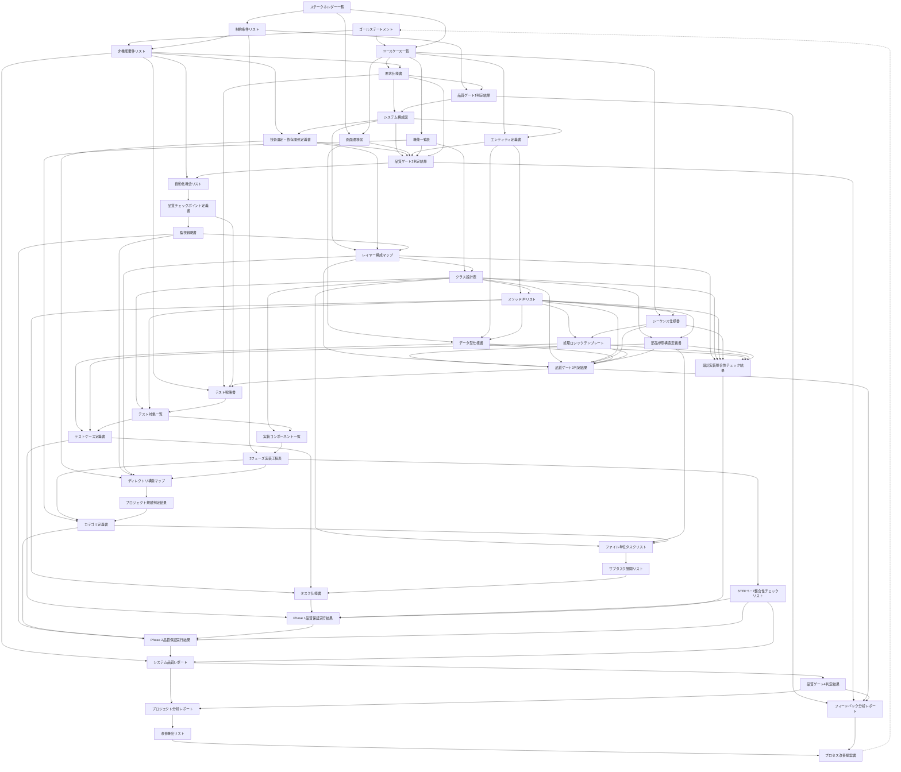

# AIコーディング開発プロセス v1.3 成果物フロー定義書（3フェーズ実装モデル対応）

## 1. 概要

本文書は、AIコーディング開発プロセスv1.3における成果物（ドキュメント）の流れを定義します。STEP 5・STEP 7一体化による3フェーズ実装モデル（Phase 1: 実装・単体テスト、Phase 2: 結合テスト、Phase 3: E2Eテスト）に対応し、各成果物がどのプロセスで作成され、どのプロセスでインプットとして使用されるかを明確にし、成果物の再利用性と必要性を検証します。

### 1.1 成果物フローの原則

1. **すべての成果物は後続プロセスのインプットとなる**: 使用されない成果物は作成しない
2. **成果物の依存関係を明確化**: どの成果物がどの成果物の作成に必要かを定義
3. **情報の段階的詳細化**: 抽象的な成果物から具体的な成果物への変換を追跡
4. **3フェーズ実装モデル対応**: STEP 5計画とSTEP 7実行の完全整合性を確保
5. **Plan-Do整合性の保証**: STEP 5・7整合性チェックリストによる継続的確認

## 2. 成果物フロー全体図（3フェーズ実装モデル対応）



## 3. 成果物の作成・使用マトリクス

### 3.1 STEP 0: ゴール定義の成果物

| 成果物 | 作成プロセス | 使用プロセス | 用途 |
|--------|-------------|--------------|------|
| ゴールステートメント | 0.1 目的記述 | 1.1 ユースケース抽出<br/>1.2 非機能要件抽出 | プロジェクトの目的と成功基準の参照 |
| ステークホルダー一覧 | 0.2 利用者定義 | 0.3 制約整理<br/>1.1 ユースケース抽出<br/>2.3 UI構成定義 | アクターの特定、要件の抽出元 |
| 制約条件リスト | 0.3 制約整理 | 1.2 非機能要件抽出<br/>5.2 スケジュール設計<br/>品質ゲート1 | 技術・予算・期間の制約確認 |

### 3.2 STEP 1: 要件定義の成果物

| 成果物 | 作成プロセス | 使用プロセス | 用途 |
|--------|-------------|--------------|------|
| ユースケース一覧 | 1.1 ユースケース抽出 | 1.3 要求仕様化<br/>2.3 UI構成定義<br/>2.4 データモデル設計<br/>2.5 機能構成定義<br/>3.4 振る舞い定義 | 機能要件の基礎、シナリオ定義 |
| 非機能要件リスト | 1.2 非機能要件抽出 | 1.3 要求仕様化<br/>2.2 技術選定<br/>2.5.1 自動化機会分析<br/>4.1 テスト方針策定<br/>7.3 最終品質確認 | 品質・性能基準の定義 |
| 要求仕様書 | 1.3 要求仕様化 | 品質ゲート1<br/>2.1 構成要素定義<br/>4.1 テスト方針策定 | 要件の統合文書 |

### 3.3 STEP 2: システム設計の成果物

| 成果物 | 作成プロセス | 使用プロセス | 用途 |
|--------|-------------|--------------|------|
| システム構成図 | 2.1 構成要素定義 | 2.2 技術選定<br/>2.4 データモデル設計<br/>3.1 レイヤー構造定義 | アーキテクチャの基本構造 |
| 技術選定・依存関係定義書 | 2.2 技術選定・依存関係定義 | 3.1 レイヤー構造定義<br/>5.3 ディレクトリ構造定義 | 技術スタックと制約 |
| 画面遷移図（上位） | 2.3 UI構成定義 | 3.5 データ型定義 | UI設計の基礎 |
| エンティティ定義書 | 2.4 データモデル設計 | 3.3 メソッド設計<br/>3.5 データ型定義 | データ構造の定義 |
| 機能一覧表 | 2.5 機能構成定義 | 3.2 クラス定義<br/>6.2 カテゴリ単位タスク分割 | 機能の整理と分類 |

### 3.4 STEP 2.5: 自動化設計の成果物（v1.3新規）

| 成果物 | 作成プロセス | 使用プロセス | 用途 |
|--------|-------------|--------------|------|
| 自動化機会リスト | 2.5.1 自動化機会分析 | 2.5.2 品質チェックポイント定義 | 自動化対象の特定 |
| 品質チェックポイント定義書 | 2.5.2 品質チェックポイント定義 | 2.5.3 監視戦略策定<br/>4.1 テスト方針策定<br/>7.1 多層品質保証実行 | 品質確認ポイントの定義 |
| 監視戦略書 | 2.5.3 監視戦略策定 | 3.1 レイヤー構造定義<br/>5.3 ディレクトリ構造定義<br/>7.2 カテゴリ単位進捗管理 | 継続的監視の戦略 |

### 3.5 STEP 3: 詳細設計の成果物

| 成果物 | 作成プロセス | 使用プロセス | 用途 |
|--------|-------------|--------------|------|
| レイヤー構成マップ | 3.1 レイヤー構造定義 | 3.2 クラス定義<br/>5.3 ディレクトリ構造定義 | レイヤー責任の明確化 |
| クラス設計表 | 3.2 クラス定義 | 3.3 メソッド設計<br/>3.7 部品参照構造定義<br/>4.2 テスト粒度設計<br/>5.1 実装範囲定義<br/>6.3 ファイル単位タスク詳細化 | クラスの詳細仕様 |
| メソッドI/Fリスト | 3.3 メソッド設計 | 3.4 振る舞い定義<br/>3.5 データ型定義<br/>3.6 処理パターン定義<br/>3.7 部品参照構造定義<br/>4.2 テスト粒度設計<br/>6.5 Issue登録・仕様書作成 | インターフェース定義 |
| シーケンス仕様書 | 3.4 振る舞い定義 | 3.6 処理パターン定義 | 処理フローの定義 |
| データ型仕様書 | 3.5 データ型定義 | 4.3 テストケース設計 | データ構造の詳細 |
| 処理ロジックテンプレート | 3.6 処理パターン定義 | 4.3 テストケース設計 | 共通処理パターン |
| 部品参照構造定義書 | 3.7 部品参照構造定義 | 品質ゲート3<br/>6.3 ファイル単位タスク詳細化 | 依存関係の管理 |

### 3.6 STEP 4: テスト設計の成果物

| 成果物 | 作成プロセス | 使用プロセス | 用途 |
|--------|-------------|--------------|------|
| テスト戦略書 | 4.1 テスト方針策定 | 4.2 テスト粒度設計 | テスト方針の定義 |
| テスト対象一覧 | 4.2 テスト粒度設計 | 4.3 テストケース設計<br/>5.1 実装範囲定義 | テスト対象の明確化 |
| テストケース定義書 | 4.3 テストケース設計 | 6.5 Issue登録・仕様書作成<br/>7.1 多層品質保証実行 | 具体的なテスト仕様 |

### 3.7 STEP 5: 開発計画の成果物（3フェーズ実装モデル対応）

| 成果物 | 作成プロセス | 使用プロセス | 用途 |
|--------|-------------|--------------|------|
| 実装コンポーネント一覧 | 5.1 実装範囲定義 | 5.2 スケジュール設計<br/>6.1 プロジェクト規模判定 | 実装対象の明確化 |
| 3フェーズ実装工程表 | 5.2 スケジュール設計 | 6.2 カテゴリ単位タスク分割<br/>7.1 Phase 1実行<br/>7.2 Phase 2実行<br/>7.3 Phase 3実行 | Phase 1（実装・単体テスト）、Phase 2（結合テスト）、Phase 3（E2Eテスト）の3フェーズ実装スケジュール |
| STEP 5・7整合性チェックリスト | 5.2 スケジュール設計 | 7.1 Phase 1実行<br/>7.2 Phase 2実行<br/>7.3 Phase 3実行 | STEP 5計画とSTEP 7実行の完全整合性確認、Plan-Do整合性の継続的監視 |
| ディレクトリ構造マップ | 5.3 ディレクトリ構造定義 | 6.1 プロジェクト規模判定 | ファイル配置の基準 |

### 3.8 STEP 6: 段階的タスク管理の成果物

| 成果物 | 作成プロセス | 使用プロセス | 用途 |
|--------|-------------|--------------|------|
| プロジェクト規模判定結果 | 6.1 プロジェクト規模判定 | 6.2 カテゴリ単位タスク分割 | 管理手法の選択 |
| カテゴリ定義書 | 6.2 カテゴリ単位タスク分割 | 6.3 ファイル単位タスク詳細化<br/>7.2 カテゴリ単位進捗管理 | カテゴリ管理 |
| ファイル単位タスクリスト | 6.3 ファイル単位タスク詳細化 | 6.4 選択的サブタスク展開 | タスクの詳細化 |
| サブタスク展開リスト | 6.4 選択的サブタスク展開 | 6.5 Issue登録・仕様書作成 | サブタスクの定義 |
| Issue登録リスト・タスク仕様書 | 6.5 Issue登録・仕様書作成 | 7.1 多層品質保証実行 | 実装仕様 |

### 3.9 STEP 7: コーディング・テスト実行の成果物（3フェーズ実装モデル対応）

| 成果物 | 作成プロセス | 使用プロセス | 用途 |
|--------|-------------|--------------|------|
| Phase 1品質保証実行結果 | 7.1 Phase 1実行（実装・単体テスト） | 7.2 Phase 2実行 | Phase 1品質状況の把握 |
| Phase 2品質保証実行結果 | 7.2 Phase 2実行（結合テスト） | 7.3 Phase 3実行 | Phase 2品質状況の把握 |
| システム品質レポート | 7.3 Phase 3実行（E2Eテスト） | 品質ゲート4<br/>8.1 プロジェクト分析 | 総合品質評価 |

### 3.10 STEP 8: 継続的改善の成果物（v1.3新規）

| 成果物 | 作成プロセス | 使用プロセス | 用途 |
|--------|-------------|--------------|------|
| プロジェクト分析レポート | 8.1 プロジェクト分析 | 8.2 改善機会特定 | 実績の分析 |
| 改善機会リスト | 8.2 改善機会特定 | 8.3 改善提案作成 | 改善点の特定 |
| プロセス改善提案書 | 8.3 改善提案作成 | 次期プロジェクトSTEP 0 | プロセス改善 |

### 3.11 品質ゲートの成果物

| 成果物 | 作成プロセス | 使用プロセス | 用途 |
|--------|-------------|--------------|------|
| 品質ゲート1判定結果 | 品質ゲート1 | 2.1 構成要素定義<br/>フィードバックループ | 要件品質の確認 |
| 品質ゲート2判定結果 | 品質ゲート2 | 2.5.1 自動化機会分析<br/>フィードバックループ | 設計品質の確認 |
| 品質ゲート3判定結果 | 品質ゲート3 | 4.1 テスト方針策定<br/>フィードバックループ | 詳細設計品質の確認 |
| 品質ゲート4判定結果 | 品質ゲート4 | 8.1 プロジェクト分析<br/>フィードバックループ | 実装品質の確認 |

### 3.12 横断的プロセスの成果物

| 成果物 | 作成プロセス | 使用プロセス | 用途 |
|--------|-------------|--------------|------|
| 設計実装整合性チェック結果 | 設計実装整合性チェック | 7.1 Phase 1実行 | 設計準拠性の確認 |
| フィードバック分析レポート | フィードバックループ | 8.3 改善提案作成 | 問題の根本原因分析 |

### 3.13 3フェーズ実装モデル特有の成果物

| 成果物 | 作成プロセス | 使用プロセス | 用途 | 特徴 |
|--------|-------------|--------------|------|------|
| 3フェーズ実装工程表 | 5.2 スケジュール設計 | 7.1, 7.2, 7.3実行 | 3フェーズスケジュール管理 | STEP 7サブプロセス対応表、フェーズ移行条件を含む |
| STEP 5・7整合性チェックリスト | 5.2 スケジュール設計 | 7.1, 7.2, 7.3実行 | Plan-Do整合性確認 | フェーズ別整合性チェック、継続的監視機能 |
| Phase 1品質保証実行結果 | 7.1 Phase 1実行 | 7.2 Phase 2実行 | Phase 1品質状況把握 | ファイル単位品質結果、単体テスト実行結果 |
| Phase 2品質保証実行結果 | 7.2 Phase 2実行 | 7.3 Phase 3実行 | Phase 2品質状況把握 | カテゴリレベル品質結果、結合テスト実行結果 |

## 4. 成果物の依存関係分析

### 4.1 使用されない成果物の確認

すべての成果物が後続プロセスで使用されることを確認しました。使用されない成果物はありません。

### 4.2 重要な成果物の特定（3フェーズ実装モデル対応）

以下の成果物は、多くのプロセスで使用される重要な成果物です：

| 成果物 | 使用プロセス数 | 重要度 |
|--------|---------------|--------|
| メソッドI/Fリスト | 6プロセス | 最高 |
| クラス設計表 | 5プロセス | 最高 |
| ユースケース一覧 | 5プロセス | 最高 |
| 非機能要件リスト | 5プロセス | 最高 |
| 3フェーズ実装工程表 | 4プロセス | 最高 |
| STEP 5・7整合性チェックリスト | 3プロセス | 高 |
| テストケース定義書 | 2プロセス | 高 |
| カテゴリ定義書 | 2プロセス | 高 |

### 4.3 成果物の段階的詳細化の追跡（3フェーズ実装モデル対応）

以下の流れで、抽象的な成果物から具体的な成果物へと段階的に詳細化されます：

```
ゴールステートメント（抽象）
  ↓
ユースケース一覧・非機能要件リスト
  ↓
要求仕様書
  ↓
システム構成図・機能一覧表
  ↓
クラス設計表・メソッドI/Fリスト
  ↓
処理ロジックテンプレート・データ型仕様書
  ↓
テストケース定義書
  ↓
3フェーズ実装工程表・STEP 5・7整合性チェックリスト
  ↓
タスク仕様書
  ↓
Phase 1品質保証実行結果 → Phase 2品質保証実行結果 → システム品質レポート（具体）
```

## 5. 成果物フローの検証結果（3フェーズ実装モデル対応）

### 5.1 完全性の確認

- ✅ すべての成果物が後続プロセスで使用される
- ✅ 各プロセスに必要なインプットがすべて定義されている
- ✅ 成果物間の依存関係が明確である
- ✅ 3フェーズ実装モデルの成果物が完全に定義されている
- ✅ STEP 5・7整合性チェックリストによる整合性確認が組み込まれている

### 5.2 効率性の確認

- ✅ 不要な成果物は存在しない
- ✅ 成果物の重複が最小限に抑えられている
- ✅ 情報の段階的詳細化が適切に行われている
- ✅ 3フェーズ実装による段階的品質保証が効率的に実現されている
- ✅ Plan-Do整合性確認による無駄の排除が実現されている

### 5.3 トレーサビリティの確認

- ✅ 要件から実装まで成果物を通じて追跡可能
- ✅ 変更影響の分析が可能
- ✅ 品質保証のための情報が十分に提供されている
- ✅ 3フェーズ実装の各段階で品質状況が追跡可能
- ✅ STEP 5計画からSTEP 7実行まで完全に追跡可能

### 5.4 3フェーズ実装モデル特有の検証

- ✅ Phase 1→2→3の段階的移行が成果物フローで保証されている
- ✅ 各フェーズの品質保証実行結果が次フェーズのインプットとなっている
- ✅ STEP 5・7整合性チェックリストが全フェーズで活用されている
- ✅ フェーズ別品質基準達成が成果物で確認可能

## 6. まとめ

AIコーディング開発プロセスv1.3（3フェーズ実装モデル対応）の成果物フローは、以下の特徴を持ちます：

1. **完全な再利用性**: すべての成果物が後続プロセスで使用される
2. **明確な依存関係**: 成果物間の依存関係が可視化されている
3. **段階的詳細化**: 抽象から具体への情報変換が追跡可能
4. **効率的な情報管理**: 不要な成果物がなく、重複が最小限
5. **高いトレーサビリティ**: 要件から実装まで完全に追跡可能
6. **3フェーズ実装モデル対応**: Phase 1→2→3の段階的品質保証を実現
7. **Plan-Do整合性の保証**: STEP 5・7整合性チェックリストによる継続的確認
8. **品質の段階的向上**: フェーズ別品質保証実行結果による品質管理

この成果物フローにより、プロセスエンジニアリングの原則に基づいた、無駄のない効率的な開発プロセスが実現され、さらに3フェーズ実装モデルによる段階的品質保証とSTEP 5・7一体化による計画・実行の完全整合性が確保されます。