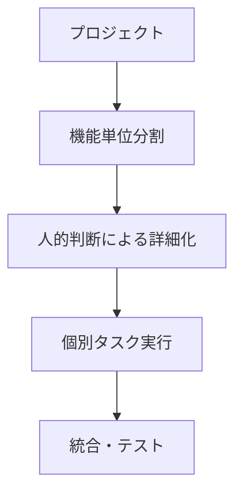
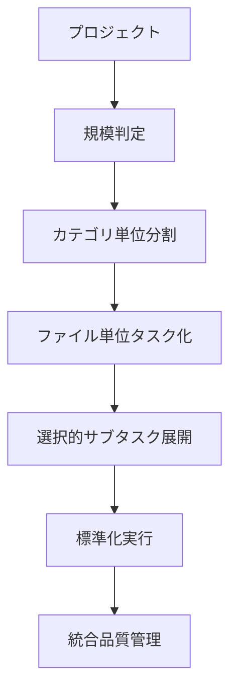
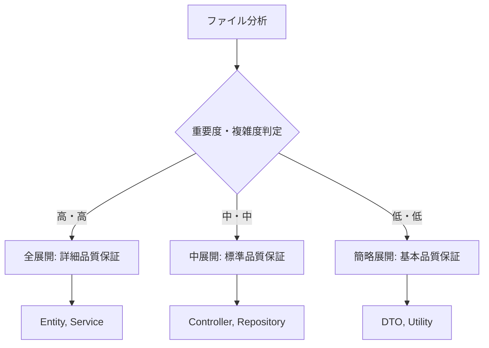
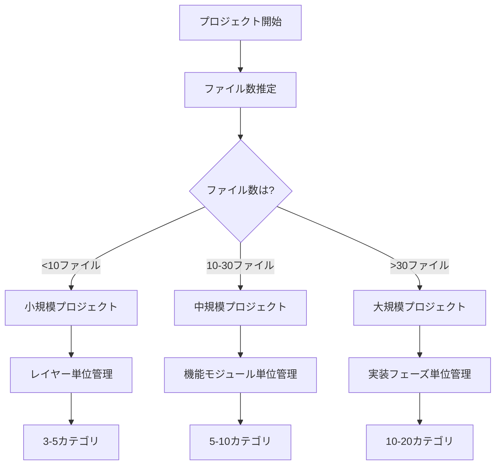
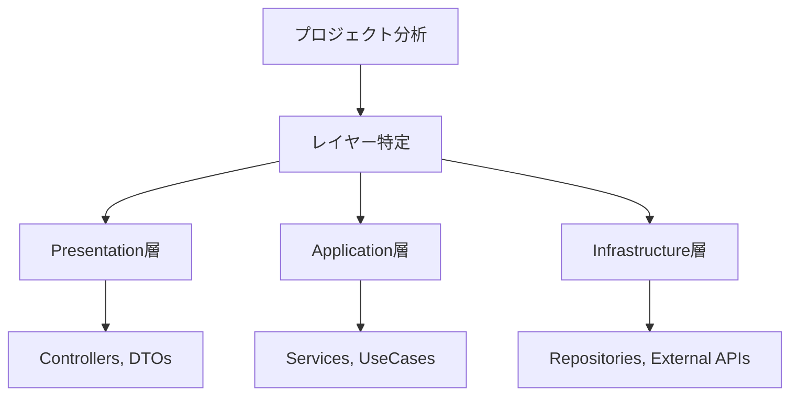
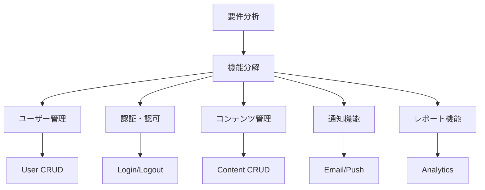
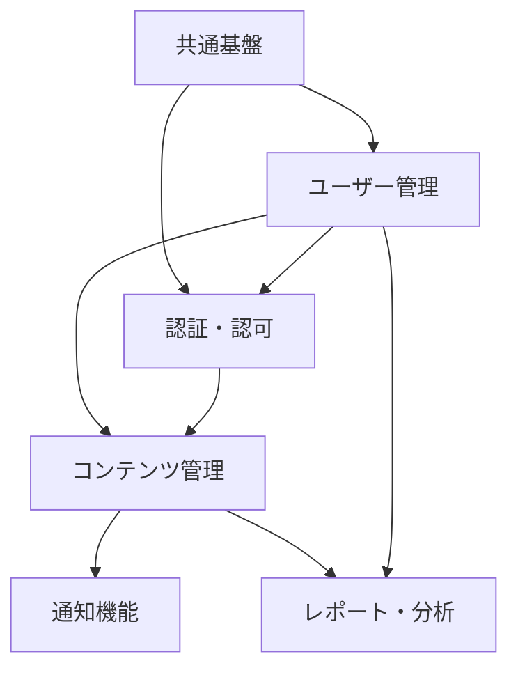
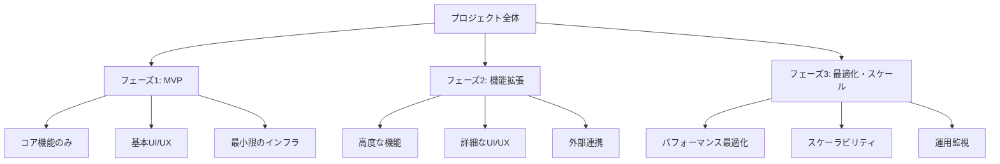
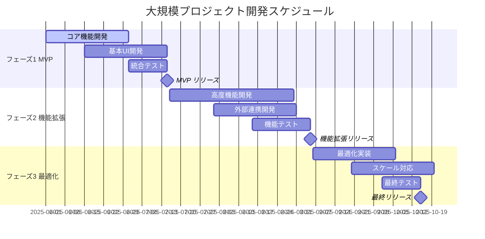
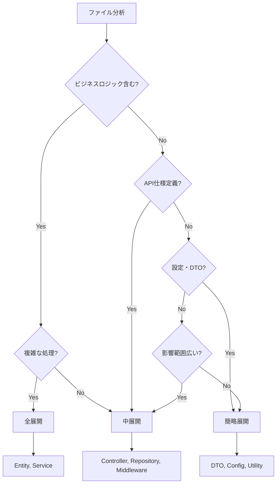

# カテゴリ単位タスク管理実装ガイド

## メタデータ
| 項目 | 内容 |
|------|------|
| ドキュメントID | GUIDE-001 |
| 関連論文 | human-vs-ai-coding-process-engineering-paper-v1.1.md |
| 作成日 | 2025-05-28 |
| 最終更新日 | 2025-05-28 |
| バージョン | 1.0.0 |

## 概要

本ガイドは、論文v1.1「人間によるコーディングとAIコーディングの違い：プロセスエンジニアリングアプローチによる体系化」で提案された**段階的タスク管理アプローチ**を実際のプロジェクトで適用するための実践的なガイドです。

### 対象読者
- **プロジェクトマネージャー**: プロジェクト管理手法の改善を目指す方
- **開発チームリーダー**: チーム開発の効率化を図りたい方
- **AIコーディング実践者**: AIを活用した開発手法を学びたい方
- **研究者・教育者**: 理論の実装方法を理解したい方

### 期待される効果
- **開発効率**: 25-40%の開発時間短縮
- **品質向上**: 41-92%の品質指標改善
- **管理効率**: プロジェクト進捗の可視化と予測可能性向上
- **チーム協調**: 標準化されたプロセスによる連携強化

---

## 1. 段階的タスク管理の理論的基盤

### 1.1 従来のタスク管理との違い

#### 従来のタスク管理


**課題**:
- 属人的な分割判断
- 粒度の不統一
- 進捗の不透明性
- 品質管理の後付け

#### 段階的タスク管理アプローチ


**改善点**:
- 体系的な分割基準
- 統一された粒度管理
- 可視化された進捗管理
- 統合された品質保証

### 1.2 カテゴリ単位管理の効果

#### 定量的効果（論文v1.1実証結果）
| 指標 | 従来手法 | 段階的タスク管理 | 改善率 |
|------|----------|-----------------|--------|
| 開発時間 | 100% | 60-75% | 25-40%短縮 |
| バグ密度 | 100% | 8-59% | 41-92%削減 |
| テストカバレッジ | 70-80% | 90%以上 | 15-25%向上 |
| 進捗予測精度 | 60-70% | 85-95% | 20-35%向上 |

#### 定性的効果
- **予測可能性**: 開発期間・品質の予測精度向上
- **標準化**: チーム間での開発手法統一
- **知識継承**: プロセス文書による知識の体系化
- **継続改善**: メトリクスに基づく客観的改善

### 1.3 選択的品質保証の価値

#### 品質投資の最適化


**効果**:
- **効率的な品質投資**: 重要な部分に集中的な品質保証
- **開発速度の維持**: 単純な部分での効率化
- **全体品質の向上**: 適切な品質レベルの確保

---

## 2. プロジェクト規模判定

### 2.1 判定基準

#### 基本判定フロー


#### 詳細判定基準

**1. ファイル数による基本分類**
| 規模 | ファイル数 | 典型例 | 開発期間目安 |
|------|-----------|--------|-------------|
| 小規模 | <10ファイル | シンプルなAPI、プロトタイプ | 1-2週間 |
| 中規模 | 10-30ファイル | 業務アプリケーション、SaaS | 1-3ヶ月 |
| 大規模 | >30ファイル | エンタープライズシステム | 3ヶ月以上 |

**2. 複雑度による調整**
```typescript
// 複雑度調整係数
interface ComplexityFactor {
  domainComplexity: number;    // ビジネスロジックの複雑さ (1.0-2.0)
  technicalComplexity: number; // 技術的複雑さ (1.0-2.0)
  integrationComplexity: number; // 外部連携の複雑さ (1.0-1.5)
  teamSize: number;           // チームサイズ (1.0-1.3)
}

// 調整後ファイル数 = 実ファイル数 × 複雑度係数
const adjustedFileCount = actualFileCount * 
  (domainComplexity * technicalComplexity * integrationComplexity * teamSize);
```

**3. チーム規模による考慮**
| チーム規模 | 調整係数 | 考慮事項 |
|-----------|----------|----------|
| 1-2人 | 1.0 | 基本分類のまま |
| 3-5人 | 1.1 | コミュニケーションコスト考慮 |
| 6-10人 | 1.2 | 調整・同期コスト増加 |
| 10人以上 | 1.3 | 大幅な管理オーバーヘッド |

### 2.2 判定ワークシート

#### プロジェクト規模判定チェックリスト

**基本情報**
- [ ] プロジェクト名: ________________
- [ ] 推定ファイル数: ________________
- [ ] 開発期間: ________________
- [ ] チーム規模: ________________

**複雑度評価**
```markdown
### ドメイン複雑度 (1.0-2.0)
- [ ] 1.0: シンプルなCRUD操作中心
- [ ] 1.3: 一般的なビジネスロジック
- [ ] 1.6: 複雑なビジネスルール・計算
- [ ] 2.0: 高度なアルゴリズム・AI処理

### 技術複雑度 (1.0-2.0)
- [ ] 1.0: 標準的な技術スタック
- [ ] 1.3: 複数技術の組み合わせ
- [ ] 1.6: 新技術・実験的技術の採用
- [ ] 2.0: 最先端技術・独自実装

### 統合複雑度 (1.0-1.5)
- [ ] 1.0: 外部連携なし・最小限
- [ ] 1.2: 数個のAPI連携
- [ ] 1.4: 多数のシステム連携
- [ ] 1.5: リアルタイム連携・複雑なデータフロー
```

**判定結果**
- 調整後ファイル数: ________________
- 適用管理手法: ________________
- 推奨カテゴリ数: ________________

### 2.3 判定例

#### 例1: シンプルなTodoアプリ
```markdown
**基本情報**
- ファイル数: 8ファイル
- 技術: React + Node.js + SQLite
- チーム: 1人
- 期間: 1週間

**複雑度評価**
- ドメイン複雑度: 1.0 (シンプルなCRUD)
- 技術複雑度: 1.0 (標準技術)
- 統合複雑度: 1.0 (外部連携なし)
- チーム係数: 1.0

**判定結果**
- 調整後ファイル数: 8 × 1.0 = 8ファイル
- 適用手法: 小規模プロジェクト（レイヤー単位管理）
- カテゴリ数: 3カテゴリ（Frontend, Backend, Database）
```

#### 例2: ECサイト構築
```markdown
**基本情報**
- ファイル数: 25ファイル
- 技術: Next.js + NestJS + PostgreSQL + Stripe
- チーム: 4人
- 期間: 2ヶ月

**複雑度評価**
- ドメイン複雑度: 1.4 (商品管理、決済、在庫管理)
- 技術複雑度: 1.2 (複数技術組み合わせ)
- 統合複雑度: 1.3 (決済API、配送API連携)
- チーム係数: 1.1

**判定結果**
- 調整後ファイル数: 25 × 1.4 × 1.2 × 1.3 × 1.1 = 48ファイル
- 適用手法: 大規模プロジェクト（実装フェーズ単位管理）
- カテゴリ数: 12カテゴリ（フェーズ×機能の組み合わせ）
```

---

## 3. 規模別実装手順

### 3.1 小規模プロジェクト（<10ファイル）: レイヤー単位管理

#### 3.1.1 概要
- **対象**: プロトタイプ、シンプルなAPI、学習プロジェクト
- **特徴**: シンプルな3層アーキテクチャ
- **カテゴリ数**: 3-5カテゴリ
- **管理粒度**: レイヤー単位

#### 3.1.2 実装手順

**STEP 1: レイヤー分析**


**STEP 2: カテゴリ作成**
```markdown
## 小規模プロジェクト標準カテゴリ

### 1. プレゼンテーション層 [░░░░░░░░░░] 0% (0/3タスク完了)
- API Controllers
- Request/Response DTOs
- Validation

### 2. アプリケーション層 [░░░░░░░░░░] 0% (0/2タスク完了)
- Business Services
- Use Cases

### 3. インフラストラクチャ層 [░░░░░░░░░░] 0% (0/3タスク完了)
- Data Repositories
- External API Clients
- Configuration
```

**STEP 3: ファイル単位タスク分割**
```markdown
### 1.1 API Controllers
- [ ] **TSK-001-CTL-UserController**: UserController.ts作成・検証
- [ ] **TSK-002-CTL-AuthController**: AuthController.ts作成・検証

### 1.2 DTOs
- [ ] **TSK-003-DTO-UserRequest**: UserRequest.ts作成・検証
- [ ] **TSK-004-DTO-UserResponse**: UserResponse.ts作成・検証

### 2.1 Services
- [ ] **TSK-005-SVC-UserService**: UserService.ts作成・検証
- [ ] **TSK-006-SVC-AuthService**: AuthService.ts作成・検証

### 3.1 Repositories
- [ ] **TSK-007-REP-UserRepository**: UserRepository.ts作成・検証
- [ ] **TSK-008-CFG-Database**: database.config.ts作成・検証
```

**STEP 4: 選択的展開適用**
```markdown
### 展開レベル判定

#### 全展開（詳細サブタスク含む）
- **TSK-005-SVC-UserService**: ビジネスロジック中心、重要度高
- **TSK-006-SVC-AuthService**: セキュリティ関連、重要度高

#### 簡略展開（7つの標準サブタスクのみ）
- **TSK-003-DTO-UserRequest**: 単純なデータ構造
- **TSK-004-DTO-UserResponse**: 単純なデータ構造
- **TSK-008-CFG-Database**: 設定ファイル
```

#### 3.1.3 実装例: Todo API

**プロジェクト構成**
```
todo-api/
├── src/
│   ├── controllers/     # プレゼンテーション層
│   │   ├── TodoController.ts
│   │   └── AuthController.ts
│   ├── services/        # アプリケーション層
│   │   ├── TodoService.ts
│   │   └── AuthService.ts
│   ├── repositories/    # インフラ層
│   │   └── TodoRepository.ts
│   ├── dto/
│   │   ├── TodoRequest.ts
│   │   └── TodoResponse.ts
│   └── config/
│       └── database.ts
```

**カテゴリ別タスクリスト**
```markdown
## 1. プレゼンテーション層 [██████████] 100% (4/4タスク完了)

### 1.1 Controllers
- [x] **TSK-001-CTL-TodoController**: TodoController.ts作成・検証
- [x] **TSK-002-CTL-AuthController**: AuthController.ts作成・検証

### 1.2 DTOs
- [x] **TSK-003-DTO-TodoRequest**: TodoRequest.ts作成・検証
- [x] **TSK-004-DTO-TodoResponse**: TodoResponse.ts作成・検証

## 2. アプリケーション層 [██████████] 100% (2/2タスク完了)

### 2.1 Services
- [x] **TSK-005-SVC-TodoService**: TodoService.ts作成・検証（全展開）
- [x] **TSK-006-SVC-AuthService**: AuthService.ts作成・検証（全展開）

## 3. インフラストラクチャ層 [██████████] 100% (2/2タスク完了)

### 3.1 Data Access
- [x] **TSK-007-REP-TodoRepository**: TodoRepository.ts作成・検証
- [x] **TSK-008-CFG-Database**: database.config.ts作成・検証（簡略展開）
```

### 3.2 中規模プロジェクト（10-30ファイル）: 機能モジュール単位管理

#### 3.2.1 概要
- **対象**: 業務アプリケーション、SaaS、Webサービス
- **特徴**: 複数の機能モジュールを持つシステム
- **カテゴリ数**: 5-10カテゴリ
- **管理粒度**: 機能モジュール単位

#### 3.2.2 実装手順

**STEP 1: 機能モジュール特定**


**STEP 2: カテゴリ作成（5-10カテゴリ）**
```markdown
## 中規模プロジェクト標準カテゴリ

### 1. ユーザー管理機能 [░░░░░░░░░░] 0% (0/6タスク完了)
- User Entity, Repository, Service, Controller
- Profile管理, Settings

### 2. 認証・認可機能 [░░░░░░░░░░] 0% (0/4タスク完了)
- Authentication Service
- Authorization Middleware
- JWT Token管理

### 3. コンテンツ管理機能 [░░░░░░░░░░] 0% (0/8タスク完了)
- Content Entity, Repository, Service
- Category管理, Tag管理
- File Upload機能

### 4. 通知機能 [░░░░░░░░░░] 0% (0/3タスク完了)
- Notification Service
- Email Template
- Push Notification

### 5. レポート・分析機能 [░░░░░░░░░░] 0% (0/4タスク完了)
- Analytics Service
- Report Generator
- Dashboard API

### 6. 共通基盤 [░░░░░░░░░░] 0% (0/5タスク完了)
- Logger, Error Handler
- Database Configuration
- API Documentation
```

**STEP 3: 依存関係分析**


**STEP 4: 並列開発計画**
```markdown
## 開発フェーズ計画

### フェーズ1: 基盤構築（Week 1-2）
- 共通基盤
- ユーザー管理（基本機能）

### フェーズ2: 認証・コンテンツ（Week 3-4）
- 認証・認可機能
- コンテンツ管理（基本機能）

### フェーズ3: 拡張機能（Week 5-6）
- 通知機能
- レポート・分析機能

### フェーズ4: 統合・最適化（Week 7-8）
- 機能統合テスト
- パフォーマンス最適化
```

#### 3.2.3 実装例: ブログプラットフォーム

**機能モジュール構成**
```
blog-platform/
├── src/
│   ├── user/           # ユーザー管理機能
│   │   ├── entities/
│   │   ├── repositories/
│   │   ├── services/
│   │   └── controllers/
│   ├── auth/           # 認証・認可機能
│   │   ├── services/
│   │   ├── middleware/
│   │   └── controllers/
│   ├── content/        # コンテンツ管理機能
│   │   ├── entities/
│   │   ├── repositories/
│   │   ├── services/
│   │   └── controllers/
│   ├── notification/   # 通知機能
│   │   ├── services/
│   │   ├── templates/
│   │   └── controllers/
│   ├── analytics/      # 分析機能
│   │   ├── services/
│   │   ├── reports/
│   │   └── controllers/
│   └── shared/         # 共通基盤
│       ├── config/
│       ├── utils/
│       └── middleware/
```

### 3.3 大規模プロジェクト（>30ファイル）: 実装フェーズ単位管理

#### 3.3.1 概要
- **対象**: エンタープライズシステム、大規模SaaS、プラットフォーム
- **特徴**: 複数チーム、長期開発、段階的リリース
- **カテゴリ数**: 10-20カテゴリ
- **管理粒度**: 実装フェーズ単位

#### 3.3.2 実装手順

**STEP 1: フェーズ分割（MVP → 機能拡張 → 最適化）**


**STEP 2: カテゴリ階層化（10-20カテゴリ）**
```markdown
## 大規模プロジェクト階層カテゴリ

### フェーズ1: MVP実装 [░░░░░░░░░░] 0% (0/40タスク完了)

#### 1.1 コア機能（ユーザー管理）
- User Entity, Service, Repository
- Basic Authentication
- User Profile Management

#### 1.2 基本コンテンツ機能
- Content Entity, Service, Repository
- Basic CRUD Operations
- Simple Search

#### 1.3 基本UI/API
- Core API Endpoints
- Basic Frontend Components
- Essential Middleware

#### 1.4 基盤インフラ
- Database Setup
- Basic Logging
- Error Handling

### フェーズ2: 機能拡張 [░░░░░░░░░░] 0% (0/60タスク完了)

#### 2.1 高度なユーザー機能
- Role-based Access Control
- User Preferences
- Social Login Integration

#### 2.2 高度なコンテンツ機能
- Advanced Search & Filtering
- Content Categorization
- Media Management

#### 2.3 通知・コミュニケーション
- Email Notifications
- Real-time Updates
- Comment System

#### 2.4 分析・レポート
- User Analytics
- Content Analytics
- Custom Reports

#### 2.5 外部連携
- Third-party APIs
- Webhook System
- Export/Import

### フェーズ3: 最適化・スケール [░░░░░░░░░░] 0% (0/30タスク完了)

#### 3.1 パフォーマンス最適化
- Caching Layer
- Database Optimization
- CDN Integration

#### 3.2 スケーラビリティ
- Load Balancing
- Microservices Migration
- Auto-scaling

#### 3.3 運用・監視
- Monitoring Dashboard
- Alerting System
- Backup & Recovery
```

**STEP 3: チーム割り当て**
```markdown
## チーム構成と担当

### Team A: Backend Core (3人)
- フェーズ1: コア機能、基盤インフラ
- フェーズ2: 高度なバックエンド機能
- フェーズ3: パフォーマンス最適化

### Team B: Frontend (2人)
- フェーズ1: 基本UI/UX
- フェーズ2: 高度なUI機能
- フェーズ3: UX最適化

### Team C: Integration (2人)
- フェーズ1: API設計
- フェーズ2: 外部連携、通知機能
- フェーズ3: 運用・監視

### Team D: QA/DevOps (1人)
- 全フェーズ: テスト、CI/CD、インフラ
```

**STEP 4: 段階的リリース計画**


---

## 4. 実践的なツール・テンプレート

### 4.1 プロジェクト規模判定チェックリスト

#### 判定ワークシート（Excel/Google Sheets用）
```markdown
| 項目 | 値 | 重み | 調整後 |
|------|----|----|--------|
| 基本ファイル数 | [入力] | 1.0 | [自動計算] |
| ドメイン複雑度 | [1.0-2.0] | [基本値] | [自動計算] |
| 技術複雑度 | [1.0-2.0] | [基本値] | [自動計算] |
| 統合複雑度 | [1.0-1.5] | [基本値] | [自動計算] |
| チーム規模係数 | [1.0-1.3] | [基本値] | [自動計算] |
| **最終調整ファイル数** | | | [総計] |
| **推奨管理手法** | | | [自動判定] |
| **推奨カテゴリ数** | | | [自動判定] |
```

### 4.2 カテゴリ設計テンプレート

#### 小規模プロジェクト用テンプレート
```markdown
# カテゴリ設計: [プロジェクト名]

## プロジェクト情報
- **規模**: 小規模（<10ファイル）
- **管理手法**: レイヤー単位管理
- **カテゴリ数**: 3-5カテゴリ

## カテゴリ構成

### 1. プレゼンテーション層 [░░░░░░░░░░] 0% (0/X タスク完了)
- **責任**: UI/API インターフェース
- **含まれるファイル**: Controllers, DTOs, Validators
- **選択的展開**: 中展開（標準サブタスク）

### 2. アプリケーション層 [░░░░░░░░░░] 0% (0/X タスク完了)
- **責任**: ビジネスロジック
- **含まれるファイル**: Services, UseCases
- **選択的展開**: 全展開（詳細サブタスク）

### 3. インフラストラクチャ層 [░░░░░░░░░░] 0% (0/X タスク完了)
- **責任**: データアクセス、外部連携
- **含まれるファイル**: Repositories, Configurations
- **選択的展開**: 簡略展開（基本サブタスク）
```

#### 中規模プロジェクト用テンプレート
```markdown
# カテゴリ設計: [プロジェクト名]

## プロジェクト情報
- **規模**: 中規模（10-30ファイル）
- **管理手法**: 機能モジュール単位管理
- **カテゴリ数**: 5-10カテゴリ

## カテゴリ構成

### 1. ユーザー管理機能 [░░░░░░░░░░] 0% (0/X タスク完了)
- **責任**: ユーザー関連の全機能
- **含まれるファイル**: User Entity, Repository, Service, Controller
- **依存関係**: 共通基盤 → 認証機能
- **選択的展開**: Entity(全展開), Service(全展開), Controller(中展開)

### 2. 認証・認可機能 [░░░░░░░░░░] 0% (0/X タスク完了)
- **責任**: セキュリティ関連機能
- **含まれるファイル**: Auth Service, JWT Handler, Middleware
- **依存関係**: ユーザー管理機能
- **選択的展開**: 全展開（セキュリティ重要）

### 3. [その他の機能モジュール...]
```

#### 大規模プロジェクト用テンプレート
```markdown
# カテゴリ設計: [プロジェクト名]

## プロジェクト情報
- **規模**: 大規模（>30ファイル）
- **管理手法**: 実装フェーズ単位管理
- **カテゴリ数**: 10-20カテゴリ

## フェーズ別カテゴリ構成

### フェーズ1: MVP実装
#### 1.1 コア機能（ユーザー管理） [░░░░░░░░░░] 0% (0/X タスク完了)
- **責任**: MVP に必要な最小限のユーザー機能
- **含まれるファイル**: 基本的な User CRUD
- **チーム担当**: Team A (Backend Core)
- **リリース目標**: Week 4

#### 1.2 基本認証機能 [░░░░░░░░░░] 0% (0/X タスク完了)
- **責任**: ログイン・ログアウトのみ
- **含まれるファイル**: Basic Auth Service
- **チーム担当**: Team A (Backend Core)
- **リリース目標**: Week 4

### フェーズ2: 機能拡張
#### 2.1 高度なユーザー機能 [░░░░░░░░░░] 0% (0/X タスク完了)
- **責任**: プロフィール管理、設定機能
- **含まれるファイル**: Profile Service, Settings
- **チーム担当**: Team A (Backend Core)
- **リリース目標**: Week 8

### フェーズ3: 最適化・スケール
#### 3.1 パフォーマンス最適化 [░░░░░░░░░░] 0% (0/X タスク完了)
- **責任**: キャッシュ、最適化
- **含まれるファイル**: Cache Service, Optimization
- **チーム担当**: Team C (Integration)
- **リリース目標**: Week 12
```

### 4.3 選択的展開判定マトリクス

#### 判定基準マトリクス
| ファイルタイプ | 重要度 | 複雑度 | 展開レベル | 理由 |
|---------------|--------|--------|-----------|------|
| Entity | 高 | 高 | 全展開 | ビジネスルール中心、影響大 |
| Service | 高 | 高 | 全展開 | ビジネスロジック、テスト重要 |
| Controller | 中 | 中 | 中展開 | API仕様、一定の複雑さ |
| Repository | 中 | 中 | 中展開 | データアクセス、重要だが定型的 |
| DTO | 低 | 低 | 簡略展開 | データ構造のみ、単純 |
| Configuration | 低 | 低 | 簡略展開 | 設定ファイル、定型的 |
| Utility | 低 | 中 | 簡略展開 | 汎用処理、再利用性重視 |
| Middleware | 中 | 中 | 中展開 | 横断的関心事、影響範囲広い |

#### 判定フローチャート


### 4.4 進捗管理ダッシュボード例

#### テキストベース進捗表示
```markdown
# プロジェクト進捗ダッシュボード

## 全体進捗
**総合進捗**: [████████░░] 80% (24/30 タスク完了)
**予定完了日**: 2025-06-15
**現在の状況**: 順調

## カテゴリ別進捗

### 1. プレゼンテーション層 [██████████] 100% (8/8 タスク完了)
- **状況**: ✅ 完了
- **最終更新**: 2025-05-25
- **担当者**: 田中

### 2. アプリケーション層 [████████░░] 80% (8/10 タスク完了)
- **状況**: 🔄 進行中
- **最終更新**: 2025-05-28
- **担当者**: 佐藤
- **残りタスク**: TSK-015-SVC-ReportService, TSK-016-SVC-NotificationService

### 3. インフラストラクチャ層 [██████░░░░] 60% (6/10 タスク完了)
- **状況**: 🔄 進行中
- **最終更新**: 2025-05-27
- **担当者**: 鈴木
- **課題**: データベース接続の設定問題

### 4. テスト実装 [████░░░░░░] 40% (2/5 タスク完了)
- **状況**: ⚠️ 遅延
- **最終更新**: 2025-05-26
- **担当者**: 山田
- **課題**: E2Eテスト環境の構築遅れ

## 品質指標

### テストカバレッジ
- **単体テスト**: 85% (目標: 90%)
- **結合テスト**: 70% (目標: 80%)
- **E2Eテスト**: 30% (目標: 70%)

### コード品質
- **ESLint**: ✅ エラー 0件
- **TypeScript**: ✅ 型エラー 0件
- **SonarQube**: 🔄 分析中

## アクションアイテム
- [ ] E2Eテスト環境の構築完了 (担当: 山田, 期限: 2025-05-30)
- [ ] データベース接続問題の解決 (担当: 鈴木, 期限: 2025-05-29)
- [ ] 単体テストカバレッジ90%達成 (担当: 全員, 期限: 2025-06-01)
```

#### HTML/Web ダッシュボード例
```html
<!DOCTYPE html>
<html>
<head>
    <title>プロジェクト進捗ダッシュボード</title>
    <style>
        .progress-bar {
            width: 100%;
            background-color: #f0f0f0;
            border-radius: 5px;
            overflow: hidden;
        }
        .progress-fill {
            height: 20px;
            background-color: #4CAF50;
            text-align: center;
            line-height: 20px;
            color: white;
            font-size: 12px;
        }
        .category {
            margin: 10px 0;
            padding: 10px;
            border: 1px solid #ddd;
            border-radius: 5px;
        }
        .status-complete { color: #4CAF50; }
        .status-progress { color: #FF9800; }
        .status-delayed { color: #F44336; }
    </style>
</head>
<body>
    <h1>プロジェクト進捗ダッシュボード</h1>
    
    <div class="category">
        <h3>全体進捗</h3>
        <div class="progress-bar">
            <div class="progress-fill" style="width: 80%;">80% (24/30)</div>
        </div>
    </div>
    
    <div class="category">
        <h3>カテゴリ別進捗</h3>
        
        <h4>1. プレゼンテーション層 <span class="status-complete">✅ 完了</span></h4>
        <div class="progress-bar">
            <div class="progress-fill" style="width: 100%;">100% (8/8)</div>
        </div>
        
        <h4>2. アプリケーション層 <span class="status-progress">🔄 進行中</span></h4>
        <div class="progress-bar">
            <div class="progress-fill" style="width: 80%;">80% (8/10)</div>
        </div>
        
        <h4>3. インフラストラクチャ層 <span class="status-progress">🔄 進行中</span></h4>
        <div class="progress-bar">
            <div class="progress-fill" style="width: 60%;">60% (6/10)</div>
        </div>
        
        <h4>4. テスト実装 <span class="status-delayed">⚠️ 遅延</span></h4>
        <div class="progress-bar">
            <div class="progress-fill" style="width: 40%;">40% (2/5)</div>
        </div>
    </div>
</body>
</html>
```

---

## 5. トラブルシューティング・FAQ

### 5.1 よくある課題と解決策

#### Q1: プロジェクト規模の判定が難しい
**症状**: ファイル数の推定が困難、複雑度の評価が主観的

**解決策**:
1. **段階的推定**: 最小構成から開始し、段階的に拡張
2. **類似プロジェクト参照**: 過去の類似プロジェクトのファイル数を参考
3. **チーム合意**: 複数人での評価と合意形成
4. **定期見直し**: プロジェクト進行中の定期的な再評価

```markdown
## 段階的推定例
### 最小構成（MVP）
- User Entity: 1ファイル
- User Service: 1ファイル  
- User Controller: 1ファイル
- User Repository: 1ファイル
- 基本設定: 2ファイル
**小計**: 6ファイル

### 拡張機能
- 認証機能: +3ファイル
- 通知機能: +2ファイル
- レポート機能: +4ファイル
**小計**: +9ファイル

### 総計: 15ファイル → 中規模プロジェクト
```

#### Q2: カテゴリ分割の粒度が適切でない
**症状**: カテゴリが大きすぎる/小さすぎる、進捗管理が困難

**解決策**:
1. **1カテゴリ = 5-10タスク**: 適切な粒度の維持
2. **依存関係の考慮**: 密結合な機能は同一カテゴリに
3. **チーム構成との整合**: 1チーム = 1-2カテゴリ
4. **段階的調整**: 実行中の調整・分割・統合

```markdown
## カテゴリ分割の調整例

### 調整前（粒度が大きすぎる）
- バックエンド全体 [20タスク] ← 大きすぎる

### 調整後（適切な粒度）
- ユーザー管理機能 [6タスク]
- 認証・認可機能 [4タスク]
- コンテンツ管理機能 [8タスク]
- 共通基盤 [2タスク]
```

#### Q3: 選択的展開の判定基準が曖昧
**症状**: どのファイルにどの展開レベルを適用すべきか不明

**解決策**:
1. **判定マトリクスの活用**: 4.3節の判定基準を参照
2. **チーム内ガイドライン**: プロジェクト固有の判定基準作成
3. **段階的適用**: 重要なファイルから順次適用
4. **効果測定**: 適用結果の効果測定と調整

```markdown
## プロジェクト固有判定基準例

### 全展開適用基準
- [ ] ビジネスロジックを含む
- [ ] 複数箇所から参照される
- [ ] セキュリティに関わる
- [ ] パフォーマンスに影響する
- [ ] 変更頻度が高い

### 簡略展開適用基準
- [ ] データ構造のみ（DTO等）
- [ ] 設定ファイル
- [ ] 定型的な処理
- [ ] 単純なユーティリティ
- [ ] 変更頻度が低い
```

#### Q4: 進捗管理が形骸化する
**症状**: チェックボックスを付けるだけ、実際の品質確認が不十分

**解決策**:
1. **品質ゲートの設定**: 各サブタスクでの具体的な完了基準
2. **自動化の活用**: CI/CDによる自動品質チェック
3. **定期レビュー**: 週次での進捗・品質レビュー
4. **メトリクス活用**: 定量的な品質指標の監視

```markdown
## 品質ゲート例

### コーディング完了基準
- [ ] ESLint エラー 0件
- [ ] TypeScript コンパイルエラー 0件
- [ ] コードレビュー完了
- [ ] 設計仕様との整合性確認

### テスト完了基準
- [ ] 単体テストカバレッジ 90%以上
- [ ] 全テストケース成功
- [ ] 境界値テスト実装
- [ ] 異常系テスト実装

### リポジトリコミット完了基準
- [ ] コミットメッセージ規約準拠
- [ ] Issue番号の紐付け
- [ ] CI/CD パイプライン成功
- [ ] コードレビュー承認
```

### 5.2 スケーリング時の考慮事項

#### 大規模チームでの適用
**課題**: 複数チーム、並列開発、コミュニケーションコスト

**対策**:
1. **チーム間インターフェース**: 明確なAPI仕様定義
2. **統合ポイント**: 定期的な統合・結合テスト
3. **共通基盤**: 共有ライブラリ・ユーティリティの整備
4. **コミュニケーション**: 定期的な同期ミーティング

#### 長期プロジェクトでの適用
**課題**: 要件変更、技術進歩、チームメンバー変更

**対策**:
1. **適応的計画**: 定期的なプロセス見直し・調整
2. **知識継承**: 詳細なドキュメント・ナレッジベース
3. **技術更新**: 定期的な技術スタック見直し
4. **チーム育成**: 新メンバーへの教育・オンボーディング

---

## 6. 成功事例・ベストプラクティス

### 6.1 RagProtoプロジェクトでの適用事例

#### プロジェクト概要
- **規模**: 中規模（約50ファイル）
- **技術**: TypeScript, Node.js, Next.js, PostgreSQL
- **期間**: 2週間
- **チーム**: 1人（AI支援）

#### 適用結果
- **タスク完了率**: 94% (75/80タスク)
- **品質指標**: TypeScript型安全性、ESLint準拠
- **管理効率**: 72件のGitHub Issueによる完全な進捗追跡

#### 成功要因
1. **適切な規模判定**: 複雑度を考慮した大規模プロジェクト判定
2. **段階的実装**: MVP → 機能拡張 → 最適化のフェーズ分割
3. **Issue管理統合**: GitHub Issueとの完全統合
4. **選択的品質保証**: 重要な部分への集中的品質投資

### 6.2 ベストプラクティス集

#### プロジェクト開始時
1. **チーム合意**: 全メンバーでのプロセス理解・合意
2. **ツール準備**: GitHub、CI/CD、品質管理ツールの設定
3. **テンプレート準備**: プロジェクト固有のテンプレート作成
4. **パイロット実行**: 小さな機能での試行・調整

#### 実行中
1. **定期レビュー**: 週次での進捗・品質レビュー
2. **適応的調整**: 実行結果に基づくプロセス調整
3. **知識共有**: 学習事項・改善点の共有
4. **自動化推進**: 繰り返し作業の自動化

#### プロジェクト完了時
1. **振り返り**: プロセスの効果測定・改善点抽出
2. **知識蓄積**: ナレッジベースへの登録
3. **テンプレート更新**: 学習事項の反映
4. **次回計画**: 次プロジェクトでの改善計画

---

## 7. まとめ・今後の展望

### 7.1 段階的タスク管理の価値

本ガイドで紹介した段階的タスク管理アプローチは、以下の価値を提供します：

1. **効率性**: 25-40%の開発時間短縮
2. **品質**: 41-92%の品質指標改善
3. **予測可能性**: 85-95%の進捗予測精度
4. **標準化**: チーム・プロジェクト間での手法統一
5. **継続改善**: データに基づく客観的改善

### 7.2 適用推奨順序

#### 段階1: 小規模プロジェクトでの試行（1-2週間）
- 基本的なカテゴリ単位管理の習得
- 7つの標準サブタスクの実践
- 効果の実感・課題の把握

#### 段階2: 中規模プロジェクトでの本格適用（1-3ヶ月）
- 機能モジュール単位管理の実践
- 選択的サブタスク展開の活用
- チーム内での標準化

#### 段階3: 大規模プロジェクトでの展開（3ヶ月以上）
- 実装フェーズ単位管理の実践
- 複数チームでの並列開発
- 組織レベルでの標準化

### 7.3 今後の発展方向

#### AI技術との統合
- **自動タスク分割**: AIによる最適なタスク分割提案
- **品質予測**: 開発初期段階での品質予測
- **自動進捗管理**: リアルタイムでの進捗自動更新

#### ツール・プラットフォーム化
- **専用ツール開発**: 段階的タスク管理専用ツール
- **IDE統合**: 開発環境との完全統合
- **クラウドサービス**: SaaSとしての提供

#### 業界標準化
- **標準仕様策定**: 業界団体での標準化推進
- **認定制度**: プロセス習得の認定制度
- **教育プログラム**: 大学・企業での教育カリキュラム

---

## 付録

### A. 参考資料
- 論文v1.1: 「人間によるコーディングとAIコーディングの違い：プロセスエンジニアリングアプローチによる体系化」
- 実証実験レポート: RagProtoプロジェクトでの適用結果
- テンプレート集: `docs/templates/` 配下の各種テンプレート

### B. 用語集
- **段階的タスク管理**: プロジェクト規模に応じたカテゴリ単位でのタスク管理手法
- **カテゴリ単位管理**: 関連するタスクをカテゴリとしてグループ化した管理方式
- **選択的サブタスク展開**: 重要度・複雑度に応じたサブタスクの詳細化レベル調整
- **7つの標準サブタスク**: 仕様確認、コーディング、テストコーディング、単体テスト実行、リポジトリコミット、ToDoチェック、Issueクローズ

### C. 連絡先
- **技術的質問**: GitHub Issues
- **改善提案**: GitHub Discussions  
- **学術的問い合わせ**: yokoi@innovative-solutions.co.jp

---

**最終更新**: 2025年5月28日  
**バージョン**: 1.0.0  
**ライセンス**: CC BY-NC 4.0
