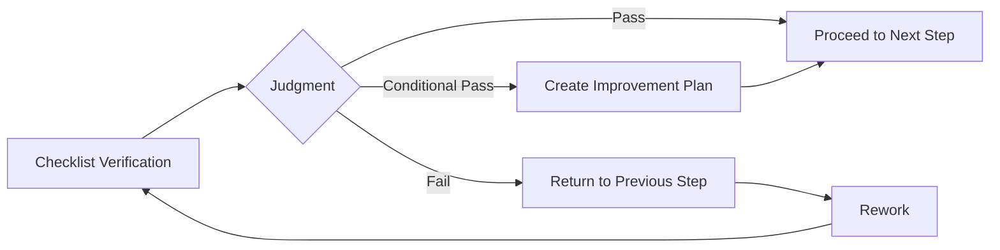
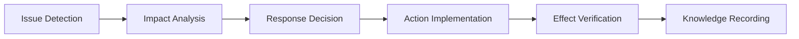

# AI Coding Development Process Systematization Document v1.3 (Complete Edition)

## 1. Overview

This document is the complete definition of the AI agent software development process v1.3. Based on the staged task management approach of v1.2, it adds quality gates, feedback loops, and continuous improvement processes as countermeasures to issues identified in empirical experiments.

### 1.1 Major Improvements in v1.3

1. **Introduction of Quality Gates**: Quality checkpoints between each step
2. **Establishment of Feedback Loops**: Early problem detection and correction
3. **Strengthening Design-Implementation Consistency**: Continuous consistency check process
4. **Automation Design Process (STEP 2.5)**: Clarification of automation strategy
5. **Continuous Improvement Process (STEP 8)**: Post-project completion review

### 1.2 Supplementary Documents

Please refer to the following supplementary documents when implementing this process:

#### Quality Gate Related
- [Quality Gate Detailed Specifications](./quality-gate-detailed-specifications-v1.3.md): Detailed specifications for all quality gates
- [Quality Gate Checklists](./quality-gate-checklists-v1.3.md): Implementation checklists
- [Quality Gate Implementation Guide](./quality-gate-implementation-guide-v1.3.md): Specific implementation procedures
- [Quality Gate 1 Template](../../templates/en/quality-gate-1-template.md): Requirements completeness check
- [Quality Gate 2 Template](../../templates/en/quality-gate-2-template.md): Architecture feasibility check
- [Quality Gate 3 Template](../../templates/en/quality-gate-3-template.md): Design completeness check
- [Quality Gate 4 Template](../../templates/en/quality-gate-4-template.md): Implementation quality check

#### Step-by-Step Templates
##### STEP 0: Goal Definition
- [Goal Statement Template](../../templates/en/step0-goal-statement-template.md)
- [Stakeholder List Template](../../templates/en/step0-stakeholders-template.md)
- [Constraints List Template](../../templates/en/step0-constraints-template.md)

##### STEP 1: Requirements Definition
- [Use Case List Template](../../templates/en/step1-use-cases-template.md)
- [Non-functional Requirements List Template](../../templates/en/step1-non-functional-template.md)
- [Requirements Specification Template](../../templates/en/step1-requirements-specification-template.md)

##### STEP 2: System Design
- [System Architecture Diagram Template](../../templates/en/step2-system-architecture-template.md)
- [Technology Selection Document Template](../../templates/en/step2-tech-stack-template.md)

##### STEP 2.5: Automation Design (New in v1.3)
- [Automation Opportunities List Template](../../templates/en/step2.5-automation-opportunities-template.md)
- [Quality Checkpoint Definition Template](../../templates/en/step2.5-quality-checkpoints-template.md)
- [Monitoring Strategy Template](../../templates/en/step2.5-monitoring-strategy-template.md)

##### STEP 3: Detailed Design
- [Class Design Table Template](../../templates/en/step3-class-design-template.md)
- [Interface Definition Template](../../templates/en/step3-interfaces-template.md)

##### STEP 4: Test Design
- [Test Strategy Document Template](../../templates/en/step4-test-strategy-template.md)
- [Test Target List Template](../../templates/en/step4-test-targets-template.md)
- [Test Case Definition Template](../../templates/en/step4-test-cases-template.md)

##### STEP 5: Development Planning
- [Implementation Component List Template](../../templates/en/step5-components-template.md)
- [Development Schedule Template](../../templates/en/step5-schedule-template.md)
- [Directory Structure Map Template](../../templates/en/step5-directory-structure-template.md)

##### STEP 6: Staged Task Management
- [Category Definition Document Template](../../templates/en/step6-task-management-template.md)
- [File-based Task List Template](../../templates/en/step6-task-list-template.md)
- [Task Specification Template](../../templates/en/step6-task-specification-template.md)
- [Implementation TODO List Template](../../templates/en/step6-todo-list-template.md)
- [TODO Creation Guide](../../templates/en/step6-todo-creation-guide.md)

##### STEP 7: Coding/Test Execution
- [Execution Log/Progress Management Template](../../templates/en/step7-progress-template.md)
- [Deliverables/Quality Record Template](../../templates/en/step7-deliverables-template.md)
- [Completed System Template](../../templates/en/step7-final-system-template.md)

##### STEP 8: Continuous Improvement (New in v1.3)
- [Project Analysis Template](../../templates/en/step8-project-analysis-template.md)
- [Improvement Opportunities List Template](../../templates/en/step8-improvement-opportunities-template.md)
- [Process Improvement Proposal Template](../../templates/en/step8-improvement-proposals-template.md)

#### Other Templates
- [Design-Implementation Consistency Template](../../templates/en/design-implementation-consistency-template.md)
- [Feedback Analysis Template](../../templates/en/feedback-analysis-template.md)

## 2. Overall Process Flow v1.3

```mermaid
flowchart TD
    subgraph "STEP 0: Goal Definition"
        A0[0.1 Purpose Description] --> B0[0.2 User Definition]
        B0 --> C0[0.3 Constraint Organization]
    end
    
    subgraph "STEP 1: Requirements Definition"
        C0 --> A1[1.1 Use Case Extraction]
        A1 --> B1[1.2 Non-functional Requirements Extraction]
        B1 --> C1[1.3 Requirements Specification]
    end
    
    C1 --> QG1{Quality Gate 1:<br/>Requirements Completeness}
    QG1 -->|Pass| A2
    QG1 -->|Fail| A1
    
    subgraph "STEP 2: System Design"
        A2[2.1 System Configuration Design] --> B2[2.2 Technology Selection]
        B2 --> C2[2.3 Entity Definition]
        C2 --> D2[2.4 Screen Design]
        D2 --> E2[2.5 Function List Definition]
    end
    
    E2 --> QG2{Quality Gate 2:<br/>Architecture Feasibility}
    QG2 -->|Pass| A25
    QG2 -->|Fail| A2
    
    subgraph "STEP 2.5: Automation Design"
        A25[2.5.1 Automation Opportunity Analysis] --> B25[2.5.2 Quality Checkpoint Definition]
        B25 --> C25[2.5.3 Monitoring Strategy Development]
    end
    
    subgraph "STEP 3: Detailed Design"
        C25 --> A3[3.1 Layer Structure Design]
        A3 --> B3[3.2 Class/Method Design]
        B3 --> C3[3.3 Sequence Diagram Creation]
        C3 --> D3[3.4 Data Type Specification]
        D3 --> E3[3.5 Processing Logic Design]
        E3 --> F3[3.6 Error Handling Design]
        F3 --> G3[3.7 Component Reference Structure Definition]
    end
    
    G3 --> QG3{Quality Gate 3:<br/>Design Completeness}
    QG3 -->|Pass| A4
    QG3 -->|Fail| A3
    
    subgraph "STEP 4: Test Design"
        A4[4.1 Test Strategy Development] --> B4[4.2 Test Target List Creation]
        B4 --> C4[4.3 Test Case Design]
    end
    
    subgraph "STEP 5: Development Planning"
        C4 --> A5[5.1 Implementation Component Organization]
        A5 --> B5[5.2 Development Schedule Creation]
        B5 --> C5[5.3 Directory Structure Mapping]
    end
    
    subgraph "STEP 6: Staged Task Management"
        C5 --> A6[6.1 Category Definition]
        A6 --> B6[6.2 File-based Task List Creation]
        B6 --> C6[6.3 Task Specification]
        C6 --> D6[6.4 Implementation TODO List Creation]
    end
    
    subgraph "STEP 7: Coding/Test Execution"
        D6 --> A7[7.1 Environment Setup]
        A7 --> B7[7.2 File-based Task Execution]
        B7 --> C7[7.3 Subtask Management]
        C7 --> D7[7.4 Integration/Testing]
        D7 --> E7[7.5 Quality Verification]
    end
    
    E7 --> QG4{Quality Gate 4:<br/>Implementation Quality}
    QG4 -->|Pass| A8
    QG4 -->|Fail| B7
    
    subgraph "STEP 8: Continuous Improvement"
        A8[8.1 Project Analysis] --> B8[8.2 Improvement Opportunity Identification]
        B8 --> C8[8.3 Process Improvement Proposal]
        C8 --> D8[8.4 Knowledge Base Update]
    end
    
    %% Feedback Loops
    A1 -.-> |Requirement Feedback| C0
    A2 -.-> |Design Feedback| C1
    A3 -.-> |Detailed Design Feedback| E2
    A4 -.-> |Test Design Feedback| G3
    A7 -.-> |Implementation Feedback| A3
    D7 -.-> |Integration Feedback| A2
    D8 -.-> |Process Improvement| A0
```

## 3. STEP 0: Goal Definition

### 3.1 Overview
Define clear project goals and understand the context for AI understanding.

### 3.2 Execution Steps

#### 3.2.1 Purpose Description
- **Input**: Business requirements, project background
- **Process**: 
  - Clarify the background and goals of system development
  - Define success criteria (measurable indicators)
  - Specify project scope
- **Output**: Goal statement document

#### 3.2.2 User Definition
- **Input**: Target market analysis, user research results
- **Process**: 
  - Identify target users (persona definition)
  - Clarify user needs and pain points
  - Define expected usage scenarios
- **Output**: Stakeholder list, user profile

#### 3.2.3 Constraint Organization
- **Input**: Technical constraints, business constraints, regulatory requirements
- **Process**: 
  - List technical constraints (performance, security, compatibility)
  - Organize business constraints (budget, timeline, resources)
  - Confirm regulatory/compliance requirements
- **Output**: Constraint list

### 3.3 Templates
- Goal Statement Template
- Stakeholder List Template
- Constraint List Template

## 4. STEP 1: Requirements Definition

### 4.1 Overview
Systematically organize functional and non-functional requirements.

### 4.2 Execution Steps

#### 4.2.1 Use Case Extraction
- **Input**: Stakeholder list, user profile
- **Process**: 
  - Create use case list for each stakeholder
  - Define preconditions, main flow, and postconditions for each use case
  - Identify exception flows
- **Output**: Use case list

#### 4.2.2 Non-functional Requirements Extraction
- **Input**: Constraint list, industry standards
- **Process**: 
  - Define performance requirements (response time, throughput)
  - Specify security requirements (authentication, authorization, encryption)
  - Define usability requirements (accessibility, UI/UX standards)
  - Specify maintainability requirements
- **Output**: Non-functional requirements list

#### 4.2.3 Requirements Specification
- **Input**: Use case list, non-functional requirements list
- **Process**: 
  - Integrate functional and non-functional requirements
  - Set priority for each requirement
  - Define acceptance criteria
  - Create requirements traceability matrix
- **Output**: Requirements specification document

### 4.3 Quality Gate 1: Requirements Completeness Check
- **Check Items**:
  - Use case coverage (100%)
  - Clarity of each requirement (no ambiguity)
  - Completeness of non-functional requirements
  - Consistency of priority settings
  - Feasibility of acceptance criteria
- **Pass Criteria**: All required items 100%, recommended items 80% or more

## 5. STEP 2: System Design

### 5.1 Overview
Design system architecture and technology stack selection.

### 5.2 Execution Steps

#### 5.2.1 System Configuration Design
- **Input**: Requirements specification document
- **Process**: 
  - Design overall system architecture
  - Define component structure
  - Design data flow
  - Consider deployment architecture
- **Output**: System architecture diagram

#### 5.2.2 Technology Selection/Dependency Definition
- **Input**: Non-functional requirements, technical constraints
- **Process**: 
  - Select technology stack for each layer
  - Define library/framework dependencies
  - Consider version management policy
  - Evaluate security and license compliance
- **Output**: Technology selection document, dependency definition document

#### 5.2.3 Entity Definition
- **Input**: Use case list, data requirements
- **Process**: 
  - Extract business entities
  - Define attributes for each entity
  - Design relationships between entities
  - Consider data lifecycle
- **Output**: Entity definition document, ER diagram

#### 5.2.4 Screen Design
- **Input**: Use case list, UI/UX requirements
- **Process**: 
  - Create screen list
  - Design screen transitions
  - Create wireframes
  - Consider responsive design
- **Output**: Screen transition diagram, wireframes

#### 5.2.5 Function List Definition
- **Input**: Use case list, screen design
- **Process**: 
  - List functions for each screen
  - Define API endpoints
  - Map functions to use cases
- **Output**: Function list

### 5.3 Quality Gate 2: Architecture Feasibility Check
- **Check Items**:
  - Technology stack compatibility
  - Performance target achievability
  - Security requirement satisfaction
  - Scalability assurance
  - License compatibility
- **Pass Criteria**: All critical items pass, risk mitigation plan for warnings

## 6. STEP 2.5: Automation Design (New in v1.3)

### 6.1 Overview
Design automation strategy to improve development efficiency and quality.

### 6.2 Execution Steps

#### 6.2.1 Automation Opportunity Analysis
- **Input**: Development plan, technology stack
- **Process**: 
  - Identify automatable processes
  - Evaluate cost-effectiveness
  - Select automation tools
  - Create implementation priority
- **Output**: Automation opportunities list

#### 6.2.2 Quality Checkpoint Definition
- **Input**: Test strategy, quality requirements
- **Process**: 
  - Define quality checkpoints for each development phase
  - Design CI/CD pipeline
  - Set automated test scope
  - Define quality metrics
- **Output**: Quality checkpoint definition document

#### 6.2.3 Monitoring Strategy Development
- **Input**: Non-functional requirements, operation requirements
- **Process**: 
  - Design monitoring architecture
  - Define metrics to collect
  - Set alert rules
  - Design dashboards
- **Output**: Monitoring strategy document

## 7. STEP 3: Detailed Design

### 7.1 Overview
Design technical details for implementation.

### 7.2 Execution Steps

#### 7.2.1 Layer Structure Design
- **Input**: System architecture diagram
- **Process**: 
  - Define detailed structure for each layer
  - Design inter-layer interfaces
  - Consider dependency direction
  - Define package structure
- **Output**: Layer structure diagram

#### 7.2.2 Class/Method Design
- **Input**: Entity definition, function list
- **Process**: 
  - Design classes for each layer
  - Define methods and properties
  - Consider design patterns
  - Design inheritance/interface structure
- **Output**: Class design table, method interface list

#### 7.2.3 Sequence Diagram Creation
- **Input**: Use cases, class design
- **Process**: 
  - Create sequence diagrams for main scenarios
  - Design inter-object interactions
  - Consider error handling flows
  - Verify data flow
- **Output**: Sequence diagrams

#### 7.2.4 Data Type Specification
- **Input**: Entity definition, API design
- **Process**: 
  - Define DTOs and Value Objects
  - Design validation rules
  - Consider type conversion
  - Define constants and enums
- **Output**: Data type specification document

#### 7.2.5 Processing Logic Design
- **Input**: Function list, business rules
- **Process**: 
  - Design algorithms for complex processing
  - Create flowcharts
  - Consider performance optimization
  - Design transaction boundaries
- **Output**: Processing logic specification

#### 7.2.6 Error Handling Design
- **Input**: Non-functional requirements, use cases
- **Process**: 
  - Design exception hierarchy
  - Define error codes
  - Design error messages
  - Consider retry logic
- **Output**: Error handling specification

#### 7.2.7 Component Reference Structure Definition
- **Input**: Class design, layer structure
- **Process**: 
  - Clarify dependencies between components
  - Check for circular dependencies
  - Evaluate reusability
  - Perform impact analysis
- **Output**: Component reference structure table

### 7.3 Quality Gate 3: Design Completeness Check
- **Check Items**:
  - Completeness of class/method definitions
  - Interface consistency
  - Absence of circular dependencies
  - Coverage of error handling
  - Traceability to requirements
- **Pass Criteria**: Design coverage 100%, no critical design issues

## 8. STEP 4: Test Design

### 8.1 Overview
Design comprehensive test strategy and test cases.

### 8.2 Execution Steps

#### 8.2.1 Test Strategy Development
- **Input**: Requirements specification, quality requirements
- **Process**: 
  - Define test levels (unit, integration, system, acceptance)
  - Determine test approach for each level
  - Define test environment
  - Plan test data management
- **Output**: Test strategy document

#### 8.2.2 Test Target List Creation
- **Input**: Component list, risk analysis
- **Process**: 
  - List test targets for each component
  - Perform priority evaluation based on risk
  - Define coverage targets
  - Identify non-testable items
- **Output**: Test target list

#### 8.2.3 Test Case Design
- **Input**: Requirements specification, design documents
- **Process**: 
  - Design test cases for each test target
  - Include normal, abnormal, and boundary cases
  - Define expected results
  - Consider test data requirements
- **Output**: Test case definition document

## 9. STEP 5: Development Planning

### 9.1 Overview
Plan specific implementation based on design.

### 9.2 Execution Steps

#### 9.2.1 Implementation Component Organization
- **Input**: Class design table, component structure
- **Process**: 
  - List files to implement
  - Analyze dependencies
  - Determine implementation order
  - Identify reusable components
- **Output**: Implementation component list

#### 9.2.2 Development Schedule Creation
- **Input**: Implementation component list, resource plan
- **Process**: 
  - Estimate implementation time for each component
  - Consider parallel development possibilities
  - Set milestones
  - Plan buffer time
- **Output**: Development schedule

#### 9.2.3 Directory Structure Mapping
- **Input**: Layer structure, implementation component list
- **Process**: 
  - Design directory structure corresponding to layers
  - Define file naming conventions
  - Consider build/deployment structure
  - Plan configuration file placement
- **Output**: Directory structure map

## 10. STEP 6: Staged Task Management

### 10.1 Overview
Break down implementation work into file-based tasks and manage them in stages.

### 10.2 Execution Steps

#### 10.2.1 Category Definition
- **Input**: Implementation component list, project scale
- **Process**: 
  - Determine management units based on project scale
  - Small scale (<10 files): Layer-based
  - Medium scale (10-30 files): Function module-based
  - Large scale (>30 files): Implementation phase-based
- **Output**: Category definition document

#### 10.2.2 File-based Task List Creation
- **Input**: Category definition, implementation component list
- **Process**: 
  - Assign tasks for each file
  - Grant task IDs (TSK-{serial}-{category}-{filename})
  - Set priority (High/Medium/Low)
  - Identify dependencies
  - Estimate time
- **Output**: File-based task list (table format)

#### 10.2.3 Task Specification
- **Input**: File-based task list, design documents
- **Process**: 
  - Define detailed implementation content for each task
  - Specify completion criteria
  - List reference design documents
  - Define interface specifications
- **Output**: Task specification document

#### 10.2.4 Implementation TODO List Creation
- **Input**: File-based task list, task specifications
- **Process**: 
  - Convert to hierarchical TODO list
  - Apply selective subtask expansion
    - Full expansion: Entity, Service (complex business logic)
    - Medium expansion: Controller, Repository  
    - Simple expansion: DTO, Utility
  - Add 7 standard subtasks
- **Output**: Implementation TODO list (checkbox format)

### 10.3 7 Standard Subtasks
1. **Specification confirmation/design understanding**
2. **Coding**
3. **Test coding**
4. **Unit test execution**
5. **Repository commit**
6. **TODO check**
7. **Issue close**

## 11. STEP 7: Coding/Test Execution

### 11.1 Overview
Execute actual implementation based on TODO list.

### 11.2 Execution Steps

#### 11.2.1 Environment Setup
- **Input**: Technology stack, development environment requirements
- **Process**: 
  - Set up development environment
  - Install required tools
  - Configure IDE
  - Prepare test data
- **Output**: Development environment

#### 11.2.2 File-based Task Execution
- **Input**: Implementation TODO list
- **Process**: 
  - Select tasks by category
  - Execute according to 7 standard subtasks
  - Update progress in real-time
  - Immediate feedback upon issue discovery
- **Output**: Implemented code

#### 11.2.3 Subtask Management
- **Input**: Task execution status
- **Process**: 
  - Mark completed subtasks
  - Update progress bar
  - Identify and record blockers
  - Escalate when necessary
- **Output**: Progress report

#### 11.2.4 Integration/Testing
- **Input**: Implemented components
- **Process**: 
  - Execute unit tests
  - Perform integration testing
  - Implement integration between components
  - Fix discovered issues
- **Output**: Test results, integrated system

#### 11.2.5 Quality Verification
- **Input**: Test results, quality metrics
- **Process**: 
  - Verify coverage achievement
  - Execute static analysis
  - Perform security scan
  - Confirm performance requirements
- **Output**: Quality report

### 11.3 Quality Gate 4: Implementation Quality Check
- **Check Items**:
  - Test coverage (90% or higher)
  - Static analysis results (no critical issues)
  - Security scan results
  - Performance test results
  - Design-implementation consistency
- **Pass Criteria**: All quality metrics achieved

## 12. STEP 8: Continuous Improvement (New in v1.3)

### 12.1 Overview
Analyze project results and identify process improvements.

### 12.2 Execution Steps

#### 12.2.1 Project Analysis
- **Input**: Project deliverables, metrics data
- **Process**: 
  - Analyze quantitative data (productivity, quality, duration)
  - Identify problem patterns
  - Evaluate process compliance
  - Collect team feedback
- **Output**: Project analysis report

#### 12.2.2 Improvement Opportunity Identification
- **Input**: Project analysis report
- **Process**: 
  - Identify process bottlenecks
  - Find automation opportunities
  - Evaluate tool effectiveness
  - Consider template improvements
- **Output**: Improvement opportunities list

#### 12.2.3 Process Improvement Proposal
- **Input**: Improvement opportunities list
- **Process**: 
  - Prioritize improvements
  - Create specific improvement plans
  - Estimate expected effects
  - Plan implementation
- **Output**: Process improvement proposal

#### 12.2.4 Knowledge Base Update
- **Input**: Lessons learned, best practices
- **Process**: 
  - Update process documentation
  - Enhance templates
  - Record case studies
  - Share knowledge
- **Output**: Updated knowledge base

## 13. Quality Gate Mechanism

### 13.1 Overview
Quality gates ensure that quality is built in at each phase transition.

### 13.2 Quality Gate Types

#### 13.2.1 Quality Gate 1: Requirements Completeness
- **Timing**: Between STEP 1 and STEP 2
- **Purpose**: Ensure requirement quality
- **Main Check Items**: Use case coverage, requirement clarity, priority consistency

#### 13.2.2 Quality Gate 2: Architecture Feasibility  
- **Timing**: Between STEP 2 and STEP 2.5
- **Purpose**: Validate technical feasibility
- **Main Check Items**: Technology compatibility, performance achievability, security satisfaction

#### 13.2.3 Quality Gate 3: Design Completeness
- **Timing**: Between STEP 3 and STEP 4
- **Purpose**: Ensure implementation readiness
- **Main Check Items**: Design coverage, interface consistency, no circular dependencies

#### 13.2.4 Quality Gate 4: Implementation Quality
- **Timing**: Between STEP 7 and STEP 8
- **Purpose**: Ensure deliverable quality
- **Main Check Items**: Test coverage, code quality, security, performance

### 13.3 Quality Gate Process

## 14. Feedback Loop Mechanism

### 14.1 Overview
Establish mechanisms for early problem detection and rapid response.

### 14.2 Feedback Types

#### 14.2.1 Immediate Feedback
- **Target**: Issues discovered during coding
- **Response**: Immediate design modification
- **Tool**: Real-time communication tools

#### 14.2.2 Daily Feedback
- **Target**: Progress delays, blockers
- **Response**: Plan adjustment, resource reallocation
- **Tool**: Daily standup, progress dashboard

#### 14.2.3 Phase Feedback
- **Target**: Quality gate results
- **Response**: Process improvement, rework
- **Tool**: Review meetings, metrics analysis

### 14.3 Feedback Process

## 15. Metrics and Evaluation

### 15.1 Process Metrics

#### 15.1.1 Productivity Metrics
- Lines of code per day
- Task completion rate
- Schedule adherence rate
- AI assistance utilization rate

#### 15.1.2 Quality Metrics
- Test coverage
- Bug density
- Code review findings
- Technical debt ratio

#### 15.1.3 Process Metrics
- Quality gate pass rate
- Rework rate
- Process compliance rate
- Improvement implementation rate

### 15.2 Evaluation Methods

#### 15.2.1 Quantitative Evaluation
- Comparison with baseline metrics
- Trend analysis
- Statistical significance testing

#### 15.2.2 Qualitative Evaluation
- Team satisfaction survey
- Retrospective meetings
- Stakeholder feedback

## 16. Tool Integration

### 16.1 Required Tools

#### 16.1.1 Development Tools
- IDE (VSCode, IntelliJ IDEA)
- Version control (Git)
- Package managers (npm, pip, maven)

#### 16.1.2 Quality Assurance Tools
- Static analysis (ESLint, SonarQube)
- Test frameworks (Jest, pytest, JUnit)
- Coverage tools (Istanbul, Coverage.py)

#### 16.1.3 CI/CD Tools
- GitHub Actions / GitLab CI / Jenkins
- Docker / Kubernetes
- Monitoring tools (Prometheus, Grafana)

#### 16.1.4 Project Management Tools
- Issue tracking (GitHub Issues, Jira)
- Documentation (Markdown, Confluence)
- Communication (Slack, Teams)

### 16.2 Tool Configuration

Refer to specific tool documentation for detailed configuration.

## 17. Best Practices

### 17.1 General Principles
1. **Documentation First**: Always create design documents before implementation
2. **Test Driven**: Write tests before or alongside implementation
3. **Continuous Integration**: Integrate and test frequently
4. **Immediate Feedback**: Address issues as soon as discovered
5. **Knowledge Sharing**: Document and share learnings

### 17.2 AI Collaboration Tips
1. **Clear Context**: Provide comprehensive context to AI
2. **Structured Prompts**: Use templates for consistent results
3. **Iterative Refinement**: Refine outputs through multiple iterations
4. **Human Validation**: Always review AI-generated code
5. **Learning Integration**: Incorporate AI feedback into process

## 18. Conclusion

The AI coding development process v1.3 provides a comprehensive framework for high-quality software development using AI. Through quality gates, feedback loops, and continuous improvement, this process ensures both productivity and quality.

Key success factors:
1. **Systematic Approach**: Following the structured 8-step process
2. **Quality Focus**: Building quality in at each step
3. **Continuous Improvement**: Learning and improving from each project
4. **Tool Integration**: Leveraging automation effectively
5. **Human-AI Collaboration**: Optimizing the strengths of both

By implementing this process, development teams can achieve significant improvements in productivity, quality, and predictability while building sustainable software systems.

---

**Document Information**
- Version: 1.3
- Last Updated: 2024-12-20
- Status: Released
- Next Review: 2025-03-20

**Related Documents**
- Quality Gate Detailed Specifications v1.3
- Process Implementation Guide v1.3
- Template Collection v1.3
- Case Study Collection v1.3