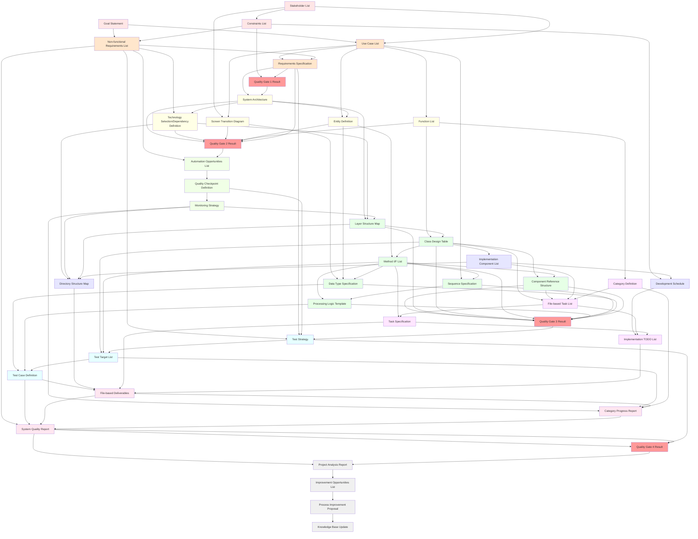
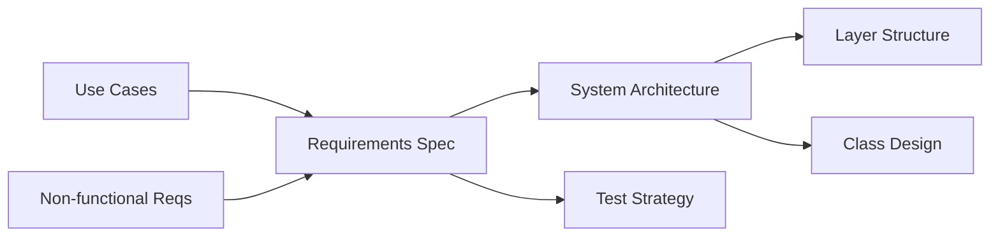
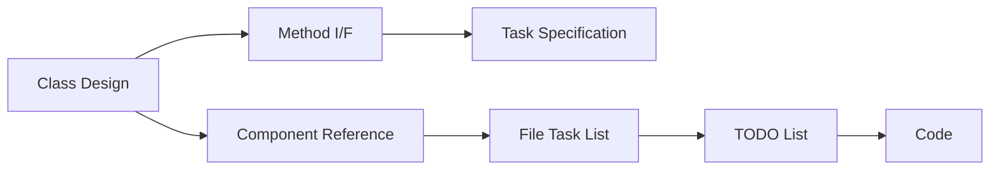

# AI Coding Development Process v1.3 Deliverable Flow Definition

## 1. Overview

This document defines the flow of deliverables (documents) in the AI Coding Development Process v1.3. It clarifies which deliverables are created in which process and which processes use them as inputs, verifying the reusability and necessity of deliverables.

### 1.1 Principles of Deliverable Flow

1. **All deliverables become inputs for subsequent processes**: Do not create unused deliverables
2. **Clarify deliverable dependencies**: Define which deliverables are needed to create which deliverables
3. **Stepwise information refinement**: Track transformation from abstract to concrete deliverables

## 2. Overall Deliverable Flow Diagram



## 3. Deliverable List by Step

### 3.1 STEP 0: Goal Definition

| Deliverable ID | Deliverable Name | Type | Primary Use |
|----------------|------------------|------|-------------|
| D01 | Goal Statement | Document | Foundation for use case extraction |
| D02 | Stakeholder List | List | User and constraint definition |
| D03 | Constraints List | List | Technology selection and schedule constraints |

### 3.2 STEP 1: Requirements Definition

| Deliverable ID | Deliverable Name | Type | Primary Use |
|----------------|------------------|------|-------------|
| D11 | Use Case List | List | Foundation for function definition |
| D12 | Non-functional Requirements List | List | Technology selection criteria |
| D13 | Requirements Specification | Document | System design input |

### 3.3 STEP 2: System Design

| Deliverable ID | Deliverable Name | Type | Primary Use |
|----------------|------------------|------|-------------|
| D21 | System Architecture | Diagram | Overall structure definition |
| D22 | Technology Selection/Dependency Definition | Document | Implementation environment determination |
| D23 | Screen Transition Diagram | Diagram | UI flow definition |
| D24 | Entity Definition | Document | Data structure design |
| D25 | Function List | List | Detailed design scope |

### 3.4 STEP 2.5: Automation Design

| Deliverable ID | Deliverable Name | Type | Primary Use |
|----------------|------------------|------|-------------|
| D251 | Automation Opportunities List | List | Efficiency improvement planning |
| D252 | Quality Checkpoint Definition | Document | Quality assurance design |
| D253 | Monitoring Strategy | Document | Operational monitoring design |

### 3.5 STEP 3: Detailed Design

| Deliverable ID | Deliverable Name | Type | Primary Use |
|----------------|------------------|------|-------------|
| D31 | Layer Structure Map | Diagram | Architecture implementation |
| D32 | Class Design Table | Table | Class implementation guide |
| D33 | Method I/F List | List | Interface definition |
| D34 | Sequence Specification | Diagram | Processing flow definition |
| D35 | Data Type Specification | Document | Type implementation guide |
| D36 | Processing Logic Template | Document | Algorithm implementation |
| D37 | Component Reference Structure | Table | Dependency management |

### 3.6 STEP 4: Test Design

| Deliverable ID | Deliverable Name | Type | Primary Use |
|----------------|------------------|------|-------------|
| D41 | Test Strategy | Document | Test planning |
| D42 | Test Target List | List | Test scope definition |
| D43 | Test Case Definition | Document | Test implementation |

### 3.7 STEP 5: Development Planning

| Deliverable ID | Deliverable Name | Type | Primary Use |
|----------------|------------------|------|-------------|
| D51 | Implementation Component List | List | Development scope |
| D52 | Development Schedule | Schedule | Progress management |
| D53 | Directory Structure Map | Diagram | File organization |

### 3.8 STEP 6: Staged Task Management

| Deliverable ID | Deliverable Name | Type | Primary Use |
|----------------|------------------|------|-------------|
| D62 | Category Definition | Document | Task organization |
| D63 | File-based Task List | Table | Task assignment |
| D65 | Task Specification | Document | Implementation details |
| D66 | Implementation TODO List | Checklist | Execution management |

### 3.9 STEP 7: Coding/Test Execution

| Deliverable ID | Deliverable Name | Type | Primary Use |
|----------------|------------------|------|-------------|
| D71 | File-based Deliverables | Code | System components |
| D72 | Category Progress Report | Report | Progress tracking |
| D73 | System Quality Report | Report | Quality verification |

### 3.10 STEP 8: Continuous Improvement

| Deliverable ID | Deliverable Name | Type | Primary Use |
|----------------|------------------|------|-------------|
| D81 | Project Analysis Report | Report | Lessons learned |
| D82 | Improvement Opportunities List | List | Process enhancement |
| D83 | Process Improvement Proposal | Document | Future improvements |
| D84 | Knowledge Base Update | Document | Organizational learning |

### 3.11 Quality Gates

| Deliverable ID | Deliverable Name | Type | Primary Use |
|----------------|------------------|------|-------------|
| QG1D | Quality Gate 1 Result | Report | Requirements validation |
| QG2D | Quality Gate 2 Result | Report | Architecture validation |
| QG3D | Quality Gate 3 Result | Report | Design validation |
| QG4D | Quality Gate 4 Result | Report | Implementation validation |

## 4. Key Deliverable Flows

### 4.1 Requirements to Design Flow



### 4.2 Design to Implementation Flow



### 4.3 Quality Assurance Flow


## 5. Deliverable Dependency Matrix

### 5.1 Direct Dependencies

| Deliverable | Direct Prerequisites | Direct Outputs |
|-------------|---------------------|----------------|
| Goal Statement | - | Use Cases, Non-functional Requirements |
| Use Case List | Goal Statement, Stakeholder List | Requirements Spec, Screen Design, Functions |
| Requirements Spec | Use Cases, Non-functional Reqs | System Architecture, Test Strategy |
| System Architecture | Requirements Spec, QG1 | Technology Stack, Layer Structure |
| Class Design | Function List, Layer Structure | Method I/F, Component Reference |
| Task Specification | Method I/F, File Task List | TODO List |
| Implementation TODO | Task Spec, Development Schedule | Code Deliverables |

### 5.2 Indirect Dependencies

Complex dependencies exist through quality gates and feedback loops. Each quality gate result influences multiple downstream deliverables.

## 6. Deliverable Verification Points

### 6.1 Completeness Check

Each deliverable must be verified for:
- **Content completeness**: All required sections filled
- **Consistency**: Alignment with related deliverables
- **Traceability**: Clear linkage to source requirements
- **Usability**: Sufficient detail for intended use

### 6.2 Quality Criteria

| Deliverable Type | Quality Criteria |
|------------------|------------------|
| Documents | Clear structure, complete content, version controlled |
| Lists | Comprehensive coverage, prioritized, categorized |
| Diagrams | Standard notation, clear labels, appropriate detail |
| Tables | Complete cells, consistent format, sortable |
| Code | Tested, documented, follows standards |

## 7. Deliverable Management

### 7.1 Storage Structure

```
project/
├── docs/
│   ├── step0-goal/
│   ├── step1-requirements/
│   ├── step2-system-design/
│   ├── step2.5-automation/
│   ├── step3-detailed-design/
│   ├── step4-test-design/
│   ├── step5-planning/
│   ├── step6-task-management/
│   ├── step7-implementation/
│   └── step8-improvement/
├── quality-gates/
│   ├── qg1-requirements/
│   ├── qg2-architecture/
│   ├── qg3-design/
│   └── qg4-implementation/
└── deliverables/
    └── [actual code and test files]
```

### 7.2 Version Control

- All deliverables must be version controlled
- Use semantic versioning for documents
- Maintain change history
- Tag quality gate milestones

### 7.3 Access Control

- Read access: All team members
- Write access: Assigned contributors
- Approval authority: Technical leads
- Archive access: Long-term storage

## 8. Deliverable Templates

### 8.1 Document Templates

Each document type has a corresponding template that includes:
- Standard sections
- Required information
- Quality checklist
- Examples

### 8.2 List Templates

Standardized formats for:
- Requirement lists
- Task lists
- Test lists
- Issue lists

### 8.3 Diagram Standards

- Architecture: C4 model or similar
- Sequence: UML sequence diagrams
- Data: ER diagrams
- Process: BPMN or flowcharts

## 9. Continuous Improvement

### 9.1 Deliverable Effectiveness Review

Regular review of:
- Usage frequency
- Update frequency
- Value assessment
- Redundancy check

### 9.2 Template Evolution

Based on project feedback:
- Simplify overly complex templates
- Add missing sections
- Remove unused elements
- Improve examples

### 9.3 Process Optimization

Identify opportunities to:
- Combine related deliverables
- Automate generation
- Streamline reviews
- Enhance reusability

## 10. Conclusion

The deliverable flow in AI Coding Development Process v1.3 ensures:
- **Traceability**: From requirements to implementation
- **Efficiency**: No redundant documentation
- **Quality**: Built-in verification points
- **Reusability**: Structured for future projects
- **Continuous Improvement**: Feedback-driven optimization

By following this deliverable flow, teams can maintain clarity, consistency, and quality throughout the development lifecycle while maximizing the benefits of AI-assisted development.

---

**Document Information**
- Version: 1.0
- Created: 2024-12-20
- Last Updated: 2024-12-20
- Status: Released

**Related Documents**
- AI Coding Development Process v1.3 Complete
- Quality Gate Specifications v1.3
- Template Collection v1.3