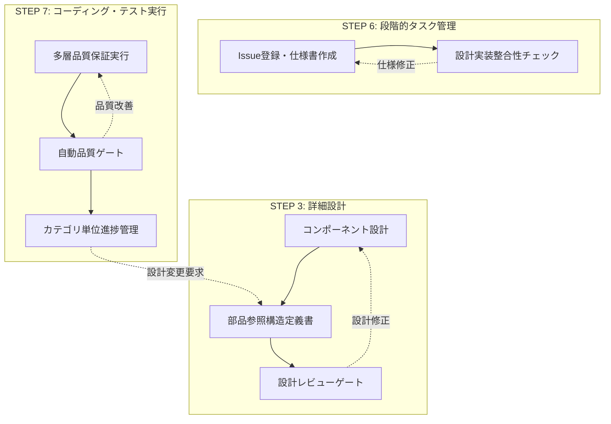
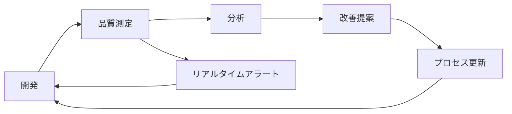

# プロセス定義更新分析レポート v1.3

## メタデータ

| 項目 | 内容 |
|------|------|
| ドキュメントID | PROC-UPDATE-001 |
| 作成日 | 2025-06-16 |
| 最終更新日 | 2025-06-16 |
| 作成者 | Process Engineering Team |
| 関連文書 | ai-coding-development-process-v1.2-part1-3.md, improvement-proposal.md, problem-root-cause-analysis-report.md |

## 概要

本文書は、改善提案書および問題分析レポートに基づき、現行のAIコーディング開発プロセス定義（v1.2）をv1.3へ更新するための詳細な分析を行います。各改善項目を具体的なプロセス変更にマッピングし、実装ガイドラインを提供します。

---

## 1. 現状分析と改善ニーズ

### 1.1 v1.2プロセスの強み（継続要素）

| 強み | 現状評価 | 継続理由 |
|------|----------|----------|
| **段階的詳細化** | A | 抽象から具体への体系的変換が有効 |
| **ファイル単位タスク管理** | A | 実装時の管理効率が高い |
| **7つの標準サブタスク** | A | 実装品質の標準化に成功 |
| **選択的品質投資** | A | リソース最適化に有効 |
| **トレーサビリティ** | A | 要件から実装まで完全追跡可能 |

### 1.2 識別された問題と改善領域

#### 改善提案書からの主要課題
| 改善領域 | 現状評価 | 改善ポテンシャル | 優先度 |
|----------|----------|------------------|--------|
| **自動化レベル** | B+ | 文書生成・更新の自動化 | 高 |
| **効率性** | B+ | テンプレート活用の最適化 | 中 |
| **ツール統合** | B | 開発ツールとの連携強化 | 高 |
| **メトリクス可視化** | B | 進捗・品質の可視化強化 | 中 |

#### 問題分析レポートからの課題
| 問題カテゴリ | 詳細 | 影響度 | 緊急度 |
|--------------|------|--------|--------|
| **設計実装整合性** | 設計書と実装の不整合 | 高 | 高 |
| **テスト設計** | 実装依存のモック、統合テスト不足 | 高 | 高 |
| **品質ゲート** | 自動整合性チェック不足 | 中 | 高 |
| **フィードバック** | 問題発見の遅延 | 中 | 中 |

---

## 2. プロセス定義v1.3への改善マッピング

### 2.1 フロー改善 - フィードバックループと品質ゲートの追加

#### 2.1.1 新しいフィードバックループ



#### 2.1.2 品質ゲートの定義

| ゲート名 | 配置場所 | チェック内容 | 自動化レベル |
|----------|----------|--------------|--------------|
| **設計レビューゲート** | STEP 3終了時 | インターフェース整合性、命名規則 | 半自動 |
| **設計実装整合性ゲート** | STEP 6実行時 | 設計書とコードの一致 | 自動 |
| **統合品質ゲート** | STEP 7各段階 | テスト品質、カバレッジ | 自動 |
| **リリース前ゲート** | STEP 7終了時 | 総合品質評価 | 自動 |

### 2.2 プロセス改善 - 既存ステップの修正

#### 2.2.1 STEP 3: 詳細設計の改善

**現行プロセス（v1.2）**:
- 3.1～3.7のサブステップ実行
- 成果物作成

**改善プロセス（v1.3）**:
```yaml
STEP 3: 詳細設計（改善版）
  3.1: レイヤー構造定義
  3.2: クラス定義
  3.3: メソッド設計
  3.4: 振る舞い定義
  3.5: データ型定義
  3.6: 処理パターン定義
  3.7: 部品参照構造定義
  3.8: 【新規】インターフェース一元管理
    - 共通型定義ファイルの作成
    - 重複定義の排除
    - 自動整合性チェック
  3.9: 【新規】設計レビューチェックリスト
    - 命名規則の確認
    - 型定義の整合性
    - 依存関係の妥当性
```

#### 2.2.2 STEP 6: 段階的タスク管理の改善

**追加サブステップ**:
```yaml
STEP 6: 段階的タスク管理（改善版）
  6.5: Issue登録・仕様書作成
  6.6: 【新規】自動Issue生成
    - ToDoリストからのIssue自動作成
    - GitHub API連携
    - タスク仕様書の自動生成
  6.7: 【新規】設計実装整合性検証
    - 設計書とコードの自動比較
    - 不整合の早期発見
    - 修正提案の生成
```

#### 2.2.3 STEP 7: コーディング・テスト実行の改善

**強化された品質保証**:
```yaml
STEP 7: コーディング・テスト実行（改善版）
  7.1: 多層品質保証実行
    7.1.1: タスクレベル品質保証
    7.1.2: 【強化】統合テスト必須化
      - 実装を使用したテスト
      - モック最小化方針
    7.1.3: カテゴリレベル品質保証
    7.1.4: プロジェクトレベル品質保証
  7.2: 【新規】継続的品質監視
    - リアルタイムメトリクス収集
    - 品質トレンド分析
    - 予防的アラート
```

### 2.3 新プロセス - 追加すべき新規プロセス

#### 2.3.1 STEP 2.5: 自動化設計（新規）

```yaml
STEP 2.5: 自動化設計
  目的: プロジェクト開始時に自動化戦略を定義
  
  サブステップ:
    2.5.1: 自動化対象の選定
      - 文書生成対象の特定
      - テスト自動化範囲の定義
      - 品質チェック自動化計画
    
    2.5.2: ツール選定
      - テンプレートエンジン
      - CI/CDツール
      - 品質管理ツール
    
    2.5.3: 統合設計
      - GitHub連携設計
      - ダッシュボード設計
      - アラート設計
  
  成果物:
    - 自動化戦略書
    - ツール統合設計書
    - 品質管理ダッシュボード仕様
```

#### 2.3.2 STEP 8: 継続的改善（新規）

```yaml
STEP 8: 継続的改善
  目的: プロジェクト完了後の振り返りと改善
  
  サブステップ:
    8.1: メトリクス分析
      - 開発効率の測定
      - 品質指標の評価
      - プロセス遵守度の確認
    
    8.2: 課題抽出
      - ボトルネックの特定
      - 改善機会の発見
      - ベストプラクティスの抽出
    
    8.3: プロセス更新
      - テンプレートの改善
      - 自動化の拡充
      - ガイドラインの更新
  
  成果物:
    - プロジェクト振り返りレポート
    - 改善提案書
    - 更新されたプロセス定義
```

### 2.4 文書更新 - 既存ドキュメントの改訂

#### 2.4.1 更新が必要な既存文書

| 文書カテゴリ | 更新内容 | 優先度 |
|--------------|----------|--------|
| **プロセス定義** | v1.3への全面改訂 | 高 |
| **テンプレート** | 自動化対応、検証項目追加 | 高 |
| **ガイドライン** | 品質ゲート、自動化手順 | 中 |
| **チェックリスト** | 設計実装整合性項目 | 高 |

#### 2.4.2 テンプレート更新例

**メソッドインターフェーステンプレート（改訂版）**:
```markdown
## メソッドインターフェース定義

### 基本情報
- **ファイル**: [ファイル名]
- **設計書参照**: [設計書へのリンク]
- **最終更新**: [日付]
- **整合性確認**: [ ] 完了

### インターフェース定義
\`\`\`typescript
// 共通型定義ファイルからインポート
import { UserData, JWTPayload } from '@/types/common';

interface MethodName {
  // メソッド定義
}
\`\`\`

### 設計実装チェックリスト
- [ ] 設計書の型定義と一致
- [ ] 命名規則に準拠
- [ ] 共通型定義を使用
- [ ] 重複定義なし
```

### 2.5 新規文書 - 追加すべきドキュメントタイプ

#### 2.5.1 自動化関連文書

| 文書名 | 目的 | 内容 |
|--------|------|------|
| **自動化戦略書** | 自動化方針の定義 | 対象、ツール、統合計画 |
| **CI/CD設定書** | パイプライン定義 | ワークフロー、品質ゲート |
| **品質ダッシュボード仕様** | 可視化設計 | メトリクス、表示方法 |

#### 2.5.2 品質保証関連文書

| 文書名 | 目的 | 内容 |
|--------|------|------|
| **設計実装整合性レポート** | 不整合の記録 | 発見事項、修正履歴 |
| **統合テスト戦略書** | テスト方針 | 実装依存回避、カバレッジ目標 |
| **品質メトリクスレポート** | 品質状況報告 | 測定値、トレンド、改善提案 |

### 2.6 管理方法の変更 - タスク管理の進化

#### 2.6.1 タスク管理の自動化

**現行（v1.2）**:
```yaml
手動プロセス:
  1. ToDoリスト作成（Markdown）
  2. 手動でGitHub Issue作成
  3. 手動で進捗更新
```

**改善（v1.3）**:
```yaml
自動化プロセス:
  1. ToDoリスト作成（構造化YAML）
  2. 自動Issue生成スクリプト実行
  3. Git連携による自動進捗更新
  4. ダッシュボードでリアルタイム表示
```

#### 2.6.2 品質管理の進化

```typescript
// 品質管理システムの構造
interface QualityManagementSystem {
  // リアルタイム品質監視
  monitoring: {
    testCoverage: CoverageMonitor;
    codeQuality: QualityAnalyzer;
    performance: PerformanceTracker;
  };
  
  // 自動品質ゲート
  gates: {
    preCommit: QualityGate[];
    preMerge: QualityGate[];
    preRelease: QualityGate[];
  };
  
  // 予防的アクション
  prevention: {
    alerts: AlertRule[];
    autoFix: AutoFixStrategy[];
    suggestions: ImprovementSuggestion[];
  };
}
```

### 2.7 自動化統合 - 具体的な実装箇所

#### 2.7.1 文書生成の自動化

| 自動化対象 | 実装方法 | 統合ポイント |
|------------|----------|------------|
| **タスク仕様書** | テンプレートエンジン | STEP 6実行時 |
| **Issue作成** | GitHub API | ToDoリスト作成後 |
| **進捗レポート** | データ集約スクリプト | 日次実行 |
| **品質レポート** | メトリクス収集 | CI/CD実行時 |

#### 2.7.2 品質チェックの自動化

```yaml
# .github/workflows/quality-check-v1.3.yml
name: Quality Assurance v1.3

on: [push, pull_request]

jobs:
  design-implementation-check:
    name: Design Implementation Consistency
    steps:
      - name: Extract interfaces from design docs
        run: npm run extract:design-interfaces
        
      - name: Compare with implementation
        run: npm run check:design-consistency
        
      - name: Generate report
        run: npm run report:consistency
        
  integration-test:
    name: Mandatory Integration Tests
    steps:
      - name: Run integration tests
        run: npm run test:integration -- --no-mock
        
      - name: Check coverage
        run: npm run coverage:integration -- --threshold=90
```

### 2.8 品質保証タイミング - 実装時期と方法

#### 2.8.1 品質チェックポイントマトリクス

| タイミング | チェック内容 | 方法 | 自動化度 |
|------------|--------------|------|----------|
| **設計完了時** | インターフェース整合性 | レビューチェックリスト | 半自動 |
| **コーディング前** | 設計書確認 | 自動リマインダー | 自動 |
| **コミット時** | コード品質、規約準拠 | pre-commitフック | 自動 |
| **PR作成時** | 設計実装整合性 | GitHub Actions | 自動 |
| **マージ前** | 統合テスト、品質ゲート | CI/CD | 自動 |
| **リリース前** | 総合品質評価 | 品質ダッシュボード | 自動 |

#### 2.8.2 継続的品質改善サイクル



---

## 3. 実装ガイドライン

### 3.1 段階的導入計画

#### Phase 1: 基盤整備（1-2ヶ月）
| タスク | 成果物 | 担当 |
|--------|--------|------|
| テンプレートエンジン導入 | 自動生成システム | 開発チーム |
| GitHub API連携 | Issue自動生成機能 | 開発チーム |
| 基本品質ゲート実装 | CI/CDパイプライン | DevOpsチーム |

#### Phase 2: 自動化拡張（3-4ヶ月）
| タスク | 成果物 | 担当 |
|--------|--------|------|
| 設計実装整合性チェッカー | 自動検証ツール | 品質チーム |
| 品質ダッシュボード | 可視化システム | 開発チーム |
| 統合テスト強化 | テストフレームワーク | テストチーム |

#### Phase 3: 最適化（5-6ヶ月）
| タスク | 成果物 | 担当 |
|--------|--------|------|
| AI支援機能 | 設計支援システム | R&Dチーム |
| 予測分析 | 品質予測モデル | データチーム |
| プロセス最適化 | 改善されたv1.4 | プロセスチーム |

### 3.2 実装優先度マトリクス

| 改善項目 | 効果 | 実装難易度 | 優先度 | 推奨実装時期 |
|----------|------|------------|--------|-------------|
| **設計実装整合性チェック** | 高 | 中 | 最高 | Phase 1 |
| **Issue自動生成** | 高 | 低 | 最高 | Phase 1 |
| **統合テスト強化** | 高 | 中 | 高 | Phase 1 |
| **品質ダッシュボード** | 中 | 中 | 中 | Phase 2 |
| **AI支援機能** | 中 | 高 | 低 | Phase 3 |

### 3.3 成功指標

#### 定量的指標
| 指標 | 現状値 | 目標値（6ヶ月後） | 測定方法 |
|------|--------|-------------------|----------|
| **設計実装不整合率** | 5% | 1%以下 | 自動チェック |
| **Issue作成時間** | 30分/件 | 3分/件 | 時間測定 |
| **品質ゲート通過率** | 70% | 95% | CI/CD統計 |
| **テストカバレッジ** | 40% | 90% | 自動測定 |

#### 定性的指標
- 開発者の作業負荷軽減
- 品質の安定性向上
- プロセス遵守の自然な実現
- チーム全体の生産性向上

---

## 4. リスクと対策

### 4.1 実装リスク

| リスク | 発生確率 | 影響度 | 対策 |
|--------|----------|--------|------|
| **過度な自動化による複雑化** | 中 | 高 | 段階的導入、シンプル設計維持 |
| **既存プロセスとの不整合** | 低 | 中 | 並行運用期間の設定 |
| **チームの抵抗** | 中 | 中 | 教育、段階的移行 |
| **ツール依存** | 低 | 高 | 代替手段の確保 |

### 4.2 技術的課題

| 課題 | 詳細 | 解決策 |
|------|------|--------|
| **異種システム統合** | GitHub, CI/CD, 品質ツール | 標準APIの活用 |
| **大規模データ処理** | メトリクス収集・分析 | 効率的なデータパイプライン |
| **リアルタイム性** | ダッシュボード更新 | イベント駆動アーキテクチャ |

---

## 5. 結論と推奨事項

### 5.1 主要な改善ポイント

1. **設計実装整合性の自動検証**
   - 設計書とコードの不整合を早期発見
   - 品質問題の予防的対処

2. **統合テストの必須化**
   - 実装依存のモック最小化
   - 実際の動作検証強化

3. **プロセス自動化**
   - 文書生成、Issue管理の自動化
   - 開発者負荷の大幅軽減

4. **継続的品質監視**
   - リアルタイムメトリクス
   - 予防的品質管理

### 5.2 期待される効果

| 効果カテゴリ | 詳細 | 期待値 |
|--------------|------|--------|
| **品質向上** | 設計実装不整合の削減 | 80%削減 |
| **効率化** | 管理作業の自動化 | 70%削減 |
| **可視性** | リアルタイム進捗・品質 | 100%向上 |
| **予防性** | 問題の早期発見 | 90%向上 |

### 5.3 次のステップ

1. **承認プロセス**
   - ステークホルダーレビュー
   - 実装計画の承認

2. **パイロットプロジェクト**
   - 小規模プロジェクトでの検証
   - フィードバック収集

3. **本格展開**
   - 段階的な全社展開
   - 継続的な改善

---

## 6. 完了確認
- [x] 現状分析と問題識別が完了
- [x] 各改善項目の具体的なマッピングが完了
- [x] 実装ガイドラインが作成済み
- [x] リスク分析と対策が定義済み
- [x] 成功指標が設定済み
- [x] 実装優先度が明確化済み