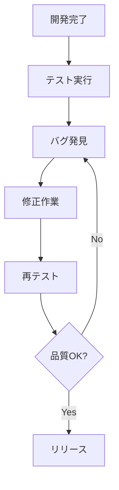
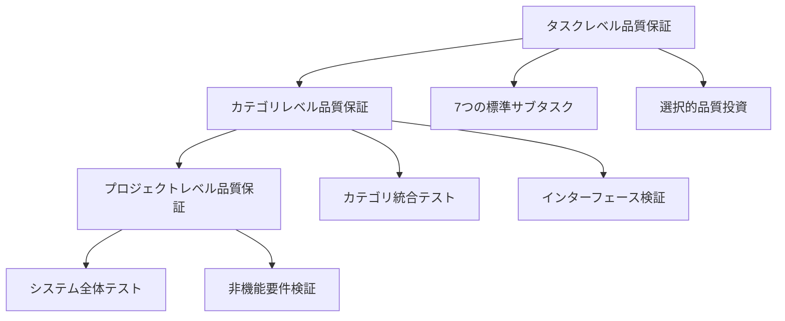
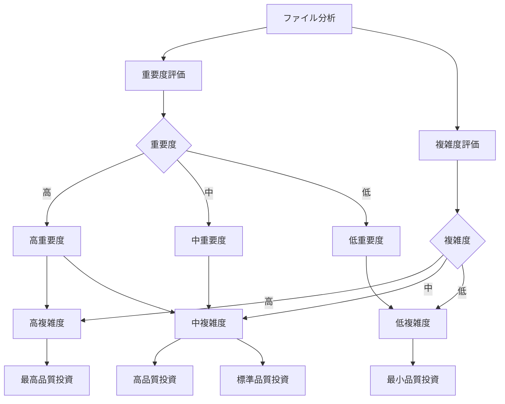

# 多層品質保証システム実装ガイド（完全版）

## メタデータ
| 項目 | 内容 |
|------|------|
| ドキュメントID | GUIDE-002 |
| 関連論文 | human-vs-ai-coding-process-engineering-paper-v1.1.md |
| 関連ガイド | categorical-task-management-guide.md |
| 作成日 | 2025-05-28 |
| 最終更新日 | 2025-05-28 |
| バージョン | 1.0.0 |

## 概要

本ガイドは、論文v1.1で提案された**多層品質保証システム**の理論と実装方法を詳細に解説します。段階的タスク管理アプローチと統合された品質保証により、効率的な品質投資と全体品質の向上を実現します。

### 対象読者
- **品質管理責任者**: 品質保証プロセスの改善を目指す方
- **開発チームリーダー**: チーム開発での品質向上を図りたい方
- **DevOpsエンジニア**: CI/CD統合による自動品質管理を実装したい方
- **プロジェクトマネージャー**: 品質とコストのバランス最適化を目指す方

### 期待される効果
- **品質向上**: 41-92%の品質指標改善
- **効率的品質投資**: 重要度に応じた最適な品質保証レベル
- **自動化**: CI/CDパイプラインとの完全統合
- **予測可能性**: 品質リスクの早期発見と対策

---

## 1. 多層品質保証システムの概念

### 1.1 従来の品質保証との違い

#### 従来の品質保証

**課題**:
- 後付けの品質管理
- 一律の品質基準
- 高い修正コスト
- 品質リスクの見落とし

#### 多層品質保証システム

**改善点**:
- 段階的品質管理
- 重要度に応じた品質投資
- 早期品質確保
- 統合的品質監視

### 1.2 品質投資の最適化理論

#### 重要度・複雑度マトリクス

#### 品質投資レベル定義
| 重要度 | 複雑度 | 投資レベル | テストカバレッジ | 品質チェック項目 |
|--------|--------|-----------|-----------------|-----------------|
| 高 | 高 | 最高 | 95%以上 | 全項目 + 追加検証 |
| 高 | 中 | 高 | 90%以上 | 全項目 |
| 中 | 高 | 高 | 90%以上 | 全項目 |
| 中 | 中 | 標準 | 85%以上 | 標準項目 |
| 中 | 低 | 標準 | 80%以上 | 標準項目 |
| 低 | 中 | 最小 | 75%以上 | 基本項目 |
| 低 | 低 | 最小 | 70%以上 | 基本項目 |

---

## 2. 実装推奨順序と今後の展望

### 2.1 段階的実装アプローチ

#### フェーズ1: タスクレベル品質保証の確立（1-2週間）
1. **7つの標準サブタスクの実装**
2. **選択的品質投資の適用**
3. **基本的なCI/CD統合**

#### フェーズ2: カテゴリレベル品質保証の追加（2-3週間）
1. **統合テストの実装**
2. **API契約テストの導入**
3. **カテゴリ別メトリクス収集**

#### フェーズ3: プロジェクトレベル品質保証の完成（3-4週間）
1. **E2Eテストの包括的実装**
2. **非機能要件テストの追加**
3. **品質監視ダッシュボードの構築**

#### フェーズ4: 自動化・最適化（継続的）
1. **メトリクス自動収集の拡張**
2. **アラートシステムの最適化**
3. **品質予測システムの導入**

### 2.2 成功要因

#### 組織レベルでの成功要因
1. **経営層のコミット**: 品質投資への理解と支援
2. **チーム教育**: 多層品質保証の理解と実践
3. **ツール投資**: 適切な品質管理ツールの導入
4. **継続改善**: 定期的な振り返りと改善

#### 技術レベルでの成功要因
1. **段階的導入**: 小さく始めて徐々に拡張
2. **自動化優先**: 手動作業の最小化
3. **メトリクス重視**: データに基づく意思決定
4. **フィードバックループ**: 迅速な問題発見と対応

### 2.3 今後の発展方向

#### AI技術との統合
- **自動品質予測**: 機械学習による品質リスク予測
- **インテリジェントテスト**: AIによる最適なテストケース生成
- **自動修正提案**: 品質問題の自動修正提案

#### 業界標準化
- **品質保証標準**: 業界標準としての確立
- **認定制度**: 多層品質保証の認定制度
- **教育プログラム**: 大学・企業での教育カリキュラム

---

## 付録

### A. 参考資料
- 論文v1.1: 「人間によるコーディングとAIコーディングの違い：プロセスエンジニアリングアプローチによる体系化」
- カテゴリ単位タスク管理ガイド: `categorical-task-management-guide.md`
- 実証実験レポート: RagProtoプロジェクトでの適用結果

### B. 用語集
- **多層品質保証**: タスク、カテゴリ、プロジェクトの3層での品質管理
- **選択的品質投資**: 重要度・複雑度に応じた品質保証レベルの調整
- **品質ゲート**: 各段階での品質基準チェックポイント
- **品質メトリクス**: 品質を定量的に測定する指標

### C. 連絡先
- **技術的質問**: GitHub Issues
- **改善提案**: GitHub Discussions  
- **学術的問い合わせ**: yokoi@innovative-solutions.co.jp

---

**最終更新**: 2025年5月28日  
**バージョン**: 1.0.0  
**ライセンス**: CC BY-NC 4.0
