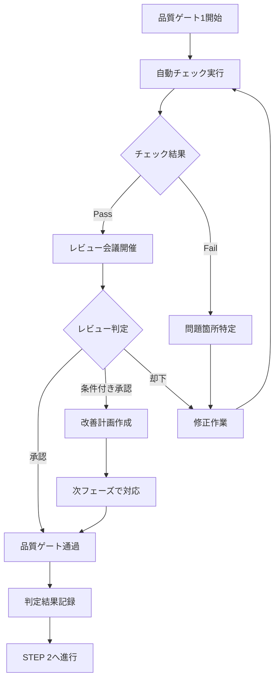
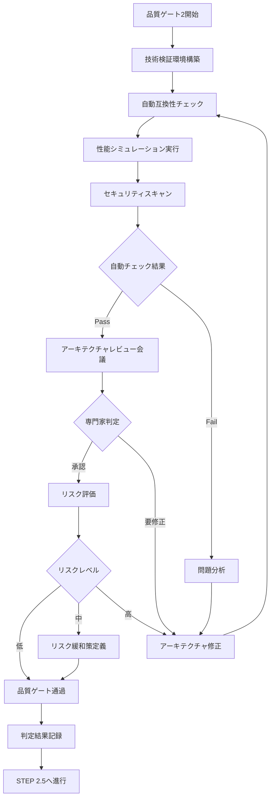
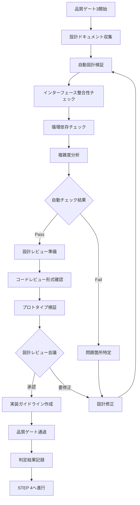
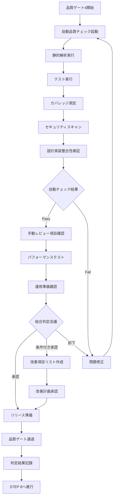
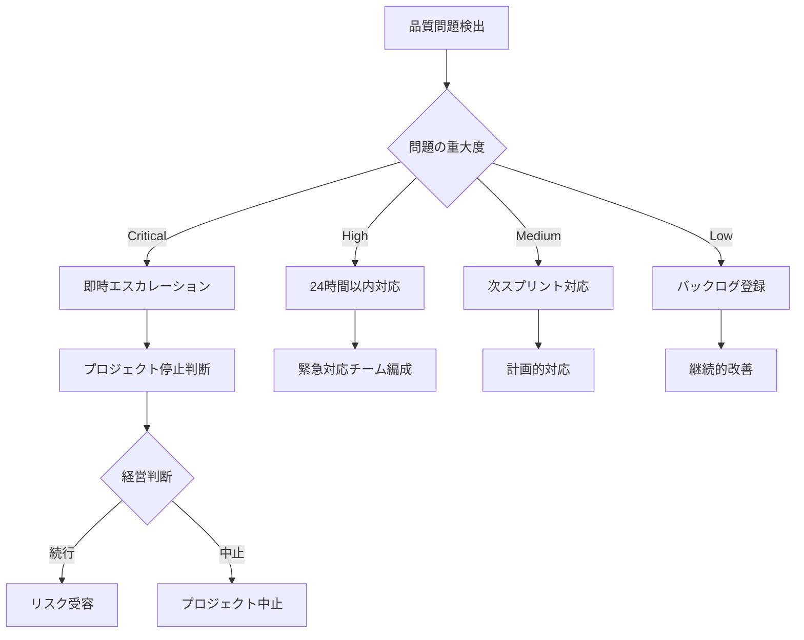

# 品質ゲート詳細仕様書 v1.3

## 1. 概要

本文書は、AIコーディング開発プロセスv1.3における品質ゲートの詳細な仕様、チェック内容、実施手順を定義します。実証実験で判明した設計実装不整合などの問題を防ぐため、各品質ゲートで厳密なチェックと自動化を実現します。

### 1.1 品質ゲートの目的

1. **早期問題発見**: 各フェーズの終了時点で品質問題を発見し、次フェーズへの影響を防止
2. **設計実装整合性**: 設計と実装の一貫性を継続的に検証
3. **自動化による確実性**: 人的ミスを防ぎ、チェックの網羅性を確保
4. **双方向フィードバック**: 実装からの設計へのフィードバックループを確立

### 1.2 品質ゲートの原則

- **強制力**: 品質ゲートの通過は必須であり、スキップ不可
- **自動化優先**: 可能な限り自動化し、手動チェックは最小限に
- **測定可能**: すべての判定基準は定量的または明確に定義
- **トレーサビリティ**: チェック結果と判定理由を記録・追跡可能

## 2. 品質ゲート1: 要件完全性チェック

### 2.1 実施タイミング
STEP 1（要件定義）完了後、STEP 2（システム設計）開始前

### 2.2 チェック項目詳細

#### 2.2.1 ゴール定義の妥当性
```yaml
チェック項目:
  - ゴール明確性:
      内容: プロジェクトの目的が明確に定義されているか
      判定基準: 
        - SMART原則（Specific, Measurable, Achievable, Relevant, Time-bound）準拠
        - 成功基準が定量的に定義されている
      確認方法: チェックリストによる評価
      
  - ステークホルダー網羅性:
      内容: すべての関係者が特定されているか
      判定基準:
        - プライマリ/セカンダリステークホルダーの分類完了
        - 各ステークホルダーの期待事項と懸念事項が文書化
      確認方法: ステークホルダーマトリクス確認
      
  - 制約条件の現実性:
      内容: 技術的・時間的・予算的制約が実現可能か
      判定基準:
        - 各制約に対する対応策が定義されている
        - リスク評価が完了している
      確認方法: 制約条件リストのレビュー
```

#### 2.2.2 機能要件の完全性
```yaml
チェック項目:
  - ユースケースカバレッジ:
      内容: すべてのステークホルダーのユースケースが網羅されているか
      判定基準:
        - カバレッジ率: 100%
        - 各ユースケースに事前条件・主要シナリオ・事後条件が定義
      測定方法: ステークホルダー×ユースケースのマトリクス分析
      自動化: カバレッジ分析ツール使用
      
  - 要件の明確性:
      内容: 各要件が曖昧さなく定義されているか
      判定基準:
        - 要件記述の曖昧性スコア: 0（曖昧な表現がない）
        - 各要件にID、優先度、受入基準が設定
      測定方法: 自然言語処理による曖昧性検出
      自動化: 要件分析ツール使用
      
  - 要件間の整合性:
      内容: 要件間に矛盾や競合がないか
      判定基準:
        - 競合する要件: 0件
        - 依存関係が明確に定義
      測定方法: 要件間の依存関係分析
      自動化: 要件管理ツールによる整合性チェック
```

#### 2.2.3 非機能要件の測定可能性
```yaml
チェック項目:
  - 性能要件の定量化:
      内容: すべての性能要件が測定可能か
      判定基準:
        - 応答時間、スループット、リソース使用量に具体的数値設定
        - 測定方法と測定条件が定義
      確認方法: NFRチェックリストによる検証
      
  - セキュリティ要件の具体性:
      内容: セキュリティ要件が実装可能なレベルで定義されているか
      判定基準:
        - 認証・認可・暗号化方式が明確
        - コンプライアンス要件が特定
      確認方法: セキュリティチェックリスト
      
  - 運用要件の実現性:
      内容: 運用・保守要件が現実的か
      判定基準:
        - 可用性目標（SLA）が定義
        - バックアップ・リカバリ要件が明確
      確認方法: 運用チームレビュー
```

### 2.3 実施手順



### 2.4 判定基準

| 判定 | 基準 | 対応 |
|------|------|------|
| **Pass（通過）** | - 必須項目100%合格<br>- 推奨項目80%以上合格<br>- 重大な問題なし | STEP 2へ進行可能 |
| **Conditional Pass（条件付き通過）** | - 必須項目100%合格<br>- 推奨項目60-79%合格<br>- 改善計画あり | 改善計画に従いSTEP 2進行可 |
| **Fail（不合格）** | - 必須項目に不合格あり<br>- 重大な問題あり | 要件定義の修正必須 |

### 2.5 必要なツールと成果物

#### 入力成果物
- ゴールステートメント（GOAL-001）
- ステークホルダー一覧（STAKE-001）
- 制約条件リスト（CONST-001）
- ユースケース一覧（UC-001）
- 非機能要件リスト（NFR-001）
- 要求仕様書（REQ-001）

#### 使用ツール
- 要件管理ツール（JIRA, Azure DevOps等）
- 自然言語処理ツール（曖昧性検出）
- カバレッジ分析ツール
- チェックリスト管理システム

#### 出力成果物
- 品質ゲート1判定結果（QG1-001）
- 問題リスト・改善計画
- チェックリスト実施記録

## 3. 品質ゲート2: アーキテクチャ実現可能性チェック

### 3.1 実施タイミング
STEP 2（システム設計）完了後、STEP 2.5（自動化設計）開始前

### 3.2 チェック項目詳細

#### 3.2.1 技術的実現可能性
```yaml
チェック項目:
  - 技術スタック互換性:
      内容: 選定した技術の組み合わせが実証されているか
      判定基準:
        - 技術間の互換性マトリクス: 問題なし
        - バージョン間の依存関係: 解決済み
      確認方法: 技術検証環境での動作確認
      自動化: Docker環境での自動構築テスト
      
  - 性能目標達成可能性:
      内容: アーキテクチャが性能要件を満たせるか
      判定基準:
        - 性能モデリング結果: 目標値の120%以内
        - ボトルネック分析: 重大な問題なし
      確認方法: 性能シミュレーション/PoC実施
      自動化: 負荷テストツールによる検証
      
  - スケーラビリティ検証:
      内容: 将来の拡張に対応できるか
      判定基準:
        - 水平/垂直スケーリング方式が定義
        - 3年後の想定負荷に対応可能
      確認方法: アーキテクチャレビュー
```

#### 3.2.2 セキュリティアーキテクチャ
```yaml
チェック項目:
  - セキュリティ設計の完全性:
      内容: セキュリティ要件がアーキテクチャに反映されているか
      判定基準:
        - 認証・認可フローが明確
        - データ暗号化方式が定義
        - セキュリティレイヤーが適切に配置
      確認方法: セキュリティアーキテクチャレビュー
      自動化: 脅威モデリングツール使用
      
  - 脆弱性評価:
      内容: 既知の脆弱性への対策があるか
      判定基準:
        - OWASP Top 10対策: 100%実装
        - 依存ライブラリの脆弱性: Critical/High 0件
      確認方法: セキュリティスキャン
      自動化: 依存関係脆弱性スキャナー
```

#### 3.2.3 要件カバレッジ
```yaml
チェック項目:
  - 機能要件マッピング:
      内容: すべての機能要件がアーキテクチャ要素にマッピングされているか
      判定基準:
        - 要件カバレッジ: 100%
        - 各機能のコンポーネント割当が明確
      測定方法: 要件-コンポーネントマトリクス
      自動化: トレーサビリティマトリクス自動生成
      
  - 非機能要件の実現性:
      内容: NFRがアーキテクチャで実現可能か
      判定基準:
        - 各NFRの実現方式が明確
        - トレードオフが文書化されている
      確認方法: NFR実現性分析
```

### 3.3 実施手順



### 3.4 判定基準

| 判定 | 基準 | 対応 |
|------|------|------|
| **Pass（通過）** | - 技術的実現性確認済み<br>- 性能目標達成可能<br>- セキュリティリスク低 | STEP 2.5へ進行可能 |
| **Conditional Pass（条件付き通過）** | - 軽微な技術的課題あり<br>- リスク緩和策定義済み<br>- PoC計画あり | リスク管理しながら進行 |
| **Fail（不合格）** | - 重大な技術的問題<br>- 性能目標達成困難<br>- セキュリティリスク高 | アーキテクチャ再設計必須 |

### 3.5 必要なツールと成果物

#### 入力成果物
- システム構成図（ARCH-001）
- 技術選定・依存関係定義書（TECH-001）
- 画面遷移図（UI-001）
- エンティティ定義書（DATA-001）
- 機能一覧表（FUNC-001）

#### 使用ツール
- アーキテクチャモデリングツール
- 性能シミュレーター
- セキュリティスキャナー（SAST/DAST）
- 依存関係チェッカー
- 負荷テストツール

#### 出力成果物
- 品質ゲート2判定結果（QG2-001）
- 技術検証レポート
- リスク評価書
- アーキテクチャ決定記録（ADR）

## 4. 品質ゲート3: 設計完全性チェック

### 4.1 実施タイミング
STEP 3（詳細設計）完了後、STEP 4（テスト設計）開始前

### 4.2 チェック項目詳細

#### 4.2.1 インターフェース定義の完全性
```yaml
チェック項目:
  - API仕様の完全性:
      内容: すべてのAPIが詳細に定義されているか
      判定基準:
        - エンドポイント定義率: 100%
        - リクエスト/レスポンス仕様: 完全定義
        - エラーハンドリング: すべて定義
      確認方法: OpenAPI仕様の検証
      自動化: API仕様バリデーター使用
      
  - 内部インターフェース整合性:
      内容: クラス間のインターフェースが整合しているか
      判定基準:
        - メソッドシグネチャの一致: 100%
        - 型定義の整合性: エラー0件
        - 依存方向の妥当性: 循環依存0件
      測定方法: 静的解析ツール
      自動化: インターフェース整合性チェッカー
      
  - データ型の一貫性:
      内容: データ型が全レイヤーで一貫しているか
      判定基準:
        - 型定義の重複: 0件
        - 型変換の明示性: 100%
        - Null安全性: 保証済み
      確認方法: 型システム分析
      自動化: TypeScriptコンパイラチェック
```

#### 4.2.2 設計パターンの適切性
```yaml
チェック項目:
  - SOLID原則準拠:
      内容: 設計がSOLID原則に従っているか
      判定基準:
        - 単一責任原則: 違反0件
        - 開放閉鎖原則: 拡張ポイント明確
        - 依存性逆転原則: 実装済み
      測定方法: 設計メトリクス分析
      自動化: 設計品質分析ツール
      
  - デザインパターン適用:
      内容: 適切なデザインパターンが使用されているか
      判定基準:
        - パターンの適切性: レビュー承認
        - 実装の一貫性: 確保
        - ドキュメント化: 完了
      確認方法: アーキテクトレビュー
      
  - 複雑度管理:
      内容: 設計の複雑度が管理可能か
      判定基準:
        - 循環的複雑度: 10以下
        - クラス結合度: 適正範囲内
        - 継承階層: 3階層以内
      測定方法: 複雑度メトリクス
      自動化: 静的解析ツール
```

#### 4.2.3 実装可能性の検証
```yaml
チェック項目:
  - 技術的実装可能性:
      内容: 設計が選定技術で実装可能か
      判定基準:
        - フレームワーク制約との整合性: 確認済み
        - パフォーマンス実現性: 検証済み
        - 必要ライブラリの存在: 確認済み
      確認方法: プロトタイプ実装
      
  - 開発工数の妥当性:
      内容: 設計の実装工数が現実的か
      判定基準:
        - 見積もり精度: ±20%以内
        - 技術的リスク: 識別・対策済み
        - 再利用可能性: 最大化
      確認方法: 工数見積もりレビュー
```

### 4.3 実施手順



### 4.4 判定基準

| 判定 | 基準 | 対応 |
|------|------|------|
| **Pass（通過）** | - インターフェース100%定義<br>- 循環依存0件<br>- 設計レビュー承認 | STEP 4へ進行可能 |
| **Conditional Pass（条件付き通過）** | - 軽微な設計課題あり<br>- 実装時の注意事項明確<br>- 改善計画あり | 注意事項付きで進行 |
| **Fail（不合格）** | - 重大な設計欠陥<br>- インターフェース不整合<br>- 実装困難な設計 | 詳細設計の修正必須 |

### 4.5 必要なツールと成果物

#### 入力成果物
- レイヤー構成マップ（LAYER-001）
- クラス設計表（CLASS-001）
- メソッドI/Fリスト（METHOD-001）
- シーケンス仕様書（SEQ-001）
- データ型仕様書（TYPE-001）
- 処理ロジックテンプレート（LOGIC-001）
- 部品参照構造定義書（REF-001）

#### 使用ツール
- UMLモデリングツール
- 静的解析ツール（SonarQube等）
- API仕様検証ツール（Spectral等）
- 設計メトリクス分析ツール
- プロトタイピング環境

#### 出力成果物
- 品質ゲート3判定結果（QG3-001）
- 設計品質レポート
- インターフェース整合性レポート
- 実装ガイドライン

## 5. 品質ゲート4: 実装品質チェック

### 5.1 実施タイミング
STEP 7（コーディング・テスト実行）完了後、STEP 8（継続的改善）開始前

### 5.2 チェック項目詳細

#### 5.2.1 コード品質
```yaml
チェック項目:
  - 静的解析結果:
      内容: コードが品質基準を満たしているか
      判定基準:
        - Critical/High脆弱性: 0件
        - コード重複率: 3%未満
        - 技術的負債: 5日未満
      測定方法: SonarQube等の静的解析
      自動化: CI/CDパイプライン統合
      
  - コーディング規約準拠:
      内容: プロジェクトの規約に従っているか
      判定基準:
        - Lintエラー: 0件
        - フォーマット違反: 0件
        - 命名規則違反: 0件
      確認方法: ESLint/Prettier
      自動化: pre-commitフック
      
  - コードレビュー完了:
      内容: すべてのコードがレビューされているか
      判定基準:
        - レビューカバレッジ: 100%
        - 指摘事項: すべて対応済み
        - 承認者: 2名以上
      確認方法: PRレビュー記録
      自動化: GitHub/GitLab統合
```

#### 5.2.2 テストカバレッジと品質
```yaml
チェック項目:
  - テストカバレッジ:
      内容: 十分なテストが実装されているか
      判定基準:
        - ラインカバレッジ: 90%以上
        - ブランチカバレッジ: 85%以上
        - 関数カバレッジ: 95%以上
      測定方法: カバレッジツール（Jest等）
      自動化: CI/CDでの自動測定
      
  - テスト品質:
      内容: テストが適切に設計されているか
      判定基準:
        - ユニットテスト: 全public関数
        - 統合テスト: 全APIエンドポイント
        - E2Eテスト: 主要ユースケース
      確認方法: テストレビュー
      
  - テスト実行結果:
      内容: すべてのテストが成功しているか
      判定基準:
        - テスト成功率: 100%
        - 不安定なテスト: 0件
        - 実行時間: 妥当な範囲内
      測定方法: テストランナー
      自動化: CI/CDパイプライン
```

#### 5.2.3 設計実装整合性
```yaml
チェック項目:
  - インターフェース実装整合性:
      内容: 実装が設計通りか
      判定基準:
        - 設計と実装の差異: 0件
        - APIスペック準拠: 100%
        - 未実装機能: 0件
      測定方法: 自動整合性チェック
      自動化: 契約テスト（Contract Testing）
      
  - アーキテクチャ準拠:
      内容: アーキテクチャルールに従っているか
      判定基準:
        - レイヤー違反: 0件
        - 依存関係ルール違反: 0件
        - 禁止パターン使用: 0件
      測定方法: アーキテクチャテスト
      自動化: ArchUnitテスト
```

#### 5.2.4 運用準備状況
```yaml
チェック項目:
  - ログ・監視:
      内容: 運用に必要なログ・監視が実装されているか
      判定基準:
        - エラーログ: 構造化済み
        - メトリクス: 主要指標実装
        - トレーシング: 実装済み
      確認方法: ログ出力確認
      
  - ドキュメント:
      内容: 必要なドキュメントが揃っているか
      判定基準:
        - API仕様書: 最新化
        - 運用手順書: 作成済み
        - トラブルシューティングガイド: 作成済み
      確認方法: ドキュメントレビュー
      
  - セキュリティ:
      内容: セキュリティ要件を満たしているか
      判定基準:
        - 脆弱性スキャン: Critical/High 0件
        - ペネトレーションテスト: 合格
        - セキュリティヘッダー: 実装済み
      測定方法: セキュリティテスト
      自動化: SAST/DASTツール
```

### 5.3 実施手順



### 5.4 判定基準

| 判定 | 基準 | 対応 |
|------|------|------|
| **Pass（通過）** | - 全自動チェック合格<br>- テストカバレッジ基準達成<br>- セキュリティ問題なし | リリース可能 |
| **Conditional Pass（条件付き通過）** | - 軽微な問題のみ<br>- 改善計画明確<br>- リスク評価済み | 段階的リリース可 |
| **Fail（不合格）** | - 重大な品質問題<br>- セキュリティ脆弱性<br>- 設計との重大な乖離 | 実装修正必須 |

### 5.5 必要なツールと成果物

#### 入力成果物
- ソースコード一式
- テストコード一式
- ビルド・デプロイ設定
- ドキュメント一式

#### 使用ツール
- 静的解析ツール（SonarQube）
- テストフレームワーク（Jest, Playwright）
- カバレッジツール
- セキュリティスキャナー（Snyk, OWASP ZAP）
- パフォーマンステストツール（K6, JMeter）
- CI/CDツール（GitHub Actions, GitLab CI）

#### 出力成果物
- 品質ゲート4判定結果（QG4-001）
- コード品質レポート
- テストレポート
- セキュリティ評価レポート
- パフォーマンステストレポート
- リリースノート

## 6. 品質ゲート実施ガイドライン

### 6.1 自動化の実装

```yaml
自動化戦略:
  品質ゲート1:
    - 要件管理ツールとの統合
    - 自然言語処理による要件分析
    - カバレッジ自動計算
    
  品質ゲート2:
    - インフラas Code検証
    - 性能モデリングツール統合
    - セキュリティスキャン自動化
    
  品質ゲート3:
    - 設計モデル検証ツール
    - 静的解析による設計メトリクス
    - API仕様自動検証
    
  品質ゲート4:
    - CI/CDパイプライン完全統合
    - 品質ダッシュボード
    - 自動レポート生成
```

### 6.2 エスカレーションプロセス



### 6.3 継続的改善

```yaml
改善サイクル:
  測定:
    - 各品質ゲートの所要時間
    - 検出された問題の種類と数
    - False Positive率
    
  分析:
    - 問題の根本原因分析
    - プロセスのボトルネック特定
    - 自動化の効果測定
    
  改善:
    - チェック項目の最適化
    - ツールの改善・更新
    - プロセスの効率化
    
  標準化:
    - ベストプラクティスの文書化
    - チームへの展開
    - 知識の共有
```

## 7. まとめ

本品質ゲート仕様は、実証実験で判明した設計実装不整合などの問題を防ぐため、以下の特徴を持ちます：

1. **早期検証**: 各フェーズ終了時点での厳密なチェック
2. **自動化優先**: 人的ミスを防ぐ自動チェックの充実
3. **測定可能性**: すべての判定基準が定量的または明確
4. **双方向性**: 実装から設計へのフィードバックループ
5. **継続的改善**: メトリクスに基づく改善サイクル

これらの品質ゲートを確実に実施することで、高品質なソフトウェア開発を実現します。