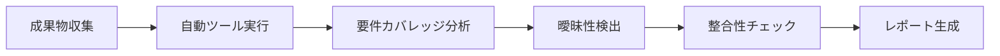
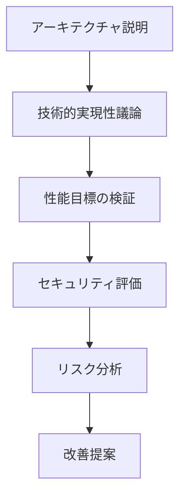
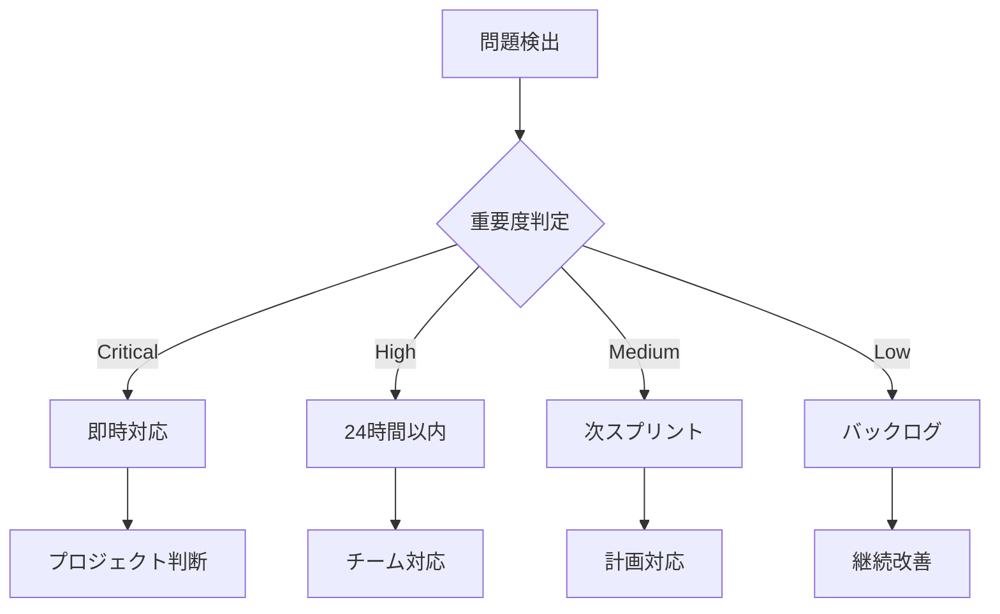

# 品質ゲート実施手順書 v1.3

## 1. 概要

本文書は、AIコーディング開発プロセスv1.3における品質ゲートの具体的な実施手順を定義します。各品質ゲートの準備、実施、判定、フォローアップまでの詳細な手順を提供します。

## 2. 品質ゲート1 実施手順

### 2.1 事前準備（実施1週間前）

#### 2.1.1 必要成果物の確認
```bash
# チェックリスト
□ ゴールステートメント（GOAL-001）
□ ステークホルダー一覧（STAKE-001）
□ 制約条件リスト（CONST-001）
□ ユースケース一覧（UC-001）
□ 非機能要件リスト（NFR-001）
□ 要求仕様書（REQ-001）
```

#### 2.1.2 参加者の招集
- **必須参加者**:
  - プロジェクトマネージャー
  - プロダクトオーナー
  - ビジネスアナリスト
  - アーキテクト（オブザーバー）
- **任意参加者**:
  - 主要ステークホルダー代表
  - QAリード

#### 2.1.3 ツール準備
```yaml
自動チェックツール:
  - 要件管理ツール（JIRA/Azure DevOps）
  - 自然言語処理ツール（要件曖昧性検出）
  - カバレッジ分析ツール
  
レビューツール:
  - チェックリスト管理システム
  - 会議システム（対面/Web）
  - 記録用ツール
```

### 2.2 実施手順（当日）

#### Phase 1: 自動チェック（1-2時間）


**実施内容**:
1. 全成果物をシステムにアップロード
2. 自動チェックツールを実行
3. 以下の観点で自動分析:
   - ステークホルダー×ユースケースのカバレッジ
   - 要件記述の曖昧な表現（「など」「適切に」等）
   - 要件間の矛盾・重複
   - 非機能要件の測定可能性
4. 自動チェックレポートの生成と配布

#### Phase 2: 手動レビュー（2-3時間）
```yaml
レビュー手順:
  1. チェックリスト確認:
     - 品質ゲート1チェックリストを使用
     - 各項目を順次確認
     - エビデンスの確認
     
  2. 問題点の議論:
     - 自動チェックで検出された問題の確認
     - 手動チェックで発見した問題の共有
     - 重要度・優先度の判定
     
  3. 改善策の検討:
     - 即時修正可能な項目の特定
     - 次フェーズでの対応項目の整理
     - リスクと対策の検討
```

#### Phase 3: 判定会議（1時間）
```yaml
判定プロセス:
  1. チェック結果サマリー:
     - 必須項目の達成率
     - 推奨項目の達成率
     - 重大問題の有無
     
  2. 判定基準の適用:
     Pass: 
       - 必須項目100%達成
       - 推奨項目80%以上
       - 重大問題なし
     
     Conditional Pass:
       - 必須項目100%達成
       - 推奨項目60-79%
       - 改善計画策定済み
     
     Fail:
       - 必須項目に未達成あり
       - 重大問題あり
       
  3. 判定結果の記録:
     - 判定結果
     - 判定理由
     - 条件（Conditional Passの場合）
     - 次のアクション
```

### 2.3 事後処理（実施後3日以内）

#### 2.3.1 判定結果の文書化
```markdown
# 品質ゲート1判定結果書

## 基本情報
- 実施日: YYYY-MM-DD
- 参加者: [リスト]
- 判定結果: [Pass/Conditional Pass/Fail]

## チェック結果サマリー
- 必須項目達成率: XX%
- 推奨項目達成率: XX%
- 検出された問題数: XX件

## 主要な問題と対策
| 問題 | 重要度 | 対策 | 期限 | 担当者 |
|------|--------|------|------|--------|
| | | | | |

## 判定理由
[判定に至った理由の詳細記載]

## 次のアクション
[具体的なアクションアイテム]

## 承認
- プロジェクトマネージャー: ___________
- プロダクトオーナー: ___________
```

#### 2.3.2 フォローアップ
- 問題リストの Issue 登録
- 改善計画の策定と承認
- 次フェーズへの申し送り事項の整理
- 関係者への結果通知

## 3. 品質ゲート2 実施手順

### 3.1 事前準備（実施1週間前）

#### 3.1.1 技術検証環境の準備
```bash
# 環境構築スクリプト例
#!/bin/bash

# Dockerによる検証環境構築
docker-compose -f docker-compose.test.yml up -d

# 技術スタックの互換性チェック
npm install
npm audit
npm run compatibility-check

# 性能テスト環境の準備
kubectl apply -f k8s/performance-test-env.yaml
```

#### 3.1.2 PoC実施
- リスクの高い技術要素の特定
- PoC計画の策定と実施
- PoC結果のレポート作成

### 3.2 実施手順（当日）

#### Phase 1: 技術検証（2-3時間）
```yaml
検証項目:
  1. 技術互換性テスト:
     - Docker環境での統合テスト
     - 依存関係の解決確認
     - バージョン互換性チェック
     
  2. 性能シミュレーション:
     - 負荷テストツールでの検証
     - ボトルネック分析
     - スケーラビリティテスト
     
  3. セキュリティスキャン:
     - 脆弱性スキャン実行
     - 依存ライブラリチェック
     - セキュリティ設定確認
```

#### Phase 2: アーキテクチャレビュー（2時間）


#### Phase 3: 判定会議（1時間）
- 技術検証結果の評価
- リスクレベルの判定
- Pass/Conditional Pass/Fail の決定

### 3.3 事後処理
- アーキテクチャ決定記録（ADR）の作成
- リスク登録簿の更新
- 技術的課題の Issue 化

## 4. 品質ゲート3 実施手順

### 4.1 事前準備（実施3日前）

#### 4.1.1 設計ドキュメントの整備
```yaml
必要ドキュメント:
  - レイヤー構成マップ
  - クラス図（UML）
  - シーケンス図
  - ER図
  - API仕様書（OpenAPI）
  - インターフェース定義書
```

#### 4.1.2 自動検証ツールの設定
```javascript
// 設計検証ツールの設定例
module.exports = {
  rules: {
    "no-circular-dependency": "error",
    "max-complexity": ["error", 10],
    "max-depth": ["error", 3],
    "interface-segregation": "error",
    "single-responsibility": "error"
  },
  thresholds: {
    coupling: 6,
    cohesion: 2,
    duplication: 3
  }
};
```

### 4.2 実施手順（当日）

#### Phase 1: 自動設計検証（2時間）
```bash
# 設計品質チェックスクリプト
#!/bin/bash

echo "=== 設計品質自動検証 ==="

# 1. インターフェース整合性チェック
npm run check:interfaces

# 2. 循環依存チェック
npm run check:circular-deps

# 3. 複雑度分析
npm run analyze:complexity

# 4. 設計メトリクス測定
npm run metrics:design

# 5. レポート生成
npm run report:design-quality
```

#### Phase 2: 設計レビュー（3時間）
```yaml
レビューアジェンダ:
  1. 設計概要説明（30分）:
     - アーキテクチャ概要
     - 主要な設計判断
     - 設計パターンの適用
     
  2. 詳細レビュー（90分）:
     - クラス設計の妥当性
     - インターフェースの適切性
     - データモデルの整合性
     
  3. プロトタイプ検証（30分）:
     - 重要部分の実装可能性
     - パフォーマンス見積もり
     
  4. 問題点と改善策（30分）:
     - 検出された問題の議論
     - 改善提案の検討
```

### 4.3 事後処理
- 設計修正項目のリスト化
- 実装ガイドラインの作成
- 設計決定事項の文書化

## 5. 品質ゲート4 実施手順

### 5.1 事前準備（継続的に実施）

#### 5.1.1 CI/CDパイプラインの設定
```yaml
# .github/workflows/quality-gate4.yml
name: Quality Gate 4 Check

on:
  pull_request:
    branches: [main, develop]

jobs:
  quality-check:
    runs-on: ubuntu-latest
    steps:
      - uses: actions/checkout@v3
      
      - name: Static Analysis
        run: |
          npm run lint
          npm run sonar:scan
          
      - name: Test Coverage
        run: |
          npm run test:coverage
          npm run coverage:report
          
      - name: Security Scan
        run: |
          npm audit
          npm run security:scan
          
      - name: Design Compliance
        run: |
          npm run check:architecture
          npm run check:contracts
```

### 5.2 実施手順（リリース前）

#### Phase 1: 自動品質チェック（1-2時間）
```bash
# 品質チェック実行コマンド
make quality-gate-4

# 以下が自動実行される:
# - 静的解析（SonarQube）
# - テスト実行とカバレッジ測定
# - セキュリティスキャン
# - 設計準拠性チェック
# - パフォーマンステスト
```

#### Phase 2: 手動確認項目（2時間）
```yaml
確認項目:
  1. コードレビュー完了状況:
     - 全PRがレビュー済み
     - 指摘事項の対応完了
     
  2. ドキュメント確認:
     - API仕様書の最新化
     - 運用手順書の完備
     - リリースノートの準備
     
  3. 運用準備:
     - ログ設定の確認
     - 監視設定の確認
     - バックアップ設定
```

#### Phase 3: 総合判定（1時間）
- 全チェック結果のレビュー
- リリース可否の判定
- 条件付きリリースの場合の条件設定

### 5.3 事後処理
- リリース判定書の作成
- 残課題の管理
- 次スプリントへの申し送り

## 6. 品質ゲート運用のベストプラクティス

### 6.1 効率的な実施のために

#### 6.1.1 自動化の推進
```yaml
自動化優先順位:
  High:
    - コード品質チェック
    - テストカバレッジ測定
    - セキュリティスキャン
    - 依存関係チェック
    
  Medium:
    - 設計整合性チェック
    - パフォーマンステスト
    - ドキュメント整合性
    
  Low:
    - 要件の曖昧性検出
    - アーキテクチャ適合性
```

#### 6.1.2 段階的導入
1. **Phase 1**: 最重要項目のみでスタート
2. **Phase 2**: 自動化ツールの段階的追加
3. **Phase 3**: 全項目の実施とメトリクス収集
4. **Phase 4**: データに基づく最適化

### 6.2 問題発生時の対応

#### 6.2.1 エスカレーションフロー


#### 6.2.2 問題管理
```yaml
問題管理プロセス:
  1. 記録:
     - 問題の詳細
     - 影響範囲
     - 発見時の状況
     
  2. 分析:
     - 根本原因
     - 影響度評価
     - 対策オプション
     
  3. 対応:
     - 即時対策
     - 恒久対策
     - 予防策
     
  4. 検証:
     - 対策の効果測定
     - 再発防止確認
```

### 6.3 継続的改善

#### 6.3.1 メトリクス収集
```yaml
収集メトリクス:
  効率性:
    - 各品質ゲートの所要時間
    - 自動化率
    - 手戻り率
    
  効果性:
    - 検出問題数
    - 問題の重要度分布
    - False Positive率
    
  改善指標:
    - 品質向上トレンド
    - プロセス成熟度
    - チーム習熟度
```

#### 6.3.2 定期的な見直し
- **月次**: メトリクスレビューと小改善
- **四半期**: プロセス全体の見直し
- **年次**: 品質ゲート体系の更新

## 7. ツールと環境

### 7.1 推奨ツールセット

| カテゴリ | ツール | 用途 | 品質ゲート |
|----------|--------|------|------------|
| 要件管理 | JIRA, Azure DevOps | 要件トレーサビリティ | QG1 |
| 設計ツール | PlantUML, draw.io | 設計ドキュメント作成 | QG2,3 |
| 静的解析 | SonarQube, ESLint | コード品質チェック | QG4 |
| テスト | Jest, Playwright | 自動テスト実行 | QG4 |
| セキュリティ | Snyk, OWASP ZAP | 脆弱性検出 | QG2,4 |
| CI/CD | GitHub Actions, GitLab CI | 自動化パイプライン | All |

### 7.2 環境要件
```yaml
開発環境:
  - Node.js: 20.x LTS
  - Docker: 最新安定版
  - Kubernetes: 1.28+（オプション）
  
ツール環境:
  - SonarQube: 9.x
  - PostgreSQL: 15.x
  - Redis: 7.x
```

## 8. まとめ

品質ゲートの成功には以下が重要です：

1. **準備の徹底**: 事前準備が成功の8割を決定
2. **自動化の推進**: 可能な限り自動化し、人的ミスを削減
3. **継続的改善**: メトリクスに基づく改善サイクル
4. **チームの理解**: 全員が品質ゲートの意義を理解
5. **柔軟な運用**: プロジェクトに応じた調整

これらの手順に従うことで、品質ゲートを効果的に実施し、高品質なソフトウェア開発を実現できます。