# ユースケース一覧 - Issue Tracking System

## メタデータ

- ドキュメントID: DOC-UC-001
- 作成日: 2025-09-15
- 作成者: GitHub Copilot
- プロジェクト: Issue Tracking System MVP
- 関連文書: goal-statement.md, non-functional.md, specification.md

## ユースケース概要図

```mermaid
graph TD
    A[ゲストユーザー] --> B[ユーザー登録]
    A --> C[ログイン画面表示]
    
    U[ユーザー] --> D[ログイン]
    U --> E[ログアウト]
    U --> F[プロファイル表示]
    U --> G[プロファイル編集]
    
    U --> H[プロジェクト一覧表示]
    U --> I[プロジェクト作成]
    U --> J[プロジェクト参加]
    
    U --> K[チケット一覧表示]
    U --> L[チケット作成]
    U --> M[チケット詳細表示]
    U --> N[チケット編集]
    U --> O[チケット削除]
    U --> P[チケット状態変更]
    
    U --> Q[チケット検索]
    U --> R[チケットフィルタリング]
    
    U --> S[ダッシュボード表示]
    
    PM[プロジェクトマネージャー] --> T[プロジェクト設定変更]
    PM --> V[メンバー管理]
    PM --> W[チケット統計表示]
    
    ADMIN[システム管理者] --> X[ユーザー管理]
    ADMIN --> Y[システム設定]
    ADMIN --> Z[データ管理]
```

## アクター定義

| アクターID | アクター名 | 説明 | 主要な関心事 |
|------------|-----------|------|-------------|
| AC-001 | ゲストユーザー | 未認証ユーザー | システム利用開始、アカウント作成 |
| AC-002 | 一般ユーザー | 認証済み開発者・利用者 | チケット管理、進捗確認、効率的な作業 |
| AC-003 | プロジェクトマネージャー | プロジェクト管理権限を持つユーザー | プロジェクト全体管理、メンバー統制、進捗監視 |
| AC-004 | システム管理者 | システム全体の管理権限を持つユーザー | システム維持、ユーザー管理、データ管理 |

## ユースケース一覧表

| UC-ID | ユースケース名 | アクター | 概要 | 優先度 | 複雑度 |
|-------|----------------|----------|------|--------|--------|
| UC-001 | ユーザー登録 | ゲストユーザー | 新規アカウントの作成 | 高 | 低 |
| UC-002 | ユーザー認証 | ゲストユーザー | システムへのログイン | 高 | 低 |
| UC-003 | ログアウト | 一般ユーザー | セッションの終了 | 高 | 低 |
| UC-004 | プロファイル管理 | 一般ユーザー | 個人情報の表示・編集 | 中 | 低 |
| UC-005 | プロジェクト作成 | 一般ユーザー | 新規プロジェクトの作成 | 高 | 中 |
| UC-006 | プロジェクト一覧表示 | 一般ユーザー | 参加プロジェクトの表示 | 高 | 低 |
| UC-007 | プロジェクト参加 | 一般ユーザー | 既存プロジェクトへの参加申請 | 中 | 中 |
| UC-008 | チケット作成 | 一般ユーザー | 新規チケットの作成 | 高 | 中 |
| UC-009 | チケット一覧表示 | 一般ユーザー | プロジェクト内チケットの一覧表示 | 高 | 中 |
| UC-010 | チケット詳細表示 | 一般ユーザー | 個別チケットの詳細表示 | 高 | 低 |
| UC-011 | チケット編集 | 一般ユーザー | 既存チケットの内容変更 | 高 | 中 |
| UC-012 | チケット削除 | 一般ユーザー | チケットの削除 | 中 | 低 |
| UC-013 | チケット状態変更 | 一般ユーザー | チケット状態の更新（新規→進行中→完了） | 高 | 中 |
| UC-014 | チケット検索 | 一般ユーザー | キーワードによるチケット検索 | 中 | 中 |
| UC-015 | チケットフィルタリング | 一般ユーザー | 条件によるチケット絞り込み | 中 | 中 |
| UC-016 | ダッシュボード表示 | 一般ユーザー | 個人の作業サマリー表示 | 中 | 高 |
| UC-017 | プロジェクト設定管理 | プロジェクトマネージャー | プロジェクト設定の変更 | 中 | 中 |
| UC-018 | メンバー管理 | プロジェクトマネージャー | プロジェクトメンバーの追加・削除 | 中 | 中 |
| UC-019 | チケット統計表示 | プロジェクトマネージャー | プロジェクトの進捗統計 | 低 | 高 |
| UC-020 | ユーザー管理 | システム管理者 | システム全体のユーザー管理 | 低 | 高 |

## 詳細ユースケース記述

### UC-001: ユーザー登録

**目的**: 新規ユーザーがシステムを利用するためのアカウントを作成する

**事前条件**: 
- ユーザーがシステムにアクセス可能
- 有効なメールアドレスを所持

**基本フロー**:
1. ユーザーが「新規登録」リンクをクリック
2. システムが登録フォームを表示
3. ユーザーが必要情報を入力（ユーザー名、メール、パスワード）
4. システムが入力値を検証
5. システムが新規ユーザーアカウントを作成
6. システムがログイン画面にリダイレクト

**例外フロー**:
- 4a. 入力値エラー: エラーメッセージ表示、再入力要求
- 4b. ユーザー名重複: 重複エラー表示、別名入力要求
- 4c. メール重複: 重複エラー表示、別メール要求

**事後条件**: 新規ユーザーアカウントがシステムに登録される

### UC-002: ユーザー認証

**目的**: 登録済みユーザーがシステムにログインする

**事前条件**: 
- ユーザーアカウントが登録済み
- ログイン画面にアクセス

**基本フロー**:
1. ユーザーがログイン画面にアクセス
2. システムがログインフォームを表示
3. ユーザーがユーザー名とパスワードを入力
4. システムが認証情報を検証
5. システムがセッションを作成
6. システムがダッシュボードにリダイレクト

**例外フロー**:
- 4a. 認証失敗: エラーメッセージ表示、再入力要求
- 4b. アカウント無効: 無効アカウントエラー表示

**事後条件**: ユーザーが認証され、システムを利用可能となる

### UC-008: チケット作成

**目的**: プロジェクト内で新しいタスクや課題を管理するためのチケットを作成する

**事前条件**:
- ユーザーがログイン済み
- 参加プロジェクトが存在

**基本フロー**:
1. ユーザーが「新規チケット作成」ボタンをクリック
2. システムがチケット作成フォームを表示
3. ユーザーがチケット情報を入力（タイトル、説明、優先度、担当者）
4. システムが入力値を検証
5. システムがチケットを作成（状態：新規）
6. システムがチケット詳細画面を表示

**例外フロー**:
- 4a. 必須項目未入力: エラーメッセージ表示、再入力要求
- 4b. 権限不足: 権限エラー表示

**事後条件**: 新規チケットがプロジェクトに作成される

### UC-013: チケット状態変更

**目的**: チケットの進行状況に応じて状態を更新する

**事前条件**:
- ユーザーがログイン済み
- 対象チケットが存在
- チケット変更権限を所有

**基本フロー**:
1. ユーザーがチケット詳細画面で「状態変更」ボタンをクリック
2. システムが状態選択メニューを表示
3. ユーザーが新しい状態を選択（新規→進行中→完了→クローズ）
4. システムが状態変更を検証
5. システムがチケット状態を更新
6. システムが変更履歴を記録
7. システムがチケット詳細画面を更新

**例外フロー**:
- 4a. 無効な状態遷移: エラーメッセージ表示
- 4b. 権限不足: 権限エラー表示

**事後条件**: チケット状態が更新され、変更履歴が記録される

## MVP実装範囲の確認

### Phase 1 (MVP): 必須実装

- ✅ UC-001: ユーザー登録
- ✅ UC-002: ユーザー認証  
- ✅ UC-003: ログアウト
- ✅ UC-005: プロジェクト作成
- ✅ UC-006: プロジェクト一覧表示
- ✅ UC-008: チケット作成
- ✅ UC-009: チケット一覧表示
- ✅ UC-010: チケット詳細表示
- ✅ UC-011: チケット編集
- ✅ UC-013: チケット状態変更

### Phase 2: 拡張実装

- UC-004: プロファイル管理
- UC-007: プロジェクト参加
- UC-012: チケット削除
- UC-014: チケット検索
- UC-015: チケットフィルタリング
- UC-016: ダッシュボード表示

### Phase 3: 管理機能

- UC-017: プロジェクト設定管理
- UC-018: メンバー管理
- UC-019: チケット統計表示
- UC-020: ユーザー管理

## 完了確認チェックリスト

- [x] 全アクターが定義されている
- [x] 主要ユースケースが特定されている
- [x] ユースケース間の関係が明確である
- [x] 詳細ユースケース記述が作成されている
- [x] MVP実装範囲が明確に定義されている
- [x] 優先度付けが完了している
- [x] Mermaid記法でUMLが作成されている
- [x] 標準テーブル形式が使用されている

## 次のアクション

1. 非機能要件リスト（non-functional.md）の作成
2. 要求仕様書（specification.md）の作成
3. STEP1品質ゲートでの検証準備