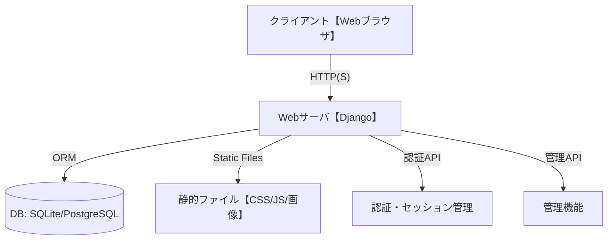

# システムアーキテクチャ設計 - Issue Tracking System

## メタデータ
- ドキュメントID: ARCH-001
- 作成日: 2025-09-16
- 作成者: GitHub Copilot
- プロジェクト: Issue Tracking System MVP
- 関連文書: ../step1/specification.md, ../step0/goal-statement.md

## 1. 全体構成図


## 2. レイヤー構造
| レイヤー | 主な役割 | 技術 | 備考 |
|----------|----------|------|------|
| プレゼンテーション | UI/UX表示 | HTML, CSS, Bootstrap, JS | Djangoテンプレート利用 |
| アプリケーション | 業務ロジック | Python, Django | MVC構造、View/Model分離 |
| データアクセス | DB操作 | Django ORM | SQLite(開発)/PostgreSQL(本番) |
| 認証・セッション | ユーザー認証 | Django Auth | 標準セッション管理 |
| 管理・運用 | 管理画面 | Django Admin | 権限管理・運用支援 |

## 3. 技術スタック
| 分類 | 技術 | バージョン | 用途 |
|------|------|-----------|------|
| バックエンド | Python | 3.9+ | サーバーサイド全般 |
| バックエンド | Django | 4.2+ | Webフレームワーク |
| フロントエンド | HTML5/CSS3 | - | UI/UX構築 |
| フロントエンド | Bootstrap | 5.x | レスポンシブデザイン |
| フロントエンド | JavaScript | ES6+ | 動的UI |
| データベース | SQLite | 3.x | 開発用DB |
| データベース | PostgreSQL | 12+ | 本番用DB |
| テスト | pytest | 7.x | 単体・統合テスト |
| テスト | Django TestCase | - | モデル・ビュー・フォームテスト |
| CI/CD | GitHub Actions | - | 自動テスト・デプロイ |

## 4. ディレクトリ構造
```
issue-tracker/
├── manage.py
├── requirements.txt
├── issue_tracker/
│   ├── __init__.py
│   ├── settings.py
│   ├── urls.py
│   └── wsgi.py
├── apps/
│   ├── users/
│   ├── projects/
│   └── issues/
├── templates/
├── static/
├── tests/
└── docs/
```

## 5. 外部サービス・連携
| サービス | 用途 | 備考 |
|----------|------|------|
| GitHub Actions | CI/CD | テスト・デプロイ自動化 |
| SendGrid等 | メール送信 | ユーザー登録・通知（Phase2以降） |

## 6. セキュリティ設計
| 項目 | 内容 | 備考 |
|------|------|------|
| 認証 | Django標準Auth | bcryptハッシュ化 |
| CSRF/XSS | Django標準保護 | テンプレート自動エスケープ |
| SQL Injection | Django ORM | パラメータ化クエリ |
| HTTPS | 本番環境で強制 | 開発はHTTP可 |
| 権限管理 | Django Admin | ロールベース管理 |

## 7. 完了確認チェックリスト
- [x] 全体構成図が作成されている
- [x] レイヤー構造が明確に定義されている
- [x] 技術スタックが網羅されている
- [x] ディレクトリ構造が設計されている
- [x] セキュリティ設計が明記されている
- [x] 標準テーブル・Mermaid記法が使用されている
- [x] STEP1成果物との整合性が確認されている

## 次のアクション
1. 技術選定・依存関係定義書の作成
2. STEP2品質ゲートでの検証準備
