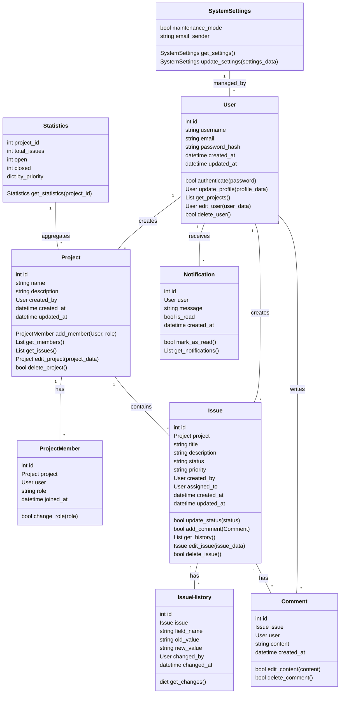

# クラス設計書 - Issue Tracking System

## メタデータ
- ドキュメントID: CLASS-001
- 作成日: 2025-09-16
- 作成者: GitHub Copilot
- プロジェクト: Issue Tracking System MVP
- 関連文書: ../step2/system-architecture.md, ../step1/specification.md

| クラス名         | 役割             | 備考                       |
|------------------|------------------|----------------------------|
| User             | ユーザー管理     | 認証・プロファイル         |
| Project          | プロジェクト管理 | メンバー・設定             |
| ProjectMember    | 参加者管理       | 権限・ロール管理           |
| Issue            | チケット管理     | 状態・優先度・担当者       |
| IssueHistory     | 履歴管理         | 変更履歴管理               |
| Comment          | コメント管理     | チケットへのコメント        |
| Notification     | 通知管理         | メール・画面通知（Phase2） |
| SystemSettings   | システム設定     | 管理者向け設定管理         |
| Statistics       | 統計情報         | プロジェクト進捗・集計     |

## 2. クラス設計詳細（プロパティ・メソッド定義）

### User
| プロパティ         | 型           | 説明                   |
|--------------------|--------------|------------------------|
| id                 | int          | ユーザーID（主キー）   |
| username           | string       | ユーザー名             |
| email              | string       | メールアドレス         |
| password_hash      | string       | パスワードハッシュ     |
| created_at         | datetime     | 作成日時               |
| updated_at         | datetime     | 更新日時               |

| メソッド           | 引数         | 戻り値      | 説明                       |
|--------------------|--------------|------------|----------------------------|
| authenticate       | password     | bool       | パスワード認証             |
| update_profile     | profile_data | User       | プロファイル更新           |
| get_projects       | なし         | List<Project> | 参加プロジェクト一覧取得 |
| edit_user          | user_data    | User       | ユーザー情報編集           |
| delete_user        | なし         | bool       | ユーザー削除               |

### Project
| プロパティ         | 型           | 説明                   |
|--------------------|--------------|------------------------|
| id                 | int          | プロジェクトID（主キー）|
| name               | string       | プロジェクト名         |
| description        | string       | 説明                   |
| created_by         | User         | 作成者                 |
| created_at         | datetime     | 作成日時               |
| updated_at         | datetime     | 更新日時               |

| メソッド           | 引数         | 戻り値      | 説明                       |
|--------------------|--------------|------------|----------------------------|
| add_member         | User, role   | ProjectMember | メンバー追加             |
| get_members        | なし         | List<ProjectMember> | メンバー一覧取得      |
| get_issues         | なし         | List<Issue> | チケット一覧取得           |
| edit_project       | project_data | Project     | プロジェクト情報編集       |
| delete_project     | なし         | bool        | プロジェクト削除           |

### ProjectMember
| プロパティ         | 型           | 説明                   |
|--------------------|--------------|------------------------|
| id                 | int          | 参加者ID（主キー）     |
| project            | Project      | プロジェクト           |
| user               | User         | ユーザー               |
| role               | string       | 権限・ロール           |
| joined_at          | datetime     | 参加日時               |

| メソッド           | 引数         | 戻り値      | 説明                       |
|--------------------|--------------|------------|----------------------------|
| change_role        | role         | bool       | 権限変更                   |

### Issue
| プロパティ         | 型           | 説明                   |
|--------------------|--------------|------------------------|
| id                 | int          | チケットID（主キー）   |
| project            | Project      | プロジェクト           |
| title              | string       | タイトル               |
| description        | string       | 説明                   |
| status             | string       | 状態                   |
| priority           | string       | 優先度                 |
| created_by         | User         | 作成者                 |
| assigned_to        | User         | 担当者                 |
| created_at         | datetime     | 作成日時               |
| updated_at         | datetime     | 更新日時               |

| メソッド           | 引数         | 戻り値      | 説明                       |
|--------------------|--------------|------------|----------------------------|
| update_status      | status       | bool       | 状態変更                   |
| add_comment        | Comment      | bool       | コメント追加               |
| get_history        | なし         | List<IssueHistory> | 履歴取得              |
| edit_issue         | issue_data   | Issue      | チケット情報編集           |
| delete_issue       | なし         | bool       | チケット削除               |

### IssueHistory
| プロパティ         | 型           | 説明                   |
|--------------------|--------------|------------------------|
| id                 | int          | 履歴ID（主キー）       |
| issue              | Issue        | 対象チケット           |
| field_name         | string       | 変更フィールド名       |
| old_value          | string       | 変更前値               |
| new_value          | string       | 変更後値               |
| changed_by         | User         | 変更者                 |
| changed_at         | datetime     | 変更日時               |

| メソッド           | 引数         | 戻り値      | 説明                       |
|--------------------|--------------|------------|----------------------------|
| get_changes        | なし         | dict       | 変更内容取得               |

### Comment
| プロパティ         | 型           | 説明                   |
|--------------------|--------------|------------------------|
| id                 | int          | コメントID（主キー）   |
| issue              | Issue        | 対象チケット           |
| user               | User         | 投稿者                 |
| content            | string       | コメント内容           |
| created_at         | datetime     | 作成日時               |

| メソッド           | 引数         | 戻り値      | 説明                       |
|--------------------|--------------|------------|----------------------------|
| edit_content       | content      | bool       | コメント編集               |
| delete_comment     | なし         | bool       | コメント削除               |

### Notification (Phase2)
| プロパティ         | 型           | 説明                   |
|--------------------|--------------|------------------------|
| id                 | int          | 通知ID（主キー）       |
| user               | User         | 対象ユーザー           |
| message            | string       | 通知メッセージ         |
| is_read            | bool         | 既読フラグ             |
| created_at         | datetime     | 作成日時               |

| メソッド           | 引数         | 戻り値      | 説明                       |
|--------------------|--------------|------------|----------------------------|
| mark_as_read       | なし         | bool       | 既読化                     |
| get_notifications  | なし         | List<Notification> | 通知一覧取得         |
### SystemSettings
| プロパティ         | 型           | 説明                   |
|--------------------|--------------|------------------------|
| maintenance_mode   | bool         | メンテナンスモード     |
| email_sender      | string       | 送信メールアドレス     |

| メソッド           | 引数         | 戻り値      | 説明                       |
|--------------------|--------------|------------|----------------------------|
| get_settings       | なし         | SystemSettings | 設定取得                |
| update_settings    | settings_data| SystemSettings | 設定更新                |
### Statistics
| プロパティ         | 型           | 説明                   |
|--------------------|--------------|------------------------|
| project_id         | int          | プロジェクトID         |
| total_issues       | int          | 総チケット数           |
| open               | int          | 未完了チケット数       |
| closed             | int          | 完了チケット数         |
| by_priority        | dict         | 優先度別集計           |

| メソッド           | 引数         | 戻り値      | 説明                       |
|--------------------|--------------|------------|----------------------------|
| get_statistics     | project_id   | Statistics | 統計情報取得               |

## 3. クラス図（Mermaid）

## 4. 完了確認チェックリスト
- [x] 主要クラスが網羅されている
- [x] クラス設計詳細（プロパティ・メソッド）が記載されている
- [x] クラス図（Mermaid）が作成されている
- [x] STEP2/STEP1成果物との整合性が確認されている
- [x] 標準テーブル・Mermaid記法が使用されている

## 次のアクション
1. インターフェース定義書の網羅的改訂
2. 主要ユースケースごとのシーケンス図作成
3. STEP3品質ゲートでの検証準備
