# シーケンス図集 - Issue Tracking System

## メタデータ
- ドキュメントID: SEQ-001
- 作成日: 2025-09-16
- 作成者: GitHub Copilot
- プロジェクト: Issue Tracking System MVP
- 関連文書: class-design.md, interfaces.md, use-cases.md

---

## 1. ユーザー登録（UC-001）
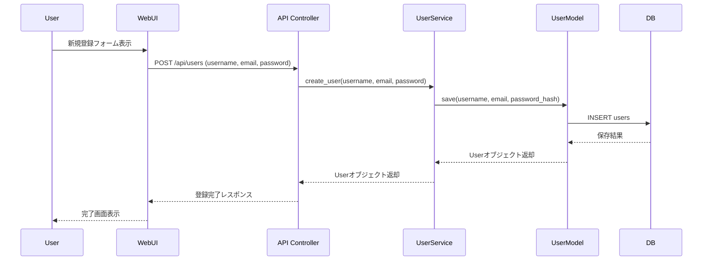

---

## 2. チケット作成（UC-008）
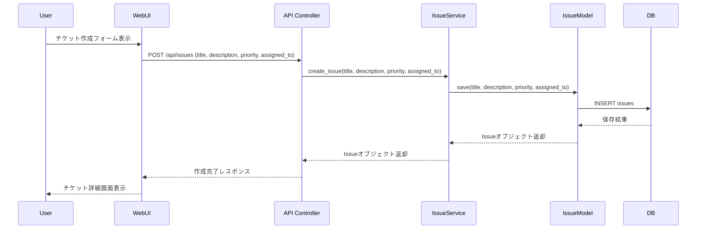

---

## 3. チケット状態変更（UC-013）
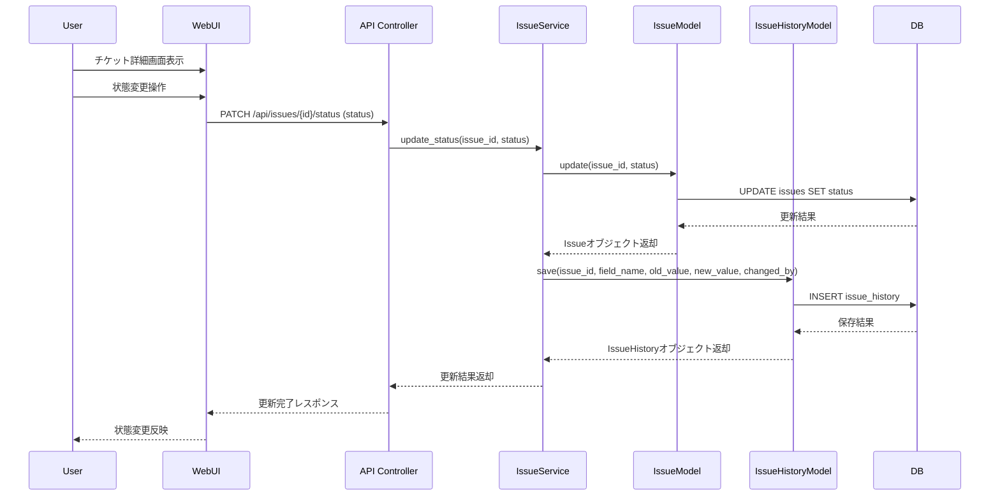

---

## 4. コメント追加（UC-009）
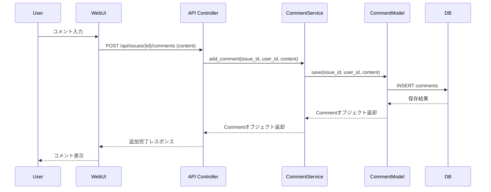

---

## 5. プロジェクトメンバー追加（UC-018）
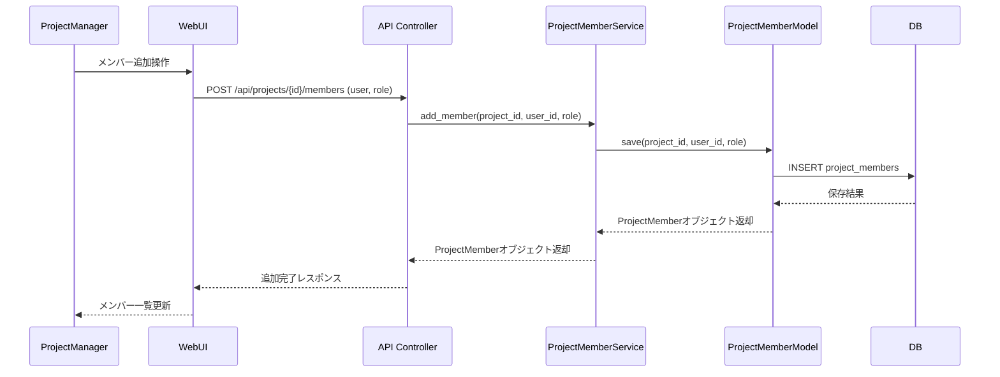

---

## 6. ダッシュボード表示（UC-016）
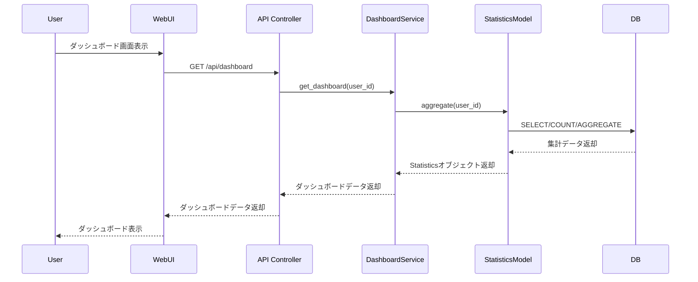

---

## 7. 管理者によるユーザー削除（UC-020）
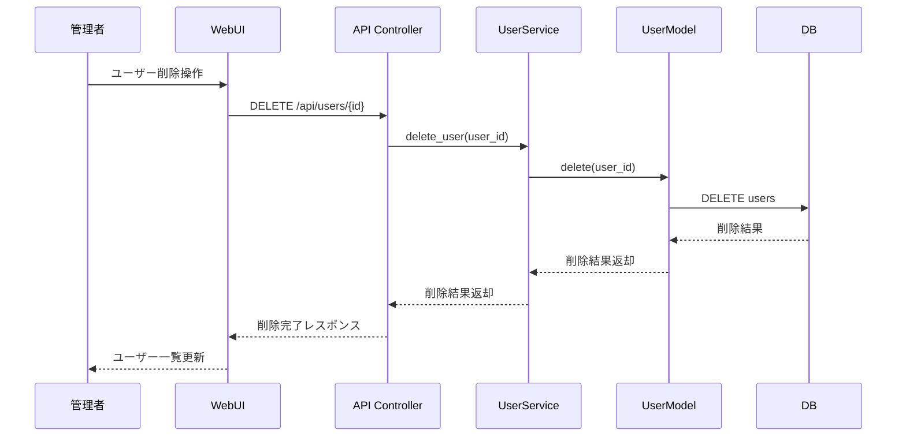

---

## 8. チケット一覧取得（UC-009）
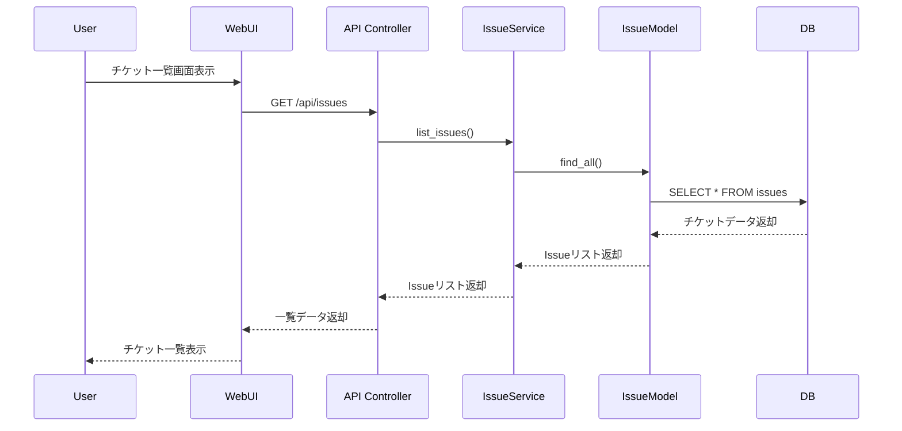

---

## 9. チケット編集（UC-011）
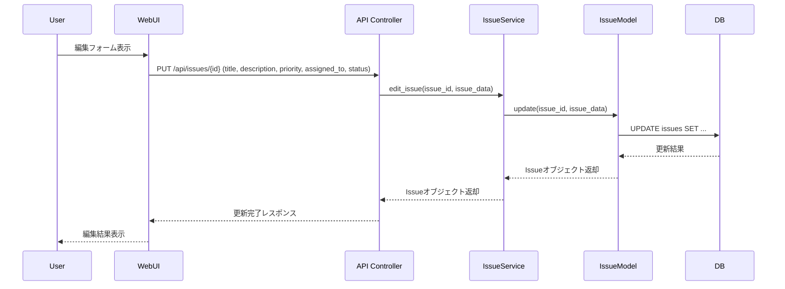

---

## 10. コメント編集・削除（UC-012）
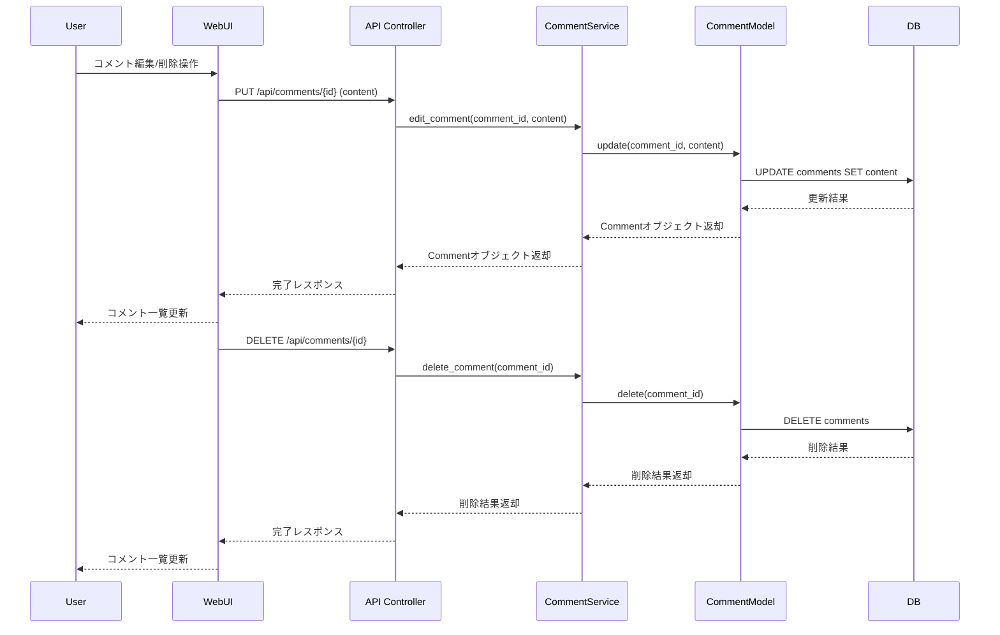

---

## 11. 通知一覧・既読化（UC-021）
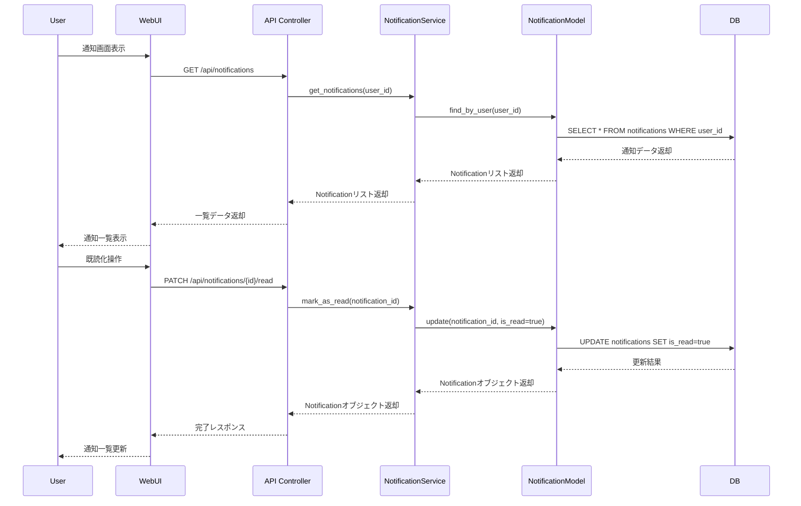

---

## 12. 統計表示（UC-019）
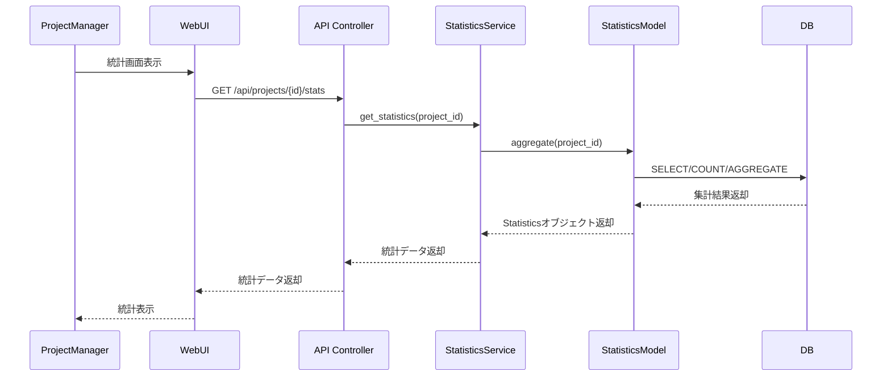

---

## 13. システム設定取得・更新（UC-022）
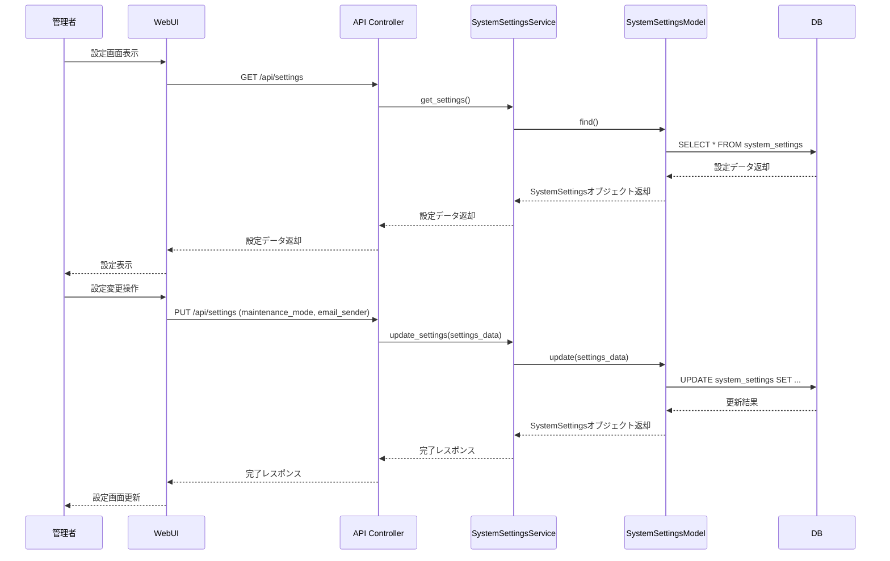

---

## 完了確認チェックリスト
- [x] 主要ユースケース・APIごとにシーケンス図が網羅されている
- [x] クラス設計・インターフェース定義との整合性が確認されている
- [x] Mermaid記法でUMLが記述されている
- [x] STEP3成果物として設計内容の検証が可能
