# UIレイアウト設計書 - Issue Tracking System

## メタデータ
| 項目 | 内容 |
|------|------|
| 文書ID | UI-LAYOUT-001 |
| 関連文書 | specification.md, use-cases.md, system-architecture.md, ui-test-design.md |
| 作成日 | 2025-09-19 |
| 最終更新日 | 2025-09-19 |
| 作成者 | GitHub Copilot |
| 承認者 | [待ちユーザーレビュー] |
| バージョン | 1.0 |
| ステータス | ドラフト |

---

## 1. 設計方針

### 1.1 基本方針
| 項目 | 方針 |
|------|------|
| デザインシステム | Bootstrap 5 + カスタムCSS |
| レスポンシブ対応 | モバイルファースト（320px～1920px対応） |
| アクセシビリティ | WCAG 2.1 AA準拠 |
| ブラウザ対応 | Chrome, Firefox, Safari, Edge 最新2バージョン |
| カラーテーマ | 青基調のモダンUI（プライマリ: #007bff） |
| フォント | システムフォント（-apple-system, BlinkMacSystemFont） |

### 1.2 共通UI原則
- **一貫性**: 全画面で統一されたコンポーネント使用
- **直感性**: ユーザーが迷わないシンプルなナビゲーション  
- **効率性**: 最小クリック数でタスク完了
- **フィードバック**: 全ユーザーアクションに適切な応答表示

### 1.3 画面分類
| 分類 | 説明 | 画面数 | レイアウト種別 |
|------|------|--------|--------------|
| 認証画面 | ログイン・登録 | 2 | 認証レイアウト |
| メイン機能画面 | 業務機能 | 6 | アプリケーションレイアウト |
| 管理画面 | システム管理・設定 | 2 | アプリケーションレイアウト |
| エラー画面 | エラー・404・メンテナンス | 3 | シンプルレイアウト |

---

## 2. 画面一覧・URL設計

### 2.1 認証関連画面
| 画面ID | 画面名 | URL | 関連UC | アクター | 説明 |
|--------|--------|-----|--------|----------|------|
| SC-001 | ログイン画面 | /login | UC-002 | 全ユーザー | ユーザー認証 |
| SC-002 | ユーザー登録画面 | /register | UC-001 | 未登録ユーザー | 新規ユーザー登録 |

### 2.2 メイン機能画面
| 画面ID | 画面名 | URL | 関連UC | アクター | 説明 |
|--------|--------|-----|--------|----------|------|
| SC-003 | ダッシュボード | /dashboard | UC-016 | 認証ユーザー | 概要・統計表示 |
| SC-004 | チケット一覧画面 | /issues | UC-009 | 認証ユーザー | チケット検索・一覧 |
| SC-005 | チケット詳細画面 | /issues/{id} | UC-010 | 認証ユーザー | チケット詳細表示 |
| SC-006 | チケット作成・編集画面 | /issues/new, /issues/{id}/edit | UC-008, UC-011 | 認証ユーザー | チケット作成・編集 |
| SC-007 | ユーザー管理画面 | /users | UC-020 | 管理者 | ユーザー管理・一覧 |
| SC-008 | 通知一覧画面 | /notifications | UC-021 | 認証ユーザー | 通知確認・管理 |

### 2.3 管理・設定画面
| 画面ID | 画面名 | URL | 関連UC | アクター | 説明 |
|--------|--------|-----|--------|----------|------|
| SC-009 | システム設定画面 | /settings | UC-022 | 管理者 | システム設定管理 |
| SC-010 | 統計情報画面 | /stats | UC-019 | PM・管理者 | プロジェクト統計表示 |

### 2.4 エラー・システム画面
| 画面ID | 画面名 | URL | 関連UC | アクター | 説明 |
|--------|--------|-----|--------|----------|------|
| SC-011 | 404エラー画面 | /404 | - | 全ユーザー | ページ未発見 |
| SC-012 | 500エラー画面 | /500 | - | 全ユーザー | サーバーエラー |
| SC-013 | メンテナンス画面 | /maintenance | - | 全ユーザー | メンテナンス中表示 |

---

## 3. UIコンポーネント設計

### 3.1 共通コンポーネント
| コンポーネントID | コンポーネント名 | 説明 | 使用画面 | Bootstrap Class |
|------------------|------------------|------|----------|----------------|
| CP-001 | アプリヘッダー | ログイン状態・メニュー表示 | 認証後全画面 | navbar, navbar-expand-lg |
| CP-002 | サイドナビゲーション | 主要機能へのナビゲーション | メイン機能画面 | nav, nav-pills |
| CP-003 | アプリフッター | 著作権・リンク情報 | 全画面 | footer, text-center |
| CP-004 | パンくずナビ | 現在位置表示 | 詳細・編集画面 | breadcrumb |
| CP-005 | アラート・通知 | 成功・エラーメッセージ | 全画面 | alert, alert-success |

### 3.2 フォームコンポーネント
| コンポーネントID | コンポーネント名 | 説明 | 使用画面 | Bootstrap Class |
|------------------|------------------|------|----------|----------------|
| FC-001 | テキスト入力フィールド | 単行テキスト入力 | フォーム画面 | form-control |
| FC-002 | テキストエリア | 複数行テキスト入力 | チケット作成・編集 | form-control |
| FC-003 | セレクトボックス | 選択肢から選択 | フォーム画面 | form-select |
| FC-004 | チェックボックス | 複数選択 | 設定画面 | form-check-input |
| FC-005 | ラジオボタン | 単一選択 | フォーム画面 | form-check-input |
| FC-006 | ファイルアップロード | ファイル選択 | チケット作成・編集 | form-control |
| FC-007 | 日付ピッカー | 日付選択 | チケット作成・編集 | form-control |

### 3.3 データ表示コンポーネント
| コンポーネントID | コンポーネント名 | 説明 | 使用画面 | Bootstrap Class |
|------------------|------------------|------|----------|----------------|
| DC-001 | データテーブル | ソート・ページング付きテーブル | 一覧画面 | table, table-striped |
| DC-002 | カードリスト | カード形式データ表示 | ダッシュボード | card, card-body |
| DC-003 | ステータスバッジ | 状態表示バッジ | チケット一覧・詳細 | badge, bg-primary |
| DC-004 | プログレスバー | 進捗表示 | ダッシュボード・統計 | progress, progress-bar |
| DC-005 | アバター | ユーザーアイコン | 全画面 | rounded-circle |

### 3.4 アクションコンポーネント
| コンポーネントID | コンポーネント名 | 説明 | 使用画面 | Bootstrap Class |
|------------------|------------------|------|----------|----------------|
| AC-001 | プライマリボタン | 主要アクション | 全画面 | btn, btn-primary |
| AC-002 | セカンダリボタン | 副次アクション | 全画面 | btn, btn-outline-secondary |
| AC-003 | 危険ボタン | 削除等危険アクション | 詳細・一覧画面 | btn, btn-danger |
| AC-004 | ドロップダウンメニュー | アクション選択 | 一覧・詳細画面 | dropdown, btn-group |
| AC-005 | ツールチップ | 説明・ヘルプ表示 | 全画面 | tooltip |

---

## 4. 画面遷移設計

### 4.1 全体遷移フロー
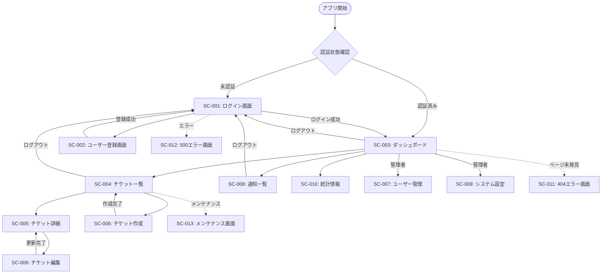

### 4.2 認証フロー詳細
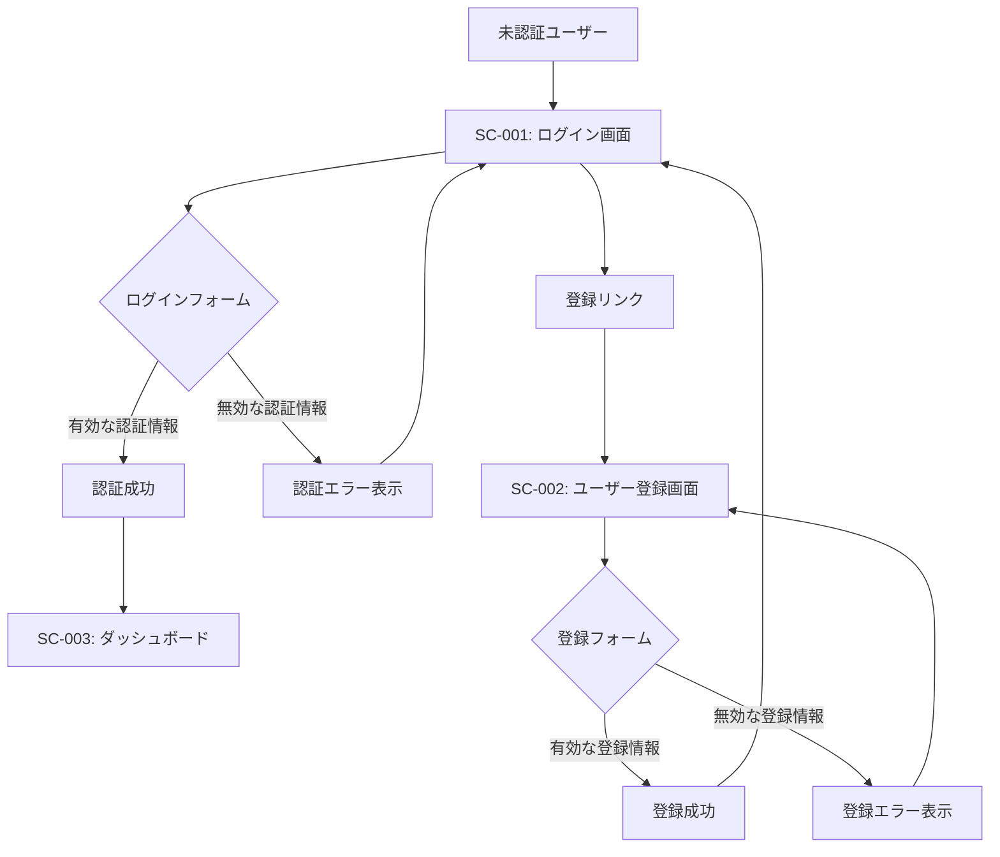

---

## 5. レイアウト構成設計

### 5.1 認証画面レイアウト
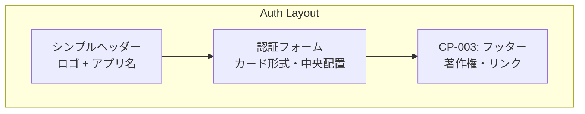

**レイアウト詳細**:
- **幅**: 最大400px、中央配置
- **カード**: Bootstrap card、影付き
- **背景**: グラデーション背景
- **レスポンシブ**: モバイルで全幅、余白調整

### 5.2 アプリケーション画面レイアウト（認証後）
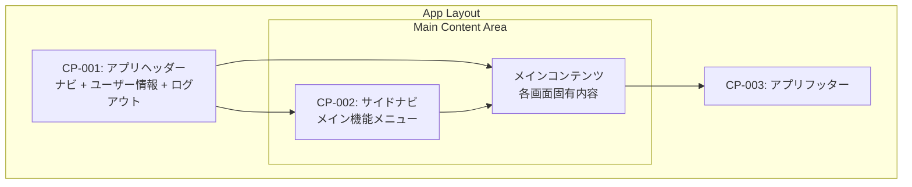

**レイアウト詳細**:
- **ヘッダー**: 固定、高さ64px
- **サイドバー**: 折りたたみ可能、幅250px
- **メインコンテンツ**: 残り全幅、スクロール可能
- **フッター**: 固定底部

### 5.3 モバイルレスポンシブ対応
| ブレークポイント | 画面サイズ | サイドバー | ヘッダー | コンテンツ |
|------------------|------------|------------|----------|------------|
| xs | <576px | 隠す（ハンバーガー） | 固定・簡略 | 全幅 |
| sm | 576px-768px | 隠す（ハンバーガー） | 固定 | 全幅 |
| md | 768px-992px | 表示（固定） | 固定 | 残り幅 |
| lg | 992px-1200px | 表示（固定） | 固定 | 残り幅 |
| xl | >1200px | 表示（固定） | 固定 | 残り幅 |

---

## 6. 個別画面詳細設計

### 6.1 SC-001: ログイン画面
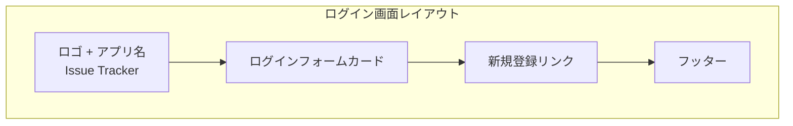

**コンポーネント構成**:
```html
<!-- 想定HTML構造 -->
<div class="auth-layout">
  <header class="auth-header">
    <h1 class="logo">Issue Tracker</h1>
  </header>
  <main class="auth-main">
    <div class="card auth-card">
      <div class="card-body">
        <h2 class="card-title">ログイン</h2>
        <form>
          <div class="mb-3">
            <label for="username" class="form-label">ユーザー名</label>
            <input type="text" class="form-control" id="username" required>
          </div>
          <div class="mb-3">
            <label for="password" class="form-label">パスワード</label>
            <input type="password" class="form-control" id="password" required>
          </div>
          <div class="mb-3 form-check">
            <input type="checkbox" class="form-check-input" id="remember">
            <label class="form-check-label" for="remember">ログイン状態を保持</label>
          </div>
          <button type="submit" class="btn btn-primary w-100">ログイン</button>
        </form>
        <hr>
        <p class="text-center mb-0">
          <a href="/register" class="text-decoration-none">新規アカウント作成</a>
        </p>
      </div>
    </div>
  </main>
  <footer class="auth-footer">
    <p>&copy; 2025 Issue Tracker. All rights reserved.</p>
  </footer>
</div>
```

**スタイル仕様**:
- **カード幅**: 400px（max-width）
- **入力フィールド**: Bootstrap form-control
- **ボタン**: 全幅プライマリボタン
- **背景**: グラデーション（#007bff → #6c757d）

### 6.2 SC-002: ユーザー登録画面
**ログイン画面と同様のレイアウト**、フォーム内容のみ変更:
- ユーザー名、メールアドレス、パスワード、パスワード確認
- 利用規約同意チェックボックス
- 登録ボタン + ログインページリンク

### 6.3 SC-003: ダッシュボード
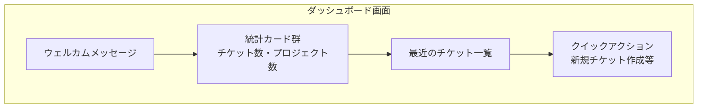

**コンポーネント構成**:
- **統計カード**: 3列グリッド（Col-4）
- **最近のチケット**: テーブル形式、5件表示
- **クイックアクション**: ボタングループ

### 6.4 SC-004: チケット一覧画面
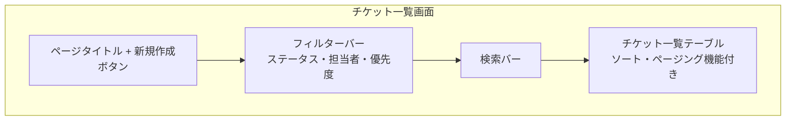

**テーブル列設計**:
| 列名 | 幅 | ソート | 説明 |
|------|-----|-------|------|
| ID | 80px | ○ | チケット番号 |
| タイトル | 300px | ○ | チケットタイトル（リンク） |
| ステータス | 100px | ○ | バッジ表示 |
| 優先度 | 100px | ○ | バッジ表示 |
| 担当者 | 120px | ○ | ユーザー名 |
| 作成日 | 120px | ○ | yyyy-mm-dd |
| アクション | 100px | × | 編集・削除ボタン |

### 6.5 SC-005: チケット詳細画面
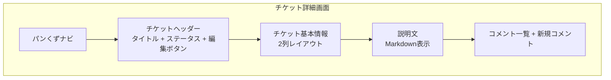

**情報表示レイアウト**:
- **左列**: ID、ステータス、優先度、作成者、作成日
- **右列**: 担当者、締切日、プロジェクト、ラベル
- **説明**: 全幅、Markdown レンダリング
- **コメント**: 時系列表示、新規投稿フォーム

### 6.6 SC-006: チケット作成・編集画面
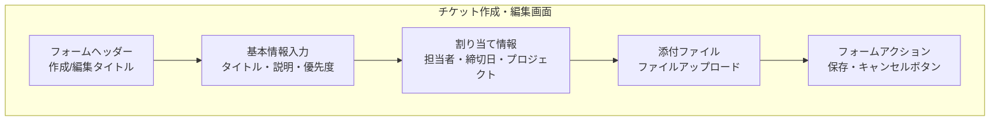

**フォーム構成**:
- **必須項目**: タイトル、説明、優先度
- **任意項目**: 担当者、締切日、プロジェクト、ラベル、添付ファイル
- **バリデーション**: クライアント側 + サーバー側
- **保存形式**: 下書き保存 + 完了保存

### 6.7 SC-007: ユーザー管理画面
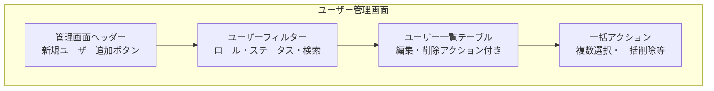

### 6.8 SC-008: 通知一覧画面
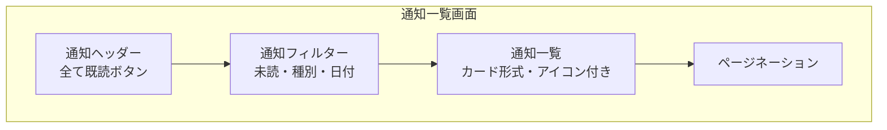

### 6.9 SC-009: システム設定画面
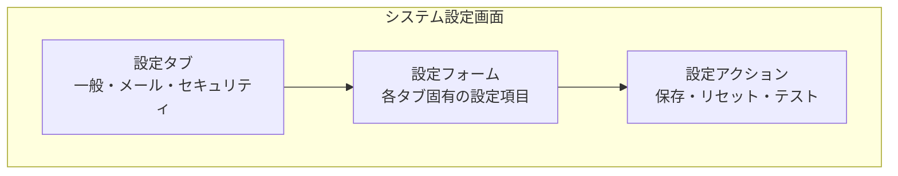

### 6.10 SC-010: 統計情報画面
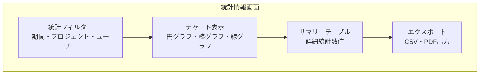

---

## 7. カラーパレット・スタイルガイド

### 7.1 カラーパレット
| 用途 | カラー名 | HEX | Bootstrap Class | 使用箇所 |
|------|----------|-----|-----------------|----------|
| プライマリ | Blue | #007bff | btn-primary, bg-primary | メインボタン・アクセント |
| セカンダリ | Gray | #6c757d | btn-secondary, bg-secondary | 副次ボタン・テキスト |
| 成功 | Green | #28a745 | btn-success, bg-success | 成功メッセージ・完了 |
| 警告 | Yellow | #ffc107 | btn-warning, bg-warning | 警告・注意 |
| 危険 | Red | #dc3545 | btn-danger, bg-danger | エラー・削除 |
| 情報 | Light Blue | #17a2b8 | btn-info, bg-info | 情報・通知 |
| 明るい背景 | Light | #f8f9fa | bg-light | カード背景 |
| 暗い背景 | Dark | #343a40 | bg-dark | ヘッダー・フッター |

### 7.2 タイポグラフィ
| 要素 | フォントサイズ | フォントウェイト | 行間 | 用途 |
|------|---------------|----------------|------|------|
| H1 | 2.5rem (40px) | 700 | 1.2 | ページタイトル |
| H2 | 2rem (32px) | 600 | 1.3 | セクションタイトル |
| H3 | 1.75rem (28px) | 600 | 1.4 | サブセクション |
| H4 | 1.5rem (24px) | 500 | 1.4 | カードタイトル |
| Body | 1rem (16px) | 400 | 1.6 | 本文 |
| Small | 0.875rem (14px) | 400 | 1.5 | 補助テキスト |
| Caption | 0.75rem (12px) | 400 | 1.4 | キャプション・ラベル |

### 7.3 スペーシング
| サイズ | 値 | Bootstrap Class | 用途 |
|-------|-----|----------------|------|
| XS | 0.25rem (4px) | p-1, m-1 | 細かい調整 |
| SM | 0.5rem (8px) | p-2, m-2 | 要素間の狭いスペース |
| MD | 1rem (16px) | p-3, m-3 | 標準スペース |
| LG | 1.5rem (24px) | p-4, m-4 | セクション間 |
| XL | 3rem (48px) | p-5, m-5 | ページ間・大きな区切り |

---

## 8. アクセシビリティ・ユーザビリティ

### 8.1 アクセシビリティ対応
- **キーボードナビゲーション**: 全機能をキーボードのみで操作可能
- **スクリーンリーダー対応**: 適切なARIA属性・alt属性設定
- **コントラスト比**: WCAG AA基準（4.5:1）以上
- **フォーカス表示**: 明確なフォーカス状態表示
- **エラーメッセージ**: 具体的で理解しやすいメッセージ

### 8.2 ユーザビリティ原則
- **直感的ナビゲーション**: 3クリック以内で目的達成
- **一貫性**: 同じ操作は同じ場所・同じ方法
- **フィードバック**: 全アクションに対する明確な応答
- **エラー防止**: バリデーション・確認ダイアログ
- **効率性**: ショートカット・バッチ処理対応

---

## 9. 技術仕様・制約

### 9.1 技術制約
- **フレームワーク**: Bootstrap 5.3.x必須
- **JavaScript**: ES6+、jQuery依存なし
- **CSS**: CSS3、プリプロセッサ不使用
- **アイコン**: Bootstrap Icons推奨
- **フォント**: システムフォント優先

### 9.2 パフォーマンス要件
- **初期読み込み**: 3秒以内
- **画面遷移**: 1秒以内
- **API応答**: 2秒以内でローディング表示
- **ファイルサイズ**: CSS 100KB以下、JS 200KB以下

### 9.3 ブラウザ対応
| ブラウザ | 対応バージョン | 備考 |
|----------|----------------|------|
| Chrome | 最新2バージョン | フルサポート |
| Firefox | 最新2バージョン | フルサポート |
| Safari | 最新2バージョン | フルサポート |
| Edge | 最新2バージョン | フルサポート |

---

## 10. 完了確認チェックリスト

### 10.1 設計完了確認
- [x] 全画面のワイヤーフレームが定義されている
- [x] UIコンポーネントが体系的に整理されている
- [x] 画面遷移フローが明確に定義されている
- [x] レスポンシブ対応が設計されている
- [x] カラーパレット・スタイルガイドが定義されている
- [x] アクセシビリティ要件が明記されている
- [x] 技術制約・パフォーマンス要件が明記されている

### 10.2 一貫性確認
- [x] 全画面でコンポーネント使用が統一されている
- [x] 画面間の遷移が論理的である
- [x] UIパターンが一貫している
- [x] 用語・文言が統一されている

### 10.3 完成度確認
- [x] ユースケースとの整合性が確認されている
- [x] 技術仕様との整合性が確認されている
- [x] 実装可能性が検証されている
- [x] ユーザビリティが考慮されている

---

## 次のアクション

1. **ユーザーレビュー実施**
2. **フィードバック反映・修正**
3. **最終版確定・承認**
4. **実装作業開始**

---

**作成完了**: このUIレイアウト設計書は、Issue Tracker システムの全画面設計を網羅し、実装に必要な詳細情報を提供します。ユーザーレビューをお待ちしております。