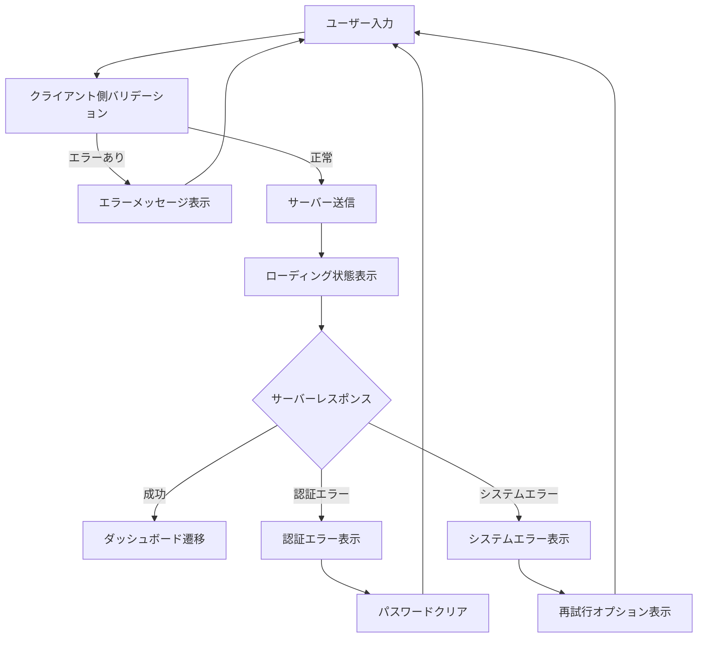

# ログイン画面UIワイヤーフレーム設計書

## メタデータ

| 項目 | 内容 |
|------|------|
| 画面ID | SC-001 |
| 画面名 | ログイン画面 |
| URL | /login |
| 関連UC | UC-002 (ユーザーログイン) |
| 対象ユーザー | 未認証ユーザー |
| 作成日 | 2025-09-19 |
| バージョン | 1.0 |
| ステータス | ドラフト |

---

## 画面概要

**目的**: ユーザーがシステムにログインする際の認証画面

**機能要件**:

- ユーザー名・パスワード入力
- ログイン状態保持オプション
- 新規登録ページへの誘導
- エラーメッセージ表示
- レスポンシブ対応

---

## ワイヤーフレーム設計

### デスクトップ版（1200px以上）

```
┌─────────────────────────────────────────────────────┐
│                   Issue Tracker                     │ ← ロゴ・アプリ名
│                                                     │
│                                                     │
│        ┌─────────────────────────────┐              │
│        │        ログイン            │              │ ← カードタイトル
│        │                             │              │
│        │  ユーザー名                │              │
│        │  [_______________]          │              │ ← 入力フィールド
│        │                             │              │
│        │  パスワード                │              │
│        │  [_______________]          │              │ ← 入力フィールド（マスク）
│        │                             │              │
│        │  □ ログイン状態を保持      │              │ ← チェックボックス
│        │                             │              │
│        │     [ログイン]             │              │ ← プライマリボタン
│        │                             │              │
│        │  ─────────────────────      │              │ ← 区切り線
│        │                             │              │
│        │   新規アカウント作成        │              │ ← リンク（中央揃え）
│        └─────────────────────────────┘              │
│                                                     │
│                                                     │
│         © 2025 Issue Tracker. All rights reserved.  │ ← フッター
└─────────────────────────────────────────────────────┘
```

### タブレット版（768px-1199px）

```
┌─────────────────────────────┐
│      Issue Tracker         │ ← ロゴ・アプリ名
│                             │
│   ┌───────────────────────┐ │
│   │      ログイン        │ │ ← カードタイトル
│   │                       │ │
│   │  ユーザー名          │ │
│   │  [_____________]      │ │
│   │                       │ │
│   │  パスワード          │ │
│   │  [_____________]      │ │
│   │                       │ │
│   │  □ ログイン状態保持  │ │
│   │                       │ │
│   │    [ログイン]        │ │
│   │                       │ │
│   │  ─────────────────    │ │
│   │                       │ │
│   │  新規アカウント作成   │ │
│   └───────────────────────┘ │
│                             │
│  © 2025 Issue Tracker.     │
└─────────────────────────────┘
```

### モバイル版（768px未満）

```
┌─────────────────┐
│  Issue Tracker  │ ← ロゴ（小）
│                 │
│ ┌─────────────┐ │
│ │   ログイン   │ │
│ │             │ │
│ │ ユーザー名  │ │
│ │ [_________] │ │
│ │             │ │
│ │ パスワード  │ │
│ │ [_________] │ │
│ │             │ │
│ │□ 状態保持  │ │
│ │             │ │
│ │ [ログイン]  │ │
│ │             │ │
│ │ ───────────  │ │
│ │             │ │
│ │新規アカウント│ │
│ │   作成      │ │
│ └─────────────┘ │
│                 │
│ © 2025 Issue    │
│   Tracker       │
└─────────────────┘
```

---

## 要素詳細仕様

### レイアウト構造

```html
<div class="auth-layout">
  <header class="auth-header">
    <h1 class="logo">Issue Tracker</h1>
  </header>
  
  <main class="auth-main">
    <div class="container">
      <div class="row justify-content-center">
        <div class="col-md-6 col-lg-4">
          <div class="card shadow auth-card">
            <div class="card-body">
              <!-- フォーム内容 -->
            </div>
          </div>
        </div>
      </div>
    </div>
  </main>
  
  <footer class="auth-footer">
    <!-- フッター内容 -->
  </footer>
</div>
```

### スタイル仕様

| 要素 | 詳細仕様 |
|------|----------|
| **背景** | グラデーション: linear-gradient(135deg, #667eea 0%, #764ba2 100%) |
| **ロゴ** | フォントサイズ: 2.5rem, 色: white, 中央揃え |
| **カード** | 最大幅: 400px, 影: box-shadow 0 10px 25px rgba(0,0,0,0.1) |
| **入力フィールド** | Bootstrap form-control, 高さ: 45px |
| **ログインボタン** | Bootstrap btn-primary, 全幅, 高さ: 45px |
| **リンク** | 色: #007bff, ホバー時下線表示 |

### レスポンシブ対応

| ブレークポイント | カード幅 | マージン | フォントサイズ調整 |
|------------------|----------|----------|-------------------|
| xs (<576px) | 95vw | 10px | ロゴ: 2rem |
| sm (576-768px) | 90vw | 15px | ロゴ: 2.2rem |
| md (768-992px) | 500px | 20px | ロゴ: 2.5rem |
| lg (992px+) | 400px | auto | ロゴ: 2.5rem |

---

## 機能仕様

### フォームバリデーション

**クライアント側バリデーション**:

```javascript
// 入力値検証ルール
const validationRules = {
  username: {
    required: true,
    minLength: 3,
    maxLength: 30,
    pattern: /^[a-zA-Z0-9_]+$/
  },
  password: {
    required: true,
    minLength: 6,
    maxLength: 128
  }
};
```

**バリデーションメッセージ**:

| フィールド | エラー条件 | メッセージ |
|------------|------------|------------|
| ユーザー名 | 空欄 | ユーザー名を入力してください |
| ユーザー名 | 3文字未満 | ユーザー名は3文字以上で入力してください |
| ユーザー名 | 不正文字 | ユーザー名は英数字とアンダースコアのみ使用可能です |
| パスワード | 空欄 | パスワードを入力してください |
| パスワード | 6文字未満 | パスワードは6文字以上で入力してください |

### 状態管理

**ログインフォーム状態**:

```javascript
const loginFormState = {
  username: '',
  password: '',
  rememberMe: false,
  isSubmitting: false,
  errors: {},
  submitAttempted: false
};
```

### エラーハンドリング

**サーバーエラーレスポンス対応**:

| HTTPステータス | メッセージ表示 | 対応 |
|----------------|--------------|------|
| 400 | "入力内容に誤りがあります" | 具体的なフィールドエラー表示 |
| 401 | "ユーザー名またはパスワードが間違っています" | フォームのリセット |
| 429 | "ログイン試行回数が上限に達しました。しばらくしてからお試しください" | フォーム無効化 |
| 500 | "システムエラーが発生しました。管理者にお問い合わせください" | 再試行ボタン表示 |

---

## アクセシビリティ仕様

### キーボードナビゲーション

| 順序 | 要素 | Tab Index | 説明 |
|------|------|-----------|------|
| 1 | ユーザー名入力 | 1 | 最初のフォーカス |
| 2 | パスワード入力 | 2 | Enter でログインボタンに移動 |
| 3 | ログイン状態保持 | 3 | チェックボックス |
| 4 | ログインボタン | 4 | Enter でフォーム送信 |
| 5 | 新規登録リンク | 5 | Enter で画面遷移 |

### スクリーンリーダー対応

```html
<!-- ARIA属性設定例 -->
<form role="form" aria-labelledby="login-title">
  <h2 id="login-title" class="sr-only">ログインフォーム</h2>
  
  <div class="mb-3">
    <label for="username" class="form-label">ユーザー名</label>
    <input 
      type="text" 
      class="form-control" 
      id="username" 
      name="username"
      aria-required="true"
      aria-describedby="username-error"
      autocomplete="username"
    >
    <div id="username-error" class="invalid-feedback" aria-live="polite"></div>
  </div>
</form>
```

### コントラスト・可読性

| 要素 | 前景色 | 背景色 | コントラスト比 | WCAG準拠 |
|------|--------|--------|---------------|----------|
| 入力フィールドテキスト | #212529 | #ffffff | 16.75:1 | AAA |
| エラーメッセージ | #dc3545 | #ffffff | 5.14:1 | AA |
| リンクテキスト | #0056b3 | #ffffff | 7.00:1 | AAA |
| ボタンテキスト | #ffffff | #007bff | 4.59:1 | AA |

---

## 動作・遷移仕様

### フォーム送信フロー



### ページ遷移パターン

| 操作 | 遷移先 | 条件 | 動作 |
|------|--------|------|------|
| ログイン成功 | /dashboard | 認証成功 | リダイレクト |
| 新規登録リンククリック | /register | - | 画面遷移 |
| パスワード忘れ（将来対応） | /forgot-password | - | 画面遷移 |
| 既にログイン済み | /dashboard | セッション存在 | 自動リダイレクト |

---

## テスト観点

### 表示テスト

- [ ] デスクトップでの正常表示
- [ ] タブレットでの正常表示  
- [ ] モバイルでの正常表示
- [ ] 各ブラウザでの表示確認
- [ ] 高DPI画面での表示確認

### 機能テスト

- [ ] 正常なログイン処理
- [ ] バリデーションエラー表示
- [ ] サーバーエラー処理
- [ ] ログイン状態保持機能
- [ ] 新規登録画面遷移

### アクセシビリティテスト

- [ ] キーボードのみでの操作
- [ ] スクリーンリーダーでの読み上げ
- [ ] コントラスト比測定
- [ ] フォーカス表示確認

### パフォーマンステスト

- [ ] 初期表示速度（3秒以内）
- [ ] フォーム送信応答速度
- [ ] 大量エラー時の表示速度

---

## 実装メモ

### 必要なCSSクラス

```css
/* 認証レイアウト専用 */
.auth-layout {
  min-height: 100vh;
  background: linear-gradient(135deg, #667eea 0%, #764ba2 100%);
  display: flex;
  flex-direction: column;
}

.auth-header {
  text-align: center;
  padding: 2rem 0;
}

.auth-main {
  flex: 1;
  display: flex;
  align-items: center;
  padding: 1rem;
}

.auth-card {
  border: none;
  border-radius: 1rem;
  box-shadow: 0 10px 25px rgba(0,0,0,0.1);
}

.auth-footer {
  text-align: center;
  color: rgba(255,255,255,0.8);
  padding: 1rem;
}
```

### JavaScriptファイル構成

```javascript
// login.js
class LoginForm {
  constructor() {
    this.form = document.getElementById('login-form');
    this.submitButton = document.getElementById('submit-btn');
    this.init();
  }
  
  init() {
    this.bindEvents();
    this.setupValidation();
  }
  
  bindEvents() {
    this.form.addEventListener('submit', this.handleSubmit.bind(this));
  }
  
  // その他のメソッド...
}

document.addEventListener('DOMContentLoaded', () => {
  new LoginForm();
});
```

---

**設計完了**: ログイン画面のワイヤーフレーム設計が完了しました。実装に必要な詳細仕様をすべて含んでいます。